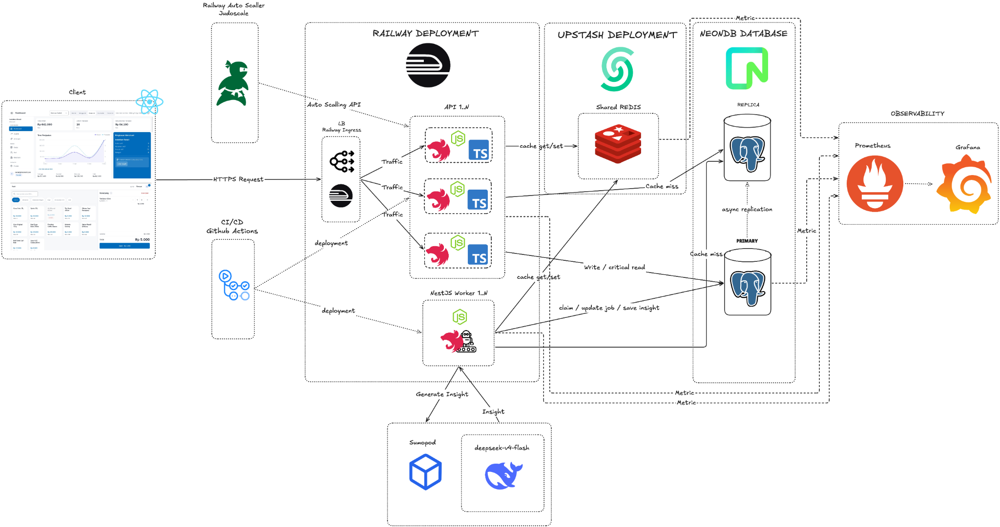
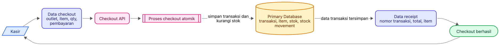
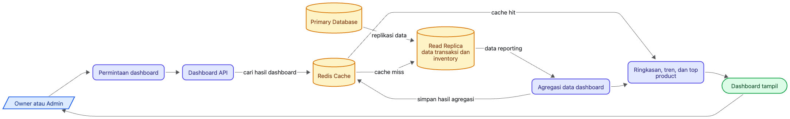
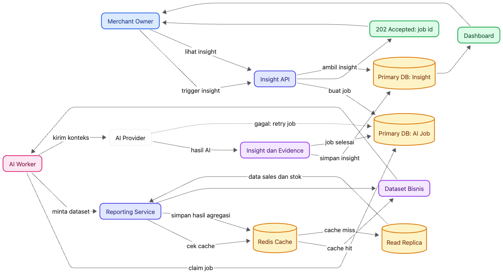

# POS Backend

Backend REST API untuk sistem point of sale : merchant dengan banyak outlet, kasir, administrator, dan pemilik usaha.

Fokus utama sistem adalah menjaga checkout tetap cepat dan konsisten, sementara dashboard, reporting, dan insight AI diproses dengan pola akses yang sesuai.

## Daftar Isi

- [Gambaran sistem](#gambaran-sistem)
- [Diagram arsitektur](#diagram-arsitektur)
- [Alur checkout](#alur-checkout)
- [Alur dashboard](#alur-dashboard)
- [Alur AI insight](#alur-ai-insight)
- [Prasyarat](#prasyarat)
- [Menjalankan secara lokal](#menjalankan-secara-lokal)
- [Testing dan quality check](#testing-dan-quality-check)
- [Deployment staging dan production](#deployment-staging-dan-production)
- [API endpoint](#api-endpoint)
- [Struktur repository](#struktur-repository)
- [Dokumentasi lanjutan](#dokumentasi-lanjutan)

## Gambaran Sistem

| Area        | Tanggung jawab                                      | Karakteristik                                        |
| ----------- | --------------------------------------------------- | ---------------------------------------------------- |
| Checkout    | transaksi, pembayaran, stok, dan idempotensi        | write ke primary database, atomik, latency-sensitive |
| Dashboard   | ringkasan penjualan, tren, produk, outlet, dan stok | query baca melalui cache dan read replica            |
| AI insight  | membuat narasi insight dari data bisnis             | asynchronous melalui database job dan worker         |
| Operasional | katalog, kategori, outlet, staf, dan inventory      | RBAC berdasarkan role pengguna                       |

| Role      | Akses utama                                                                    |
| --------- | ------------------------------------------------------------------------------ |
| `CASHIER` | katalog POS, checkout, status transaksi, riwayat transaksi, dan receipt        |
| `ADMIN`   | katalog, inventory, outlet, serta dashboard operasional                        |
| `OWNER`   | seluruh kebutuhan bisnis, dashboard, insight AI, staf, dan pengaturan merchant |

## Diagram Arsitektur

Gambaran hubungan antara client, API, worker, primary database, read replica, Redis, serta provider AI.



## Alur Checkout

Checkout berada pada jalur yang membutuhkan konsistensi kuat. Sistem memvalidasi permintaan, membuat transaksi, dan memperbarui stok secara atomik di primary database.



## Alur Dashboard

Dashboard menangani pembacaan laporan yang dapat bersifat bursty. Query diarahkan melalui cache dan read replica agar beban reporting tidak mengganggu checkout.



## Alur AI Insight

Insight AI tidak berjalan pada request pengguna. Sistem membuat job yang durable di database, lalu worker mengambil, menjalankan, dan mengulang job yang gagal sesuai kebijakan retry.



## Prasyarat

- node.js 22 atau versi yang kompatibel dengan workflow CI
- npm
- PostgreSQL untuk primary database
- PostgreSQL read replica untuk staging atau production, atau URL primary yang sama untuk lokal
- Redis, sangat disarankan untuk cache dashboard dan distributed lock

## Menjalankan Secara Lokal

### 1. siapkan environment

Gunakan template lengkap yang menjelaskan setiap variabel.

```bash
cp .env.example .env
```

Untuk lokal, `DATABASE_URL`, `DATABASE_URL_WRITE`, dan `DATABASE_URL_READ_REPLICA` boleh mengarah ke database PostgreSQL yang sama. Jangan gunakan URL production.

### 2. instal dependency dan siapkan Prisma

```bash
npm ci
npx prisma generate
npx prisma migrate dev
```

`prisma migrate dev` hanya untuk development lokal. Ia dapat membuat atau menerapkan migration pada database lokal.

### 3. jalankan API dan worker

Jalankan dua terminal terpisah.

```bash
# terminal 1
npm run start:dev
```

```bash
# terminal 2
npm run start:dev:worker
```

API tersedia pada `http://localhost:3000/api/v1`.

### 4. verifikasi service

```bash
curl http://localhost:3000/api/v1/health
```

Health check memeriksa koneksi primary database dan read replica, lalu menampilkan jumlah job AI yang masih pending.

### 5. isi data demo, opsional

```bash
npx prisma db seed
```

> seed hanya untuk local atau staging demo. Seed menghapus dan membuat ulang data demo pada merchant target, sehingga jangan dijalankan terhadap database production.

## Testing dan Quality Check

```bash
# cek format dan aturan lint tanpa mengubah file
npm run lint:check

# test unit
npm test

# test beserta coverage
npm run test:cov

# cek dependency antar module
npm run depcruise

# static application security testing
npm run semgrep

# build API dan worker
npm run build
```

Untuk memperbaiki format secara otomatis, gunakan `npm run format`. Untuk lint dengan auto-fix, gunakan `npm run lint`.

## Deployment Staging dan Production

### Konfigurasi environment

API dan worker memakai environment yang sama untuk database serta AI, dengan perbedaan kebutuhan berikut.

| Variabel                                        | API                         | Worker                           | Keterangan                                                                                                             |
| ----------------------------------------------- | --------------------------- | -------------------------------- | ---------------------------------------------------------------------------------------------------------------------- |
| `DATABASE_URL_WRITE`                            | wajib                       | wajib                            | primary database untuk operasi tulis dan job AI                                                                        |
| `DATABASE_URL_READ_REPLICA`                     | wajib di staging/production | wajib saat worker boot           | `PlatformModule` menginisialisasi read client; gunakan read replica atau primary yang sama bila replica belum tersedia |
| `REDIS_URL`                                     | disarankan                  | tidak digunakan langsung         | cache dashboard dan distributed lock                                                                                   |
| `JWT_ACCESS_SECRET`                             | wajib                       | tidak diperlukan                 | autentikasi request API                                                                                                |
| `CORS_ORIGINS`                                  | wajib                       | tidak diperlukan                 | origin frontend yang diizinkan                                                                                         |
| `METRICS_AUTH_USER` dan `METRICS_AUTH_PASSWORD` | disarankan                  | tidak diperlukan                 | basic auth untuk endpoint metrics                                                                                      |
| `AI_PROVIDER_*`                                 | tidak diperlukan langsung   | wajib bila AI insight diaktifkan | konfigurasi provider AI                                                                                                |
| `AI_WORKER_*` dan `AI_JOB_*`                    | tidak diperlukan langsung   | digunakan                        | batas concurrency, retry, dan lease job                                                                                |

Gunakan [`.env.example`](.env.example) sebagai daftar lengkap variabel dan penjelasan penggunaannya.

### Urutan deploy manual

Jalankan migration sebelum menyalakan versi aplikasi baru.

```bash
npm ci
npx prisma generate
npx prisma migrate deploy
npm run build
```

Kemudian jalankan sebagai dua service terpisah:

```bash
# service API
npm run start:prod
```

```bash
# service worker
npm run start:prod:worker
```

`prisma migrate deploy` hanya menerapkan migration yang sudah ada di `prisma/migrations/`. Jangan gunakan `prisma migrate dev`, `prisma db push`, atau `prisma db seed` pada production.

### Alur CI/CD

| Event                                 | Pemeriksaan                                                                          | Hasil                                          |
| ------------------------------------- | ------------------------------------------------------------------------------------ | ---------------------------------------------- |
| pull request ke `staging` atau `main` | lint, Prisma validate, test coverage, dependency-cruiser, build, Semgrep, SonarCloud | validasi perubahan tanpa migration atau deploy |
| push ke `staging`                     | seluruh pemeriksaan, `prisma migrate deploy`, deploy API dan worker                  | memperbarui staging                            |
| push ke `main`                        | seluruh pemeriksaan, `prisma migrate deploy`, deploy API dan worker                  | memperbarui production                         |

Secret deployment diatur melalui GitHub Environment `staging` dan `production`.

## API Endpoint

Base URL lokal: `http://localhost:3000/api/v1`

Seluruh endpoint selain yang diberi label **public** membutuhkan header berikut.

```http
Authorization: Bearer <access_token>
```

Detail request body, query parameter, response, dan kode error tersedia pada DTO source serta [kontrak API deliverables](docs/deliverables/07-iterasi-1-api-contract.md).

<details>
<summary><strong>platform dan autentikasi</strong></summary>

| Method | Endpoint         | Akses                  | Keterangan                                                 |
| ------ | ---------------- | ---------------------- | ---------------------------------------------------------- |
| `GET`  | `/health`        | public                 | memeriksa primary database, read replica, dan backlog AI   |
| `GET`  | `/metrics`       | public atau basic auth | metrik Prometheus, basic auth aktif jika metrics env diisi |
| `POST` | `/auth/register` | public                 | membuat merchant dan owner awal                            |
| `POST` | `/auth/login`    | public                 | login dan menerima access token                            |

</details>

<details>
<summary><strong>merchant, staf, dan outlet</strong></summary>

| Method  | Endpoint          | Akses                         | Keterangan                      |
| ------- | ----------------- | ----------------------------- | ------------------------------- |
| `GET`   | `/merchant`       | semua pengguna terautentikasi | membaca profil merchant sendiri |
| `PATCH` | `/merchant`       | owner                         | memperbarui profil merchant     |
| `POST`  | `/staff`          | owner                         | membuat staf admin atau kasir   |
| `GET`   | `/staff`          | owner                         | daftar staf merchant            |
| `PATCH` | `/staff/:user_id` | owner                         | memperbarui staf                |
| `POST`  | `/outlets`        | owner                         | membuat outlet                  |
| `GET`   | `/outlets`        | owner, admin                  | daftar outlet merchant          |
| `PATCH` | `/outlets/:id`    | owner                         | memperbarui outlet              |

</details>

<details>
<summary><strong>kategori, produk, dan inventory</strong></summary>

| Method   | Endpoint                                                        | Akses                         | Keterangan                                   |
| -------- | --------------------------------------------------------------- | ----------------------------- | -------------------------------------------- |
| `POST`   | `/categories`                                                   | owner, admin                  | membuat kategori                             |
| `GET`    | `/categories`                                                   | semua pengguna terautentikasi | daftar kategori                              |
| `PATCH`  | `/categories/:category_id`                                      | owner, admin                  | memperbarui kategori                         |
| `POST`   | `/products`                                                     | owner, admin                  | membuat produk                               |
| `GET`    | `/products`                                                     | owner, admin                  | daftar produk master                         |
| `PATCH`  | `/products/:product_id`                                         | owner, admin                  | memperbarui produk                           |
| `PUT`    | `/products/:product_id/outlet-prices/:outlet_id`                | owner, admin                  | membuat atau memperbarui harga khusus outlet |
| `DELETE` | `/products/:product_id/outlet-prices/:outlet_id`                | owner, admin                  | menghapus harga khusus outlet                |
| `GET`    | `/products/catalog`                                             | cashier, owner                | katalog POS sesuai outlet dan stok           |
| `GET`    | `/inventory`                                                    | owner, admin                  | daftar inventory                             |
| `POST`   | `/inventory/adjustments`                                        | owner, admin                  | adjustment stok                              |
| `PUT`    | `/inventory/:product_id/outlets/:outlet_id/low-stock-threshold` | owner, admin                  | menetapkan ambang stok rendah outlet         |
| `DELETE` | `/inventory/:product_id/outlets/:outlet_id/low-stock-threshold` | owner, admin                  | menghapus ambang stok rendah outlet          |
| `GET`    | `/inventory/movements`                                          | owner, admin                  | riwayat pergerakan stok                      |

</details>

<details>
<summary><strong>checkout, transaksi, dan receipt</strong></summary>

| Method | Endpoint                    | Akses          | Keterangan                                                       |
| ------ | --------------------------- | -------------- | ---------------------------------------------------------------- |
| `POST` | `/checkout`                 | cashier, owner | checkout idempotent, pembayaran, transaksi, dan pengurangan stok |
| `GET`  | `/transactions/status`      | cashier, owner | status checkout berdasarkan request id                           |
| `GET`  | `/transactions`             | cashier, owner | daftar transaksi sesuai scope pengguna                           |
| `GET`  | `/transactions/search`      | cashier, owner | mencari transaksi berdasarkan nomor transaksi                    |
| `GET`  | `/transactions/:id`         | cashier, owner | detail transaksi                                                 |
| `GET`  | `/receipts/:transaction_id` | cashier, owner | receipt transaksi                                                |

</details>

<details>
<summary><strong>dashboard dan AI insight</strong></summary>

| Method | Endpoint                       | Akses        | Keterangan                                       |
| ------ | ------------------------------ | ------------ | ------------------------------------------------ |
| `GET`  | `/dashboard/summary`           | owner        | omzet, jumlah transaksi, dan average order value |
| `GET`  | `/dashboard/sales-trend`       | owner        | tren penjualan per hari atau jam                 |
| `GET`  | `/dashboard/aov-trend`         | owner        | tren average order value                         |
| `GET`  | `/dashboard/time-pattern`      | owner        | pola waktu transaksi                             |
| `GET`  | `/dashboard/top-products`      | owner        | produk terlaris dan paling sedikit terjual       |
| `GET`  | `/dashboard/outlet-comparison` | owner        | perbandingan performa outlet                     |
| `GET`  | `/dashboard/operations`        | owner, admin | ringkasan stok dan katalog operasional           |
| `GET`  | `/dashboard/low-stock`         | owner, admin | daftar stok rendah                               |
| `POST` | `/insights/trigger`            | owner        | menjadwalkan analisis AI tanpa menunggu hasilnya |
| `GET`  | `/insights`                    | owner        | insight terbaru per tipe                         |

</details>

## Struktur Repository

```text
apps/
  api/                 aplikasi HTTP REST API
  worker/              proses background untuk AI insight
libs/
  catalog/             kategori, produk, dan harga outlet
  identity/            login, JWT, dan staf
  insight/             job, worker, provider AI, dan hasil insight
  inventory/           stok, adjustment, dan stock movement
  platform/            Prisma, cache, security, metrics, dan error handling
  reporting/           dashboard dan agregasi reporting
  sales/               checkout, transaksi, dan receipt
  tenant/              merchant dan outlet
prisma/
  migrations/          migration database yang dijalankan saat deploy
  schema.prisma        definisi schema Prisma
  seed.ts              data demo lokal atau staging
test/
  loadtest/            skenario load test
docs/
  deliverables/        dokumen requirement dan kontrak proyek
```

## Dokumentasi Lanjutan

| Dokumen                                                          | Kegunaan                                   |
| ---------------------------------------------------------------- | ------------------------------------------ |
| [Final Project](docs/deliverables/FinalProject.md)               | ringkasan deliverables final project       |
| [Study Case Indonesia](docs/deliverables/StudyCase-Ind.md)       | konteks studi kasus dalam bahasa Indonesia |
| [Business Flow](docs/deliverables/01-iterasi-1-business-flow.md) | alur bisnis utama                          |
| [FRD](docs/deliverables/04-iterasi-1-proposed-frd.md)            | functional requirement dan aturan bisnis   |
| [Data Model](docs/deliverables/05b-iterasi-1-datamodel.md)       | desain database dan relasi data            |
| [API Contract](docs/deliverables/07-iterasi-1-api-contract.md)   | detail request, response, dan RBAC API     |
