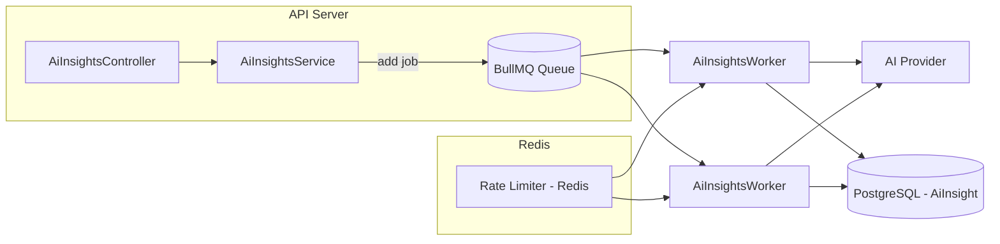
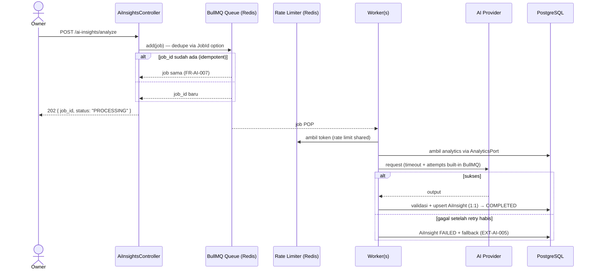

# AI ANALYZE — SYSTEM FLOW (Berjenjang: DB Baseline → BullMQ + Redis)

Dokumen pendukung untuk alur sistem `POST /ai-insights/analyze` pada AI Insight Module.
Menjelaskan **dua tingkat (tier)** arsitektur pemrosesan analisis AI, beserta kapan memakai tiap tingkat.

---

## 1. Tujuan

Analisis AI bersifat **asynchronous dan manual** (FR-AI-001, ASM-010): Owner memicu analisis, sistem
tidak menahan HTTP request untuk menunggu AI provider selesai. Tujuan dokumen ini adalah menetapkan
alur konkret yang mencegah:

- AI provider **dihantam terus-menerus** (rate limiting).
- **Analisis ganda** untuk merchant yang sama berjalan bersamaan (idempotency).
- Checkout/dashboard **melambat** karena proses AI (jalur operasional ≠ jalur insight).

Pendekatan yang dipakai adalah **naik level bertahap**:

| Level | Teknologi | Kapan dipakai |
|---|---|---|
| **L1 — Baseline** | DB `AiJobRecord` + rate limiting + worker polling | Mulai MVP (tidak butuh infra tambahan) |
| **L2 — Scale-up** | BullMQ + Redis | Ketika L1 sudah tidak cukup (job banyak, butuh concurrency/retry terjadwal) |

> L1 sudah memenuhi seluruh FR-AI / EXT-AI. L2 hanyalah **peningkatan mekanik antrian**, bukan
> perubahan flow atau kontrak API.

---

## 2. Constraints yang Mengikat (dari Deliverables)

| ID | Isi |
|---|---|
| FR-AI-001 | Insight generation = background job, bukan bagian dari response checkout. |
| FR-AI-006 | Job gagal → status `FAILED`/`RETRY_SCHEDULED` + retry terbatas. |
| FR-AI-007 | Job untuk merchant + tipe + periode/versi data yang sama harus **idempotent**. |
| FR-AI-008 | Owner melihat status `READY`, `PROCESSING`, `STALE`, `FAILED` tanpa memengaruhi dashboard. |
| FR-AI-011 | Kegagalan provider dibatasi **timeout** dan tidak retry tanpa batas. |
| FR-AI-012 | Hanya Owner; **tanpa batas maksimum penggunaan**. |
| EXT-AI-001 | Integrasi provider di luar jalur commit transaksi/checkout. |
| EXT-AI-003 | Timeout, retry terbatas, dan circuit/degradation behavior didefinisikan. |
| EXT-AI-004 | Output provider divalidasi sebelum dipublikasikan. |
| EXT-AI-005 | Ada fallback insight/status bila provider tidak tersedia. |
| BR-016 | Insight bukan sumber kebenaran transaksi/status/harga. |
| BR-017 | Retry insight harus idempotent. |
| BR-020 | Hanya Owner memicu AI; tidak ada batas maksimum. |

---

## 3. Level 1 — Baseline (DB JobRecord + Rate Limiting + Worker)

### 3.1 Komponen

```
POST /ai-insights/analyze
        │
        ▼
┌─────────────────────┐
│ AiInsightsController │  (OWNER only — FR-AI-012)
└─────────────────────┘
        │
        ▼
┌──────────────────────┐     ┌──────────────────────┐
│  AiInsightsService    │     │  RateLimiter (local) │
│  enqueueAnalysis()    │────▶│  semaphore/token     │
└──────────────────────┘     │  bucket              │
        │                     └──────────────────────┘
        ▼
┌────────────────────────────────────────────┐
│  DB: AiJobRecord  (job store — baseline)   │
│  status: PENDING → PROCESSING → COMPLETED  │
│          └─ RETRY_SCHEDULED / FAILED       │
└────────────────────────────────────────────┘
        ▲
        │  (poll/claim job PENDING | RETRY_SCHEDULED)
┌────────────────────────────────────────────┐
│  AiInsightsWorker (background)             │
│   1. claim job (atomic UPDATE ... RETURNING│
│      atau SELECT ... FOR UPDATE SKIP LOCKED)│
│   2. ambil data via AnalyticsPort           │
│   3. panggil AI provider (timeout)          │
│   4. validasi output (EXT-AI-004)           │
│   5. upsert AiInsight (1:1)                 │
└────────────────────────────────────────────┘
```

### 3.2 Alur Endpoint `POST /ai-insights/analyze`

```mermaid
sequenceDiagram
    actor O as Owner
    participant C as AiInsightsController
    participant S as AiInsightsService
    participant RL as RateLimiter
    participant DB as PostgreSQL (AiJobRecord)
    participant W as AiInsightsWorker
    participant P as AI Provider

    O->>C: POST /ai-insights/analyze
    C->>S: enqueueAnalysis(merchantId)
    S->>DB: check job PROCESSING utk merchant tsb
    alt sudah ada job PROCESSING / PENDING
        DB-->>S: job ada (idempotent)
        S-->>C: 202 { job_id, status: "PROCESSING" }
        C-->>O: 202 Accepted (jangan tumpuk)
    else tidak ada
        S->>RL: boleh claim slot? (rate limit)
        alt slot tersedia
            RL-->>S: boleh
            S->>DB: INSERT AiJobRecord { status: PROCESSING }
        else slot penuh
            RL-->>S: tunda
            S->>DB: INSERT AiJobRecord { status: PENDING }
        end
        S-->>C: 202 { job_id, status: "PROCESSING" }
        C-->>O: 202 Accepted (async)
    end

    W->>DB: claim job PENDING/RETRY (atomic)
    DB-->>W: job PROCESSING
    W->>W: rate limit provider (mis. 1 call / N detik)
    W->>DB: ambil analytics via AnalyticsPort (read-only)
    W->>P: request insight (timeout FR-AI-011)
    alt sukses
        P-->>W: title, content, type
        W->>W: validasi output (EXT-AI-004)
        W->>DB: upsert AiInsight (1:1) + job COMPLETED
    else timeout / error
        W->>DB: attempts++ ; next_retry_at (backoff)
        alt attempts < maxRetry
            DB: status RETRY_SCHEDULED
        else attempts >= maxRetry
            DB: status FAILED (FR-AI-006)
            DB: fallback insight STALE/FAILED (EXT-AI-005)
        end
    end
```

### 3.3 Model Job — `AiJobRecord`

| Field | Keterangan |
|---|---|
| `job_id` | PK |
| `merchant_id` | FK → Merchant (scope tenant) |
| `type` | tipe insight (sales / inventory / recommendation) |
| `dedupe_key` | `hash(merchant_id + type + period/version)` → idempotency (FR-AI-007, BR-017) |
| `state` | `PENDING` \| `PROCESSING` \| `COMPLETED` \| `RETRY_SCHEDULED` \| `FAILED` |
| `attempts` | jumlah percobaan (retry terbatas — FR-AI-006) |
| `next_retry_at` | kapan boleh di-claim lagi (backoff) |
| `error_category` | mis. `TIMEOUT`, `PROVIDER_UNAVAILABLE`, `VALIDATION_FAILED` |
| `created_at` / `updated_at` | timestamps |

> `dedupe_key` di-unique-kan → menjamin tidak ada dua job identik berjalan bersamaan (idempotent).

### 3.4 Rate Limiting

Dua lapis rate limiting:

1. **Lapis request (job-level)** — mencegah analisis ganda & hantaman endpoint:
   - Satu merchant hanya boleh punya ≤ 1 job aktif (`PROCESSING`/`PENDING`). Trigger baru → idempotent 202.
   - Ini sekaligus memenuhi FR-AI-007 (idempotent) tanpa menumpuk job.

2. **Lapis provider (call-level)** — mencegah hantaman ke AI provider:
   - Token bucket / semaphore lokal di worker: mis. maks. 1 call per N detik, atau maks. M call bersamaan.
   - Ini berbeda dengan "limit harian pemakaian" yang dilarang FR-AI-012 — yang dibatasi di sini adalah
     **laju panggilan teknis**, bukan kuota penggunaan Owner.

### 3.5 Idempotency

- **Tingkat job**: `dedupe_key` unik → job ganda untuk (merchant, type, period) yang sama di-ignore.
- **Tingkat hasil**: worker **upsert** `AiInsight` (1:1, `merchant_id` unik) — retry tidak membuat duplikat insight (BR-017).
- **Tingkat API**: request analyze berulang selama ada job aktif → 202 dengan `job_id` yang sama, bukan error.

### 3.6 Kelebihan & Batas L1

| Kelebihan | Batas (pemicu naik ke L2) |
|---|---|
| Tidak butuh Redis/BullMQ — setup minim, cocok untuk MVP & 1 worker | Job menumpuk saat slot rate limiter penuh (PENDING menumpuk) |
| Retry/idempotency/audit terekam di DB (bisa diinspeksi) | Butuh beberapa worker sekaligus (concurrency) |
| State transparan untuk debugging | Butuh retry terjadwal presisi / delayed job |
| Konsisten dengan pola JobRecord di SRS §12.1 | Lalu lintas AI tinggi / non-deterministik |

---

## 4. Level 2 — Scale-up (BullMQ + Redis)

### 4.1 Kapan Naik Level

Naik ke L2 **hanya jika** L1 terbukti kurang, misalnya:

- Job PENDING menumpuk lama karena rate limiter satu-satu (throughput rendah).
- Butuh **beberapa worker paralel** dengan redis-based rate limiting yang shared antar worker.
- Butuh fitur BullMQ: `delay` (backoff terjadwal), `attempts` built-in, concurrency control, retry otomatis.
- Monitoring antrian yang lebih kaya (BullMQ Board / Arena) diperlukan.

### 4.2 Arsitektur



### 4.3 Alur



### 4.4 Perbedaan dengan L1

| Aspek | L1 (DB) | L2 (BullMQ + Redis) |
|---|---|---|
| Job store | tabel `AiJobRecord` | antrian Redis (BullMQ) |
| Retry/backoff | manual (`next_retry_at`) | built-in (`attempts`, `backoff`) |
| Concurrency | 1 worker / semaphore lokal | banyak worker + rate limit Redis |
| Delayed job | polling `next_retry_at` | fitur `delay` native |
| Idempotency | `dedupe_key` unik | `jobId` unik di BullMQ |
| Hasil akhir | `AiInsight` (1:1) di PostgreSQL | `AiInsight` (1:1) di PostgreSQL |

> **Penting**: pada kedua level, hasil akhir tetap **upsert `AiInsight` 1:1** di PostgreSQL. L2 hanya
> mengganti mekanisme antrian job — flow API, status insight, dan kontrak port (`enqueueAnalysis`,
> `getCurrent`) **tidak berubah**.

---

## 5. Status `AiInsight` (FR-AI-008)

Status dilihat Owner via `GET /ai-insights`:

| Status | Makna |
|---|---|
| `READY` | Insight valid terbaru, siap dibaca. |
| `PROCESSING` | Job sedang berjalan (worker memproses). |
| `STALE` | Insight lama masih ada, tapi data sudah berubah/outdated. |
| `FAILED` | Job gagal setelah retry habis; fallback tersedia. |

---

## 6. Kesimpulan

1. **Mulai dengan L1 (DB `AiJobRecord` + rate limiting + worker)** — sudah memenuhi seluruh FR-AI/EXT-AI,
   tanpa infra tambahan, dan sesuai pola `JobRecord` di SRS §12.1.
2. **Naik ke L2 (BullMQ + Redis) hanya saat L1 terbukti kurang** — throughput, concurrency, atau
   kebutuhan retry terjadwal. Pergantian bersifat mekanik dan tidak mengubah API/port.
3. Rate limiting yang dipakai adalah **teknis (laju panggilan)** — bukan kuota penggunaan Owner
   (tidak melanggar FR-AI-012).
4. Idempotency dijaga pada 3 tingkat: job (`dedupe_key`), hasil (upsert 1:1), dan API (202 berulang).

---

## Lampiran — Mapping FR/EXT ke Desain

| Requirement | Terpenuhi oleh |
|---|---|
| FR-AI-001 (background job) | Worker terpisah; endpoint hanya enqueue |
| FR-AI-006 (retry terbatas) | `attempts`, `next_retry_at`, `RETRY_SCHEDULED`/`FAILED` |
| FR-AI-007 (idempotent) | `dedupe_key` unik + upsert 1:1 |
| FR-AI-008 (status) | `READY/PROCESSING/STALE/FAILED` |
| FR-AI-011 (timeout) | Timeout call provider + retry terbatas |
| FR-AI-012 (OWNER only, no max) | Guard OWNER; rate limit teknis bukan kuota |
| EXT-AI-001 (luar jalur checkout) | Worker terpisah dari transaksi |
| EXT-AI-003 (timeout/retry/circuit) | Timeout + backoff + error_category |
| EXT-AI-004 (validasi output) | Validasi sebelum upsert |
| EXT-AI-005 (fallback) | Insight STALE/FAILED bila provider down |
| BR-016 (bukan sumber kebenaran) | Insight read-only, tidak menulis data operasional |
| BR-017 (retry idempotent) | upsert 1:1 + dedupe |
| BR-020 (OWNER, no max) | Guard OWNER |