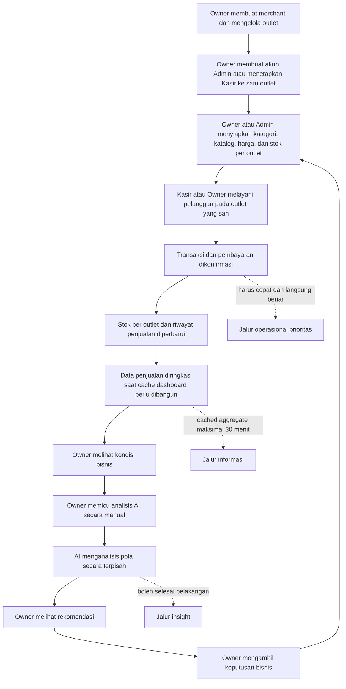
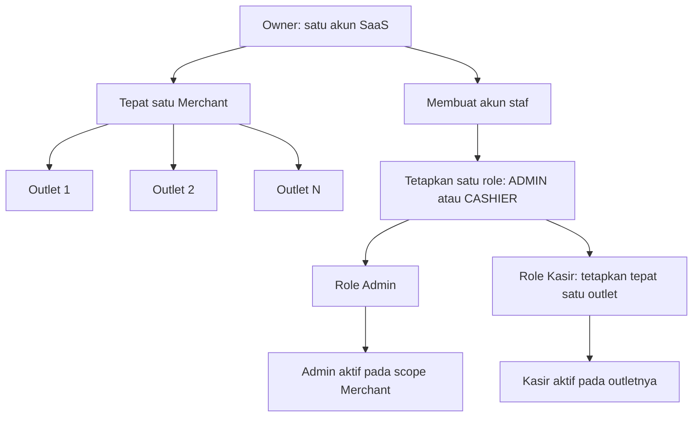
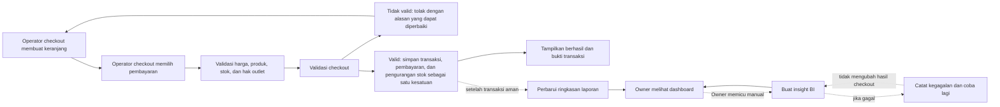
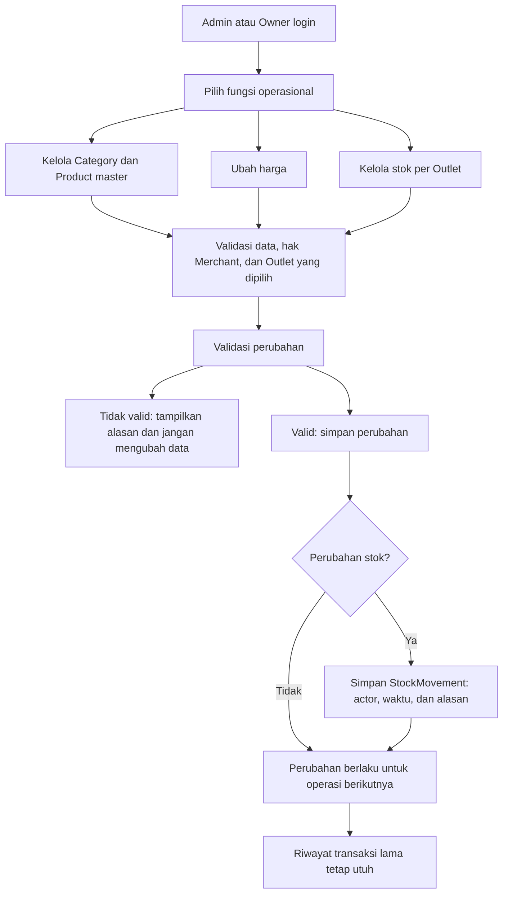
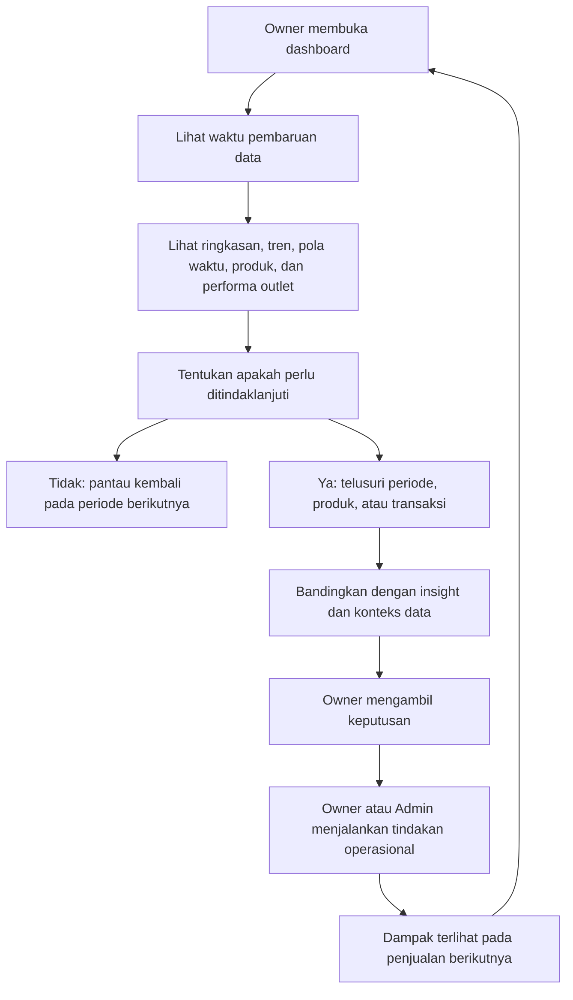

# Iterasi 1 — Penyamaan Pandangan Business Flow Aplikasi K

> Fokus dokumen: **mengapa aplikasi ini dibuat, siapa yang dilayani, dan bagaimana alur bisnisnya bekerja dari atas ke bawah**. Dokumen ini sengaja belum masuk ke pilihan framework, database, endpoint, message broker, atau detail deployment.

| Atribut | Nilai |
|---|---|
| Dokumen | Business Flow dan business rationale |
| Versi | 0.8 — Iterasi 1 (structured) |
| Iterasi | 1 |
| Status | Proposed — untuk penyamaan pandangan |
| Audiens utama | Owner/stakeholder, Product, UX, engineer, QA, mentor, dan presenter |
| Panduan paket | [`00-iterasi-1-document-guide.md`](./00-iterasi-1-document-guide.md) |
| Requirement pengguna | [`02-iterasi-1-proposed-urs.md`](./02-iterasi-1-proposed-urs.md) |
| Functional requirements | [`04-iterasi-1-proposed-frd.md`](./04-iterasi-1-proposed-frd.md) |
| Requirement sistem | [`03-iterasi-1-proposed-srs.md`](./03-iterasi-1-proposed-srs.md) |

## Cara membaca dokumen ini

- **Baca cepat:** bagian 1–4 untuk memahami visi, masalah, dan alur bisnis utama.
- **Baca per aktor:** bagian 5–9 untuk memahami Kasir, Admin, Owner, dan AI.
- **Baca untuk scope:** bagian 10–18 untuk prinsip, prioritas, sumber keputusan, pertanyaan terbuka, dan definisi keberhasilan.
- Detail fitur berada di FRD; requirement pengguna dan sistem yang dapat diuji berada di URS/SRS melalui tautan di atas.

---

## 1. Ringkasan paling sederhana

Aplikasi K membantu merchant/UMKM menjalankan satu siklus bisnis yang utuh:

1. Owner menyiapkan outlet dan tim; Owner atau Admin menyiapkan kategori, produk, harga, serta stok per outlet agar siap dijual.
2. Kasir melayani pembeli dan mencatat pembayaran dengan cepat serta benar; Owner dapat menjalankan flow POS yang sama pada Outlet aktif yang dipilih.
3. Setiap penjualan menjadi catatan bisnis yang dapat dipercaya.
4. Catatan tersebut diolah menjadi laporan dan insight tanpa memperlambat kasir.
5. Owner memakai hasilnya untuk mengambil keputusan, lalu keputusan itu kembali menjadi tindakan operasional seperti mengubah harga, produk, atau ketersediaan jual.

Jadi, aplikasi yang ingin kita buat **bukan hanya layar kasir** dan **bukan pula dashboard AI yang berdiri sendiri**. Aplikasi ini adalah penghubung antara kegiatan di meja kasir dan keputusan pemilik usaha.

### Satu kalimat visi

> Membantu UMKM bertransaksi dengan cepat hari ini, menjaga catatan usahanya tetap benar, dan mengambil keputusan yang lebih baik untuk hari berikutnya.

---

## 2. Masalah bisnis yang sebenarnya

Ada dua kebutuhan yang sama-sama penting tetapi sifatnya berbeda.

### Kebutuhan operasional: uang sedang berpindah sekarang

Saat pelanggan ada di depan kasir, sistem harus cepat dan memberi kepastian. Kasir perlu mengetahui:

- produk yang dijual benar;
- harga yang digunakan benar;
- produk masih aktif untuk dijual;
- pembayaran tercatat satu kali, bukan nol kali atau dua kali;
- transaksi benar-benar berhasil atau benar-benar gagal;
- bukti transaksi dapat diberikan.

Keterlambatan di sini langsung terasa: antrean bertambah, pelanggan bingung, kasir berpotensi mengulang pembayaran, dan merchant dapat kehilangan uang maupun kepercayaan.

### Kebutuhan pengelolaan: memahami bisnis setelah transaksi terjadi

Owner perlu membaca banyak transaksi untuk memantau penjualan dan menemukan pola; AI juga perlu memproses riwayat tersebut untuk menghasilkan insight. Owner atau Admin mengelola katalog dan stok dari ringkasan operasional, sedangkan Admin tetap tanpa akses ke detail transaksi. Aktivitas ini penting, tetapi umumnya tidak harus selesai dalam detik yang sama dengan checkout.

Masalah inti studi kasus muncul ketika kedua kebutuhan tersebut memakai sumber daya sistem yang sama tanpa prioritas yang jelas. Laporan atau AI yang sedang membaca banyak data dapat membuat pembayaran melambat.

### Prinsip prioritas bisnis

> **Checkout adalah jalur uang dan selalu mendapat prioritas pertama.** Reporting dan AI menambah nilai setelahnya, sehingga boleh sedikit terlambat tetapi tidak boleh membuat checkout ikut terlambat atau gagal.

Ini tidak berarti laporan dan AI tidak penting. Artinya, waktu keberhasilannya berbeda:

- checkout harus benar dan responsif **sekarang**;
- dashboard harus cukup baru untuk mengambil keputusan dan boleh memakai cached aggregate maksimal 30 menit;
- insight BI (AI Insight yang diwujudkan sebagai Business Intelligence) dipicu secara manual oleh Owner dan diproses **belakangan** di luar jalur checkout.

---

## 3. Tujuan aplikasi dari sudut pandang bisnis

### Tujuan utama

1. **Mempercepat pelayanan pelanggan**  
   Kasir dapat menyelesaikan transaksi dengan langkah sesedikit mungkin dan status yang tidak ambigu.

2. **Menciptakan catatan transaksi yang dapat dipercaya**  
   Penjualan, harga saat transaksi, dan pembayaran tidak boleh saling bertentangan.

3. **Memberi kendali operasional kepada merchant**  
   Owner memegang kendali penuh atas outlet, tim, dan operasi. Admin menjaga kategori, katalog, harga, dan stok pada seluruh outlet dalam merchant sesuai kebutuhan operasionalnya.

4. **Mengubah transaksi menjadi informasi yang berguna**  
   Owner tidak perlu membaca daftar transaksi satu per satu untuk memahami omzet, produk terlaris, atau performa tiap outlet.

5. **Memberi rekomendasi tanpa mengganggu penjualan**  
   AI membantu owner melihat pola atau tindakan yang layak dipertimbangkan, tetapi kegagalan AI tidak boleh menghentikan kasir.

6. **Bertumbuh secara hemat biaya**  
   Sistem mendukung 500+ merchant dengan memisahkan prioritas kerja dan menggunakan sumber daya sesuai kebutuhan, bukan sekadar terus memperbesar server.

### Nilai yang dijanjikan kepada merchant

| Nilai | Makna praktis |
|---|---|
| Cepat | Pelanggan tidak menunggu sistem saat checkout. |
| Benar | Total, harga, status produk, dan status transaksi konsisten. |
| Aman | Pengguna hanya melihat dan mengubah data sesuai perannya dan merchant-nya. |
| Terlihat | Owner dapat memahami kondisi usaha tanpa mengolah data secara manual. |
| Dapat ditindaklanjuti | Insight tidak hanya menampilkan angka, tetapi membantu menentukan tindakan berikutnya. |
| Tetap terjangkau | Pertumbuhan penggunaan tidak otomatis menuntut pertumbuhan biaya yang sama besarnya. |

---

## 4. Top-down flow bisnis

Flow di atas membentuk sebuah **business loop**, yaitu siklus berulang:

> Siapkan bisnis → jual → catat → pahami → putuskan → perbaiki cara berjualan.

Keberhasilan aplikasi tidak berhenti pada tombol “Bayar berhasil”. Transaksi tersebut juga harus menjadi bahan keputusan yang benar bagi owner, tanpa membuat transaksi berikutnya melambat.

---

## 4.1 Struktur usaha, outlet, dan akses

- Owner hanya membuat satu akun awal melalui registrasi SaaS; Merchant dibuat bersama akun tersebut.
- Owner dapat membuat, mengubah, atau menonaktifkan Outlet.
- Owner adalah pemegang penuh lifecycle staf: membuat akun, menetapkan Admin pada Merchant atau Kasir ke satu Outlet, menonaktifkan, lalu mereset akses bila perlu.
- Admin dan Kasir bukan jenis mesin POS. Keduanya adalah **peran manusia**. Perangkat kasir cukup menjadi client aplikasi dan belum perlu dimodelkan sebagai entitas.
- Pada MVP, satu karyawan hanya memiliki satu role. Admin bekerja pada Merchant; Kasir bekerja pada tepat satu Outlet. Owner bukan karyawan dalam batasan ini.

### Lifecycle akun staf

1. Owner mengisi nama, email, password awal, dan tepat satu role: `ADMIN` atau `CASHIER`.
2. Jika role-nya `CASHIER`, Owner wajib memilih tepat satu Outlet aktif; `ADMIN` tidak diberi Outlet.
3. Sistem memvalidasi email unik, role, Merchant, dan Outlet lalu menyimpan password hanya dalam bentuk hash.
4. Akun dibuat langsung dengan status yang ditetapkan Owner dan dapat digunakan untuk login ketika berstatus `ACTIVE`.
5. Hanya Owner yang dapat mengubah `User.role` dan `User.outlet_id`, menonaktifkan, mengaktifkan kembali, atau mereset password staf tanpa menghapus riwayat transaksi.

Seluruh pengguna—Owner, Admin, dan Kasir—menggunakan email sebagai identitas login. Role menggunakan nilai tetap `OWNER`, `ADMIN`, atau `CASHIER`, bukan teks bebas. Password yang tersimpan tidak boleh dapat dibaca kembali dalam bentuk asli.

Setelah login berhasil, sistem menerbitkan satu JWT access token yang berlaku 900 detik. MVP tidak menyediakan refresh token atau pencabutan token server-side. Logout berarti aplikasi menghapus token dari client; token yang pernah disalin masih dapat digunakan sampai expiry selama akun tetap aktif. Untuk membatasi risikonya, setiap request terproteksi tetap memeriksa signature dan expiry token serta status akun saat ini, sehingga akun yang dinonaktifkan langsung ditolak.

---

## 5. Apa yang diinginkan setiap aktor

### 5.1 Kasir: “Saya ingin melayani pelanggan tanpa ragu”

Kasir tidak datang untuk menganalisis bisnis. Ia ingin menyelesaikan antrean dengan cepat, akurat, dan tenang.

#### Kebutuhan kasir

- masuk ke aplikasi dengan identitasnya sendiri;
- hanya melihat fungsi yang diperlukan untuk berjualan;
- menemukan produk dengan cepat;
- melihat harga dan status produk yang jelas;
- menambah, mengurangi, atau membatalkan item sebelum pembayaran;
- melihat total yang harus dibayar;
- memilih atau mencatat metode pembayaran;
- mendapat status tegas: sedang diproses, berhasil, atau gagal;
- tidak menghasilkan transaksi ganda ketika tombol ditekan dua kali atau respons jaringan terlambat;
- memberikan bukti transaksi;
- memulai transaksi pelanggan berikutnya dengan cepat.

#### Yang paling ditakuti kasir

- layar berputar tanpa kepastian;
- produk terlihat aktif tetapi transaksi gagal tanpa penjelasan;
- total berubah secara mengejutkan;
- pembayaran sudah diterima tetapi transaksi tidak tercatat;
- menekan ulang lalu pelanggan ditagih dua kali;
- laporan atau proses lain membuat POS lambat.

#### Ukuran sukses kasir

- langkah checkout pendek;
- mayoritas transaksi selesai dalam target waktu yang disepakati;
- status akhir selalu jelas;
- kesalahan yang dapat dicegah oleh sistem berkurang;
- kasir tidak perlu memahami keadaan proses AI atau reporting untuk tetap berjualan.

### 5.2 Admin: “Saya ingin toko selalu siap berjualan”

Admin berada pada scope Merchant dan bertanggung jawab menjaga data operasional yang dipakai seluruh Kasir. Kualitas checkout di setiap outlet sangat bergantung pada kualitas pekerjaan Admin.

#### Kebutuhan admin

- membuat, memperbarui, dan menonaktifkan Category serta Product master Merchant;
- mengatur harga dan status produk aktif/tidak aktif;
- melihat stok per produk pada Outlet yang dipilih;
- menentukan low-stock threshold dasar ketika membuat Product dan dapat mengubah override-nya untuk setiap Outlet;
- menambah, mengurangi, dan mengoreksi stok per Outlet dengan alasan yang jelas;
- melihat perubahan yang berhasil atau gagal disimpan;
- melihat actor, waktu, dan alasan khusus untuk perubahan stok melalui StockMovement;
- tidak dapat mengakses data merchant lain, mengelola Outlet, atau mengelola akun/role staf;
- melakukan perubahan tanpa merusak transaksi yang sedang berjalan atau riwayat transaksi lama.

#### Aturan bisnis penting bagi admin

- perubahan harga berlaku untuk transaksi berikutnya;
- transaksi lama tetap menyimpan harga yang berlaku saat penjualan terjadi;
- setiap Product wajib memiliki satu Category; Category yang dipilih saat membuat/mengubah Product harus aktif;
- Category dinonaktifkan, bukan dihapus fisik, sehingga relasi Product dan riwayat tetap dipertahankan;
- menonaktifkan produk tidak menghapus riwayat penjualannya;
- setiap perubahan stok harus menyebut Outlet, produk, alasan, pelaku, serta nilai sebelum/sesudah;
- perubahan data harus dibatasi pada merchant yang sama.

#### Ukuran sukses admin

- data kategori/produk yang dilihat Kasir benar dan terbaru;
- kesalahan harga atau stok per Outlet mudah diketahui dan diperbaiki;
- riwayat bisnis tidak berubah hanya karena katalog saat ini berubah;
- operasi massal atau berat tidak memperlambat checkout.

### 5.3 Owner: “Saya ingin tahu keadaan usaha dan apa yang perlu saya lakukan”

Owner tidak membutuhkan sebanyak mungkin grafik. Owner membutuhkan jawaban yang cepat dipahami dan cukup dapat dipercaya untuk mengambil keputusan.

#### Kebutuhan owner

- melihat ringkasan penjualan pada periode tertentu;
- membandingkan kondisi sekarang dengan periode sebelumnya;
- melihat produk yang paling laku dan kurang laku;
- membandingkan performa antaroutlet atau produk;
- melihat tren penjualan dan tren rata-rata nilai transaksi dari waktu ke waktu;
- melihat pola waktu penjualan untuk mengetahui jam ramai dan jam sepi;
- menelusuri angka ringkasan ke data yang lebih detail bila ada kejanggalan;
- mengetahui kapan dashboard terakhir diperbarui;
- menerima insight BI yang menjelaskan dasar rekomendasinya;
- mengelola tim dan batas akses mereka;
- yakin bahwa data Merchant A tidak bercampur dengan Merchant B.

#### Pertanyaan bisnis yang sebaiknya dijawab dashboard MVP

1. Berapa nilai penjualan hari ini/periode ini?
2. Berapa jumlah transaksi dan rata-rata nilai transaksi?
3. Produk apa yang paling banyak terjual?
4. Produk apa yang paling sedikit atau tidak terjual pada periode tersebut?
5. Outlet mana yang memiliki performa paling tinggi atau perlu diperhatikan?
6. Bagaimana tren nilai penjualan dan rata-rata nilai transaksi dari waktu ke waktu?
7. Kapan jam ramai dan jam sepi penjualan?
8. Apakah kinerja membaik atau menurun dibanding periode sebelumnya?

#### Bentuk insight BI yang masuk akal secara abstrak

- “Penjualan produk A meningkat dibanding periode sebelumnya.”
- “Penjualan produk B turun dibanding periode sebelumnya; periksa harga, ketersediaan, atau promosi.”
- “Jam ramai cenderung terjadi pada rentang tertentu.”

Insight harus menyertakan periode data dan alasan singkat. AI adalah **pemberi saran**, bukan pihak yang otomatis mengubah harga, status produk, atau akses staf.

> **Notifikasi:** Fitur "AI Insight" pada produk ini **digunakan sebagai Business Intelligence (BI)**. AI bukan satu fitur insight tunggal, melainkan mesin yang menghasilkan kumpulan insight analitik (beberapa tipe) berbasis data merchant untuk mendukung keputusan Owner.

Fitur BI (Business Intelligence) hanya dapat dipicu secara manual, dilihat, dan dikelola oleh Owner. Admin dan Kasir tidak memiliki akses ke insight BI. Satu analisis per Merchant per hari dapat menghasilkan atau memperbarui **beberapa tipe insight** sekaligus—tren penjualan, perbandingan Outlet, produk terlaris/tidak laku, pola waktu, dan tren AOV—sesuai data yang tersedia.

#### Ukuran sukses owner

- dapat memahami kondisi bisnis dalam waktu singkat;
- angka utama dapat dipercaya dan ditelusuri;
- tahu seberapa baru datanya;
- insight mengarah pada tindakan, bukan sekadar kalimat menarik;
- dashboard tetap dapat digunakan meskipun AI belum selesai.

### 5.4 Layanan analitik BI (Business Intelligence): fungsi sistem, bukan pengguna manusia

AI disebut sebagai aktor dalam studi kasus karena memiliki pola penggunaan sistem sendiri. Namun dari sudut pandang bisnis, AI adalah fungsi pendukung bagi owner.

#### Kebutuhan fungsi AI

- membaca riwayat transaksi atau data yang sudah diringkas;
- hanya mulai ketika dipicu secara manual oleh Owner, lalu diproses secara asynchronous atau dalam batch di luar request checkout;
- dapat tertunda dan dicoba ulang bila gagal;
- tidak membuat insight yang sama berulang kali tanpa alasan;
- menyimpan waktu pemrosesan dan periode data yang dianalisis;
- tidak membaca atau mencampur data lintas merchant;
- tidak memakai kapasitas kritis checkout secara tidak terkendali.
- hanya menerima permintaan dari dan menampilkan hasil kepada Owner Merchant yang berhak.

#### Ukuran sukses AI

- insight relevan, memiliki konteks, dan cukup baru;
- kegagalan AI hanya membuat insight terlambat, bukan membuat pembayaran gagal;
- biaya pemrosesan sebanding dengan nilai insight;
- owner tetap menjadi pengambil keputusan akhir.

---

## 6. Hubungan dan batas tanggung jawab aktor

| Aktor/fungsi | Mengubah data utama | Membaca data | Butuh hasil langsung? | Jika gagal/terlambat |
|---|---|---|---|---|
| Kasir | Membuat transaksi dan mencatat pembayaran pada Outlet tugasnya; mengurangi stok sebagai akibat checkout | Produk, harga, stok, status transaksi Outlet | Ya | Pelayanan dan pendapatan langsung terdampak. |
| Admin | Category, produk, harga, dan stok per Outlet pada Merchant | Katalog, inventory, dan riwayat StockMovement seluruh Merchant | Sebagian besar ya, tetapi bukan seketat checkout | Operasi toko dapat terganggu, tetapi transaksi yang sedang berlangsung harus tetap diprioritaskan. |
| Owner | Merchant, outlet, akun staf, `User.role`/`User.outlet_id`, seluruh operasi Admin/Kasir, dan keputusan pengelolaan | Seluruh data Merchant sesuai permission, termasuk ringkasan lintas Outlet, laporan, detail transaksi, insight | Checkout harus langsung benar saat Owner menjalankan POS; keputusan bisnis dapat sedikit tertunda | Owner dapat menggantikan fungsi operasional tanpa memberi permission tambahan kepada Admin. |
| Reporting | Membaca cached aggregate atau membangunnya saat cache miss | Banyak transaksi historis | Tidak | Dashboard dapat stale/gagal; checkout tidak boleh terdampak. |
| AI | Membuat insight turunan | Riwayat atau ringkasan transaksi | Tidak | Insight diberi status belum tersedia/terlambat; checkout dan dashboard dasar tetap berjalan. |

Aturan Iterasi 1 yang telah disepakati: satu Owner memiliki tepat satu Merchant; satu Merchant dapat memiliki banyak Outlet. Owner adalah satu-satunya pihak yang membuat, mengaktifkan ulang, menonaktifkan, dan mengatur staf. Role dan Outlet staf disimpan langsung pada User. Setiap staf hanya memiliki satu role; Admin bekerja pada scope Merchant, sedangkan Kasir memiliki tepat satu Outlet.

---

## 7. Flow utama POS: dari pelanggan datang sampai transaksi selesai

### Happy path

1. Kasir masuk ke POS pada Outlet tugasnya, atau Owner masuk lalu memilih Outlet aktif dalam Merchant.
2. Operator checkout mencari atau memilih produk.
3. Sistem menampilkan harga dan status produk aktif.
4. Operator checkout menyusun keranjang dan memeriksa kuantitas.
5. Sistem menghitung subtotal dan total.
6. Operator checkout menekan checkout dan memilih metode pembayaran.
7. Sistem memvalidasi kembali data penting, terutama produk aktif, harga yang berlaku, stok pada Outlet, serta hak Kasir atau Owner pada Outlet tersebut.
8. Sistem menyelesaikan satu kesatuan perubahan: membuat transaksi, menyimpan detail/harga saat penjualan, mencatat pembayaran, dan mengurangi stok Outlet.
9. Sistem menampilkan status berhasil beserta nomor transaksi.
10. Kasir memberi bukti transaksi dan melayani pelanggan berikutnya.
11. Setelah itu, pembaruan laporan dan pemrosesan AI berjalan di belakang layar.

### Mengapa validasi dilakukan lagi saat checkout?

Keranjang dapat terbuka beberapa saat. Di antara produk dimasukkan dan tombol bayar ditekan, Admin dapat mengubah harga, menonaktifkan produk, atau stok terakhir dapat terjual oleh Kasir lain. Karena itu tampilan awal membantu Kasir memilih, tetapi keputusan final harus memakai kondisi yang sah pada saat transaksi diselesaikan.

### Flow diagram: jalur uang dan jalur informasi

### Status yang harus dipahami kasir

| Status | Arti bagi kasir | Tindakan aman |
|---|---|---|
| Keranjang | Belum ada transaksi final. | Item masih dapat diubah. |
| Memproses | Sistem sedang menentukan hasil; jangan kirim ulang secara membabi buta. | Tunggu atau cek status transaksi yang sama. |
| Berhasil | Transaksi final dan memiliki identitas unik. | Berikan bukti transaksi. |
| Gagal sebelum tersimpan | Tidak ada transaksi final. | Perbaiki penyebab lalu coba lagi. |
| Status belum diketahui | Respons terputus dan hasil belum terlihat di layar. | Cari berdasarkan identitas permintaan/transaksi, jangan langsung membuat transaksi baru. |

Status “belum diketahui” adalah detail yang sering luput. Jaringan dapat putus setelah server berhasil menyimpan transaksi tetapi sebelum kasir menerima jawabannya. Sistem harus membantu kasir mengecek transaksi yang sama agar tidak terjadi pembayaran ganda.

---

## 8. Flow operasional: Admin atau Owner menjaga toko siap berjualan

Prinsipnya: Admin atau Owner mengubah **kondisi bisnis sekarang dan ke depan**, bukan menulis ulang sejarah. Contohnya, harga kopi yang berubah hari ini tidak boleh mengubah harga kopi pada struk minggu lalu.

---

## 9. Flow owner: dari angka menjadi keputusan

Owner tidak seharusnya diberi kesan bahwa dashboard selalu real-time jika memang tidak. Menampilkan “terakhir diperbarui” adalah bagian dari kepercayaan pengguna, bukan sekadar detail UI.

---

## 10. Prinsip flow lintas aktor

### 10.1 Satu sumber kebenaran untuk transaksi

Transaksi final harus memiliki satu catatan resmi yang menjadi dasar reporting dan AI. Dashboard dan insight adalah turunan; keduanya tidak boleh menjadi pihak yang menentukan apakah transaksi kasir berhasil.

### 10.2 Harga historis tidak mengikuti katalog terbaru

Detail transaksi perlu menyimpan “snapshot”, yaitu salinan nilai penting ketika penjualan terjadi. Dengan begitu, laporan masa lalu tetap benar meskipun nama atau harga produk berubah.

### 10.3 Satu checkout menghasilkan paling banyak satu transaksi final

Permintaan checkout yang sama harus dapat dikenali. Client membuat satu `checkout_request_id` UUID untuk satu niat pembayaran dan mempertahankannya saat retry; server menghitung `request_hash` dari payload checkout yang dinormalisasi. Keduanya disimpan langsung pada `Transaction`, bukan pada tabel idempotency terpisah. ID sama dengan hash sama mengembalikan transaksi yang sudah ada, sedangkan ID sama dengan payload berbeda ditolak. Pelanggan berikutnya tetap memakai ID baru meskipun isi belanjanya identik.

### 10.4 Stok per Outlet adalah fakta operasional

MVP menyimpan stok numerik untuk setiap kombinasi **Product + Outlet**. Owner dan Admin bekerja pada scope Merchant, tetapi setiap adjustment wajib memilih Outlet secara eksplisit. Checkout hanya boleh berhasil bila produk aktif dan stok Outlet mencukupi; pembuatan Transaction beserta atribut pembayaran `CONFIRMED`, line snapshot, stock movement, dan pengurangan stok harus menjadi satu keputusan atomik agar dua operator checkout tidak menjual stok terakhir yang sama.

### 10.5 Reporting dan AI membaca hasil, bukan mengendalikan checkout

Checkout tidak menunggu dashboard atau AI. Bila shared cache gagal, dashboard mencoba query agregasi bounded; bila query juga gagal, cache lama dapat ditampilkan sebagai `STALE`. Kegagalan reporting atau AI tidak mengubah transaksi yang sudah berhasil.

### 10.6 Setiap data selalu memiliki pemilik merchant

Role saja tidak cukup. Kasir Merchant A mungkin memiliki role yang sama dengan Kasir Merchant B, tetapi tetap tidak boleh melihat produk, transaksi, atau laporan satu sama lain.

## 11. Pendekatan solusi secara abstrak

Pendekatan yang disarankan adalah **satu produk yang terasa utuh bagi pengguna, tetapi memiliki jalur kerja dengan prioritas berbeda di dalamnya**.

### Lapisan 1 — Protect the sale: lindungi jalur penjualan

- Buat checkout sesingkat dan sejelas mungkin.
- Lakukan hanya pekerjaan yang wajib untuk memastikan penjualan benar.
- Pastikan transaksi, pembayaran, dan stok per Outlet memiliki hasil yang konsisten.
- Cegah pengulangan transaksi yang tidak disengaja.
- Beri checkout prioritas sumber daya tertinggi.

### Lapisan 2 — Run the store: bantu toko tetap siap

- Sediakan pengelolaan Category, Product master, harga, stok per Outlet, outlet, serta role dan Outlet langsung pada User.
- Pastikan perubahan tidak merusak sejarah transaksi.
- Batasi akses per role dan per merchant.
- Simpan StockMovement untuk perubahan stok dan log operasional untuk observability.

### Lapisan 3 — Understand the business: ubah transaksi menjadi informasi

- Saat Owner membuka dashboard, baca cached aggregate bersama yang masih berumur maksimal 30 menit.
- Jika cache belum ada atau kedaluwarsa, agregasikan Transaction `COMPLETED` di jalur dashboard, lalu simpan hasilnya kembali; checkout tidak menunggu dan tidak memperbarui cache.
- Tampilkan waktu agregasi dan status freshness agar Owner mengetahui seberapa baru data yang sedang dilihat.
- Biarkan owner menelusuri angka penting bila diperlukan.

### Lapisan 4 — Advise, do not command: AI memberi saran

- Proses secara asynchronous, artinya tidak harus selesai pada saat transaksi terjadi.
- Mulai analisis hanya setelah Owner memicunya secara manual, maksimal satu kali per hari per merchant.
- Gunakan data per merchant dan periode yang jelas.
- Berikan alasan singkat di balik insight.
- Jangan otomatis mengubah harga, status produk, atau akses staf pada MVP.
- Bila AI gagal, turunkan layanan secara anggun: dashboard dasar tetap hidup dan insight diberi status tertunda.

### Lapisan 5 — Scale by priority, not by brute force

- Kurangi pekerjaan berat di jalur checkout.
- Ringkas dan proses data di luar jam/jalur kritis jika memungkinkan.
- Skalakan bagian yang benar-benar padat secara terpisah ketika ada bukti.
- Gunakan metrik seperti waktu checkout, error, dan antrean pekerjaan analitik sebagai pemicu peningkatan kapasitas.
- Hindari menambah komponen operasional hanya agar diagram terlihat “enterprise”.

“Enterprise” dalam konteks ini bukan berarti komponen sebanyak mungkin. Artinya: batas tanggung jawab jelas, kegagalan dapat dikendalikan, akses aman, keputusan dapat dijelaskan, dan sistem dapat dioperasikan oleh tim kecil.

---

## 12. Prioritas pengalaman pengguna

Urutan prioritas bila terjadi konflik:

1. **Integritas transaksi** — jangan sampai uang, transaksi, dan pembayaran saling bertentangan.
2. **Kepastian kasir** — selalu jelas apakah transaksi berhasil, gagal, atau perlu dicek.
3. **Kecepatan checkout** — pekerjaan non-kritis tidak boleh berada di jalur pembayaran.
4. **Keamanan dan isolasi merchant** — data tidak boleh bocor lintas role atau merchant.
5. **Ketersediaan operasi admin** — katalog dan stok per Outlet dapat dikelola dengan aman.
6. **Freshness dashboard** — informasi cukup baru untuk keputusan.
7. **Kecanggihan AI** — bernilai, tetapi paling mudah ditunda bila membahayakan MVP.

Urutan ini penting untuk menjaga scope. Jika waktu proyek menipis, kita menyederhanakan AI lebih dahulu, bukan mengorbankan kebenaran checkout.

---

## 13. Benchmark workflow POS serupa dan pelajaran yang dapat diambil

Benchmark ini hanya dipakai untuk menguji kewajaran flow, bukan menyalin seluruh cakupan produk komersial.

### Shopify POS

- Shopify menjelaskan flow dasarnya sebagai membuat keranjang, mengubah item bila perlu, lalu menerima pembayaran dengan metode yang tersedia. Ini mendukung bentuk flow kasir kita: **pilih item → review keranjang → bayar → selesai**.
- Shopify memisahkan role dan permission staf, termasuk akses lokasi. Ini menguatkan bahwa role harus digabung dengan batas merchant/lokasi, bukan sekadar label “kasir”.
- Laporan retail Shopify dapat tertinggal sekitar 1–5 menit. Ini merupakan bukti praktik bahwa dashboard operasional tidak harus memperbarui transaksi dalam milidetik agar tetap berguna; MVP kita memilih toleransi yang lebih longgar, yaitu cached aggregate maksimal 30 menit, demi kesederhanaan dan biaya.
- Shopify mempertahankan nilai asli dari saat order pada laporan tertentu. Ini selaras dengan kebutuhan snapshot harga/nama produk pada transaksi.

Sumber: [Selling in person with Shopify POS](https://help.shopify.com/en/manual/sell-in-person/shopify-pos), [Point of Sale staff management](https://help.shopify.com/en/manual/sell-in-person/shopify-pos/staff-management), dan [Retail sales reports](https://help.shopify.com/en/manual/reports-and-analytics/shopify-reports/report-types/default-reports/retail-sales-reports).

### Square POS

- Square memungkinkan metode pembayaran diatur dan diurutkan agar layar checkout sesuai kebutuhan toko. Pelajarannya: tampilkan pilihan yang relevan dan sering digunakan, jangan membebani kasir dengan semua kemungkinan.
- Square menyediakan opsi melewati layar pilihan receipt pada lingkungan ber-volume tinggi. Pelajarannya bukan menghapus bukti transaksi, melainkan membuat langkah setelah pembayaran dapat dikonfigurasi dan tidak menghambat antrean.
- Square menempatkan laporan sales/transaction sebagai fungsi terpisah dari alur penerimaan pembayaran. Ini sesuai dengan pemisahan jalur uang dan jalur informasi.

Sumber: [Customize payment types](https://squareup.com/help/us/en/article/6389-manage-payment-types-with-the-square-app), [Manage receipt settings](https://squareup.com/help/us/en/article/8669-manage-receipt-settings-on-square-point-of-sale), dan [Sales and transactions reports](https://squareup.com/help/us/en/subtopic/sales-and-transactions-reports).

### Yang tidak kita adopsi dulu

- omnichannel online–offline;
- multi-location yang kompleks;
- loyalty, gift card, dan customer CRM;
- purchase order dan supplier management;
- split payment dan refund lanjutan;
- offline-first transaction;
- printer/hardware integration yang spesifik;
- AI yang mengambil tindakan otomatis.

Semua itu valid untuk produk POS matang, tetapi belum merupakan jawaban langsung terhadap studi kasus Iterasi 1.

---

## 14. Scope bisnis awal yang diusulkan

Ini belum FRD final. Tujuannya memberi batas agar pandangan bisnis tidak melebar.

### Wajib untuk MVP

- registrasi Owner, login seluruh pengguna menggunakan email, JWT access token tunggal berumur 900 detik, logout client-side, serta lifecycle akun staf yang dikelola langsung oleh Owner;
- satu Owner untuk satu Merchant, serta CRUD banyak Outlet oleh Owner;
- role minimum: Owner, Admin, Kasir; setiap staf satu role; Admin scope Merchant dan Kasir tepat satu Outlet;
- isolasi data per merchant;
- kelola Category wajib dan Product master Merchant; Category dinonaktifkan, bukan dihapus fisik; serta kelola stok per Product + Outlet;
- buat keranjang dan selesaikan checkout;
- simpan snapshot item/harga pada transaksi;
- validasi dan kurangi stok Outlet secara aman saat checkout berhasil;
- cegah transaksi duplikat;
- riwayat dan detail transaksi;
- dashboard dengan omzet, jumlah transaksi, AOV, tren penjualan dan AOV, pola waktu, produk terlaris/tidak laku, perbandingan outlet, serta waktu pembaruan data;
- beberapa tipe insight BI (tren penjualan, perbandingan outlet, produk terlaris/tidak laku, pola waktu, tren AOV) yang diproses di luar jalur checkout;
- bukti bahwa reporting/AI tidak membuat checkout menunggu.

### Jika waktu cukup

- pencarian produk yang lebih kaya;
- perbandingan periode dan filter dashboard yang lebih fleksibel;
- ekspor laporan;
- konfigurasi metode pembayaran atau receipt.

### Di luar scope awal

- akuntansi lengkap dan rekonsiliasi bank;
- procurement/supplier/purchase order;
- payroll dan shift management penuh;
- CRM, loyalty, promo kompleks;
- marketplace atau e-commerce omnichannel;
- offline-first sync;
- multi-currency dan perpajakan;
- diskon, promo, dan service charge;
- refund, void, koreksi, atau pembatalan transaksi final, termasuk flow approval terkait;
- integrasi payment gateway, settlement, atau rekonsiliasi pembayaran otomatis;
- transfer/pemindahan stok antar-Outlet dan rekomendasi AI untuk menjalankan transfer/restock otomatis;
- audit trail umum untuk perubahan katalog, staf, atau Outlet; MVP hanya menyimpan StockMovement dan log operasional sesuai fungsinya;
- bahan baku, purchase order, dan inventory gudang terpisah;
- keputusan harga atau ketersediaan produk otomatis oleh AI;

---

## 15. Fakta, keputusan, dan status validasi

Memisahkan ketiganya mencegah tim menganggap tebakan sebagai requirement.

### Fakta dari dokumen kasus

- Produk adalah POS + business intelligence untuk UMKM Indonesia.
- Ada kasir, admin, owner, dan workload analitik AI.
- Checkout membutuhkan latency rendah yang konsisten.
- AI berjalan asinkron dan tidak membutuhkan data real-time per transaksi.
- Sistem ditargetkan bertumbuh ke 500+ merchant.
- Biaya harus dijaga; tidak boleh hanya mengandalkan penambahan kapasitas.
- User management, permission, dan business transaction wajib ada.
- Prototype harus dapat diuji, dipresentasikan, dan didemonstrasikan.

### Keputusan/prinsip Iterasi 1

- Checkout menjadi prioritas bisnis dan teknis tertinggi.
- Dashboard boleh sedikit tertinggal dan selalu menunjukkan waktu pembaruan.
- AI tidak berada di jalur keberhasilan checkout.
- Owner adalah otoritas tertinggi merchant; Admin mengelola operasi; Kasir bertransaksi.
- Satu Owner memiliki satu Merchant; satu Merchant dapat memiliki banyak Outlet.
- Owner mengelola penuh lifecycle akun Admin/Kasir; role dan Outlet disimpan langsung pada User. Semua pengguna login dengan email dan memiliki tepat satu role enum `OWNER`, `ADMIN`, atau `CASHIER`; Admin bekerja pada Merchant dan Kasir memiliki tepat satu Outlet.
- Authentication MVP menggunakan satu JWT access token berumur 900 detik tanpa refresh token atau revocation server-side. Logout menghapus token dari client; request terproteksi selalu memvalidasi signature, expiry, dan status akun saat ini.
- Setiap Product wajib memiliki satu Category aktif saat dipilih; Category dinonaktifkan, bukan dihapus fisik, tanpa memutus relasi Product dan riwayat yang sudah ada. Product dengan Category nonaktif tidak tampil di katalog POS dan tidak dapat di-checkout.
- Adjustment manual untuk penambahan atau pengurangan stok wajib memiliki alasan.
- Riwayat transaksi tersedia sesuai batas akses setiap role.
- Fitur BI hanya tersedia dan dipicu secara manual oleh Owner. Satu analisis per Merchant per hari dapat menghasilkan atau memperbarui beberapa tipe insight sekaligus sesuai data yang tersedia.
- Harga historis disimpan pada transaksi.
- Setiap data dibatasi oleh merchant.
- Insight BI tidak melakukan tindakan otomatis pada MVP.

### Asumsi dan proposal yang masih perlu divalidasi

- **Locked (`OD-001`):** MVP hanya mencatat pembayaran (`CASH` / `QRIS` / `TRANSFER`); sistem tidak memindahkan dana.
- **Locked:** Category dan Product master dikelola pada Merchant; setiap Product wajib memiliki Category dan stok dikelola per kombinasi Product + Outlet.
- **Locked untuk flow wajib:** Checkout dan transaksi dioperasikan dalam konteks satu Outlet. Owner mewarisi permission Kasir dan dapat checkout pada Outlet aktif yang dipilih dalam Merchant-nya; Kasir hanya pada Outlet tugasnya; Admin tidak checkout atau melihat transaksi. Keputusan ini menutup `OD-010`.
- **Locked:** Owner membuat dan mengelola langsung akun Admin/Kasir; registrasi publik hanya untuk Owner dan semua akun login menggunakan email.
- **Locked (`OD-011`):** JWT access token tunggal dengan expiry 900 detik; tidak ada refresh token/revocation server-side dan logout dilakukan dengan menghapus token dari client.
- **Locked (`OD-002`):** harga master global + harga override per Outlet; tanpa override, harga master dipakai.
- **Locked (`OD-003`):** Kasir hanya melihat riwayat transaksi yang dilakukannya sendiri.
- **Locked (`OD-004`):** diskon, pajak, dan service charge di luar MVP; total transaksi sama dengan subtotal.
- **Locked (`OD-005`):** refund/void di luar scope MVP.
- **Locked (`OD-001`):** pembayaran manual disimpan sebagai `payment_method`, `payment_status = CONFIRMED`, dan `paid_at` langsung pada `Transaction`; tidak ada tabel Payment terpisah.
- **Locked (`OD-012`):** idempotency checkout memakai `Transaction.checkout_request_id` dan `Transaction.request_hash`; tidak ada tabel `IdempotencyRecord` terpisah.
- **Locked (`OD-006`):** dashboard Owner menggunakan shared cache dengan cached aggregate berumur maksimal 30 menit pada kondisi normal; cache miss membangun ulang agregat dari Transaction `COMPLETED` dan checkout tidak menginvalidasi cache.
- **Proposed:** AI dapat diwujudkan sebagai insight berbasis aturan/analitik sederhana lebih dahulu, lalu model AI menjadi peningkatan.

---

## 16. Pertanyaan bisnis dan status keputusan berikutnya

Label `Open` berarti masih membutuhkan keputusan. Label `Resolved` berarti pertanyaannya dipertahankan sebagai histori, tetapi jawabannya sudah masuk scope Iterasi 1.

### Checkout dan pembayaran

1. **Resolved (`OD-001` locked) —** Kapan transaksi dianggap final? Setelah operator checkout (Kasir atau Owner) mengonfirmasi pembayaran dan satu commit atomik menyimpan Transaction `COMPLETED` beserta `payment_method`, `payment_status = CONFIRMED`, `paid_at`, line snapshot, StockMovement, dan perubahan stok. Tidak ada Payment terpisah; receipt mengikuti Transaction final tersebut.
2. **Resolved (`OD-004` locked) —** Apakah diskon, pajak, atau service charge wajib pada MVP? Jawaban: tidak; ketiganya di luar MVP dan total transaksi sama dengan subtotal.
3. **Resolved (`OD-005` locked) —** Apakah void, cancel, refund, atau koreksi transaksi masuk MVP? Jawaban: tidak masuk MVP.

### Struktur merchant dan pengguna

4. **Resolved —** Admin melihat dashboard operasional seluruh Merchant yang hanya memuat ringkasan inventory, stok rendah berdasarkan threshold efektif Product–Outlet, dan kondisi katalog. Admin tidak melihat omzet, AOV, analytics bisnis, insight BI, serta tidak mengelola Outlet atau staf. Owner dapat mengakses dashboard operasional dan menjalankan tindakan katalog/inventory karena mewarisi permission Admin.
5. **Resolved (`OD-003` locked) —** Apakah Kasir boleh melihat riwayat semua kasir di outletnya atau hanya transaksi sendiri? Jawaban: hanya transaksi yang dilakukannya sendiri.

### Produk dan inventory

6. **Resolved (`OD-002` locked) —** Apakah harga Product master selalu global, atau boleh memiliki price override per Outlet? Jawaban: harga master global + override per Outlet.
7. **Resolved —** Low-stock threshold tidak disimpan pada Merchant. Owner atau Admin wajib menentukan threshold dasar per Product saat membuat Product dan dapat menetapkan override untuk tiap Outlet; tanpa override, Outlet memakai threshold Product.

### Dashboard dan AI

8. **Resolved —** Lima angka atau informasi apa yang paling penting bagi Owner saat demo? Scope Must saat ini mencakup omzet, jumlah transaksi, AOV, tren penjualan/AOV, pola waktu, produk terlaris/tidak laku, dan perbandingan Outlet.
9. **Resolved (`OD-006` locked) —** Berapa keterlambatan dashboard yang masih dapat diterima? Jawaban: cached aggregate dapat digunakan maksimal 30 menit pada kondisi normal dan waktu pembaruannya harus terlihat.
10. **Resolved (`OD-007` locked) —** Insight BI MVP mencakup tren penjualan, perbandingan Outlet, produk terlaris/tidak laku, pola waktu, dan tren AOV; satu analisis dapat menghasilkan beberapa tipe sekaligus.
11. **Open —** Apakah istilah “AI” mensyaratkan penggunaan model eksternal, atau kualitas insight dan proses asinkron lebih penting?

Jawaban atas pertanyaan ini akan mengubah FRD, flow detail, ERD, dan pengujian. Karena itu kita tidak boleh menguncinya diam-diam lewat implementasi.

---

## 17. Definisi keberhasilan dari business view

Pada akhir MVP, kita seharusnya dapat memperagakan cerita berikut tanpa penjelasan teknis yang panjang:

1. Owner membuat atau memiliki merchant dan memberi akses kepada Admin dan Kasir.
2. Owner membuat outlet serta staf; Owner atau Admin menyiapkan Category, Product master, harga, dan stok per Outlet.
3. Kasir atau Owner membuat transaksi dan pembayaran tercatat dengan cepat.
4. Pengulangan request yang sama tidak membuat transaksi ganda.
5. Kasir tidak dapat mengakses data merchant atau outlet di luar tugasnya.
6. Dashboard menunjukkan omzet, jumlah transaksi, AOV, tren penjualan dan AOV, pola waktu, produk terlaris/tidak laku, serta performa outlet dengan waktu pembaruan yang jelas.
7. Insight muncul setelah data diproses dan menjelaskan dasar sederhananya.
8. Bila proses AI/reporting diperlambat atau gagal, checkout tetap berjalan normal.
9. Dua Kasir tidak dapat menjual stok terakhir yang sama pada Outlet yang sama.

### North-star metric untuk MVP

Jika harus memilih satu ukuran terpenting:

> **Persentase checkout yang selesai dengan cepat, satu kali, dan menghasilkan transaksi serta pembayaran yang benar.**

Dashboard dan AI dinilai setelah fondasi ini terpenuhi.

---

## 18. Kesepakatan pandangan yang diusulkan

Untuk menutup Iterasi 1, pandangan bersama yang disarankan adalah:

> Aplikasi K adalah sistem operasi bisnis ringan bagi UMKM multi-outlet. Owner mengatur merchant, outlet, akses staf, dan dapat menjalankan seluruh fungsi Admin maupun Kasir. Admin memastikan Category, katalog, dan stok setiap Outlet siap dijual sesuai kebutuhan operasionalnya. Kasir mengubah produk menjadi transaksi dengan cepat dan pasti pada Outlet tugasnya. Transaksi menjadi sumber kebenaran usaha. Reporting mengubahnya menjadi keadaan bisnis yang mudah dibaca. AI memberi saran berdasarkan keadaan tersebut. Owner tetap mengambil keputusan akhir. Seluruh proses pendukung dirancang mengalah terhadap checkout ketika berebut waktu atau sumber daya, karena checkout adalah saat nilai bisnis benar-benar terjadi.

Dokumen berikutnya sebaiknya tidak langsung memilih teknologi. Iterasi 2 paling bernilai jika mengubah pertanyaan terbuka di atas menjadi keputusan scope, user story, permission matrix, dan business rule yang dapat diuji.
