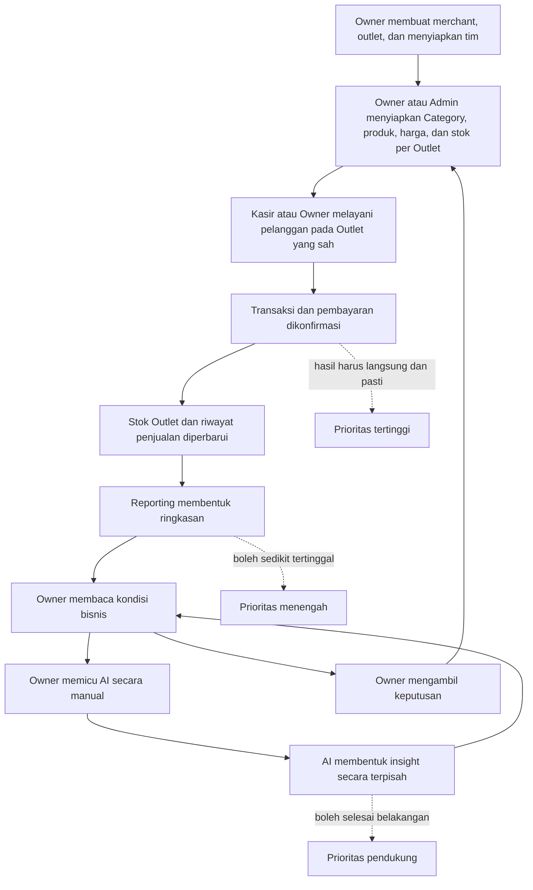

# Proposed User Requirements Specification (URS)

**Produk: Aplikasi K — POS dan Business Intelligence untuk UMKM**

| Atribut | Nilai |
|---|---|
| Dokumen | User Requirements Specification |
| Versi | 0.8 — Iterasi 1 (structured) |
| Status | **Proposed — untuk penyamaan pandangan, belum baseline final** |
| Bahasa utama | Bahasa Indonesia |
| Sumber | [Study Case Indonesia](./StudyCase-Ind.md), [Final Project](./FinalProject.md), [How Understand](./HowUnderstand.md), dan hasil [Business Flow Iterasi 1](./01-iterasi-1-business-flow.md) |
| Audiens | Product owner, stakeholder bisnis, designer, engineer, QA, mentor, dan presenter |
| Panduan paket | [`00-iterasi-1-document-guide.md`](./00-iterasi-1-document-guide.md) |
| Konteks bisnis | [`01-iterasi-1-business-flow.md`](./01-iterasi-1-business-flow.md) |
| Functional view | [`04-iterasi-1-proposed-frd.md`](./04-iterasi-1-proposed-frd.md) |
| Turunan sistem | [`03-iterasi-1-proposed-srs.md`](./03-iterasi-1-proposed-srs.md) |

> **Batas dokumen:** URS menjelaskan kebutuhan dari sisi bisnis dan pengguna—hasil apa yang dibutuhkan, oleh siapa, dan mengapa. Detail perilaku internal, data, API, NFR, serta pengujian berada di SRS.

## Cara membaca dokumen ini

| Tujuan | Bagian utama |
|---|---|
| Memahami scope dengan cepat | Bagian 2–5 |
| Menyetujui kebutuhan per aktor | Bagian 6–10 |
| Menilai kelayakan dan risiko | Bagian 11–14 |
| Menemukan keputusan yang belum final | Bagian 15 |
| Menentukan kesiapan baseline | Bagian 16 |

Pembaca tidak perlu memakai narasi persona atau user journey sebagai requirement tambahan. Requirement normatif selalu memiliki ID `UR-*`; narasi lain memberi konteks dan contoh penggunaan.

---

## 1. Tujuan dokumen

Dokumen ini menyatukan pandangan mengenai aplikasi yang akan dibuat sebelum tim mengunci desain teknis. URS menjadi kesepakatan awal tentang:

- masalah bisnis yang diselesaikan;
- siapa pengguna dan pihak yang terdampak;
- hasil yang dibutuhkan setiap pengguna;
- alur kerja utama;
- batas akses dan tanggung jawab;
- prioritas ketika kebutuhan saling bertentangan;
- lingkup MVP dan hal yang sengaja ditunda;
- ukuran keberhasilan yang dapat dipahami stakeholder nonteknis.

Dokumen ini bukan kontrak final. Label **Proposed** berarti requirement sudah cukup konkret untuk didiskusikan dan diturunkan menjadi SRS, tetapi beberapa keputusan bisnis masih perlu dikonfirmasi.

---

## 2. Ringkasan kebutuhan bisnis

Aplikasi K dibutuhkan agar merchant/UMKM dapat:

1. menyiapkan outlet, pengguna, Category, produk, harga, dan stok per Outlet;
2. melayani transaksi pelanggan dengan cepat dan benar;
3. memiliki catatan penjualan yang dapat dipercaya;
4. melihat kondisi usaha tanpa mengolah transaksi secara manual;
5. menerima insight yang membantu pengambilan keputusan;
6. tetap melayani pembayaran ketika reporting atau AI sedang sibuk maupun gagal;
7. bertumbuh ke 500+ merchant tanpa biaya dan kompleksitas meningkat secara tidak terkendali.

### Pernyataan visi

> Membantu UMKM bertransaksi dengan cepat hari ini, menjaga catatan usahanya tetap benar, dan mengambil keputusan yang lebih baik untuk hari berikutnya.

### Masalah paling penting

Kasir, Admin, Owner, reporting, dan AI menggunakan data bisnis yang saling berhubungan tetapi mempunyai urgensi berbeda. Checkout memerlukan jawaban segera, sedangkan dashboard boleh memakai cached aggregate sampai 30 menit dan AI dapat diproses kemudian. Jika semuanya diperlakukan sama, pekerjaan analitik yang berat dapat memperlambat saat uang sedang berpindah.

### Prinsip bisnis utama

> Checkout adalah jalur uang dan selalu menjadi prioritas pertama. Reporting dan AI boleh sedikit tertinggal, tetapi tidak boleh membuat checkout ikut tertinggal atau gagal.

---

## 3. Ruang lingkup produk

### 3.1 Di dalam lingkup MVP

- registrasi akun Owner dan pembuatan merchant;
- satu Owner untuk satu Merchant serta CRUD banyak Outlet oleh Owner;
- login menggunakan JWT access token tunggal dengan expiry 900 detik dan logout dengan menghapus token dari client;
- pengelolaan penuh lifecycle pengguna oleh Owner: pembuatan akun menggunakan email dan password awal, perubahan role dan Outlet langsung pada User, reset password, aktivasi, dan penonaktifan;
- role enum `OWNER`, `ADMIN`, dan `CASHIER`; setiap pengguna memiliki tepat satu role; Owner mewarisi permission Admin dan Kasir, Admin berada pada Merchant, dan Kasir pada tepat satu Outlet;
- isolasi data antarmerchant;
- pengelolaan Category wajib dan Product master pada Merchant oleh Owner/Admin; Category dinonaktifkan, bukan dihapus fisik, dan Product dengan Category nonaktif tidak ditampilkan di katalog POS atau dapat di-checkout;
- inventory per Product + Outlet, termasuk penambahan dan pengurangan stok dengan alasan oleh Owner/Admin;
- keranjang dan checkout;
- pencatatan metode pembayaran;
- perlindungan terhadap transaksi duplikat;
- bukti dan riwayat transaksi;
- dashboard Owner dengan omzet, jumlah transaksi, AOV, tren penjualan/AOV, pola waktu, produk terlaris/tidak laku, perbandingan Outlet, periode, dan waktu pembaruan;
- insight yang dipicu manual oleh Owner dan diproses asinkron tanpa menghambat checkout;
- bukti pengujian bahwa checkout tetap responsif ketika reporting/AI berjalan.

### 3.2 Jika waktu cukup

- filter/perbandingan dashboard yang lebih fleksibel;
- ekspor laporan;
- insight tambahan;
- konfigurasi metode pembayaran dan receipt.

### 3.3 Di luar lingkup Iterasi 1

- penyimpanan data kartu atau credential pembayaran pelanggan;
- akuntansi lengkap dan rekonsiliasi bank;
- supplier, purchase order, dan procurement;
- payroll dan shift management penuh;
- CRM, loyalty, gift card, dan promo kompleks;
- marketplace atau e-commerce omnichannel;
- sinkronisasi offline-first;
- multi-currency dan perpajakan;
- diskon, promo, dan service charge;
- refund, void, koreksi, atau pembatalan transaksi final, termasuk flow approval terkait;
- integrasi payment gateway, settlement, atau rekonsiliasi pembayaran otomatis;
- transfer/pemindahan stok antar-Outlet;
- audit trail umum untuk perubahan katalog, staf, atau Outlet; StockMovement dan log operasional tetap tersedia sesuai fungsi MVP;
- AI yang otomatis mengubah harga, status produk, atau akses staf;
- bahan baku, purchase order, dan inventory gudang terpisah;
- perangkat/register POS sebagai entitas terpisah;

---

## 4. Stakeholder dan pengguna

| Pihak | Kepentingan | Keputusan/aktivitas utama |
|---|---|---|
| Merchant Owner | Kendali usaha, keamanan data, dan kualitas keputusan | Mengelola merchant, outlet, tim, melihat performa, menilai insight, mengambil keputusan |
| Admin | Kesiapan operasional Merchant | Mengelola Category, Product master, harga, dan stok per Outlet |
| Kasir | Pelayanan pelanggan yang cepat dan pasti | Menyusun keranjang, mencatat pembayaran, memberikan bukti transaksi |
| Pelanggan merchant | Pelayanan dan bukti transaksi | Membayar dan menerima konfirmasi; bukan akun aplikasi dalam MVP |
| Reporting | Menyediakan ringkasan yang mudah dibaca | Mengolah transaksi menjadi metrik bisnis |
| Layanan analitik AI | Membantu Owner menemukan pola | Menghasilkan insight tanpa mengendalikan checkout |
| Tim operasional aplikasi | Menjaga layanan sehat dan dapat ditelusuri | Memantau error, latency, job tertunda, dan insiden |
| Tim pengembang/QA | Menjamin requirement dapat dibangun dan dibuktikan | Implementasi, testing, deployment, dan dokumentasi |

### 4.1 Persona: Kasir

**Tujuan:** melayani pelanggan dengan cepat tanpa ragu apakah transaksi sudah tercatat.

**Kesulitan yang ingin dihindari:**

- pencarian produk lambat;
- harga atau status produk tidak jelas;
- total transaksi salah;
- status pembayaran menggantung;
- transaksi tercatat dua kali;
- laporan/AI membuat POS tidak responsif;
- pesan error teknis yang tidak membantu.

**Hasil yang diinginkan:** transaksi singkat, status tegas, bukti tersedia, dan dapat segera melayani pelanggan berikutnya.

### 4.2 Persona: Admin

**Tujuan:** memastikan data toko selalu siap dipakai berjualan.

**Kesulitan yang ingin dihindari:**

- produk salah harga atau tidak tersedia tetapi masih dijual;
- perubahan tersimpan tanpa konfirmasi;
- perubahan katalog mengubah riwayat penjualan lama;
- operasi admin mengganggu checkout.

**Hasil yang diinginkan:** katalog Merchant dan stok tiap Outlet akurat, serta dampak setiap perubahan jelas.

### 4.3 Persona: Owner

**Tujuan:** memahami kondisi usaha dan menentukan tindakan berikutnya.

**Kesulitan yang ingin dihindari:**

- harus membaca transaksi satu per satu;
- grafik banyak tetapi tidak menjawab pertanyaan;
- data tidak jelas kapan diperbarui;
- insight AI tidak menjelaskan dasar rekomendasi;
- data merchant lain tercampur atau bocor.

**Hasil yang diinginkan:** ringkasan yang terpercaya, dapat ditelusuri, dan berujung pada keputusan operasional.

---

## 5. Business flow tingkat atas

---

## 6. Konvensi requirement

### 6.1 Identitas

Setiap kebutuhan memiliki ID tetap:

- `UR-BIZ` — kebutuhan bisnis;
- `UR-OWN` — kebutuhan Owner;
- `UR-ADM` — kebutuhan Admin;
- `UR-CAS` — kebutuhan Kasir;
- `UR-REP` — kebutuhan reporting/dashboard;
- `UR-AI` — kebutuhan BI/insight (AI Insight yang diwujudkan sebagai Business Intelligence);
- `UR-SEC` — keamanan dan isolasi;
- `UR-OPS` — operasi, keandalan, dan pertumbuhan.

ID tidak boleh digunakan kembali untuk makna berbeda. Jika satu kebutuhan baru disisipkan, gunakan suffix stabil seperti `UR-OWN-005A` agar referensi dokumen dan test lama tidak bergeser.

### 6.2 Prioritas

| Prioritas | Makna |
|---|---|
| Must | MVP tidak dapat diterima tanpa requirement ini. |
| Should | Sangat bernilai, dikerjakan setelah semua Must stabil. |
| Could | Peningkatan jika waktu dan kapasitas tersedia. |

### 6.3 Status

| Status | Makna |
|---|---|
| Confirmed | Tertulis eksplisit dalam dokumen kasus/final project. |
| Locked | Telah diputuskan secara eksplisit oleh stakeholder pada Iterasi 1. |
| Proposed | Usulan yang diperlukan untuk membuat requirement utuh dan dapat diuji. |
| Open | Memerlukan keputusan stakeholder sebelum baseline final. |

Status gabungan seperti `Confirmed/Proposed` berarti inti kebutuhannya berasal dari kasus, sedangkan detail operasionalnya masih berupa usulan. `Open scope` berarti keberadaan fiturnya wajib, tetapi batas akses atau perilaku tertentu belum diputuskan.

---

## 7. User requirements

### 7.1 Kebutuhan bisnis

| ID | Kebutuhan pengguna/bisnis | Prioritas | Status    |
|---|---|---|-----------|
| UR-BIZ-001 | Merchant membutuhkan POS yang memungkinkan transaksi pelanggan diselesaikan dengan cepat dan benar. | Must | Confirmed |
| UR-BIZ-002 | Merchant membutuhkan catatan transaksi, pembayaran, harga saat penjualan, dan stok per Outlet yang tidak saling bertentangan. | Must | Confirmed |
| UR-BIZ-003 | Checkout harus tetap responsif ketika admin, reporting, atau AI sedang aktif. | Must | Confirmed |
| UR-BIZ-004 | Produk harus mendukung pertumbuhan hingga 500+ merchant secara hemat biaya. | Must | Confirmed |
| UR-BIZ-005 | Reporting dan AI boleh menggunakan data yang sedikit tertinggal jika keterlambatannya diketahui dan tidak mengganggu checkout. | Must | Confirmed |
| UR-BIZ-006 | Setiap merchant membutuhkan ruang data yang terpisah dari merchant lain. | Must | Confirmed |
| UR-BIZ-007 | Catatan historis harus tetap dapat dipercaya setelah katalog atau harga berubah. | Must | Confirmed |
| UR-BIZ-008 | Produk harus tetap berguna sebagai POS meskipun layanan AI sedang gagal atau tidak tersedia. | Must | Confirmed |
| UR-BIZ-009 | Solusi harus realistis untuk dibangun, diuji, dan didemonstrasikan oleh tim dalam periode proyek. | Must | Confirmed |
| UR-BIZ-010 | Tim membutuhkan bukti terukur bahwa solusi menyelesaikan masalah isolasi workload, bukan hanya diagram. | Must | Confirmed |

### 7.2 Kebutuhan Owner

| ID | Kebutuhan Owner | Prioritas | Status    |
|---|---|---|-----------|
| UR-OWN-001 | Owner harus dapat mendaftarkan akun dan membentuk merchant miliknya. | Must | Confirmed |
| UR-OWN-002 | Owner harus dapat masuk dan keluar dari aplikasi dengan aman. | Must | Confirmed |
| UR-OWN-003 | Owner harus dapat membuat, melihat, memperbarui, mengaktifkan/menonaktifkan, mereset password, menetapkan role, dan menetapkan Outlet staf dalam Merchant-nya. | Must | Locked    |
| UR-OWN-003A | Owner harus dapat membuat, memperbarui, serta menonaktifkan Outlet dalam merchant-nya. | Must | Locked    |
| UR-OWN-003B | Owner harus dapat melihat status akun staf; password yang tersimpan tidak boleh dapat ditampilkan kembali dalam bentuk asli. | Must | Confirmed |
| UR-OWN-004 | Owner harus dapat melihat ringkasan nilai penjualan, jumlah transaksi, dan rata-rata nilai transaksi untuk suatu periode. | Must | Confirmed |
| UR-OWN-005 | Owner harus dapat melihat produk terlaris, produk paling sedikit atau tidak terjual, serta performa merchant dan outlet yang perlu diperhatikan. | Must | Locked    |
| UR-OWN-005A | Owner harus dapat melihat tren penjualan, tren rata-rata nilai transaksi atau AOV, dan pola waktu penjualan untuk mengetahui perubahan performa serta jam ramai/sepi pada periode yang dipilih. | Must | Locked    |
| UR-OWN-005B | Owner harus dapat menjalankan seluruh fungsi operasional Admin pada Merchant-nya: mengelola Category, Product, harga, low-stock threshold, inventory, dan dashboard operasional. Owner juga dapat memilih Outlet aktif untuk menjalankan seluruh flow Kasir, termasuk Cart, checkout, receipt, dan lookup transaksi. | Must | Locked |
| UR-OWN-006 | Owner harus mengetahui kapan data dashboard terakhir diperbarui. | Must | Proposed  |
| UR-OWN-007 | Owner harus dapat menelusuri ringkasan ke riwayat/detail transaksi yang relevan. | Should | Proposed  |
| UR-OWN-008 | Owner harus dapat melihat insight beserta periode dan dasar singkatnya. | Must | Proposed  |
| UR-OWN-009 | Owner harus diberi tahu ketika insight belum tersedia, tertunda, atau gagal diperbarui tanpa menganggap transaksi ikut gagal. | Must | Proposed  |
| UR-OWN-010 | Owner tetap menjadi pengambil keputusan akhir; AI tidak boleh mengubah harga, status produk, atau akses staf secara otomatis dalam MVP. | Must | Proposed  |

### 7.3 Kebutuhan Admin

| ID | Kebutuhan Admin | Prioritas | Status    |
|---|---|---|-----------|
| UR-ADM-001 | Admin harus dapat melihat Category, Product master, serta stok seluruh Outlet dalam Merchant-nya, termasuk penanda stok rendah berdasarkan threshold efektif setiap Product pada setiap Outlet. | Must | Locked    |
| UR-ADM-002 | Admin harus dapat membuat, memperbarui, dan menonaktifkan Category serta mengelola nama, harga, low-stock threshold dasar, dan status aktif Product pada Merchant-nya. Low-stock threshold dasar wajib diisi saat Product dibuat. | Must | Locked    |
| UR-ADM-003 | Admin harus dapat menambah, mengurangi, dan mengoreksi stok Product pada Outlet aktif yang dipilih dengan alasan. Outlet nonaktif hanya dapat dilihat sebagai histori. | Must | Locked    |
| UR-ADM-004 | Admin harus mendapat konfirmasi yang jelas ketika perubahan berhasil atau gagal. | Must | Confirmed |
| UR-ADM-005 | Perubahan harga hanya berlaku pada checkout yang belum diselesaikan dan tidak mengubah transaksi historis. | Must | Confirmed |
| UR-ADM-005A | Admin harus dapat menetapkan atau menghapus harga override untuk Product pada setiap Outlet; tanpa override, harga master Product berlaku. | Must | Locked |
| UR-ADM-005B | Admin harus dapat menetapkan atau menghapus low-stock threshold override untuk Product pada setiap Outlet; tanpa override, threshold dasar Product berlaku. | Must | Locked |
| UR-ADM-006 | Menonaktifkan produk tidak boleh menghapus riwayat transaksi produk tersebut. | Must | Confirmed |
| UR-ADM-007 | Admin hanya dapat bekerja pada data dan fungsi Merchant-nya; setiap perubahan stok harus dibatasi pada Outlet yang dipilih secara eksplisit. | Must | Confirmed |
| UR-ADM-008 | Operasi admin tidak boleh membuat transaksi checkout gagal atau melambat melewati batas yang disepakati. | Must | Locked    |

### 7.4 Kebutuhan Kasir

| ID | Kebutuhan Kasir | Prioritas | Status |
|---|---|---|---|
| UR-CAS-001 | Kasir harus dapat login dan hanya melihat fungsi yang dibutuhkan untuk berjualan. | Must | Confirmed |
| UR-CAS-002 | Kasir harus dapat mencari atau memilih produk aktif dengan cepat. | Must | Confirmed |
| UR-CAS-002A | Kasir harus dapat memfilter katalog berdasarkan Category aktif agar menemukan Product dengan cepat. | Must | Locked |
| UR-CAS-003 | Kasir harus dapat melihat harga, status aktif produk, dan ketersediaan stok pada Outlet tugasnya. | Must | Confirmed |
| UR-CAS-004 | Kasir harus dapat menambah, mengubah kuantitas, dan menghapus item sebelum checkout. | Must | Confirmed |
| UR-CAS-005 | Kasir harus dapat melihat subtotal dan total transaksi sebelum meminta pembayaran. Pada MVP, total sama dengan subtotal karena diskon, pajak, dan service charge di luar scope. | Must | Confirmed |
| UR-CAS-006 | Kasir harus dapat memilih metode pembayaran yang tersedia dan mengonfirmasi pembayaran. | Must | Confirmed |
| UR-CAS-007 | Kasir harus menerima status yang tidak ambigu: memproses, berhasil, gagal, atau perlu dicek. | Must | Confirmed |
| UR-CAS-008 | Pengulangan aksi checkout yang sama tidak boleh membuat transaksi final kedua. | Must | Confirmed |
| UR-CAS-009 | Kasir harus dapat mencari status transaksi ketika respons checkout terputus atau tidak diketahui. | Must | Confirmed |
| UR-CAS-010 | Kasir harus menerima alasan yang dapat ditindaklanjuti jika harga berubah, produk dinonaktifkan, stok tidak cukup, akses outlet tidak sah, atau pembayaran tidak dapat dicatat. | Must | Proposed |
| UR-CAS-011 | Kasir harus memperoleh nomor dan bukti transaksi setelah berhasil. | Must | Confirmed |
| UR-CAS-012 | Kasir harus dapat segera memulai transaksi pelanggan berikutnya setelah checkout selesai. | Must | Confirmed |
| UR-CAS-013 | Kasir tidak perlu menunggu dashboard atau AI untuk menyelesaikan checkout. | Must | Confirmed |
| UR-CAS-014 | Kasir harus dapat melihat riwayat transaksi yang dilakukan oleh dirinya sendiri dalam Outlet tugasnya. | Must | Confirmed |

### 7.5 Kebutuhan reporting dan dashboard

| ID | Kebutuhan reporting | Prioritas | Status                |
|---|---|---|-----------------------|
| UR-REP-001 | Dashboard harus merangkum transaksi final, bukan transaksi draft atau gagal. | Must | Confirmed              |
| UR-REP-002 | Dashboard harus menampilkan periode, waktu agregasi data, dan status freshness. | Must | Locked              |
| UR-REP-003 | Dashboard Owner harus menyediakan omzet, jumlah transaksi, rata-rata transaksi, produk terlaris, produk paling sedikit atau tidak terjual, dan perbandingan performa outlet. | Must | Locked                |
| UR-REP-003A | Dashboard harus menyediakan tren penjualan, tren AOV, dan pola waktu penjualan pada periode yang dipilih. | Must | Locked                |
| UR-REP-004 | Dashboard Owner boleh menggunakan cached aggregate bersama yang berumur maksimal 30 menit. Cache miss harus membangun agregat dari Transaction `COMPLETED` tanpa menambah pekerjaan analitik pada request checkout. | Must | Locked             |
| UR-REP-005 | Kegagalan pembaruan laporan tidak boleh mengubah atau membatalkan transaksi yang sudah berhasil. | Must | Confirmed             |
| UR-REP-006 | Data laporan harus selalu dibatasi pada satu merchant. | Must | Confirmed              |
| UR-REP-007 | Definisi setiap angka utama harus terdokumentasi agar Owner dan tim tidak menafsirkannya berbeda. | Must | Confirmed             |

### 7.6 Kebutuhan BI/insight

> **Notifikasi:** Fitur "AI Insight" pada produk ini **digunakan sebagai Business Intelligence (BI)**. Artinya AI bukan satu fitur insight tunggal, melainkan mesin yang menghasilkan kumpulan insight analitik (beberapa tipe) berbasis data merchant untuk mendukung keputusan Owner.

| ID | Kebutuhan BI/AI | Prioritas | Status |
|---|---|---|---|
| UR-AI-001 | Insight harus dihasilkan dari data merchant yang bersangkutan saja. | Must | Confirmed |
| UR-AI-002 | Pembuatan insight harus berjalan di luar jalur checkout. | Must | Confirmed |
| UR-AI-003 | Insight harus mencantumkan periode data dan waktu pembaruan. | Must | Confirmed |
| UR-AI-004 | Insight harus menjelaskan dasar ringkas sehingga tidak tampak sebagai klaim tanpa konteks. | Must | Confirmed |
| UR-AI-005 | Kegagalan AI harus menghasilkan status tertunda/gagal yang dapat dipahami dan dapat diproses ulang. | Must | Confirmed |
| UR-AI-006 | Retry atau pemrosesan ulang pada hari yang sama harus memakai `AiAnalysisJob` harian Merchant yang sama dan tidak boleh membuat job kedua; versi data hanya metadata output dan tidak memengaruhi deduplikasi. | Must | Locked |
| UR-AI-007 | AI tidak boleh memblokir, membatalkan, atau mengubah hasil checkout. | Must | Confirmed |
| UR-AI-008 | MVP menyediakan **beberapa tipe insight BI** yang dapat dibuktikan dari data demo: tren penjualan, perbandingan outlet, produk terlaris/tidak laku, pola waktu penjualan, dan tren AOV. | Must | Confirmed |
| UR-AI-009 | Insight tidak boleh menjadi perintah otomatis untuk mengubah harga, status produk, atau akun. | Must | Confirmed |
| UR-AI-010 | Hanya Owner yang boleh memicu secara manual, melihat, atau mengelola insight BI Merchant; Admin dan Kasir tidak boleh mengaksesnya. Maksimal satu analisis per Merchant per hari; satu analisis dapat menghasilkan atau memperbarui beberapa tipe insight sekaligus sesuai data yang tersedia. Analisis MVP selalu mencakup seluruh Merchant untuk 30 hari kalender lokal yang berakhir pada tanggal analisis; Owner tidak memilih Outlet atau rentang periode saat trigger. | Must | Locked |

### 7.7 Kebutuhan keamanan dan kepercayaan

| ID | Kebutuhan keamanan | Prioritas | Status |
|---|---|---|---|
| UR-SEC-001 | Setiap pengguna harus menggunakan identitas akun sendiri. | Must | Confirmed |
| UR-SEC-002 | Password tidak boleh disimpan atau ditampilkan sebagai teks asli. | Must | Proposed |
| UR-SEC-003 | Logout harus menghapus JWT access token dari client. Karena MVP tidak memiliki revocation server-side, token yang telah disalin dapat tetap digunakan sampai expiry 900 detik selama akun aktif; akun yang dinonaktifkan harus langsung ditolak pada setiap request terproteksi. | Must | Locked |
| UR-SEC-004 | Setiap aksi harus diperiksa berdasarkan role/permission dan merchant, tidak hanya disembunyikan dari UI. | Must | Proposed |
| UR-SEC-005 | Pengguna Merchant A tidak boleh membaca atau mengubah data Merchant B. | Must | Proposed |
| UR-SEC-006 | Data sensitif dan secret tidak boleh muncul pada log atau repository. | Must | Proposed |
| UR-SEC-007 | Aplikasi tidak menyimpan data kartu atau credential pembayaran pelanggan pada MVP. | Must | Proposed |
| UR-SEC-008 | Pesan error kepada pengguna tidak boleh membocorkan detail internal atau data merchant lain. | Must | Proposed |

### 7.8 Kebutuhan operasi dan pertumbuhan

| ID | Kebutuhan operasional | Prioritas | Status |
|---|---|---|---|
| UR-OPS-001 | Tim operasional harus dapat menelusuri checkout menggunakan identitas transaksi/permintaan. | Must | Confirmed |
| UR-OPS-002 | Tim harus dapat melihat waktu respons, tingkat error checkout, volume transaksi, cache hit/miss/age dan latency agregasi dashboard, serta pekerjaan AI yang tertunda (monitoring memakai Prometheus + Grafana). | Must | Locked |
| UR-OPS-003 | Kegagalan komponen reporting/AI harus ditangani tanpa mematikan POS. | Must | Confirmed |
| UR-OPS-004 | Sistem harus dapat diuji dengan data dan aktivitas yang mewakili 500+ merchant. | Must | Confirmed |
| UR-OPS-005 | Peningkatan kapasitas harus dipicu oleh bukti seperti latency, error, koneksi, atau antrean—bukan hanya perkiraan. | Should | Confirmed |
| UR-OPS-006 | Tim kecil harus dapat menjalankan, memahami, dan memperbaiki sistem tanpa beban operasi yang tidak proporsional. | Must | Confirmed |
| UR-OPS-007 | Checkout yang sudah dikonfirmasi tidak boleh hilang karena proses AI/reporting gagal. | Must | Confirmed |
| UR-OPS-008 | Deployment dan perubahan data harus memiliki cara rollback atau pemulihan yang terdokumentasi. | Should | Confirmed |

---

## 8. Proposed role and permission matrix

Legenda: `✓` diizinkan, `—` tidak diizinkan. `OWNER` mewarisi seluruh permission `ADMIN` dan `CASHIER`; untuk permission POS, Owner wajib memilih Outlet aktif dalam Merchant-nya.

| Kapabilitas |              Owner               |             Admin              | Kasir |
|---|:--------------------------------:|:------------------------------:|:---:|
| Mengelola profil merchant | ✓ | — | — |
| CRUD outlet | ✓ | — | — |
| Membuat/menonaktifkan Admin | ✓ | — | — |
| Membuat/menonaktifkan Kasir | ✓ | — | — |
| Menetapkan role dan outlet staf | ✓ | — | — |
| Mengatur/reset akses staf | ✓ | — | — |
| Melihat Category dan Product master | ✓ | ✓ | Produk tersedia di Outlet tugasnya |
| Membuat/mengubah/menonaktifkan Category serta mengelola produk dan harga (global + override per Outlet) | ✓ | ✓ | — |
| Melihat/mengubah stok per Outlet | ✓, harus memilih Outlet untuk perubahan | ✓, harus memilih Outlet | — |
| Membuat dan mengubah Cart | ✓, pada Outlet aktif yang dipilih | — | Outlet tugasnya |
| Membuat checkout | ✓, pada Outlet aktif yang dipilih | — | Outlet tugasnya |
| Melihat transaksi sendiri | ✓ | — | ✓ |
| Melihat seluruh transaksi | Semua Outlet | — | — |
| Melihat business dashboard dan analytics | Semua Outlet | — | — |
| Melihat dashboard operasional Merchant | ✓ | Merchant | — |
| Melihat receipt/struk transaksi | ✓ | — | ✓ untuk transaksi sendiri |
| Melihat insight BI | Semua Outlet | — | — |

Catatan:

- Owner adalah role tertinggi: Owner dapat melakukan semua fungsi Admin dan Kasir, selain fungsi eksklusif Owner. Saat menjalankan fungsi Kasir, Owner memilih satu Outlet aktif dalam Merchant sebagai konteks POS; Owner tidak dibatasi oleh `User.outlet_id` staf.
- Admin fokus operasional: mengelola Category, Product, Inventory, dan melihat dashboard operasional Merchant yang hanya berisi ringkasan inventory, stok rendah, dan kondisi katalog. Admin **tidak melihat omzet, AOV, transaksi, analytics/insight BI**, tidak mengelola Outlet/staf, dan tidak melakukan checkout.
- Checkout dapat dilakukan oleh Kasir pada Outlet tugasnya atau Owner pada Outlet aktif yang dipilih. Keputusan ini mengunci `OD-010`.
- Kasir hanya melihat riwayat transaksi yang dilakukan dirinya sendiri (mengunci `OD-003`).
- Lihat transaksi Owner mencakup **seluruh transaksi Merchant**; lihat transaksi Kasir hanya pada Outlet tempatnya ditugaskan.
- Admin dapat menetapkan harga override per Outlet di samping harga master (mengunci `OD-002`). Diskon, pajak, dan service charge tidak diterapkan pada MVP (mengunci `OD-004`).
- Otorisasi harus diberlakukan oleh sistem di belakang UI. Menyembunyikan tombol saja tidak cukup.

---

## 9. User journey dan hasil yang diharapkan

### UJ-01 — Onboarding merchant

**Pemicu:** calon Owner ingin menggunakan Aplikasi K.

**Alur ringkas:**

1. Owner mendaftarkan akun.
2. Sistem membuat Merchant milik Owner.
3. Owner membuat Outlet pertama dan dapat menambah Outlet berikutnya.
4. Owner membuat akun Admin atau Kasir; Admin tidak diberi Outlet, sedangkan Kasir diberi tepat satu Outlet.
5. Akun staf langsung dapat digunakan ketika berstatus aktif; seluruh pengguna login menggunakan email dan password yang telah ditetapkan.

**Hasil:** merchant dan tim siap melakukan setup operasional.

### UJ-02 — Menyiapkan toko

**Pemicu:** Admin perlu membuat toko siap berjualan.

**Alur ringkas:**

1. Owner atau Admin membuat Category dan Product master.
2. Admin memasukkan harga dan status aktif produk.
3. Admin memilih Outlet lalu mengisi atau mengoreksi stok produk.
4. Sistem mengonfirmasi perubahan.
5. Produk dapat ditemukan Kasir.

**Hasil:** katalog yang sah tersedia untuk checkout.

### UJ-03 — Checkout berhasil

**Pemicu:** pelanggan membawa barang ke kasir.

**Alur ringkas:**

1. Kasir membuat keranjang pada Outlet tugasnya, atau Owner membuat keranjang pada Outlet aktif yang dipilih.
2. Kasir memeriksa item, kuantitas, dan total.
3. Kasir memilih metode pembayaran.
4. Sistem memvalidasi kondisi terbaru, termasuk produk aktif, stok cukup, dan hak Kasir pada outlet.
5. Sistem menyimpan transaksi, pembayaran, dan pengurangan stok sebagai satu hasil yang konsisten.
6. Kasir menerima nomor/bukti transaksi.

**Hasil:** transaksi final tercatat tepat satu kali dan pelanggan memperoleh kepastian.

### UJ-04 — Checkout perlu diperbaiki

**Pemicu:** harga, status produk, stok, atau hak akses outlet berubah sebelum checkout final.

**Alur ringkas:**

1. Sistem tidak menyimpan transaksi parsial.
2. Kasir mendapat alasan yang spesifik.
3. Keranjang diperbarui atau item bermasalah dihapus.
4. Operator checkout mengonfirmasi ulang total.

**Hasil:** kesalahan tidak disembunyikan dan transaksi tetap dapat diselesaikan secara aman.

### UJ-05 — Respons checkout terputus

**Pemicu:** jaringan/response terputus ketika checkout sedang diproses.

**Alur ringkas:**

1. UI mempertahankan identitas permintaan checkout.
2. Kasir mengecek status permintaan yang sama.
3. Jika sudah berhasil, sistem menampilkan transaksi yang sama.
4. Jika benar-benar gagal, sistem mengizinkan retry yang aman.

**Hasil:** tidak terjadi transaksi ganda hanya karena ketidakpastian jaringan.

### UJ-06 — Owner memahami bisnis

**Pemicu:** Owner ingin mengevaluasi performa.

**Alur ringkas:**

1. Owner membuka dashboard.
2. Owner melihat periode dan waktu pembaruan.
3. Owner membaca metrik utama, tren penjualan dan AOV, pola waktu, produk terlaris/tidak laku, serta performa outlet.
4. Owner menelusuri detail jika ada perubahan/kejanggalan.
5. Owner memicu analisis AI secara manual bila membutuhkannya.
6. Sistem memproses analisis di luar jalur checkout dan Owner membaca insight beserta konteksnya.
7. Owner membuat keputusan dan meminta Admin menjalankan tindakan.

**Hasil:** data transaksi kembali menjadi perbaikan operasional.

### UJ-07 — AI/reporting gagal tanpa mengganggu kasir

**Pemicu:** proses laporan atau AI lambat/gagal.

**Alur ringkas:**

1. Checkout terus menggunakan jalurnya sendiri.
2. Kegagalan cache atau query agregasi dicatat tanpa membuat pekerjaan reporting pada checkout.
3. Dashboard memakai hasil cache lama dengan status stale bila tersedia; bila tidak tersedia, dashboard gagal secara terkontrol.
4. Insight menunjukkan status tertunda bila diperlukan.
5. Job AI dicoba ulang tanpa menggandakan hasil.

**Hasil:** fitur informasi menurun secara terkendali, sedangkan penjualan tetap hidup.

---

## 10. Aturan bisnis tingkat pengguna

| ID | Aturan bisnis |
|---|---|
| UBR-001 | Owner memiliki tepat satu Merchant; satu Merchant dapat memiliki banyak Outlet. |
| UBR-002 | Owner memiliki kontrol tertinggi atas outlet dan pengguna, termasuk nilai role dan Outlet yang disimpan langsung pada User. |
| UBR-003 | Setiap User memiliki tepat satu role enum `OWNER`, `ADMIN`, atau `CASHIER`. Owner mewarisi permission Admin dan Kasir; `User.outlet_id` kosong untuk Owner/Admin dan wajib menunjuk tepat satu Outlet untuk Kasir. Owner memilih Outlet aktif melalui flow POS, sedangkan staf tidak dapat mengubah field tersebut sendiri. |
| UBR-004 | Hanya produk aktif dengan stok cukup pada Outlet POS yang sah yang dapat diselesaikan pada checkout: Outlet tugas Kasir atau Outlet aktif yang dipilih Owner. |
| UBR-005 | Harga final adalah harga yang telah divalidasi dan disetujui pada saat checkout. |
| UBR-006 | Harga/nama produk pada transaksi final tidak berubah ketika katalog diubah kemudian. |
| UBR-007 | Transaksi final, pembayaran tercatat, dan pengurangan stok Outlet merupakan satu hasil bisnis. |
| UBR-008 | Permintaan checkout yang sama menghasilkan paling banyak satu transaksi final. |
| UBR-009 | Dashboard dan AI hanya memakai transaksi final sesuai definisi metrik. |
| UBR-010 | Dashboard dan insight selalu memiliki periode serta waktu pembaruan. Cached aggregate dashboard normal boleh digunakan maksimal 30 menit; data yang lebih lama hanya boleh ditampilkan sebagai fallback berstatus stale. |
| UBR-011 | AI tidak dapat mengeksekusi perubahan bisnis pada MVP. |
| UBR-012 | Operasi reporting/AI dapat ditunda atau dihentikan lebih dahulu untuk melindungi checkout. |
| UBR-013 | Setiap adjustment manual untuk menambah atau mengurangi stok menyimpan Outlet, produk, kuantitas sebelum/sesudah, alasan, dan pelaku. Outlet nonaktif hanya dapat dilihat sebagai histori. |
| UBR-014 | Owner membuat dan mengelola langsung akun staf menggunakan email, password awal, role, status, dan Outlet bila role-nya Kasir. Sistem hanya menyimpan password hash dan tidak dapat menampilkan kembali password yang tersimpan. |
| UBR-015 | Menonaktifkan akun mencabut kemampuan melakukan aksi baru tanpa menghapus referensi User pada Transaction atau StockMovement historis. |
| UBR-016 | Setiap Product wajib memiliki satu Category. Category harus aktif ketika dipilih untuk Product baru/perubahan dan dinonaktifkan, bukan dihapus fisik, agar relasi produk serta riwayat yang sudah ada tetap utuh. Product dengan Category nonaktif tidak tampil di katalog POS dan tidak dapat di-checkout. |
| UBR-017 | Fitur AI hanya dapat dipicu secara manual dan diakses oleh Owner, maksimal satu analisis per Merchant per hari; satu analisis dapat menghasilkan beberapa tipe insight sesuai data. Scope analisis MVP adalah seluruh Merchant dengan periode 30 hari kalender lokal yang diturunkan dari tanggal analisis, bukan input client. |
| UBR-018 | Pembayaran manual dan perlindungan duplikasi checkout disimpan langsung pada Transaction. Satu `checkout_request_id` hanya mewakili satu niat pembayaran dalam Merchant; transaksi berbeda wajib menggunakan ID baru meskipun Cart-nya identik. |

---

## 11. Kebutuhan kualitas dari sudut pengguna

Angka detail berada di SRS. Dari sisi pengguna, kualitas yang harus terasa adalah:

| Area | Ekspektasi pengguna |
|---|---|
| Kecepatan | Checkout terasa segera; pencarian produk dan interaksi utama tidak menghambat antrean. |
| Kepastian | Status transaksi tidak ambigu dan dapat dicek kembali. |
| Kebenaran | Harga historis, total, stok per Outlet, dan laporan dapat direkonsiliasi. |
| Keamanan | Pengguna tidak melihat data/fungsi di luar kewenangannya. |
| Ketahanan | AI atau dashboard gagal tidak membuat POS berhenti. |
| Transparansi data | Waktu pembaruan dan periode laporan/insight terlihat. |
| Kemudahan | Flow utama dapat dipahami tanpa pelatihan teknis. |
| Keterlacakan | Masalah dapat dicari menggunakan nomor transaksi/permintaan. |
| Pertumbuhan | Penambahan merchant tidak menyebabkan pengalaman checkout menurun secara tidak terkendali. |

---

## 12. Ukuran keberhasilan bisnis dan pengguna

### 12.1 North-star metric

> Persentase checkout yang selesai dengan cepat, satu kali, dan menghasilkan transaksi serta pembayaran yang benar.

### 12.2 Proposed success indicators

| ID | Indikator | Target awal |
|---|---|---|
| KPI-001 | Checkout valid yang berhasil | ≥ 99,5% pada pengujian tanpa kegagalan dependency yang disengaja |
| KPI-002 | Checkout duplikat untuk request ID yang sama | 0 |
| KPI-003 | Transaksi final dengan pembayaran atau stok parsial | 0 |
| KPI-004 | Akses lintas merchant pada security test | 0 berhasil |
| KPI-005 | Checkout tetap memenuhi target saat reporting/AI aktif | Ya, sesuai NFR isolasi pada SRS |
| KPI-006 | Dashboard menampilkan waktu pembaruan | 100% tampilan dashboard |
| KPI-007 | Insight menampilkan periode dan alasan singkat | 100% insight yang dipublikasikan |
| KPI-008 | Skenario inti yang dapat didemonstrasikan end-to-end | Seluruh skenario Must |

Angka ini adalah **target usulan**, bukan klaim kemampuan saat ini. Target harus dibuktikan dengan testing.

---

## 13. Asumsi dan dependency

### 13.1 Asumsi produk

1. MVP berbasis web responsif.
2. Satu Owner memiliki tepat satu Merchant, dan Owner dapat mengelola banyak Outlet pada Merchant tersebut.
3. Setiap pengguna login dengan email dan memiliki satu role enum `OWNER`, `ADMIN`, atau `CASHIER` yang disimpan langsung pada User; `outlet_id` langsung pada User kosong untuk Admin dan wajib terisi untuk Kasir. Lifecycle staf dikelola langsung oleh Owner. Authentication MVP hanya menerbitkan satu JWT access token dengan expiry tetap 900 detik, tanpa refresh token atau revocation server-side; logout menghapus token dari client dan setiap request terproteksi memeriksa status akun saat ini.
4. Product dan Category berada pada Merchant; setiap Product wajib memiliki satu Category, Category harus aktif saat dipilih dan dinonaktifkan alih-alih dihapus fisik, serta inventory berada pada kombinasi Product + Outlet.
5. Produk MVP sederhana tanpa variant kompleks; stok numerik tidak boleh negatif dan menjadi dasar checkout.
6. Pembayaran MVP dicatat sebagai tunai atau cashless manual; sistem tidak memindahkan dana.
7. Pembayaran dianggap dikonfirmasi ketika Kasir menyatakan dana telah diterima.
8. Dashboard Owner memakai shared cache dengan cached aggregate berumur maksimal 30 menit pada kondisi normal (`OD-006` locked); cache miss mengagregasi Transaction `COMPLETED`, dan checkout tidak menginvalidasi cache.
9. Insight hanya dipicu manual oleh Owner maksimal satu analisis per Merchant per hari dan diproses asynchronous; satu analisis dapat menghasilkan beberapa tipe insight sesuai data melalui LLM. Status proses dibaca dari job analisis, sedangkan hasil insight hanya ditampilkan setelah lengkap.
10. Waktu aplikasi ditampilkan dalam zona merchant; penyimpanan waktu internal dapat distandardisasi.

### 13.2 Dependency

- database operasional yang dapat menyimpan transaksi secara konsisten;
- shared cache untuk cached aggregate dashboard, query agregasi bounded dari Transaction `COMPLETED`, serta mekanisme menjalankan job AI di luar request checkout;
- layanan deployment dan observability yang sesuai anggaran;
- data demo yang cukup untuk memperlihatkan dashboard dan insight;
- keputusan stakeholder atas pertanyaan terbuka di bawah.

---

## 14. Risiko produk

| Risiko | Dampak | Mitigasi requirement |
|---|---|---|
| Scope BI terlalu besar | Checkout dan fitur inti tidak selesai | BI dibatasi sebagai insight terpisah di luar jalur checkout, dengan beberapa tipe insight minimum berbasis data yang dapat diverifikasi |
| Role tanpa tenant isolation | Kebocoran data lintas merchant | Semua akses diperiksa dengan role + merchant |
| Cache miss dashboard membaca transaksi operasional secara berat | Checkout melambat atau dashboard lambat | Query agregasi dibatasi, cache digunakan bersama selama maksimal 30 menit, concurrency miss dikendalikan, dan mixed workload diuji |
| Retry checkout membuat duplikasi | Kerugian uang dan catatan penjualan ganda | Identitas permintaan dan lookup status wajib |
| Owner salah mengisi Outlet Kasir | Kebocoran atau hambatan operasi antaroutlet | Owner menjadi satu-satunya pengelola `User.outlet_id`; scope Outlet selalu diperiksa server |
| Adjustment stok pada Outlet yang salah | Saldo stok dan insight tidak dapat dipercaya | Admin harus memilih Outlet eksplisit dan mengisi alasan perubahan |
| Harga berubah saat keranjang terbuka | Kasir/pelanggan melihat total tidak konsisten | Validasi ulang dan persetujuan total terbaru |
| Data demo terlalu sedikit | Insight tidak meyakinkan | Seed data lintas waktu/produk disiapkan sebagai deliverable test |
| Target performa dibuat tanpa baseline | Klaim tidak dapat dipertanggungjawabkan | Target SRS dilabeli proposed dan diuji dengan workload eksplisit |

---

## 15. Pertanyaan terbuka yang memerlukan keputusan

| ID | Pertanyaan | Default proposed | Dampak bila berubah |
|---|---|---|---|
| OD-001 | Batas payment manual | **Locked**: `payment_method` (`CASH`/`QRIS`/`TRANSFER`), `payment_status = CONFIRMED`, dan `paid_at` disimpan langsung pada Transaction; tidak ada tabel Payment terpisah | Mengubah Transaction, receipt, security, dan scope testing |
| OD-002 | Apakah harga Product master selalu global atau boleh override per Outlet? | **Locked**: harga master global + override per Outlet (`product_outlet_price`) | Mengubah ProductOutlet/pricing dan permission Admin |
| OD-003 | Riwayat apa yang boleh dilihat Kasir? | **Locked**: hanya transaksi yang dilakukan oleh dirinya sendiri | Mengubah UX dan authorization |
| OD-004 | Apakah diskon, pajak, dan service charge wajib? | **Locked**: tidak. Ketiganya di luar MVP dan `total = subtotal` | Mengubah perhitungan, laporan, dan test matrix |
| OD-005 | Apakah refund/void masuk MVP? | **Locked**: di luar scope Must; tidak ada refund/void | Mengubah state machine dan perhitungan omzet setelah reversal |
| OD-006 | Seberapa baru dashboard harus diperbarui? | **Locked**: cached aggregate dashboard Owner berumur maksimal 30 menit pada kondisi normal | Mengubah TTL, query agregasi, cache, dan biaya |
| OD-007 | Insight BI minimum untuk demo | **Locked**: beberapa tipe — tren penjualan, perbandingan outlet, produk terlaris/tidak laku, pola waktu, dan tren AOV | Mengubah kebutuhan data dan BI |
| OD-008 | Apakah penggunaan model AI eksternal wajib? | Tidak; nilai insight + asynchronous flow yang utama | Mengubah biaya, privasi, reliability, dan demo dependency |
| OD-009 | Berapa target concurrency resmi? | Baseline usulan pada SRS | Mengubah NFR, load test, dan kapasitas deployment |
| OD-010 | Hierarki role dan checkout | **Locked**: Owner mewarisi seluruh permission Admin dan Kasir; Owner checkout pada Outlet aktif yang dipilih dalam Merchant, Kasir hanya pada Outlet tugasnya, Admin tidak checkout | Mengubah permission model dan validasi checkout |
| OD-011 | Model authentication dan logout apa yang digunakan? | **Locked**: JWT access token tunggal dengan expiry 900 detik; tanpa refresh token/revocation server-side; logout menghapus token dari client | Mengubah UX sesi, security exposure window, API authentication, dan testing |
| OD-012 | Bagaimana idempotency checkout disimpan? | **Locked**: `checkout_request_id` UUID dan `request_hash` disimpan pada Transaction; kombinasi `merchant_id + checkout_request_id` unik, sedangkan `request_hash` tidak harus unik; tanpa tabel `IdempotencyRecord` | Mengubah checkout contract, duplicate handling, lookup setelah timeout, dan data model |

---

## 16. Kriteria persetujuan URS

URS Iterasi 1 dapat dinaikkan menjadi baseline apabila:

- stakeholder menyetujui visi, prioritas, dan lingkup MVP;
- role serta permission minimum disepakati;
- batas pembayaran diputuskan;
- aturan harga, stok per Outlet, pengisian `User.outlet_id`, dan finalisasi transaksi disepakati;
- definisi metrik dashboard yang sudah dikunci diterima dan tipe insight BI MVP disepakati;
- keterlambatan data yang dapat diterima disepakati;
- seluruh pertanyaan `OD` yang mengubah model data atau checkout telah diputuskan;
- setiap requirement Must memiliki pasangan requirement sistem dan metode verifikasi di SRS.

### Proposed sign-off

| Peran | Nama | Keputusan | Tanggal | Catatan |
|---|---|---|---|---|
| Product/Business Owner |  | Approve / Revise |  |  |
| Engineering Lead |  | Approve / Revise |  |  |
| QA Lead |  | Approve / Revise |  |  |
| UX Representative |  | Approve / Revise |  |  |
