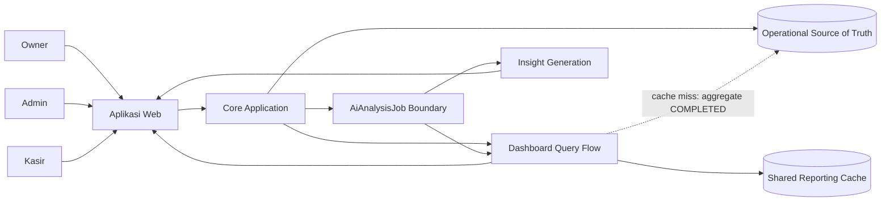
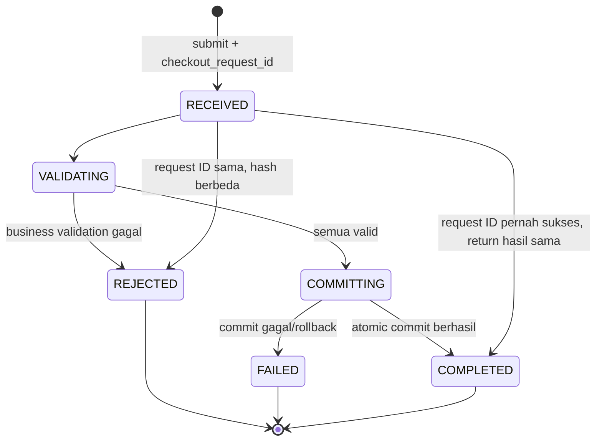
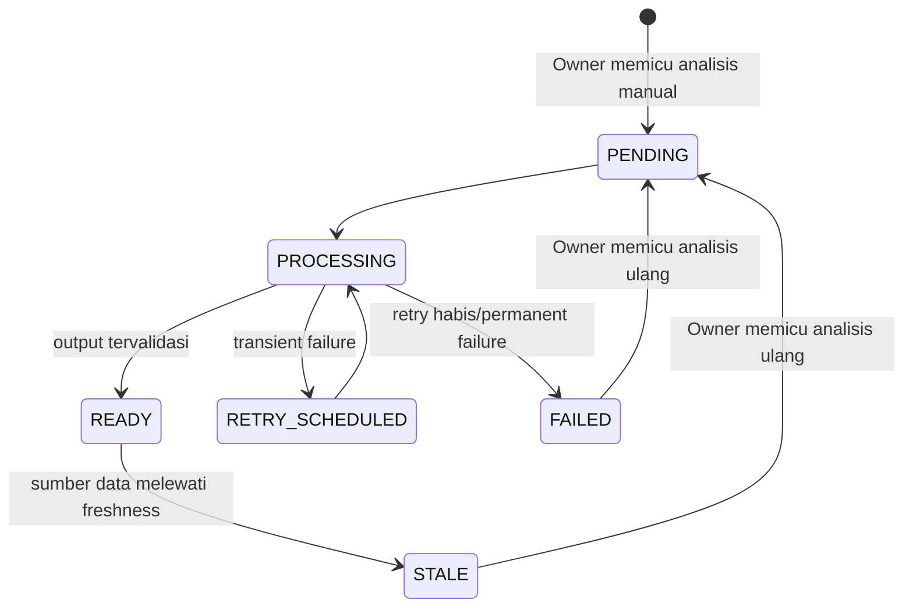
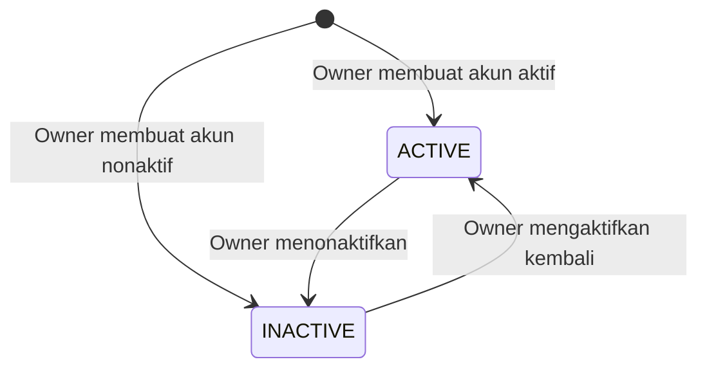

# Proposed Software Requirements Specification (SRS)

**Produk: Aplikasi K — POS dan Business Intelligence untuk UMKM**

| Atribut | Nilai |
|---|---|
| Dokumen | Software Requirements Specification |
| Versi | 0.8 — Iterasi 1 (structured) |
| Status | **Proposed — untuk review dan validasi** |
| URS terkait | [`02-iterasi-1-proposed-urs.md`](./02-iterasi-1-proposed-urs.md) |
| Audiens | Product owner, software engineer, QA, security reviewer, DevOps, designer, dan mentor |
| Jenis produk | Multi-tenant web-based SaaS POS + business intelligence |
| Panduan paket | [`00-iterasi-1-document-guide.md`](./00-iterasi-1-document-guide.md) |
| Konteks bisnis | [`01-iterasi-1-business-flow.md`](./01-iterasi-1-business-flow.md) |
| Functional view | [`04-iterasi-1-proposed-frd.md`](./04-iterasi-1-proposed-frd.md) |

> **Aturan bahasa:** kata **harus** berarti requirement wajib dan dapat diverifikasi. Kata **sebaiknya** berarti rekomendasi yang belum menjadi acceptance gate. Semua angka yang belum berasal langsung dari case diberi label **Proposed Baseline**.

## Cara membaca dokumen ini

| Tujuan | Bagian utama |
|---|---|
| Memahami batas sistem dan akses | Bagian 2–7 |
| Mengimplementasikan satu domain | Bagian 8, lalu business rule dan data requirement terkait |
| Mendesain data/API | Bagian 11–13 |
| Menilai kualitas dan skalabilitas | Bagian 14–15 |
| Menangani error dan menulis test | Bagian 16–18 |
| Menentukan kesiapan baseline | Bagian 19–23 |

Requirement normatif selalu memiliki ID (`FR-*`, `BR-*`, `DR-*`, `UI-*`, `API-*`, `NFR-*`). Diagram, use case, dan narasi menjelaskan hubungan antar-requirement, tetapi tidak membuat requirement baru tanpa ID.

---

## 1. Tujuan

SRS ini menerjemahkan kebutuhan pengguna pada URS menjadi perilaku sistem yang:

- spesifik;
- dapat diimplementasikan;
- dapat diuji;
- dapat ditelusuri kembali ke kebutuhan bisnis;
- cukup jelas untuk mencegah frontend, backend, QA, dan stakeholder membuat interpretasi yang berbeda.

SRS mendeskripsikan **apa yang harus dilakukan sistem**, bukan mengunci framework, vendor cloud, atau bentuk deployment final.

---

## 2. Ruang lingkup sistem

Aplikasi K menyediakan:

1. identity, authentication, dan account lifecycle;
2. merchant, outlet, role dan Outlet langsung pada User, permission, dan tenant isolation;
3. category dan product catalog pada merchant, serta inventory per outlet;
4. cart serta checkout dengan transaksi, pembayaran, dan stok yang konsisten;
5. pencatatan pembayaran manual;
6. receipt dan transaction history;
7. dashboard berbasis transaksi final yang mencakup metrik, tren penjualan/AOV, pola waktu, produk terlaris/tidak laku, perbandingan Outlet, dan freshness;
8. reporting cache-aside 30 menit dan asynchronous insight generation;
9. observability minimum;
10. isolasi performa checkout dari workload non-kritis.

### 2.1 Batas sistem pembayaran Iterasi 1

Pada baseline usulan, Aplikasi K **tidak memindahkan dana**. Sistem hanya mencatat bahwa operator checkout (Kasir atau Owner) telah menerima pembayaran dengan metode:

- `CASH`;
- `QRIS`; atau
- `TRANSFER`.

Konfirmasi operator checkout merupakan bukti operasional untuk prototype, bukan settlement dari bank. Sistem tidak menyimpan nomor kartu, PIN, credential e-wallet, QR payload sensitif, atau data autentikasi pembayaran pelanggan.

---

## 3. Referensi dan sumber kebenaran dokumen

Urutan referensi bila terjadi konflik:

1. keputusan stakeholder yang tercatat dan disetujui;
2. [URS baseline terbaru](./02-iterasi-1-proposed-urs.md);
3. SRS baseline terbaru;
4. [Study Case Indonesia](./StudyCase-Ind.md) dan [Final Project](./FinalProject.md);
5. [Business Flow Iterasi 1](./01-iterasi-1-business-flow.md);
6. implementasi.

Implementasi yang berbeda dari requirement tidak otomatis mengubah requirement. Perubahan harus dicatat melalui change control.

---

## 4. Istilah

| Istilah | Definisi |
|---|---|
| Merchant/tenant | Satu organisasi UMKM dan batas utama kepemilikan data. |
| Owner | Pengguna dengan kewenangan tertinggi dalam satu merchant. |
| Outlet | Lokasi/unit operasional milik satu Merchant. Kasir, inventory, dan transaksi MVP dijalankan dalam konteks Outlet. |
| Admin | Pengguna yang mengelola Category, Product master, dan inventory per Outlet pada satu Merchant. |
| Kasir | Pengguna manusia yang membuat dan menyelesaikan transaksi penjualan pada satu Outlet tugasnya; bukan perangkat/register POS. |
| Checkout | Proses final yang memvalidasi keranjang, mencatat pembayaran, dan menyimpan transaksi. |
| Transaction | Catatan penjualan final atau proses penjualan dengan state yang terdefinisi. |
| Payment attributes | `payment_method`, `payment_status = CONFIRMED`, dan `paid_at` pada Transaction; `Transaction.total` adalah jumlah yang dikonfirmasi operator checkout, bukan settlement bank. |
| Snapshot | Salinan nilai produk/harga pada saat transaksi agar sejarah tidak berubah mengikuti katalog. |
| Idempotency | Request checkout yang sama dapat diulang tanpa membuat transaksi final baru. |
| Strong consistency | Pengguna selalu melihat hasil final yang sama untuk keputusan kritis seperti checkout/pembayaran. |
| Eventual consistency | Data turunan seperti dashboard dapat menyusul beberapa saat setelah transaksi final. |
| Freshness | Umur cached aggregate sejak `data_updated_at`; pada kondisi normal maksimal 30 menit. |
| Shared reporting cache | Penyimpanan sementara bersama lintas instance API untuk hasil agregasi dashboard; bukan source of truth dan dapat dibangun ulang. |
| AiAnalysisJob | Pekerjaan asynchronous khusus untuk satu analisis BI harian Merchant; bukan record job generik dan tidak memiliki `job_type`. |
| Workload isolation | Pembatasan agar reporting/AI tidak menghabiskan resource yang dibutuhkan checkout. |
| p95 | 95% request selesai sama dengan atau lebih cepat dari nilai tersebut. |
| Correlation ID | Identitas untuk menelusuri satu alur dari UI, API, log, dan job. |
| RPO | Batas kehilangan data yang dapat diterima setelah insiden besar. |
| RTO | Target waktu untuk memulihkan layanan setelah insiden besar. |

---

## 5. Gambaran sistem

### 5.1 Konteks logis

Diagram ini menunjukkan batas tanggung jawab, bukan keputusan bahwa setiap kotak harus menjadi server/service terpisah. Modular monolith dengan worker terpisah masih memenuhi gambaran tersebut bila isolasi dan target kualitas terbukti.

### 5.2 Karakteristik pengguna

| Pengguna | Pengetahuan yang diasumsikan | Kebutuhan UX |
|---|---|---|
| Kasir | Dapat memakai perangkat web/tablet; tidak memahami arsitektur | Langkah pendek, tombol jelas, status tidak ambigu, error dapat ditindaklanjuti |
| Admin | Memahami Category, Product, dan stok per Outlet | Form konsisten, pilihan Outlet eksplisit, validasi, konfirmasi simpan, serta StockMovement khusus perubahan stok |
| Owner | Memahami bisnis tetapi belum tentu teknis | Ringkasan, perbandingan, freshness, drill-down, penjelasan insight |
| Operator | Memahami sistem/logging | Correlation ID, structured log, metrics, runbook |

### 5.3 Constraint produk

- SaaS tahap awal, sensitif terhadap biaya;
- target pertumbuhan 500+ merchant;
- checkout harus terisolasi dari admin/reporting/AI;
- AI bersifat asynchronous;
- user management dan permission wajib;
- MVP harus dapat diuji dan didemonstrasikan;
- solusi harus dapat dioperasikan tim kecil.

---

## 6. System assumptions dan locked constraints

`Locked` berasal dari keputusan stakeholder Iterasi 1. `Proposed` adalah default kerja yang masih memerlukan validasi. Status gabungan berarti sebagian aturan sudah dikunci, sedangkan perluasannya masih berupa proposal.

| ID | Status    | Asumsi/constraint                                                                                                                                                                    | Konsekuensi bila berubah |
|---|-----------|--------------------------------------------------------------------------------------------------------------------------------------------------------------------------------------|---|
| ASM-001 | Locked    | Satu Owner memiliki tepat satu Merchant; satu Merchant dapat memiliki banyak Outlet.                                                                                                 | Ownership/multi-merchant perlu model akses baru. |
| ASM-002 | Locked    | Setiap pengguna login dengan email; `role` dan `outlet_id` disimpan langsung pada User. Owner dan Admin memiliki `outlet_id = null`, sedangkan Kasir memiliki tepat satu `outlet_id` pada MVP. Owner memilih Outlet aktif secara eksplisit saat menjalankan fungsi POS. Authentication memakai satu JWT access token berumur 900 detik tanpa refresh token atau revocation server-side. | Multi-role/multi-outlet Kasir memerlukan tabel relasi dan UI pemilihan konteks yang lebih kompleks; JWT-only membatasi state server tetapi token yang disalin tetap berlaku sampai expiry selama akun aktif. |
| ASM-003 | Locked    | Category dan Product master berada pada Merchant; setiap Product wajib memiliki satu Category. Produk tanpa variant tidak ada.                                                       | Perlu SKU/variant atau perubahan model katalog. |
| ASM-004 | Locked    | MVP menyimpan stok numerik pada kombinasi Product + Outlet; stok tidak boleh negatif.                                                                                                | Perlu modul inventory, movement, dan aturan konkurensi checkout. |
| ASM-005 | Confirmed | Mata uang tunggal IDR; bukan konfigurasi per Merchant atau Transaction pada MVP.                                                                                                   | Perlu multi-currency dan aturan pembulatan. |
| ASM-006 | Locked  | Diskon, pajak, dan service charge tidak diimplementasikan pada MVP; `total = subtotal`. | Penambahan pricing adjustment memerlukan perubahan model transaksi, laporan, dan test matrix. |
| ASM-007 | Confirmed  | Refund/void transaksi tidak diimplementasi.                                                                                                                                           | Perlu state reversal, permission, dan perhitungan omzet setelah reversal. |
| ASM-008 | Locked  | Pembayaran manual disimpan langsung pada Transaction sebagai `payment_method`, `payment_status = CONFIRMED`, dan `paid_at`; tidak ada entitas Payment terpisah. | Multi/split payment atau integrasi pembayaran eksternal memerlukan entitas dan state machine terpisah. |
| ASM-009 | Locked  | Dashboard Owner memakai shared cache dengan cached aggregate berumur maksimal 30 menit pada kondisi normal; checkout tidak menginvalidasi cache. | TTL lebih singkat atau real-time memerlukan strategi update dan biaya berbeda. |
| ASM-010 | Locked    | Insight hanya dimulai melalui trigger manual Owner, maksimal satu kali per hari per Merchant, dan diproses asynchronous. Satu analisis dapat menghasilkan atau memperbarui beberapa tipe insight sekaligus sesuai data. | Trigger otomatis atau limit per tipe memerlukan perubahan flow dan kebijakan produk. |
| ASM-011 | Confirmed    | Aplikasi web modern dengan koneksi online.                                                                                                                                           | Offline-first membutuhkan desain sinkronisasi yang berbeda dan berada di luar kasus terpilih. |
| ASM-012 | Locked | Idempotency checkout disimpan pada Transaction melalui `checkout_request_id` dan `request_hash`; kombinasi `merchant_id + checkout_request_id` unik dan tidak ada `IdempotencyRecord` terpisah. | Status processing persisten, expiry key terpisah, atau workflow pembayaran lebih kompleks memerlukan record idempotency khusus. |

---

## 7. Model akses

### 7.1 Role default

| Role | Tujuan | Batas utama |
|---|---|---|
| OWNER | Mengendalikan merchant, outlet, tim, informasi bisnis, serta seluruh operasi Admin dan Kasir | Tepat satu Merchant miliknya. Owner mewarisi seluruh permission Admin dan Kasir; untuk Cart/checkout Owner wajib memilih satu Outlet aktif dalam Merchant sebagai konteks operasi. BI insight tetap eksklusif Owner. |
| ADMIN | Menjaga Category, Product master, dan inventory seluruh Outlet pada Merchant | Tidak dapat mengubah Owner, Outlet, atau field role/outlet User lain; tidak melihat transaksi, analytics, atau insight BI |
| CASHIER | Menjalankan penjualan pada outlet tugasnya | Tidak dapat mengubah katalog, akun, atau insight |

Flow Must Iterasi 1 mengunci: `CASHIER` dapat checkout hanya pada `User.outlet_id` tugasnya, sedangkan `OWNER` dapat checkout pada Outlet aktif yang dipilih dalam Merchant-nya. `ADMIN` tidak memiliki permission checkout (keputusan ini menutup `OD-010`).

### 7.2 Prinsip otorisasi

1. Otorisasi harus diperiksa pada server untuk setiap operasi yang dilindungi.
2. Pemeriksaan harus mencakup `user`, status akun, `User.merchant_id`, `User.outlet_id`, role/permission, serta scope data yang diminta.
3. `merchant_id` atau `outlet_id` dari input pengguna tidak boleh dipercaya tanpa dicocokkan dengan field User dan ownership Merchant.
4. Semua query data tenant harus selalu memiliki scope Merchant. Scope Outlet wajib diterapkan untuk Kasir; bagi Admin, Outlet adalah filter eksplisit yang opsional dalam Merchant-nya; bagi Owner, Outlet wajib dipilih untuk fungsi POS dan opsional untuk fungsi lintas Outlet.
5. UI dapat menyembunyikan fungsi yang tidak diizinkan, tetapi hal itu bukan kontrol keamanan utama.
6. Akses ditolak menggunakan respons yang tidak membocorkan keberadaan data merchant lain.

---

## 8. Functional requirements

### 8.1 Identity dan authentication

| ID | Requirement | Prioritas | Verifikasi |
|---|---|---|---|
| FR-AUTH-001 | Sistem harus memungkinkan calon Owner mendaftarkan akun menggunakan nama, email, dan password. | Must | Integration + acceptance test |
| FR-AUTH-002 | Sistem harus menolak email yang sudah terdaftar menggunakan perbandingan yang tidak sensitif kapitalisasi. | Must | Integration test |
| FR-AUTH-003 | Sistem harus memvalidasi format email dan kebijakan minimum password sebelum membuat akun. | Must | Unit + integration test |
| FR-AUTH-004 | Sistem harus menyimpan password hanya dalam bentuk password hash yang aman. | Must | Security inspection/test |
| FR-AUTH-005 | Sistem harus memungkinkan Owner, Admin, dan Kasir login memakai email dan password yang benar. | Must | Integration test |
| FR-AUTH-006 | Sistem harus menolak login akun nonaktif atau credential salah tanpa mengungkapkan bagian mana yang salah. | Must | Security test |
| FR-AUTH-007 | Login berhasil harus menerbitkan tepat satu JWT access token dengan expiry tetap 900 detik; setiap request terproteksi harus memvalidasi signature dan expiry token. | Must | Integration + security test |
| FR-AUTH-008 | Logout harus dilakukan pada client dengan menghapus JWT access token. Sistem tidak menyediakan refresh token, endpoint refresh/logout, atau revocation server-side pada MVP; token yang telah disalin tetap valid sampai expiry selama akun aktif. | Must | Acceptance + security inspection |
| FR-AUTH-009 | Setiap request terproteksi harus memeriksa status akun saat ini dan menolak akun `INACTIVE`, meskipun signature dan expiry JWT masih valid. | Must | Integration + security test |
| FR-AUTH-010 | Sistem harus membatasi percobaan login berulang untuk mengurangi brute-force. | Must | Security test |
| FR-AUTH-011 | Owner harus dapat membuat akun staf dengan nama, email unik, password awal, dan tepat satu role enum `ADMIN` atau `CASHIER`; Admin tidak diberi Outlet dan Kasir harus diberi tepat satu Outlet. | Must | Acceptance + integration test |
| FR-AUTH-012 | Sistem harus memvalidasi email staf secara case-insensitive dan hanya menyimpan password awal/reset sebagai password hash yang aman. | Must | Security + integration test |
| FR-AUTH-013 | Akun staf harus langsung dapat digunakan setelah dibuat apabila statusnya `ACTIVE`; akun `INACTIVE` tidak boleh login atau mengakses fungsi bisnis. | Must | Acceptance + integration test |
| FR-AUTH-014 | Hanya Owner yang boleh mengubah `User.role`, `User.outlet_id`, status akun, atau mereset password Admin/Kasir pada Merchant-nya. | Must | Acceptance + security test |

**Tidak termasuk Must Iterasi 1:** refresh token, endpoint refresh/logout, revocation list server-side, forgot password mandiri, social login, MFA, SSO, invitation link, dan onboarding aktivasi staf. Owner mereset password staf secara langsung; password yang tersimpan tidak pernah dapat dibaca kembali dalam bentuk asli.

### 8.2 Merchant onboarding, outlet, dan staff scope pada User

| ID | Requirement | Prioritas | Verifikasi |
|---|---|---|---|
| FR-TEN-001 | Registrasi Owner yang berhasil harus dapat dilanjutkan dengan pembuatan tepat satu merchant miliknya. | Must | Acceptance test |
| FR-TEN-002 | Sistem harus mencatat hubungan kepemilikan `OWNER` untuk pembuat merchant dan mencegah Owner yang sama membuat merchant kedua pada MVP. | Must | Integration test |
| FR-TEN-003 | Sistem harus menghasilkan identitas merchant unik yang tidak dapat ditebak sebagai kontrol keamanan satu-satunya. | Must | Inspection |
| FR-TEN-004 | Owner harus dapat membuat, mengubah, dan menonaktifkan Outlet pada merchant yang sama. Outlet nonaktif bersifat read-only untuk operasi bisnis: tidak dapat menerima checkout atau stock adjustment baru, tetapi histori tetap dapat dibaca sesuai akses. | Must | Acceptance test |
| FR-TEN-005 | Owner harus dapat membuat akun staf dengan mengisi langsung `User.role` dari enum yang diizinkan dan `User.outlet_id`; Admin menggunakan `outlet_id = null`, sedangkan Kasir wajib menunjuk tepat satu Outlet aktif di Merchant yang sama. | Must | Acceptance test |
| FR-TEN-006 | Sistem harus menolak Kasir dengan `outlet_id` kosong/tidak sah, Owner/Admin dengan `outlet_id` terisi, role tidak valid, atau User yang menunjuk Outlet Merchant lain. Owner memilih Outlet operasi melalui request POS, bukan melalui `User.outlet_id`. | Must | Security + integration test |
| FR-TEN-007 | Owner harus dapat menonaktifkan User staf tanpa menghapus transaksi historis staf. | Must | Integration test |
| FR-TEN-008 | Sistem harus menolak seluruh akses data ketika User, Merchant, atau Outlet yang dirujuk oleh User tidak aktif. | Must | Security test |
| FR-TEN-009 | Semua entitas bisnis tenant harus dikaitkan dengan satu `merchant_id`; entitas operasional outlet harus juga dikaitkan dengan satu `outlet_id`. | Must | Schema inspection + test |
| FR-TEN-010 | Sistem harus memastikan ID milik merchant/outlet lain menghasilkan `not found` atau `forbidden` yang aman, tanpa mengembalikan isi objek. | Must | Security test |

### 8.3 Product catalog

| ID | Requirement | Prioritas | Verifikasi |
|---|---|---|---|
| FR-CAT-001 | Owner atau Admin harus dapat membuat, mengubah, dan menonaktifkan Category pada Merchant. | Must | Acceptance test |
| FR-CAT-002 | Owner atau Admin harus dapat membuat Product master dengan nama, harga jual IDR, satu Category wajib, low-stock threshold dasar nonnegatif yang wajib diisi, dan status aktif pada Merchant. | Must | Acceptance test |
| FR-CAT-003 | Sistem harus menolak nama kosong, harga negatif, low-stock threshold dasar kosong/negatif, Category kosong/nonaktif, atau Category yang tidak milik Merchant aktif. | Must | Unit + integration test |
| FR-CAT-003A | Sistem harus membuat Category/Product ID unik dan mengaitkannya dengan Merchant aktif. | Must | Integration test |
| FR-CAT-004 | Owner dan Admin harus dapat melihat dan mencari Category/Product seluruh Merchant. | Must | Acceptance + performance test |
| FR-CAT-005 | Owner atau Admin harus dapat mengubah nama, Category, harga, low-stock threshold dasar, dan status aktif Product pada Merchant. | Must | Acceptance test |
| FR-CAT-006 | Operator checkout hanya boleh melihat produk aktif dengan Category aktif yang memiliki inventory pada Outlet POS yang sah. Untuk Kasir, Outlet tersebut adalah Outlet tugasnya; untuk Owner, Outlet aktif yang dipilih dalam Merchant. Product dengan Category nonaktif tetap tersimpan untuk riwayat, tetapi tidak tampil di katalog POS. | Must | Security + acceptance test |
| FR-CAT-007 | Menonaktifkan produk harus mencegah checkout baru atas produk tersebut tetapi tidak menghapus riwayat transaksi. | Must | Integration test |
| FR-CAT-008 | Sistem harus mencegah Kasir membuat atau mengubah produk melalui UI maupun API. | Must | Security test |
| FR-CAT-009 | Nama Category harus unik pada Merchant; seluruh Category dinonaktifkan, bukan dihapus fisik, sehingga relasi Product dan riwayat tetap utuh. | Must | Integration test |
| FR-CAT-010 | Owner atau Admin harus dapat menetapkan harga override per Outlet (`product_outlet_price`). Tanpa override, harga efektif adalah harga master `Product.price`; dengan override, harga efektif Outlet tersebut adalah nilai override. | Must | Acceptance + integration test |
| FR-CAT-011 | Harga efektif per Outlet harus dipakai dalam checkout dan katalog POS pada Outlet tersebut; perubahan harga efektif hanya berlaku untuk transaksi berikutnya dan tidak mengubah snapshot transaksi lama. | Must | Integration test |
| FR-CAT-012 | Katalog POS harus mendukung pencarian nama dan filter Category aktif pada Merchant/Outlet yang sah bagi operator checkout. | Must | Acceptance + performance test |

### 8.4 Inventory per Outlet

| ID | Requirement | Prioritas | Verifikasi |
|---|---|---|---|
| FR-INV-001 | Sistem harus menyimpan satu saldo stok nonnegatif untuk setiap kombinasi Product + Outlet. | Must | Schema + integration test |
| FR-INV-002 | Owner dan Admin harus dapat melihat stok serta daftar stok rendah seluruh Outlet dalam Merchant dan memfilter satu Outlet secara opsional; setiap stock adjustment tetap menunjuk tepat satu Outlet aktif secara eksplisit. Outlet nonaktif hanya dapat dibaca sebagai histori. | Must | Acceptance + security test |
| FR-INV-003 | Owner atau Admin harus dapat melakukan stock adjustment manual pada Outlet aktif dengan alasan; sistem harus mencatat nilai sebelum/sesudah, delta, Outlet, Product, actor, waktu, dan referensi bila ada. | Must | Integration test |
| FR-INV-004 | Sistem harus menolak stock adjustment manual yang menghasilkan saldo stok negatif. | Must | Unit + integration test |
| FR-INV-005 | Checkout final harus memvalidasi serta mengurangi stok Product pada Outlet checkout secara aman terhadap checkout bersamaan. | Must | Concurrency test |
| FR-INV-006 | Jika satu item tidak memiliki stok cukup, seluruh checkout harus gagal tanpa mengurangi stok item lain. | Must | Integration test |
| FR-INV-007 | Sistem harus menandai stok rendah ketika `Inventory.quantity <= effective_low_stock_threshold`; threshold efektif memakai override nonnegatif Product–Outlet bila tersedia, jika tidak memakai threshold dasar nonnegatif pada Product. | Must | Acceptance test |
| FR-INV-007A | Owner atau Admin harus dapat menetapkan atau menghapus low-stock threshold override untuk satu Product pada satu Outlet aktif dalam Merchant yang sama. Menghapus override harus mengembalikan threshold efektif ke threshold dasar Product. | Must | Acceptance + integration test |
| FR-INV-008 | Kasir tidak boleh mengubah saldo stok atau melakukan stock adjustment manual. | Must | Security test |

### 8.5 Cart dan pricing

Keranjang dapat disimpan hanya di client untuk MVP, tetapi checkout server tetap harus memvalidasi semua data. Client tidak menjadi sumber kebenaran harga, status produk, stok, atau scope outlet.

| ID | Requirement | Prioritas | Verifikasi |
|---|---|---|---|
| FR-CART-001 | Kasir harus dapat membuat keranjang kosong untuk Outlet tugasnya. Owner harus dapat melakukan hal yang sama pada Outlet aktif yang dipilih dalam Merchant-nya. | Must | Acceptance test |
| FR-CART-002 | Kasir atau Owner dalam konteks Outlet yang sah harus dapat menambah produk aktif dan mengubah kuantitas positif. | Must | Acceptance test |
| FR-CART-003 | Kasir atau Owner dalam konteks Outlet yang sah harus dapat menghapus item atau membatalkan keranjang sebelum checkout final. | Must | Acceptance test |
| FR-CART-004 | UI harus menampilkan item, kuantitas, harga tampilan, subtotal, dan total. | Must | UI test |
| FR-CART-005 | Sistem checkout harus menghitung ulang total dari data server dan tidak mempercayai total dari client. | Must | Security + integration test |
| FR-CART-006 | Sistem harus menolak harga client yang dimanipulasi. | Must | Security test |
| FR-CART-007 | Jika harga server berbeda dari harga yang disetujui pada keranjang, checkout harus ditolak dengan kode `PRICE_CHANGED` dan total terbaru. | Must | Integration test |
| FR-CART-008 | Jika produk atau Category-nya dinonaktifkan, checkout harus ditolak dengan kode `PRODUCT_INACTIVE` atau `CATEGORY_INACTIVE`; tidak ada transaksi parsial. | Must | Integration test |
| FR-CART-009 | Jika stok Outlet tidak cukup, checkout harus ditolak dengan kode `INSUFFICIENT_STOCK` dan item yang perlu diperbaiki. | Must | Integration test |
| FR-CART-010 | Setelah error bisnis, keranjang harus tetap dapat diperbaiki tanpa membuat transaksi parsial. | Must | Acceptance test |

### 8.6 Checkout dan transaction integrity

| ID | Requirement | Prioritas | Verifikasi |
|---|---|---|---|
| FR-CHK-001 | Setiap submit checkout harus membawa `checkout_request_id` UUID yang dibuat client khusus untuk satu niat pembayaran. Retry niat yang sama memakai ID yang sama; transaksi pelanggan berikutnya memakai ID baru walaupun payload identik. | Must | Integration test |
| FR-CHK-002 | Server harus membentuk `request_hash` deterministik dari payload checkout yang dinormalisasi dan mengikatnya dengan Merchant, Outlet, dan User operator checkout pada Transaction. Client tidak menjadi sumber kebenaran hash. | Must | Unit + integration/security test |
| FR-CHK-003 | Jika Transaction dengan `merchant_id + checkout_request_id` dan `request_hash` yang sama sudah ada, sistem harus mengembalikan Transaction/receipt yang sama tanpa membuat transaksi atau mengurangi stok lagi. Pada submit bersamaan, constraint unik harus memastikan hanya satu Transaction commit dan request lain diselesaikan ke hasil Transaction tersebut. | Must | Integration + concurrency test |
| FR-CHK-004 | Penggunaan `checkout_request_id` yang sama dengan payload, Outlet, atau operator berbeda harus ditolak sebagai `IDEMPOTENCY_CONFLICT` tanpa membocorkan data lintas Merchant. | Must | Security/integration test |
| FR-CHK-005 | Payload checkout harus menyatakan Outlet checkout. Sistem harus memvalidasi User aktif, `User.merchant_id`, role, Outlet checkout, produk aktif, harga, stok Outlet, metode pembayaran, dan total sebelum finalisasi. Untuk Kasir, Outlet payload wajib sama dengan `User.outlet_id`; untuk Owner, Outlet wajib aktif dan berada dalam Merchant-nya; Admin ditolak. | Must | Integration test |
| FR-CHK-006 | Pembuatan Transaction beserta atribut pembayaran `CONFIRMED`, line snapshot, stock movement, dan pengurangan stok harus commit sebagai satu unit atomik. | Must | Integration + fault injection test |
| FR-CHK-007 | Bila salah satu operasi finalisasi gagal, tidak satu pun hasil parsial boleh terlihat sebagai transaksi final. | Must | Fault injection test |
| FR-CHK-008 | Transaksi final harus memperoleh `transaction_id` dan `receipt_number` unik setidaknya dalam merchant. | Must | Integration test |
| FR-CHK-009 | Transaction line harus menyimpan product ID, nama snapshot, harga unit snapshot, dan kuantitas. Subtotal line dihitung saat dibutuhkan dari harga unit snapshot × kuantitas. | Must | Schema + integration test |
| FR-CHK-010 | Transaction harus menyimpan User operator checkout (Kasir atau Owner), Merchant, Outlet, waktu, subtotal/total, `payment_method`, `payment_status = CONFIRMED`, `paid_at`, status transaksi, `checkout_request_id`, dan `request_hash`. | Must | Schema test |
| FR-CHK-011 | Sistem harus mengembalikan status tegas `COMPLETED` untuk checkout final yang berhasil. | Must | Acceptance test |
| FR-CHK-012 | Sistem harus menyediakan lookup Transaction menggunakan `checkout_request_id` atau `transaction_id` sesuai scope Merchant dan hak akses. | Must | Acceptance + security test |
| FR-CHK-013 | Timeout di client tidak boleh otomatis diartikan sebagai transaksi gagal. UI harus lookup menggunakan `checkout_request_id`; bila belum ditemukan, client boleh retry payload yang sama dengan ID yang sama. | Must | UI + failure test |
| FR-CHK-014 | Request checkout tidak boleh menjalankan agregasi dashboard, menunggu reporting, atau menginvalidasi reporting cache. | Must | Architecture inspection + timing test |
| FR-CHK-015 | Transaction `COMPLETED` yang telah commit harus dapat menjadi sumber query reporting berikutnya tanpa bergantung pada penerbitan event atau pekerjaan reporting. | Must | Integration + recovery test |
| FR-CHK-016 | `checkout_request_id` dan `request_hash` harus dipertahankan selama Transaction historis dipertahankan agar hasil retry tetap dapat direkonsiliasi; tidak ada expiry record idempotency terpisah. | Must | Schema + integration test |
| FR-CHK-017 | Sistem harus menghasilkan correlation ID untuk setiap request checkout. | Must | Observability test |
| FR-CHK-018 | Pada MVP, sistem menghitung `total = subtotal`. Sistem tidak menerima maupun menyimpan diskon, pajak, service charge, tip, atau adjustment harga transaksi. | Must | Unit + integration test |

### 8.7 Atribut pembayaran pada Transaction dan receipt

| ID | Requirement | Prioritas | Verifikasi |
|---|---|---|---|
| FR-PAY-001 | Sistem harus menerima metode `CASH`, `QRIS`, dan `TRANSFER` pada MVP. | Must | Acceptance test |
| FR-PAY-002 | Transaction harus menyimpan `payment_method`, `payment_status = CONFIRMED`, dan `paid_at` ketika checkout commit. User operator checkout (Kasir atau Owner) adalah actor konfirmasi; tidak ada entitas Payment, state `PENDING`, settlement, callback, atau rekonsiliasi bank. | Must | Schema + integration test |
| FR-PAY-003 | `Transaction.total` adalah jumlah pembayaran manual yang dikonfirmasi untuk single-payment MVP; tidak ada field payment amount terpisah. | Must | Unit + integration test |
| FR-PAY-004 | Sistem harus menolak nilai `payment_method` selain `CASH`, `QRIS`, atau `TRANSFER`; konfigurasi lifecycle metode pembayaran tidak termasuk MVP. | Must | Integration test |
| FR-PAY-005 | Sistem tidak boleh menerima atau menyimpan data kartu, PIN, OTP, atau credential pembayaran. | Must | Security inspection/test |
| FR-PAY-006 | Checkout berhasil harus menghasilkan receipt yang menampilkan merchant, outlet, receipt number, waktu, operator checkout, item snapshot, total, dan metode pembayaran. | Must | Acceptance test |
| FR-PAY-007 | Receipt harus dapat dilihat ulang oleh role yang berhak tanpa menghitung ulang dari katalog saat ini. | Must | Integration test |
| FR-PAY-008 | Receipt sebaiknya dapat dicetak melalui browser atau diunduh dalam format sederhana. | Should | Acceptance test |

### 8.8 Transaction history

| ID | Requirement | Prioritas | Verifikasi |
|---|---|---|---|
| FR-TRX-001 | Owner harus dapat melihat daftar transaksi Merchant dengan pagination; Kasir hanya sesuai batas Outlet/riwayatnya. Admin tidak memiliki akses melihat transaksi. | Must | Acceptance test |
| FR-TRX-002 | Daftar harus dapat difilter minimal berdasarkan rentang tanggal; Owner juga dapat memfilter satu Outlet dalam Merchant-nya. | Must | Acceptance test |
| FR-TRX-003 | Owner harus dapat membuka detail dan receipt transaksi; Kasir hanya untuk transaksi miliknya sendiri (FR-TRX-004). | Must | Acceptance test |
| FR-TRX-004 | Kasir harus dapat melihat riwayat transaksi yang dilakukan oleh dirinya sendiri dalam Outlet tugasnya (mengunci `OD-003`); sistem harus menolak akses transaksi kasir lain. | Must | Acceptance/security test |
| FR-TRX-005 | Pengguna harus dapat mencari transaksi berdasarkan receipt number yang tepat. | Must | Acceptance test |
| FR-TRX-006 | Sistem harus menolak akses detail transaksi merchant lain atau outlet di luar scope pengguna. | Must | Security test |
| FR-TRX-007 | Transaksi final tidak dapat dihapus melalui fungsi MVP. | Must | Security/integration test |

### 8.9 Reporting dan dashboard

#### Definisi metrik MVP

Metrik MVP dihitung hanya dari transaksi `COMPLETED`. Pada MVP, `transaction.total = transaction.subtotal`:

- `omzet = sum(transaction.total)`;
- `transaction_count = count(completed transaction)`;
- `average_transaction_value = omzet / transaction_count`, atau `0` bila tidak ada transaksi;
- `units_sold = sum(line.quantity)`;
- `top_products` diurutkan berdasarkan units sold, lalu omzet item sebagai tie-breaker;
- `least_selling_products` mengurutkan Product aktif berdasarkan units sold terendah pada periode terpilih dan menyertakan Product dengan nol penjualan;
- `outlet_comparison` membandingkan omzet dan transaction count antaroutlet pada periode yang sama;
- `sales_trend` menampilkan omzet dan transaction count per bucket waktu secara kronologis pada periode terpilih;
- `aov_trend` menampilkan average transaction value per bucket waktu yang sama dengan sales trend;
- `sales_time_pattern` mengelompokkan omzet dan transaction count berdasarkan jam transaksi dalam zona waktu Merchant untuk menunjukkan jam ramai dan sepi.

| ID | Requirement | Prioritas | Verifikasi |
|---|---|---|---|
| FR-REP-001 | Dashboard Owner harus memakai cache-aside bersama: cache hit mengembalikan cached aggregate, sedangkan cache miss mengagregasi hanya Transaction `COMPLETED`, menyimpan hasil beserta `data_updated_at`, dan memakai freshness TTL 30 menit. Cache bukan source of truth. | Must | Integration + cache test |
| FR-REP-002 | Checkout tidak boleh membangun atau menginvalidasi reporting cache. Agregasi hanya boleh berjalan pada jalur dashboard atau ketika dataset yang sama diminta melalui `ReportingReadPort` untuk AI. | Must | Architecture inspection + performance test |
| FR-REP-003 | Owner harus dapat memilih rentang tanggal dan melihat metrik MVP seluruh Merchant atau per Outlet. Owner dan Admin dapat melihat dashboard operasional berisi ringkasan inventory, stok rendah, dan kondisi katalog; dashboard operasional tidak boleh memuat omzet, AOV, transaksi, analytics bisnis, atau insight BI untuk Admin. | Must | Acceptance + security test |
| FR-REP-003A | Dashboard Owner harus menampilkan tren penjualan dan tren AOV secara kronologis untuk periode yang dipilih menggunakan bucket waktu yang konsisten dan terlihat oleh pengguna. | Must | Acceptance + calculation test |
| FR-REP-003B | Dashboard Owner harus menampilkan produk terlaris serta produk paling sedikit atau tidak terjual pada scope Merchant atau Outlet yang dipilih. | Must | Acceptance + calculation test |
| FR-REP-003C | Dashboard Owner harus menampilkan pola waktu penjualan berdasarkan jam transaksi dalam zona waktu Merchant agar jam ramai dan sepi dapat dikenali. | Must | Acceptance + timezone calculation test |
| FR-REP-004 | Dashboard harus menampilkan `data_updated_at`, zona waktu tampilan, dan status freshness berdasarkan umur cache. | Must | UI test |
| FR-REP-005 | Dashboard harus menampilkan empty state yang benar bila periode tidak memiliki transaksi. | Must | UI test |
| FR-REP-006 | Cached aggregate berumur ≤30 menit berstatus `FRESH`. Cache yang lebih lama hanya boleh dipertahankan secara bounded dan disajikan sebagai fallback `STALE` ketika refresh/query gagal, selalu dengan waktu pembaruan yang terlihat; data lama tidak boleh dianggap cache hit normal. | Must | Failure + UI test |
| FR-REP-007 | Bila shared cache tidak tersedia, sistem harus mencoba query sumber secara bounded. Bila refresh/query sumber gagal tetapi cache lama masih dapat dibaca, sistem boleh mengembalikannya sebagai `STALE`; kegagalan ini tidak boleh mengubah transaksi sumber atau checkout. | Must | Fault injection test |
| FR-REP-008 | Request bersamaan untuk cache key yang sama dan kedaluwarsa harus dibatasi dengan single-flight atau proteksi setara agar tidak memicu banyak agregasi identik. | Must | Concurrency test |
| FR-REP-009 | Query dan cache key harus dibatasi oleh merchant, Outlet nullable, periode ternormalisasi, bucket, limit, timezone, serta versi schema cache yang relevan. Periode, bucket, dan limit harus memakai nilai yang didokumentasikan serta bounded; hasil lintas scope tidak boleh saling digunakan. | Must | Security + cache-isolation test |
| FR-REP-010 | Owner sebaiknya dapat drill-down dari metrik ke daftar transaksi relevan. | Should | Acceptance test |

### 8.10 BI insight generation

> **Notifikasi:** Fitur "AI Insight" diimplementasikan sebagai **Business Intelligence (BI)** — beberapa tipe insight analitik berbasis metrik yang dapat diverifikasi, dengan AI sebagai mesin pengerja/penjelas (opsional memakai provider eksternal). Bukan satu tipe insight tunggal.

| ID | Requirement | Prioritas | Verifikasi |
|---|---|---|---|
| FR-AI-001 | Sistem harus menjalankan insight generation melalui `AiAnalysisJob`, bukan bagian dari response checkout. | Must | Architecture + timing test |
| FR-AI-002 | Input insight harus berisi merchant, outlet bila relevan, rentang periode, versi data, dan metrik sumber yang relevan. `AiAnalysisJob` memperoleh dataset melalui `ReportingReadPort`, yang dapat memakai cached aggregate atau membangunnya pada cache miss tanpa membaca persistence Sales secara langsung. | Must | Integration + architecture test |
| FR-AI-003 | Sistem harus memvalidasi tenant pada input dan output insight. | Must | Security test |
| FR-AI-004 | Insight yang dipublikasikan harus menyimpan judul, penjelasan, periode data, waktu dibuat, tipe, dan status. | Must | Schema + UI test |
| FR-AI-005 | Setiap insight harus menyertakan evidence summary berbasis metrik, bukan hanya teks generatif. | Must | Acceptance test |
| FR-AI-006 | `AiAnalysisJob` gagal harus masuk status `FAILED`/`RETRY_SCHEDULED` dan mengikuti retry terbatas. | Must | Fault injection test |
| FR-AI-007 | Sistem harus menemukan atau membuat satu `AiAnalysisJob` harian berdasarkan `merchant_id + tanggal lokal Merchant`. Tipe insight, rentang analisis, dan versi data tidak boleh membentuk job baru pada hari yang sama. Trigger ulang harus menggunakan job yang sama; satu job dapat menghasilkan atau memperbarui beberapa tipe insight. | Must | Integration test |
| FR-AI-008 | Owner harus dapat melihat `READY`, `PROCESSING`, `STALE`, atau `FAILED` tanpa memengaruhi dashboard dasar. | Must | UI test |
| FR-AI-009 | Sistem tidak boleh memberikan kemampuan pada insight untuk langsung memanggil perubahan harga, stok, role, outlet, atau checkout. | Must | Security/design inspection |
| FR-AI-010 | MVP harus mendukung **beberapa tipe insight BI** yang deterministik dan dapat diverifikasi dari data demo: tren penjualan, perbandingan outlet, produk terlaris/tidak laku, pola waktu penjualan, dan tren AOV. | Must | Acceptance test |
| FR-AI-011 | Bila provider/model eksternal digunakan, kegagalannya harus dibatasi timeout dan tidak menyebabkan retry tanpa batas. | Must | Failure test |
| FR-AI-012 | Hanya Owner yang boleh memicu analisis secara manual, melihat, atau mengelola insight BI dalam Merchant-nya; Admin dan Kasir harus ditolak oleh API. Maksimal satu analisis per Merchant per hari; analisis tersebut dapat menghasilkan atau memperbarui beberapa tipe insight sekaligus sesuai data yang tersedia. | Must | Security + acceptance test |

### 8.11 Operational controls

| ID | Requirement | Prioritas | Verifikasi |
|---|---|---|---|
| FR-OPS-001 | Sistem harus menyediakan health indicator untuk aplikasi, database, shared cache, dan background worker AI. | Must | Operational test |
| FR-OPS-002 | Sistem harus mengukur latency, throughput, dan error checkout. | Must | Observability test |
| FR-OPS-003 | Sistem harus mengukur cache hit/miss/error, cache age, latency query agregasi dashboard, serta umur/panjang backlog insight job. | Must | Observability test |
| FR-OPS-004 | Operator harus dapat menelusuri log checkout menggunakan correlation ID, transaction ID, atau `checkout_request_id` yang disamarkan secara aman. | Must | Operational test |
| FR-OPS-005 | Retry job AI harus memiliki jumlah maksimum dan backoff; job yang terus gagal harus masuk failed state yang terlihat operator. | Must | Failure test |
| FR-OPS-006 | Sistem harus menyediakan cara aman menghapus/expire reporting cache agar dibangun ulang dari source of truth serta menjalankan ulang job insight tanpa menggandakan hasil. | Must | Recovery test |

---

## 9. Detailed use cases

### UC-01 — Registrasi Owner dan merchant

| Elemen | Detail |
|---|---|
| Aktor | Calon Owner |
| Prasyarat | Email belum terdaftar |
| Pemicu | Pengguna memilih registrasi |
| Alur utama | Isi identitas → validasi → akun Owner dibuat → Merchant dibuat dan terhubung ke Owner → pengguna masuk/diarahkan login |
| Alternatif | Email dipakai, password lemah, input tidak valid, merchant gagal dibuat |
| Postcondition sukses | Account Owner aktif dan merchant aktif dengan kepemilikan konsisten |
| Postcondition gagal | Tidak ada merchant tanpa Owner atau akun setengah terhubung |
| Requirement | FR-AUTH-001–004, FR-TEN-001–003 |

### UC-02 — Owner membuat staf

| Elemen | Detail |
|---|---|
| Aktor | Owner |
| Prasyarat | Owner login pada merchant aktif |
| Pemicu | Owner memilih tambah pengguna |
| Alur utama | Isi nama/email/password awal → isi langsung `User.role`; isi `User.outlet_id` hanya untuk Kasir → sistem validasi → password di-hash → User aktif dibuat → staf dapat login dengan email |
| Alternatif | Email sudah ada, password tidak valid, role/Outlet tidak sah, Owner tidak aktif, atau Outlet Kasir tidak aktif |
| Postcondition sukses | Admin aktif pada Merchant; Kasir aktif dan hanya mengakses Outlet terkait |
| Postcondition gagal | Tidak ada User dengan kombinasi role/Outlet yang tidak sah |
| Requirement | FR-AUTH-011–014, FR-TEN-004–010 |

### UC-03 — Owner atau Admin membuat produk

| Elemen | Detail |
|---|---|
| Aktor | Owner atau Admin |
| Prasyarat | Akun Owner/Admin aktif pada Merchant |
| Pemicu | Memilih tambah produk |
| Alur utama | Owner atau Admin login → isi Category/nama/harga/low-stock threshold dasar/status → validasi Merchant dan hak akses → Category/Product master dibuat atau diubah → stok awal per Outlet dibuat melalui adjustment terpisah → Owner/Admin dapat menetapkan threshold override untuk Outlet tertentu |
| Alternatif | Harga atau threshold negatif, threshold dasar kosong, nama kosong, Category tidak sah, atau akses Merchant tidak sah |
| Postcondition sukses | Produk aktif dapat dicari Kasir |
| Postcondition gagal | Tidak ada produk parsial |
| Requirement | FR-CAT-001–012, FR-INV-001–004, FR-INV-007–007A |

### UC-04 — Checkout berhasil

| Elemen | Detail |
|---|---|
| Aktor | Kasir atau Owner |
| Prasyarat | Kasir login dengan `User.outlet_id` aktif, atau Owner login dan memilih Outlet aktif dalam Merchant; keranjang tidak kosong; metode pembayaran dipilih |
| Pemicu | Operator checkout mengonfirmasi pembayaran |
| Alur utama | Client membuat `checkout_request_id` → server menghitung `request_hash`, mengotorisasi Kasir pada Outlet tugasnya atau Owner pada Outlet yang dipilih, lalu memvalidasi produk aktif/harga/stok → hitung total → Transaction beserta atribut pembayaran `CONFIRMED`, lines, stock movement, dan stok commit → receipt dikirim tanpa agregasi atau invalidasi cache dashboard |
| Alternatif | Produk inactive, harga berubah, stok kurang, field Merchant/Outlet User tidak sah, `checkout_request_id` conflict, database error, response timeout |
| Postcondition sukses | Tepat satu Transaction `COMPLETED` dengan atribut pembayaran `CONFIRMED`, operator checkout yang sah, dan StockMovement yang konsisten |
| Postcondition gagal | Tidak ada hasil parsial; `checkout_request_id` dapat dipakai untuk lookup/retry payload yang sama |
| Requirement | FR-CART-005–010, FR-CHK-001–018, FR-PAY-001–007 |

### UC-05 — Memeriksa checkout dengan hasil belum diketahui

| Elemen | Detail |
|---|---|
| Aktor | Kasir atau Owner |
| Prasyarat | Client memiliki `checkout_request_id` dan payload dari submit sebelumnya |
| Pemicu | Response checkout timeout/terputus |
| Alur utama | UI menandai perlu cek → lookup `checkout_request_id` dalam scope Merchant → jika Transaction `COMPLETED` ditemukan, tampilkan receipt yang sama |
| Alternatif | Belum ditemukan: retry payload yang sama dengan `checkout_request_id` yang sama; ID ditemukan dengan hash berbeda: tolak conflict |
| Postcondition | Operator checkout memperoleh hasil yang tegas tanpa transaksi ganda |
| Requirement | FR-CHK-003–004, FR-CHK-012–016 |

### UC-06 — Dashboard Owner

| Elemen | Detail |
|---|---|
| Aktor | Owner |
| Prasyarat | Login dan source of truth transaksi tersedia; shared cache boleh kosong |
| Pemicu | Membuka dashboard/rentang waktu |
| Alur utama | Otorisasi tenant → normalisasi scope/cache key → cache hit membaca cached aggregate `FRESH`; cache miss mengagregasi Transaction `COMPLETED` dan menyimpan hasil dengan freshness TTL 30 menit → tampilkan metrik, tren penjualan/AOV, pola waktu, produk terlaris/tidak laku, performa outlet, dan freshness → Owner dapat memicu AI manual yang diproses asynchronous |
| Alternatif | Tidak ada transaksi; cache gagal lalu query sumber berhasil; query sumber gagal dan cache lama ditampilkan `STALE`; cache dan query sumber sama-sama tidak tersedia; AI gagal |
| Postcondition | Tidak mengubah transaction source of truth |
| Requirement | FR-REP-001–010, FR-AI-004–012 |

---

## 10. State model

### 10.1 Checkout/transaction state

`RECEIVED`, `VALIDATING`, dan `COMMITTING` adalah state proses request yang tidak memerlukan record idempotency persisten. Hanya Transaction `COMPLETED` yang tersimpan dan masuk reporting penjualan. Selama transaksi belum terlihat setelah timeout, client dapat retry payload yang sama memakai `checkout_request_id` yang sama.

### 10.2 Insight state

`RETRY_SCHEDULED` adalah retry teknis dari job yang sama, bukan trigger analisis baru. Analisis baru hanya dimulai oleh Owner dan dibatasi maksimal satu kali per hari per merchant.

### 10.3 Staff account state

Hanya User `ACTIVE` pada Merchant aktif yang dapat login; Kasir harus memiliki `User.outlet_id` yang menunjuk Outlet aktif. Owner dan Admin memiliki `outlet_id = null`; Owner memilih Outlet aktif secara eksplisit hanya saat menjalankan fungsi POS. Reset password dilakukan Owner dan tidak mengubah status akun. Sistem hanya menyimpan password hash dan tidak dapat menampilkan kembali password yang tersimpan dalam bentuk asli.

---

## 11. Business rules

| ID | Rule |
|---|---|
| BR-001 | Semua money amount disimpan sebagai exact fixed-point `DECIMAL/NUMERIC`, dengan precision dan scale yang ditetapkan schema; tidak menggunakan binary floating point. |
| BR-002 | Kuantitas MVP adalah integer positif pada cart. |
| BR-003 | Subtotal transaksi adalah jumlah `unit_price_snapshot × quantity` untuk semua line pada scope. Pada MVP, total sama dengan subtotal. |
| BR-004 | `Transaction.total` adalah jumlah pembayaran manual yang dikonfirmasi; `payment_status` selalu `CONFIRMED` ketika Transaction menjadi `COMPLETED`. |
| BR-005 | Hanya transaksi `COMPLETED` yang mengurangi stok secara final dan masuk laporan penjualan. |
| BR-006 | Product name dan unit price snapshot tidak berubah setelah transaksi `COMPLETED`. |
| BR-007 | Perubahan katalog tidak menulis ulang transaction line historis. |
| BR-008 | Satu `(merchant_id, checkout_request_id)` hanya boleh terkait dengan satu Transaction dan satu `request_hash`; ID yang sama tidak boleh digunakan ulang untuk niat pembayaran berbeda. |
| BR-009 | `checkout_request_id` dan `request_hash` yang sama menghasilkan response Transaction yang sama; payload identik dengan ID baru merupakan transaksi baru yang sah. |
| BR-010 | Checkout multi-item bersifat all-or-nothing. |
| BR-011 | Owner adalah satu-satunya pihak yang dapat membuat, mengubah, mengaktifkan/menonaktifkan, mereset password, atau mengubah field role/Outlet User. Setiap User memiliki satu role enum `OWNER`, `ADMIN`, atau `CASHIER`; Owner dan Admin memiliki `outlet_id = null`, sedangkan Kasir memiliki tepat satu `outlet_id` aktif pada MVP. |
| BR-011B | Permission bersifat hierarkis: `OWNER` mewarisi seluruh permission `ADMIN` dan `CASHIER`; `ADMIN` tidak mewarisi permission `CASHIER` maupun Owner; `CASHIER` hanya memiliki permission POS pada Outlet tugasnya. Untuk menjalankan permission Kasir, Owner wajib memilih Outlet aktif dalam Merchant-nya dan sistem menyimpan Owner sebagai operator Transaction. |
| BR-011A | Stok tidak boleh negatif. Checkout atau stock adjustment manual yang kalah bersaing atas stok terakhir harus ditolak. |
| BR-012 | Server menentukan harga dan total final. |
| BR-013 | Perubahan harga antara Cart dan checkout memerlukan review operator checkout; sistem tidak diam-diam mengenakan harga baru. |
| BR-014 | Setiap data bisnis harus mempunyai `merchant_id` yang valid; inventory dan Transaction harus memiliki `outlet_id` yang valid. Kasir memiliki Outlet dari `User.outlet_id`, sedangkan Owner memilih Outlet aktif dalam Merchant untuk operasi POS. |
| BR-015 | User, ownership Merchant, atau Outlet nonaktif tidak dapat melakukan aksi baru, tetapi referensi User pada Transaction atau StockMovement historis tetap dipertahankan. |
| BR-016 | Insight tidak boleh menjadi sumber kebenaran transaksi, status produk, atau harga. |
| BR-017 | Reporting/insight retry harus idempotent. |
| BR-018 | Tanggal laporan menggunakan zona waktu merchant untuk batas hari; timestamp sumber disimpan secara konsisten. |
| BR-019 | Setiap Product wajib terkait dengan satu Category. Category harus aktif saat dipilih untuk Product baru/perubahan; Category dinonaktifkan dan tidak dihapus fisik sehingga relasi yang sudah ada tetap dipertahankan. Product dengan Category nonaktif tidak tersedia pada katalog POS maupun checkout. |
| BR-020 | Hanya Owner yang dapat memicu AI secara manual dan mengakses hasilnya; maksimal satu analisis per Merchant per hari, dan satu analisis dapat menghasilkan atau memperbarui beberapa tipe insight sekaligus sesuai data yang tersedia. |

---

## 12. Data requirements

### 12.1 Conceptual entities

| Entity | Tujuan | Data minimum |
|---|---|---|
| User | Identitas login dan scope staf | ID, merchant ID, outlet ID nullable, name, normalized email, password hash, role enum, status, timestamps |
| Merchant | Batas tenant dan konfigurasi umum | ID, owner user ID, name, timezone, status, timestamps; mata uang MVP selalu IDR |
| Outlet | Unit operasional Merchant | ID, merchant ID, name, address opsional, status, timestamps |
| Category | Pengelompokan Product Merchant | ID, merchant ID, name, active flag |
| Product | Katalog master Merchant | ID, merchant ID, category ID, name, current price (harga master global), low-stock threshold dasar, active flag |
| ProductOutletPrice | Harga override per Outlet | product, outlet, effective price; tanpa baris = pakai harga master |
| Inventory | Saldo dan konfigurasi stok per Outlet | ID, merchant ID, outlet ID, product ID, quantity, low-stock threshold override nullable, updated at |
| StockMovement | Jejak perubahan stok | merchant/product/outlet, type (`ADJUSTMENT` atau `SALE`), delta, before/after, reason bila adjustment, transaction reference untuk `SALE`, actor, timestamp |
| Transaction | Header penjualan sekaligus catatan pembayaran/idempotency | ID, merchant ID, outlet ID, receipt no., operator checkout, status, subtotal, total, `payment_method`, `payment_status = CONFIRMED`, `paid_at`, `checkout_request_id`, `request_hash`, timestamps |
| TransactionLine | Snapshot item terjual | transaction, product reference, name snapshot, unit price snapshot, quantity; subtotal line dihitung saat dibutuhkan |
| Insight | Output analitik | merchant, outlet bila relevan, type, period, evidence, content, state, data version, generated at |
| AiAnalysisJob | Status satu analisis BI harian Merchant | merchant, tanggal analisis lokal, state, attempts, next retry, error category |

Reporting cache bukan entitas bisnis atau tabel permanen. Cache menyimpan serialized aggregate beserta `data_updated_at` menggunakan key yang memuat Merchant dan dimensi query; cache dapat dihapus/expire dan dibangun ulang dari Transaction `COMPLETED`.

### 12.2 Data constraints

| ID | Requirement |
|---|---|
| DR-001 | Email ternormalisasi setiap Owner, Admin, dan Kasir harus unik sesuai model akun global. |
| DR-002 | Owner hanya dapat memiliki satu Merchant; setiap User terkait satu Merchant, Owner dan Admin harus memiliki `outlet_id = null`, dan Kasir harus memiliki tepat satu `outlet_id` aktif pada MVP. |
| DR-003 | Receipt number harus unik setidaknya di dalam merchant. |
| DR-004 | Foreign key/referential integrity harus mencegah TransactionLine tanpa Transaction yang valid. |
| DR-005 | Constraint/check atau domain validation harus mencegah amount, kuantitas/stok negatif, status, dan scope outlet tidak valid. |
| DR-006 | Index harus mendukung login email, pencarian User berdasarkan Merchant/role/Outlet, Category/Product search per Merchant, inventory lookup per Outlet/Product, Transaction lookup berdasarkan `merchant_id + checkout_request_id`, transaction by tenant/outlet/date/receipt, dan reporting by tenant/outlet/period. |
| DR-007 | Data tenant tidak boleh dicampur dalam unique/index/query yang menghilangkan scope merchant. |
| DR-008 | Transaction historis tidak boleh cascade-delete karena product/user dinonaktifkan. |
| DR-009 | Migration schema harus versioned, dapat dijalankan ulang secara aman sesuai tool, dan diuji pada data representatif. |
| DR-010 | Seed/demo data tidak boleh menggunakan data pelanggan nyata atau secret. |
| DR-011 | `User.role` hanya menerima `OWNER`, `ADMIN`, atau `CASHIER`; `Product.category_id` tidak boleh null dan wajib menunjuk Category dalam Merchant yang sama. Category harus aktif ketika ditetapkan ke Product. |
| DR-011A | `Product.low_stock_threshold` wajib dan nonnegatif. `Inventory.low_stock_threshold_override` nullable; bila diisi harus nonnegatif. Threshold efektif adalah `COALESCE(Inventory.low_stock_threshold_override, Product.low_stock_threshold)`. |
| DR-012 | Harga efektif per Outlet ditentukan oleh `ProductOutletPrice` bila ada, fallback ke `Product.price`. `ProductOutletPrice` wajib mengacu Product dan Outlet dalam Merchant yang sama. |
| DR-013 | `Transaction.total = subtotal`; total tersebut menjadi jumlah pembayaran manual yang dikonfirmasi. Tidak ada field diskon, pajak, service charge, tip, adjustment harga transaksi, atau payment amount terpisah pada MVP. |
| DR-014 | Kombinasi `Transaction.merchant_id + Transaction.checkout_request_id` harus unik. `checkout_request_id` dan `request_hash` wajib, tidak dapat berubah setelah commit, serta dipertahankan bersama histori Transaction. |

### 12.3 Retention Proposed Baseline

| Data | Retention awal | Catatan |
|---|---|---|
| Transaction beserta atribut pembayaran/idempotency, line, dan stock movement | Selama umur merchant/proyek | Tidak dihapus dari UI MVP |
| Application log | 30 hari | Tidak menyimpan password/payment credential |
| Job error detail | 30 hari atau hingga selesai direkonsiliasi | Redact data sensitif |
| Insight | Hasil terbaru per tipe insight per Merchant, diperbarui bersama oleh satu analisis harian bila datanya tersedia; tanpa histori per tipe | Locked |

---

## 13. External interface requirements

### 13.1 User interface

| ID | Requirement |
|---|---|
| UI-001 | UI harus responsif untuk laptop/tablet modern dengan lebar minimum yang disepakati pada desain. |
| UI-002 | Kasir harus dapat mencapai pemilihan produk, cart, dan checkout tanpa masuk ke menu Admin/Owner. |
| UI-003 | Tombol final checkout harus mencegah double-submit visual, tetapi server tetap wajib menerapkan idempotency melalui `checkout_request_id` dan `request_hash`. |
| UI-004 | Status loading, success, validation error, system error, empty, stale, dan unauthorized harus memiliki tampilan berbeda. |
| UI-005 | Error harus memberi tindakan berikutnya dan tidak menampilkan stack trace. |
| UI-006 | Receipt number/correlation reference yang aman harus mudah disalin untuk bantuan. |
| UI-007 | Dashboard dan insight harus menampilkan periode serta waktu pembaruan. |
| UI-008 | Perubahan harga sebelum finalisasi harus meminta operator checkout mereview total baru. |
| UI-009 | Aksi destructive atau berisiko seperti menonaktifkan akun/produk harus meminta konfirmasi. |
| UI-010 | Seluruh flow utama harus dapat digunakan dengan keyboard secara wajar dan memiliki label kontrol yang dapat dibaca teknologi bantu. |

### 13.2 API behavior

SRS tidak mengunci REST/GraphQL, tetapi kontrak harus memenuhi:

| ID | Requirement |
|---|---|
| API-001 | Semua request terautentikasi harus memperoleh konteks user dan merchant dari JWT access token yang signature dan expiry-nya valid, lalu memeriksa status akun saat ini. |
| API-002 | API harus menggunakan format error konsisten: code stabil, message aman, correlation ID, dan field detail bila relevan. |
| API-003 | Validation error, unauthorized, forbidden/not found aman, conflict, rate limit, dan server error harus dapat dibedakan oleh client. |
| API-004 | List endpoint harus memiliki pagination dan batas maksimum page size. |
| API-005 | Date/time dikirim dalam format standar dengan timezone/offset yang jelas. |
| API-006 | Money amount dikirim sebagai string decimal berformat eksplisit dan dipetakan ke exact `DECIMAL/NUMERIC`, bukan JSON binary float. |
| API-007 | Breaking change pada kontrak harus melalui versioning atau migration plan. |
| API-008 | Checkout timeout harus dikonfigurasi dan didokumentasikan; client harus menggunakan status lookup sebelum membuat niat pembayaran baru. |

### 13.3 External AI provider (optional)

| ID | Requirement |
|---|---|
| EXT-AI-001 | Integrasi provider harus berada di luar transaction/checkout commit path. |
| EXT-AI-002 | Payload harus meminimalkan data dan tidak mengirim password, token, atau identitas yang tidak diperlukan. |
| EXT-AI-003 | Timeout, retry terbatas, dan circuit/degradation behavior harus didefinisikan. |
| EXT-AI-004 | Output provider harus divalidasi sebelum dipublikasikan. |
| EXT-AI-005 | Produk harus memiliki fallback insight/status bila provider tidak tersedia. |

---

## 14. Non-functional requirements

### Cara membaca target kualitas

| Label | Makna |
|---|---|
| Acceptance MVP | Harus dibuktikan pada environment demo/test Iterasi 1. |
| Proposed Baseline | Target awal yang menjadi bahan validasi; belum menjadi janji produksi sebelum disetujui. |
| Target Production | Arah kualitas layanan nyata; prototype gratis tidak dianggap gagal hanya karena belum membuktikan SLA produksi. |

Setiap laporan pengujian harus menyebut environment dan label target yang sedang dibuktikan. Dengan demikian angka prototype tidak disalahartikan sebagai SLA produksi, dan target produksi tidak hilang dari konteks desain.

### 14.1 Performance — Proposed Baseline

Kondisi pengukuran harus menyebutkan environment, ukuran data, concurrency, durasi, dan apakah network eksternal dihitung.

| ID | Requirement | Target | Verifikasi |
|---|---|---|---|
| NFR-PERF-001 | Checkout submit valid | p95 ≤ 500 ms dan p99 ≤ 1.000 ms, diukur di server | Load test |
| NFR-PERF-002 | Checkout validation rejection | p95 ≤ 400 ms | Load test |
| NFR-PERF-003 | Product search/list POS | p95 ≤ 300 ms untuk dataset baseline | Load test |
| NFR-PERF-004 | Transaction status lookup | p95 ≤ 300 ms | Load test |
| NFR-PERF-005 | Dashboard Owner | cache hit p95 ≤300 ms; cache miss dengan agregasi p95 ≤2 detik pada dataset baseline | Load + cache test |
| NFR-PERF-006 | Operasi CRUD Admin biasa | p95 ≤ 700 ms | Load test |
| NFR-PERF-007 | UI harus menampilkan feedback `processing` ≤ 100 ms setelah aksi checkout | UI performance test |
| NFR-PERF-008 | Reporting/AI tidak boleh menambah query berat sinkron pada request checkout | 0 heavy synchronous analytics query | Trace/inspection |

### 14.2 Capacity dan scalability — Proposed Baseline

Dataset baseline:

- 500 merchant;
- maksimum 2.500 user aktif terdaftar;
- 100.000 produk total;
- 1.000.000 transaksi historis;
- rata-rata 3 line per transaksi;
- 50 submit checkout concurrent;
- 20 checkout/second sustained selama 15 menit;
- burst 50 checkout/second selama 60 detik.

| ID | Requirement | Target | Verifikasi |
|---|---|---|---|
| NFR-SCALE-001 | Sistem harus memenuhi NFR checkout pada dataset dan beban baseline. | Seluruh NFR-PERF checkout lulus | Load test |
| NFR-SCALE-002 | Dengan cache miss reporting dan job AI aktif pada beban representatif, p95 checkout tidak boleh memburuk >20% dan tetap harus ≤500 ms. | Kedua batas terpenuhi | Mixed workload test |
| NFR-SCALE-003 | Sistem harus membatasi concurrency query agregasi/cache miss dan job AI agar tidak mengambil seluruh koneksi/resource checkout; cache key yang sama memakai single-flight atau proteksi setara. | Checkout tetap lulus | Fault/load test |
| NFR-SCALE-004 | Sistem harus dapat menaikkan kapasitas API dan worker AI secara independen secara logis. Seluruh instance API harus memakai shared cache yang sama tanpa mengubah kontrak checkout. | Dibuktikan desain/deployment | Architecture review |
| NFR-SCALE-005 | Pagination/batch harus mencegah pembacaan seluruh transaksi merchant dalam satu request UI. | Tidak ada unbounded list | Inspection/test |

Angka concurrency wajib divalidasi stakeholder. Nilainya bertujuan membuat klaim “500+ merchant” dapat diuji, bukan menebak trafik produksi secara mutlak.

### 14.3 Availability dan reliability

| ID | Requirement | Target | Verifikasi |
|---|---|---|---|
| NFR-REL-001 | Target availability jalur POS untuk produk produksi | 99,9% per bulan, tidak termasuk maintenance terjadwal yang disetujui | Monitoring report |
| NFR-REL-002 | Kegagalan reporting/AI tidak boleh membuat endpoint checkout unavailable. | 100% pada fault test yang dirancang | Fault injection |
| NFR-REL-003 | Checkout atomik tidak boleh meninggalkan Transaction, atribut pembayaran, line, atau perubahan stok parsial. | 0 inkonsistensi | Integration/fault test |
| NFR-REL-004 | Background job AI menggunakan retry terbatas dan deduplication; cache miss key yang sama dilindungi dari stampede. | Tidak ada infinite retry/duplikasi job atau agregasi bersamaan identik | Test |
| NFR-REL-005 | Cached aggregate dashboard normal memiliki umur ≤30 menit. Data yang lebih lama hanya boleh diberikan sebagai fallback `STALE` dengan `data_updated_at`. | Locked | Monitoring/test |
| NFR-REL-006 | Setiap analisis manual yang diterima harus memiliki status yang dapat dipantau sampai `READY` atau `FAILED`. | 100% request yang diterima | Job test |
| NFR-REL-007 | Acknowledged completed transaction harus tetap tersimpan saat process aplikasi restart. | 100% | Recovery test |
| NFR-REL-008 | Dependency lambat harus memiliki timeout dan tidak menahan resource tanpa batas. | Semua call eksternal memiliki timeout | Inspection/failure test |

Catatan: availability 99,9% adalah target produk, bukan jaminan prototype gratis. Demo MVP harus melaporkan hasil uptime/test aktual secara jujur.

### 14.4 Recovery dan continuity — Proposed Baseline

| ID | Requirement | Target |
|---|---|---|
| NFR-REC-001 | Tidak ada data checkout parsial pada application failure | Atomic rollback |
| NFR-REC-002 | RPO bencana database untuk target produksi | ≤15 menit; ideal mendekati nol sesuai biaya |
| NFR-REC-003 | RTO jalur POS target produksi | ≤60 menit |
| NFR-REC-004 | Backup harus diuji melalui restore, bukan hanya dibuat | Minimal sekali sebelum final demo/release candidate |
| NFR-REC-005 | Reporting cache harus dapat dihapus/expire dan dibangun ulang dari Transaction `COMPLETED`; insight harus dapat dibangun ulang dari source of truth | Ya |
| NFR-REC-006 | Prosedur recovery minimum harus terdokumentasi | Database unavailable, shared cache unavailable, failed migration, AI job backlog, failed deployment |

### 14.5 Security

| ID | Requirement | Target/verifikasi |
|---|---|---|
| NFR-SEC-001 | Password hashing memakai algoritma adaptif yang diakui seperti Argon2id atau bcrypt dengan cost yang ditinjau. | Inspection + test |
| NFR-SEC-002 | Seluruh trafik production menggunakan TLS. | Deployment test |
| NFR-SEC-003 | JWT access token harus dikirim hanya melalui TLS, tidak boleh ditempatkan pada URL atau log, dan harus dihapus dari client saat logout; strategi penyimpanan client harus meminimalkan risiko pencurian token. | Security inspection |
| NFR-SEC-004 | Authorization negatif diuji untuk seluruh role dan endpoint sensitif. | Automated security matrix |
| NFR-SEC-005 | Tenant isolation diuji dengan ID valid milik merchant lain. | 0 cross-tenant access |
| NFR-SEC-006 | Input divalidasi dan output di-encode untuk mencegah injection/XSS sesuai interface. | Security test |
| NFR-SEC-007 | Database query harus parameterized atau melalui abstraction aman. | Code review/test |
| NFR-SEC-008 | Login dan endpoint sensitif memiliki rate limit yang terdokumentasi. | Security test |
| NFR-SEC-009 | Secret hanya berasal dari environment/secret manager dan tidak di-commit. | Repository scan |
| NFR-SEC-010 | Log tidak memuat password, JWT access token, credential pembayaran, atau stack trace ke user. | Log test |
| NFR-SEC-011 | Dependency vulnerability scanning dijalankan pada CI atau sebelum release. | CI evidence |
| NFR-SEC-012 | Akses yang tidak sah dicatat secukupnya tanpa membocorkan data target. | Log test |

### 14.6 Privacy dan data isolation

| ID | Requirement |
|---|---|
| NFR-PRIV-001 | Sistem mengumpulkan hanya data pengguna dan bisnis yang dibutuhkan MVP. |
| NFR-PRIV-002 | Data merchant tidak digunakan untuk insight merchant lain. |
| NFR-PRIV-003 | Screenshot, seed, dan environment test menggunakan data sintetis. |
| NFR-PRIV-004 | Bila provider AI eksternal dipakai, data yang dikirim harus diminimalkan dan kebijakan provider ditinjau sebelum produksi. |
| NFR-PRIV-005 | Data deletion/retention production harus diputuskan sebelum merchant nyata digunakan. |

### 14.7 Usability dan accessibility

| ID | Requirement | Target |
|---|---|---|
| NFR-UX-001 | Kasir dapat menyelesaikan happy-path checkout tanpa dokumentasi teknis. | ≥90% pada usability test kecil yang direncanakan |
| NFR-UX-002 | Checkout happy path setelah login memerlukan langkah inti sesedikit mungkin. | Target desain: pilih item → review → metode → confirm |
| NFR-UX-003 | Semua error bisnis utama menyebutkan masalah dan tindakan berikutnya. | 100% error catalog/outlet/price/payment yang terdefinisi |
| NFR-UX-004 | Warna bukan satu-satunya penanda status. | UI inspection |
| NFR-UX-005 | Flow utama mendekati WCAG 2.1 AA untuk kontras, label, focus, dan keyboard. | Accessibility review |
| NFR-UX-006 | Bahasa pengguna utama adalah Bahasa Indonesia yang konsisten dan tidak menampilkan jargon internal. | Content review |

### 14.8 Maintainability

| ID | Requirement |
|---|---|
| NFR-MNT-001 | Aturan checkout, pricing, catalog availability, authorization, validasi `User.outlet_id`, reporting, dan AI harus memiliki batas modul yang jelas. |
| NFR-MNT-002 | Logic bisnis kritis tidak boleh diduplikasi secara independen di frontend dan backend; backend menjadi validator final. |
| NFR-MNT-003 | Codebase harus memakai formatter, linter, naming convention, dan error format konsisten. |
| NFR-MNT-004 | Migration, seed, dan setup lokal harus terdokumentasi dan dapat direproduksi. |
| NFR-MNT-005 | Keputusan arsitektur besar harus memiliki rationale dan trade-off singkat. |
| NFR-MNT-006 | Satu engineer baru harus dapat menjalankan aplikasi lokal dari README tanpa knowledge tersembunyi. |
| NFR-MNT-007 | Reporting/AI dapat dimatikan tanpa mengubah checkout contract. |
| NFR-MNT-008 | Test kritis harus deterministic dan tidak bergantung pada provider AI nyata. |

### 14.9 Observability

| ID | Requirement |
|---|---|
| NFR-OBS-001 | Log terstruktur minimal berisi timestamp, level, service/module, correlation ID, safe merchant reference, actor reference, action, result, dan error category. |
| NFR-OBS-002 | Dashboard observability operator minimum menampilkan checkout request rate, success/error rate, p95/p99 latency, database error/pool pressure, cache hit/miss/error/age, latency agregasi dashboard, dan AI job backlog age. Dashboard ini ditujukan untuk operator sistem dan berbeda dari dashboard operasional Admin. **Monitoring wajib memakai Prometheus (scrape endpoint `/metrics`) dan visualisasi/dashboard Grafana.** |
| NFR-OBS-003 | Alert minimum mencakup lonjakan checkout error, p95 melewati target, database unavailable, cache failure/age melewati threshold, latency agregasi tinggi, dan AI job backlog berlebihan. |
| NFR-OBS-004 | Informasi sensitif harus direduksi/redacted pada log dan metric label. |
| NFR-OBS-005 | Correlation ID harus dikembalikan secara aman pada error agar support dapat menelusuri masalah. |

### 14.10 Compatibility dan localization

| ID | Requirement |
|---|---|
| NFR-COMP-001 | Web mendukung dua versi terbaru browser Chromium dan Firefox; Safari terbaru sebaiknya diuji. |
| NFR-COMP-002 | UI minimum mendukung viewport tablet dan desktop yang ditetapkan desain. |
| NFR-LOC-001 | Currency ditampilkan sebagai IDR dengan format lokal Indonesia. |
| NFR-LOC-002 | Waktu ditampilkan dalam zona waktu merchant; default Iterasi 1 `Asia/Jakarta`. |
| NFR-LOC-003 | Timestamp antarsistem menggunakan representasi tidak ambigu seperti UTC/ISO 8601. |

---

## 15. Workload isolation requirements

| Workload | Pola | Consistency/freshness | Failure tolerance | Proteksi yang harus dibuktikan |
|---|---|---|---|---|
| Checkout | Read + write kecil, burst pada jam puncak | Strong; langsung | Sangat rendah | Atomic transaction, bounded query, priority resource, idempotency |
| Product browsing | Read tinggi, update lebih jarang | Harga divalidasi ulang saat commit | Sedang | Index/cache opsional, bounded result |
| Admin | Read/write sesekali, dapat burst | Strong untuk perubahan sendiri | Sedang | Permission, rate/batch limit |
| Dashboard | Read agregat dan rentang waktu | Cached aggregate normal berumur ≤30 menit | Dapat stale | Shared cache, bounded aggregate query, tenant-safe key, single-flight |
| AI | Batch/CPU/network intensive | On-demand melalui trigger manual Owner | Tinggi | Worker concurrency limit, retry, dan timeout |

### Degradation order

Jika resource berada di bawah tekanan, sistem harus menurunkan layanan dalam urutan:

1. tunda insight generation;
2. batasi concurrency cache miss/agregasi dashboard;
3. layani dashboard dari data terakhir dan tandai stale;
4. batasi operasi admin berat/batch;
5. pertahankan product lookup dan checkout selama dependency inti masih sehat;
6. jika transaksi tidak dapat dijamin benar, tolak checkout dengan jelas daripada menerima secara tidak pasti.

---

## 16. Error model

| Code konseptual | Kondisi | Pesan pengguna/tindakan |
|---|---|---|
| `VALIDATION_ERROR` | Input tidak valid | Tandai field dan cara memperbaiki |
| `UNAUTHENTICATED` | JWT access token tidak ada, signature tidak valid, atau telah kedaluwarsa | Login kembali |
| `FORBIDDEN` | Role/tenant tidak berhak | Akses ditolak; hubungi Owner bila perlu |
| `PRODUCT_INACTIVE` | Produk tidak lagi dijual | Hapus/ganti item |
| `CATEGORY_INACTIVE` | Category Product tidak aktif | Hapus/ganti item atau minta Admin mengaktifkan Category |
| `PRICE_CHANGED` | Harga server berubah | Tampilkan total baru dan minta review |
| `INSUFFICIENT_STOCK` | Stok Outlet tidak cukup saat commit | Kurangi kuantitas/hapus item atau lakukan adjustment melalui Admin |
| `IDEMPOTENCY_CONFLICT` | `checkout_request_id` sama tetapi request hash/scope berbeda | Jangan gunakan ID tersebut untuk niat pembayaran berbeda; periksa transaksi sebelumnya |
| `CHECKOUT_NOT_CONFIRMED` | Hasil tidak diketahui client dan Transaction belum ditemukan | Lookup lalu retry payload yang sama memakai `checkout_request_id` yang sama sebelum membuat niat baru |
| `RATE_LIMITED` | Terlalu banyak request | Tunggu sesuai petunjuk retry |
| `DEPENDENCY_UNAVAILABLE` | Dependency inti tidak sehat | Checkout ditolak jelas; jangan menganggap pembayaran tercatat |
| `REPORT_STALE` | Cache lama dipakai karena refresh/query sumber gagal | Tampilkan data terakhir + waktu update |
| `INSIGHT_UNAVAILABLE` | AI/job gagal | Dashboard tetap tampil; insight dicoba lagi |
| `INTERNAL_ERROR` | Error tak terduga | Tampilkan correlation ID, tanpa detail internal |

---

## 17. Testing and verification requirements

### 17.1 Test levels

| Level | Fokus wajib |
|---|---|
| Unit | Perhitungan total, validasi status produk/stok/outlet, role/permission rule, metric formula, retry decision |
| Integration | Authentication, tenant/outlet scope, product/inventory, atomic checkout, idempotency, cache hit/miss/TTL/fallback |
| Concurrency | Duplicate submit, checkout stok terakhir, dan penambahan/pengurangan stok bersamaan dengan checkout | 
| Security | Role negative cases, cross-tenant IDs, injection, rate limit, secret/log leakage |
| Performance | Checkout, product search, mixed workload reporting/AI |
| Failure injection | Database rollback, shared cache gagal, query agregasi gagal, AI worker mati/timeout, response timeout |
| E2E | Owner onboarding → Admin setup → Kasir checkout → dashboard → insight |
| Accessibility/usability | Keyboard, labels, contrast, status/error comprehension |
| Recovery | Restart, retry job AI, expire/rebuild cache, backup restore |

### 17.2 Minimum acceptance scenarios

| ID | Given | When | Then |
|---|---|---|---|
| AT-001 | Owner baru dengan email valid | Registrasi dan membuat merchant | Account Owner, merchant, dan kepemilikan terbentuk konsisten |
| AT-002 | Kasir Merchant A | Meminta produk/transaksi Merchant B | Tidak ada data B dikembalikan dan kejadian tercatat aman |
| AT-003 | Produk aktif dengan stok 5 pada Outlet Kasir | Kasir membeli 2 dan mengonfirmasi metode pembayaran | Satu Transaction `COMPLETED` menyimpan `payment_method`, `payment_status = CONFIRMED`, dan `paid_at`; stok menjadi 3 |
| AT-004 | Produk stok 1 pada Outlet A dan dua Kasir Outlet A | Checkout bersamaan masing-masing qty 1 | Tepat satu berhasil; satu ditolak; stok 0, bukan -1 |
| AT-005 | `checkout_request_id` dan payload yang sama | Submit dua kali secara berurutan atau bersamaan | Kedua request memperoleh satu Transaction dengan request hash yang sama dan stok hanya berkurang sekali |
| AT-006 | `checkout_request_id` sama, tetapi Cart/metode/scope berbeda | Submit kedua | `IDEMPOTENCY_CONFLICT`; Transaction kedua tidak dibuat |
| AT-007 | Harga berubah setelah item masuk cart | Checkout | `PRICE_CHANGED`, tidak ada transaksi parsial, total baru ditampilkan |
| AT-008 | Produk dinonaktifkan atau stok tidak cukup setelah masuk cart | Checkout | Ditolak; tidak ada Transaction atau perubahan stok dibuat |
| AT-009 | Database error setelah sebagian operasi dicoba | Checkout | Rollback penuh; tidak ada Transaction `COMPLETED`, atribut pembayaran, line, atau StockMovement parsial |
| AT-010 | Server commit berhasil tetapi response client terputus | Kasir lookup `checkout_request_id` yang sama | Receipt Transaction yang sama ditampilkan; tidak ada duplikasi |
| AT-011 | Shared cache reporting tidak tersedia | Kasir checkout dan Owner membuka dashboard | Checkout tetap berhasil; dashboard mencoba query sumber secara bounded dan tidak mengubah transaksi |
| AT-012 | AI provider timeout | Owner membuka dashboard | Dashboard dasar tersedia; insight berstatus retry/failed |
| AT-013 | Product price diubah | Membuka receipt transaksi lama | Harga snapshot lama tetap tampil |
| AT-014 | Akun Kasir dinonaktifkan setelah JWT diterbitkan dan JWT tersebut belum kedaluwarsa | Menggunakan JWT lama untuk checkout | Request ditolak karena status akun saat ini `INACTIVE` |
| AT-015 | 500 merchant dataset dan mixed workload aktif | Load test dijalankan | Target NFR-PERF dan NFR-SCALE terpenuhi |
| AT-016 | Owner membuat Admin aktif dengan email dan password awal | Staf login menggunakan email | Admin dapat mengakses data operasional Merchant tanpa mengelola Outlet, staf, atau AI; sistem tidak dapat menampilkan kembali password yang tersimpan |
| AT-017 | Transaksi `COMPLETED` tersedia pada beberapa waktu, produk, dan Outlet dalam periode terpilih | Owner membuka dashboard | Omzet, jumlah transaksi, AOV, tren penjualan/AOV, pola waktu, produk terlaris/tidak laku, dan perbandingan outlet sesuai dengan transaksi sumber serta scope yang dipilih |
| AT-018 | Product aktif dengan Category aktif tampil pada katalog Kasir dan memiliki stok cukup | Admin menonaktifkan Category, lalu Kasir membuka katalog dan mencoba checkout Product tersebut | Product tetap tersimpan untuk riwayat, tidak tampil pada katalog Kasir, dan checkout ditolak dengan `CATEGORY_INACTIVE` tanpa membuat Transaction atau perubahan stok |
| AT-019 | Product memiliki threshold dasar 5 dan Inventory Outlet A tidak memiliki override | Admin menetapkan override Outlet A menjadi 2 lalu menghapusnya | Threshold efektif berubah dari 5 menjadi 2, penanda low-stock mengikuti nilai 2, lalu kembali menjadi 5 setelah override dihapus; Merchant lain tidak terpengaruh |
| AT-020 | Admin membuka dashboard operasional Merchant | Admin meminta data dashboard dan mencoba endpoint summary bisnis | Dashboard operasional hanya menampilkan ringkasan inventory, stok rendah, dan kondisi katalog; omzet, AOV, transaksi, analytics bisnis, dan insight BI tidak dikembalikan serta endpoint summary bisnis menolak Admin |
| AT-021 | Katalog Kasir memiliki Product aktif pada beberapa Category aktif | Kasir mencari nama dan memilih filter Category | Hasil hanya memuat Product yang cocok, dapat dijual, dan berada pada Outlet tugas Kasir; Product Merchant/Outlet lain tidak dikembalikan |
| AT-022 | Pengguna login dan menerima JWT access token | Mengakses endpoint terproteksi sebelum dan setelah expiry 900 detik, lalu mencoba memperbarui token | Request sebelum expiry berhasil sesuai izin; request setelah expiry ditolak; sistem tidak menyediakan refresh token atau endpoint refresh |
| AT-023 | Pengguna masih memiliki JWT valid pada client dan salinan token yang sama disimpan terpisah untuk pengujian | Memilih logout lalu mencoba request dari client tersebut dan menggunakan salinan token sebelum expiry | Token dihapus dari client sehingga request client ditolak karena tidak membawa token; salinan token tetap valid sampai expiry selama akun aktif karena tidak ada revocation server-side |
| AT-024 | Shared cache kosong dan Transaction `COMPLETED` tersedia | Owner membuka dashboard dua kali dengan cache key yang sama sebelum 30 menit | Request pertama mengagregasi source dan menyimpan hasil; request kedua memakai cache tanpa menjalankan agregasi lagi |
| AT-025 | Cached aggregate telah berumur 30 menit dan ada Transaction `COMPLETED` baru | Owner membuka dashboard dengan key yang sama | Cache dibangun ulang, transaksi baru tercakup, dan `data_updated_at` diperbarui |
| AT-026 | Cache key yang sama kosong atau kedaluwarsa | Banyak request dashboard bersamaan dikirim | Hanya satu agregasi aktif untuk key tersebut; seluruh request menerima hasil yang konsisten tanpa cache stampede |
| AT-027 | Cache telah berisi hasil beberapa Merchant, Outlet, periode, bucket, atau timezone | Owner meminta kombinasi scope yang berbeda atau ID Merchant lain | Hanya cache key dengan seluruh dimensi yang cocok dapat digunakan; akses lintas Merchant tetap ditolak |
| AT-028 | Cache lama tersedia tetapi usianya melebihi 30 menit dan query sumber gagal | Owner membuka dashboard | Cache lama dikembalikan dengan status `STALE` dan `data_updated_at`; Transaction sumber serta checkout tidak berubah |
| AT-029 | Stok cukup dan dua pelanggan berbeda membeli Cart serta metode pembayaran yang identik | Kasir submit masing-masing niat pembayaran menggunakan `checkout_request_id` berbeda | Dua Transaction sah dibuat meskipun nilai `request_hash` dapat sama; uniqueness ditentukan oleh `merchant_id + checkout_request_id`, dan stok berkurang sesuai kedua penjualan |
| AT-030 | Owner aktif pada Merchant dengan beberapa Outlet aktif | Owner mengelola Category/Product/inventory, lalu memilih Outlet B untuk menyusun Cart dan checkout | Semua aksi Admin berhasil dalam scope Merchant; checkout berhasil hanya pada Outlet B yang dipilih; Transaction menyimpan Owner sebagai operator; Admin tetap ditolak dari checkout dan fungsi Owner-eksklusif |

### 17.3 Test evidence

Setiap acceptance gate harus menghasilkan bukti berupa:

- test name dan requirement ID;
- environment/commit yang diuji;
- data dan beban input;
- hasil aktual versus target;
- log/metric/screenshot yang relevan;
- status pass/fail;
- defect atau waiver bila gagal.

---

## 18. Requirements traceability matrix

Matriks ringkas ini menghubungkan kebutuhan pengguna dengan kelompok requirement sistem dan acceptance test. Prefix yang sama menunjukkan domain yang sama, sedangkan baris exact mapping di bawah dipakai untuk keputusan berisiko tinggi atau requirement dengan suffix khusus. Traceability detail per requirement dapat diperluas pada tool/test management saat implementasi.

| URS | SRS terkait | Bukti utama |
|---|---|---|
| UR-BIZ-001–003 | FR-CART, FR-CHK, FR-INV, FR-TEN; NFR-PERF, NFR-SCALE | AT-003–012,015,029 |
| UR-BIZ-004 | NFR-SCALE, NFR-MNT, NFR-OBS | AT-015 + architecture review |
| UR-BIZ-005,008 | FR-REP, FR-AI; NFR-REL-002 | AT-011–012 |
| UR-BIZ-006 | FR-TEN; NFR-SEC-004–005 | AT-002 |
| UR-BIZ-007 | FR-CHK-009, FR-PAY-007, BR-006–007 | AT-013 |
| UR-OWN-001–003B | FR-AUTH, FR-TEN | AT-001 + owner/staff lifecycle tests |
| UR-OWN-004–007, termasuk UR-OWN-005A–005B | FR-CAT, FR-INV, FR-CART, FR-CHK, FR-REP, FR-TRX | Dashboard E2E + AT-017,019,030 |
| UR-OWN-008–010 | FR-AI-001–012 | AT-012 + insight acceptance |
| UR-ADM-001–006, termasuk UR-ADM-005A–005B | FR-CAT, FR-INV, FR-TEN | UC-03 + AT-003–009,013,019–020 |
| UR-ADM-007–008 | FR-TEN; NFR-SCALE-002 | Permission + AT-015 |
| UR-CAS-001–006 | FR-AUTH, FR-CART, FR-PAY | Checkout E2E |
| UR-CAS-007–013 | FR-CHK, error model | AT-003–012,029 |
| UR-CAS-014 | FR-TRX-001,004,006 | Transaction-history acceptance + security test; scope Kasir = hanya transaksi sendiri (`OD-003` locked) |
| UR-REP-001–007, termasuk UR-REP-003A | FR-REP, metric definitions | AT-011,017,024–028 + reporting/cache tests |
| UR-AI-001–010 | FR-AI-001–012; EXT-AI | AT-012 + AI tests |
| UR-SEC-001–008 | FR-AUTH, FR-TEN; NFR-SEC/PRIV | AT-002,014,022–023 + security suite |
| UR-OPS-001–008 | FR-OPS; NFR-OBS/REL/REC/SCALE | AT-009–012,015 + restore test |

### 18.1 Exact mapping untuk keputusan dan risiko utama

| Kebutuhan pengguna/keputusan | Requirement sistem dan aturan | Bukti minimum |
|---|---|---|
| Lifecycle staf Owner-only dan hierarki permission (`UR-OWN-003–003B,005B`) | `FR-AUTH-011–014`, `FR-TEN-005–008`, `BR-011–011B`, `DR-001–002,011` | `AT-016,030` + security test role/Outlet |
| Category wajib dan soft-deactivation (`UR-ADM-001–002,006`) | `FR-CAT-001–009`, `BR-019`, `DR-008,011` | `AT-018` + Category/Product integration test + historical transaction test |
| Checkout tepat satu kali (`UR-CAS-007–010`) | `FR-CHK-001–018`, `BR-008–010`, `DR-014`, atribut idempotency pada Transaction | `AT-005–010,029` |
| Stok per Outlet, threshold, dan konkurensi (`UR-ADM-003,005B,007`, `UR-CAS-003,010`) | `FR-INV-001–008`, termasuk `FR-INV-007A`, `BR-011A,014`, Inventory + StockMovement | `AT-003–004,008–009,019` |
| Riwayat transaksi wajib (`UR-CAS-014`) | `FR-TRX-001–007`, `DR-003–008` | Transaction-history acceptance/security test; Kasir hanya transaksi sendiri (`OD-003` locked) |
| Dashboard lengkap (`UR-OWN-004–006`, `UR-OWN-005A`, `UR-REP-001–007`, termasuk `UR-REP-003A`) | `FR-REP-001–010`, definisi metrik, reporting cache-aside | `AT-011,017,024–028` + calculation/cache test |
| AI manual Owner-only maks. 1x/hari (`UR-AI-001–010`) | `FR-AI-001–012`, `BR-016–017,020`, Insight + AiAnalysisJob | `AT-012` + authorization/idempotency/limit test |
| Isolasi 500+ Merchant (`UR-BIZ-003–006`, `UR-OPS-004–006`) | `FR-TEN-009–010`, `NFR-SEC-004–005`, `NFR-SCALE-001–005` | `AT-002,015` |

---

## 19. Out-of-scope system behavior

Sistem Iterasi 1 tidak diwajibkan untuk:

- menerima split payment, cicilan, refund, partial refund, atau chargeback;
- mengoreksi, membatalkan, void, atau membuat reversal atas transaksi final;
- mengintegrasikan payment gateway, settlement, atau rekonsiliasi pembayaran otomatis;
- menyimpan customer profile;
- menghitung diskon, pajak, service charge, tip, voucher, atau promo;
- memindahkan/mentransfer stok antar-Outlet melalui workflow khusus;
- menyediakan audit trail umum untuk katalog, staf, atau Outlet; StockMovement dan log operasional tetap digunakan sesuai requirement MVP;
- mengelola bahan baku, purchase order, supplier, atau inventory gudang terpisah;
- mengelola variant atau bundle produk;
- beroperasi offline dan melakukan conflict synchronization;
- mengirim receipt melalui SMS/email;
- menyediakan BI ad-hoc query builder;
- membiarkan AI melakukan tindakan otomatis;
- menjamin SLA produksi berbayar pada deployment demo gratis.

Out-of-scope tidak boleh “diam-diam” diimplementasikan dengan mengorbankan requirement Must.

---

## 20. Decision gates sebelum baseline

| Gate | Status | Keputusan | Pemilik keputusan | Dampak |
|---|---|---|---|---|
| DG-001 | Locked | Pembayaran manual disimpan langsung pada Transaction sebagai `payment_method` (`CASH`/`QRIS`/`TRANSFER`), `payment_status = CONFIRMED`, dan `paid_at`; tidak ada tabel Payment (menutup `OD-001`) | Product/Business | Mengunci FR-PAY, Transaction, receipt, dan checkout state |
| DG-002 | Locked | Harga master global + override per Outlet (`product_outlet_price`) (menutup `OD-002`) | Product + Engineering | Mengunci relasi Product/Inventory, pricing efektif, dan pengalaman Admin |
| DG-003 | Locked | Seluruh akun login dengan email; role enum dan Outlet disimpan langsung pada User; lifecycle staf dikelola langsung dan hanya oleh Owner | Product + Security | Authorization matrix/test mengikuti keputusan ini |
| DG-004 | Locked | Diskon, pajak, dan service charge di luar MVP; `total = subtotal`. Refund/void juga di luar scope (menutup `OD-004`/`OD-005`) | Product | Mengunci model transaksi, state, dan report formula |
| DG-005 | Locked | Dashboard Owner memakai cache-aside bersama; cached aggregate normal berumur maksimal 30 menit, cache miss mengagregasi Transaction `COMPLETED`, dan checkout tidak menginvalidasi cache (menutup `OD-006`) | Product/Owner persona + Engineering | Mengunci FR-REP, NFR-PERF-005, dan NFR-REL-005 |
| DG-006 | Partial: akses/trigger Locked, tipe insight Locked (multi-tipe BI), provider Open | Tipe BI MVP dan penggunaan provider | Product + Engineering | Mengunci data, cost, privacy, failure mode |
| DG-007 | Open; proposed baseline tersedia | Capacity/load target | Engineering + Business | Mengunci NFR-SCALE dan deployment test |
| DG-008 | Open; target dipisahkan | Availability/RPO/RTO untuk prototype vs target production | Engineering + Business | Mengunci biaya dan operational plan |
| DG-009 | Locked | `OWNER` mewarisi seluruh permission `ADMIN` dan `CASHIER`; Owner checkout pada Outlet aktif yang dipilih dalam Merchant, Kasir hanya pada Outlet tugasnya, dan Admin tidak checkout (menutup `OD-010`) | Product + Security | Permission, UI, dan validasi checkout mengikuti keputusan ini |
| DG-010 | Locked | Kasir hanya melihat riwayat transaksi yang dilakukannya sendiri; akses transaksi kasir lain ditolak (menutup `OD-003`) | Product + Security | Filter `operatorUserId = actor.userId` dipaksakan di service; security test menyusul |
| DG-011 | Locked | Authentication memakai satu JWT access token dengan expiry tetap 900 detik tanpa refresh token atau revocation server-side; logout menghapus token dari client (menutup `OD-011`) | Product + Security | Mengunci FR-AUTH-007–009, exposure window token, API authentication, dan `AT-014,022–023` |
| DG-012 | Locked | Idempotency checkout memakai `Transaction.checkout_request_id` dan `Transaction.request_hash`; kombinasi `merchant_id + checkout_request_id` unik, sedangkan `request_hash` tidak harus unik; tidak ada tabel `IdempotencyRecord` (menutup `OD-012`) | Product + Engineering | Mengunci FR-CHK-001–004,012–016, BR-008–009, DR-014, dan `AT-005–006,010,029` |

---

## 21. Definition of Done per requirement

Satu requirement dianggap selesai hanya bila:

1. acceptance criteria dipahami;
2. kode dan migration yang dibutuhkan selesai;
3. authorization dan tenant scope diuji;
4. happy path dan error path utama diuji;
5. log/metric relevan tersedia;
6. dokumentasi/API contract diperbarui;
7. tidak ada defect severity tinggi yang terbuka;
8. bukti test dapat ditautkan ke requirement ID;
9. hasil dapat didemonstrasikan bila user-facing;
10. perubahan terhadap URS/SRS tercatat bila implementasi menemukan asumsi salah.

---

## 22. Change control

Setiap perubahan requirement harus mencatat:

- requirement ID yang berubah;
- alasan dan sumber keputusan;
- perubahan teks sebelum/sesudah;
- dampak pada UX, data, API, security, performance, test, deployment, dan jadwal;
- kebutuhan migration/backward compatibility;
- siapa yang menyetujui;
- versi dokumen dan tanggal efektif.

Requirement yang sulit dibalik—tenant model, Transaction contract, price snapshot, atribut idempotency, dan atribut pembayaran—harus direview sebelum implementasi besar.

---

## 23. Proposed sign-off

SRS dapat menjadi baseline setelah seluruh requirement Must konsisten dengan URS, decision gates kritis diputuskan, dan QA menyatakan requirement dapat diverifikasi.

| Peran | Nama | Keputusan | Tanggal | Catatan |
|---|---|---|---|---|
| Product/Business Owner |  | Approve / Revise |  |  |
| Engineering Lead |  | Approve / Revise |  |  |
| QA Lead |  | Approve / Revise |  |  |
| Security Reviewer |  | Approve / Revise |  |  |
| UX Representative |  | Approve / Revise |  |  |
