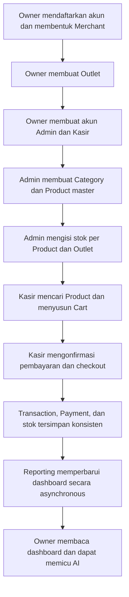
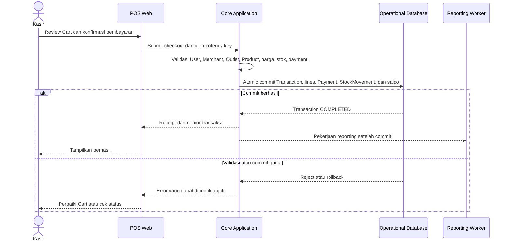
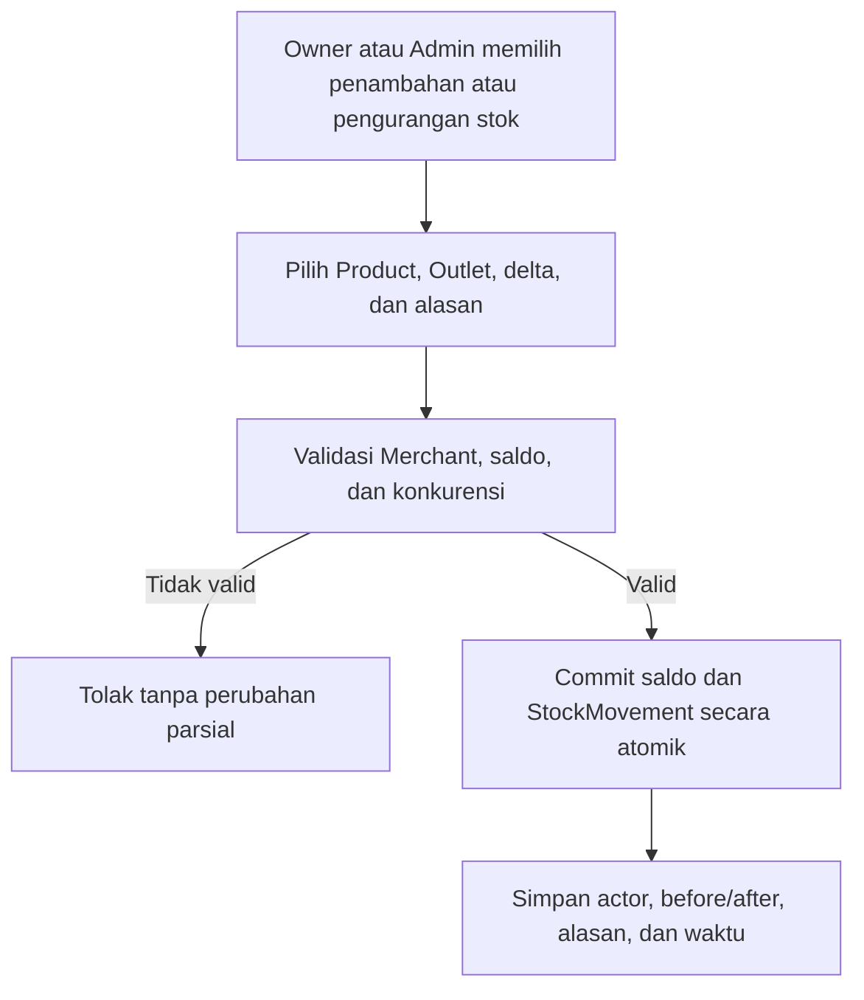
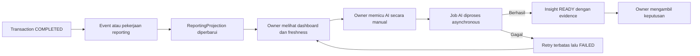

# Proposed Functional Requirements Document (FRD)

**Produk: Aplikasi K — POS dan Business Intelligence untuk UMKM**

| Atribut | Nilai |
|---|---|
| Dokumen | Functional Requirements Document, NFR Summary, dan Out-of-Scope |
| Versi | 0.8 — Iterasi 1 (structured) |
| Status | Proposed — untuk review dan validasi deliverable |
| Audiens | Stakeholder, Product, UX, engineer, QA, mentor, dan presenter |
| Panduan paket | [`00-iterasi-1-document-guide.md`](./00-iterasi-1-document-guide.md) |
| Konteks bisnis | [`01-iterasi-1-business-flow.md`](./01-iterasi-1-business-flow.md) |
| Kebutuhan pengguna | [`02-iterasi-1-proposed-urs.md`](./02-iterasi-1-proposed-urs.md) |
| Spesifikasi sistem | [`03-iterasi-1-proposed-srs.md`](./03-iterasi-1-proposed-srs.md) |

> **Tujuan dokumen:** menyajikan seluruh fitur Iterasi 1 secara jelas, terstruktur, dan cukup kontekstual tanpa menduplikasi detail teknis SRS secara tidak terkendali.

## Cara membaca dokumen ini

| Tujuan pembaca | Bagian utama |
|---|---|
| Memahami seluruh fitur | Bagian 4–6 |
| Memahami satu flow secara detail | Bagian 7–8 |
| Menilai kualitas sistem | Bagian 9 |
| Memastikan scope tidak melebar | Bagian 10–11 |
| Menelusuri fitur ke requirement dan test | Bagian 12 |

Requirement pengguna dan sistem yang normatif tetap menggunakan ID pada URS/SRS. ID `FEAT-*`, `US-*`, dan `UC-FRD-*` dalam FRD adalah lapisan navigasi dan traceability; ID tersebut tidak boleh mengubah makna `UR-*`, `FR-*`, `BR-*`, `DR-*`, atau `NFR-*` yang dirujuk.

---

# Part A — Functional Requirements

## 1. Tujuan dan batas FRD

FRD menjawab empat pertanyaan:

1. fitur apa yang tersedia pada Iterasi 1;
2. siapa yang menggunakan fitur tersebut;
3. bagaimana flow normal dan kondisi gagalnya;
4. bagaimana fitur ditelusuri ke URS, SRS, dan acceptance test.

FRD tidak mengunci:

- framework atau library;
- bentuk tabel fisik final;
- REST versus GraphQL;
- vendor cloud atau AI;
- bentuk deployment final;
- keputusan yang masih berstatus `Open`.

Jika terjadi perbedaan:

- URS menjadi rujukan intent, scope pengguna, dan prioritas;
- SRS menjadi rujukan perilaku sistem, aturan data, NFR, dan verifikasi;
- FRD menjadi tampilan feature-oriented yang menghubungkan keduanya.

## 2. Ringkasan produk dan prinsip utama

Aplikasi K adalah POS SaaS multi-tenant untuk UMKM Indonesia. Platform melayani banyak Merchant, sedangkan setiap Owner memiliki tepat satu Merchant. Satu Merchant dapat memiliki banyak Outlet. Proposed baseline mendukung lebih dari satu akun Kasir pada suatu Outlet, sedangkan satu Kasir hanya berada pada satu Outlet aktif; kapasitas multi-kasir ini bukan aturan jumlah minimum akun per Outlet.

Siklus bisnisnya:

```text
Owner menyiapkan Merchant, Outlet, dan staf
  -> Admin menyiapkan Category, Product, harga, dan stok per Outlet
      -> Kasir melakukan penjualan
          -> Transaction menjadi sumber kebenaran
              -> Reporting membentuk dashboard
                  -> Owner memicu AI dan mengambil keputusan
```

Prinsip prioritas:

> Checkout adalah jalur uang dan mendapat prioritas pertama. Reporting dan AI boleh tertinggal atau gagal, tetapi tidak boleh membuat checkout ikut lambat, gagal, atau berubah hasil.

## 3. Aktor dan scope akses

| Aktor/fungsi | Scope | Tanggung jawab utama |
|---|---|---|
| Owner | Tepat satu Merchant, lintas seluruh Outlet | Mengelola profil Merchant, Outlet, lifecycle staf, dashboard bisnis, audit yang diizinkan, dan AI insight |
| Admin | Satu Merchant, lintas seluruh Outlet | Mengelola Category, Product master, harga, inventory per Outlet, dan dashboard operasional |
| Kasir | Tepat satu Outlet aktif | Menemukan Product, menyusun Cart, checkout, melihat receipt, dan melihat transaction history sesuai batas akses |
| Reporting | Satu Merchant dan Outlet bila relevan | Mengubah Transaction final menjadi projection dashboard |
| AI insight | Satu Merchant | Menghasilkan saran untuk Owner setelah dipicu manual |
| Operator sistem | Platform | Memantau kesehatan aplikasi, database, worker, checkout, dan backlog tanpa memperoleh akses bisnis berlebihan |

Admin dan Kasir adalah manusia, bukan perangkat POS. Perangkat/register belum dimodelkan sebagai entitas pada Iterasi 1.

## 4. Feature catalog

| Feature ID | Fitur | Aktor utama | Prioritas | Use case utama |
|---|---|---|---|---|
| `FEAT-ONB` | Registrasi Owner dan pembentukan Merchant | Owner | Must | `UC-FRD-01` |
| `FEAT-AUTH` | Login, logout, status akun, dan session | Semua pengguna | Must | `UC-FRD-02` |
| `FEAT-OUT` | Pengelolaan Outlet | Owner | Must | `UC-FRD-03` |
| `FEAT-STF` | Pengelolaan lifecycle staf | Owner | Must | `UC-FRD-04` |
| `FEAT-CAT` | Pengelolaan Category | Owner, Admin | Must | `UC-FRD-05` |
| `FEAT-PROD` | Product master, harga, status, dan pencarian | Owner, Admin, Kasir | Must | `UC-FRD-06`, `UC-FRD-09` |
| `FEAT-INV-ADJ` | Melihat dan menyesuaikan stok per Outlet | Owner, Admin | Must | `UC-FRD-07` |
| `FEAT-CART` | Membuat dan mengubah Cart | Kasir | Must | `UC-FRD-09` |
| `FEAT-CHK` | Checkout, payment record, dan perlindungan duplikasi | Kasir | Must | `UC-FRD-10`, `UC-FRD-11` |
| `FEAT-REC` | Receipt dan pencarian status transaksi | Kasir, Admin, Owner | Must | `UC-FRD-10`, `UC-FRD-11` |
| `FEAT-TRX` | Transaction history dan detail | Kasir, Admin, Owner | Must | `UC-FRD-12` |
| `FEAT-DASH-OWN` | Dashboard bisnis Owner | Owner | Must | `UC-FRD-13` |
| `FEAT-DASH-ADM` | Dashboard operasional Admin | Admin | Must | `UC-FRD-14` |
| `FEAT-AI` | Trigger, status, hasil, dan histori AI insight | Owner | Must | `UC-FRD-15` |
| `FEAT-AUD-OPS` | Audit trail dan penelusuran operasional | Owner, Admin terbatas, Operator | Must/Should sesuai aksi | `UC-FRD-16` |

## 5. Role-based access definitions

Legenda: `✓` diizinkan, `—` tidak diizinkan, `Open` belum menjadi requirement Must dan tidak boleh diasumsikan sudah tersedia.

| Kapabilitas | Owner | Admin | Kasir |
|---|:---:|:---:|:---:|
| Mengelola profil Merchant | ✓ | — | — |
| Membuat/mengubah/menonaktifkan Outlet | ✓ | — | — |
| Membuat dan mengelola akun Admin/Kasir | ✓ | — | — |
| Menetapkan `User.role` dan `User.outlet_id` | ✓ | — | — |
| Melihat Category dan Product master | ✓ | ✓ | Product aktif yang tersedia pada Outlet tugasnya |
| Membuat/mengubah/menonaktifkan Category | ✓ | ✓ | — |
| Membuat/mengubah/menonaktifkan Product dan harga | ✓ | ✓ | — |
| Melihat stok seluruh Outlet | ✓ | ✓ | Hanya ketersediaan untuk berjualan |
| Penambahan atau pengurangan stok | ✓ | ✓ | — |
| Membuat dan mengubah Cart | Open | Open | ✓ |
| Checkout | Open | Open | ✓ pada Outlet tugasnya |
| Melihat seluruh transaksi Merchant | ✓ | ✓ | — |
| Melihat transaction history Kasir | ✓ | ✓ | Sesuai `OD-003`: transaksi sendiri atau seluruh Outlet |
| Melihat dashboard bisnis Owner | ✓ | — | — |
| Melihat dashboard operasional Merchant | ✓ | ✓ | — |
| Memicu dan melihat AI insight | ✓ | — | — |
| Melihat audit keamanan | ✓ sesuai kebijakan | — | — |
| Melihat jejak perubahan katalog/inventory | ✓ | ✓ | — |

Aturan akses wajib:

1. akses diperiksa oleh server, bukan hanya dengan menyembunyikan menu;
2. semua akses dibatasi oleh `User.merchant_id`;
3. akses Kasir juga dibatasi oleh `User.outlet_id`;
4. Admin memiliki `User.outlet_id = null` dan bekerja lintas Outlet dalam Merchant;
5. Kasir memiliki tepat satu `User.outlet_id` aktif;
6. data Merchant lain tidak boleh dikembalikan walaupun ID-nya diketahui;
7. checkout Owner/Admin tetap `Open` sampai permission dan pemilihan konteks Outlet diputuskan.

## 6. User stories dan acceptance summary

Setiap baris tetap memakai ID agar ringkas. Untuk membaca sumber lengkapnya, gunakan [User requirements di URS](./02-iterasi-1-proposed-urs.md#7-user-requirements), [role dan permission di URS](./02-iterasi-1-proposed-urs.md#8-proposed-role-and-permission-matrix), atau [functional requirements di SRS](./03-iterasi-1-proposed-srs.md#8-functional-requirements).

### 6.1 Onboarding, authentication, Outlet, dan staf

| User Story ID | User story | Prioritas | Acceptance summary | Referensi |
|---|---|---|---|---|
| `US-ONB-001` | Sebagai calon Owner, saya ingin mendaftarkan akun dan membentuk Merchant agar dapat mulai menggunakan platform. | Must | Email unik; Owner dan Merchant terbentuk konsisten; satu Owner tidak dapat membuat Merchant kedua. | `UR-OWN-001`, `FR-AUTH-001–004`, `FR-TEN-001–003` |
| `US-AUTH-001` | Sebagai pengguna, saya ingin login menggunakan email dan password agar dapat mengakses fungsi sesuai role. | Must | Credential valid menghasilkan session; credential salah atau akun nonaktif ditolak tanpa membocorkan detail. | `UR-OWN-002`, `UR-CAS-001`, `FR-AUTH-005–010` |
| `US-AUTH-002` | Sebagai pengguna, saya ingin logout agar session saya tidak dapat digunakan kembali sesuai model session. | Must | Session/token terkait dicabut atau tidak berlaku lagi. | `UR-SEC-003`, `FR-AUTH-008–009` |
| `US-OUT-001` | Sebagai Owner, saya ingin membuat dan mengubah Outlet agar struktur operasional Merchant tercatat. | Must | Outlet hanya dibuat pada Merchant Owner dan memiliki nama/status yang valid. | `UR-OWN-003A`, `FR-TEN-004` |
| `US-OUT-002` | Sebagai Owner, saya ingin menonaktifkan Outlet tanpa menghapus histori agar Outlet berhenti menerima checkout baru tetapi transaksi lama tetap ada. | Must | Outlet nonaktif ditolak untuk checkout baru; histori tetap dapat ditelusuri. | `UR-OWN-003A`, `FR-TEN-004,008–010` |
| `US-STF-001` | Sebagai Owner, saya ingin membuat akun Admin atau Kasir menggunakan email dan password awal agar staf dapat langsung bekerja. | Must | Role hanya `ADMIN`/`CASHIER`; email unik; password disimpan sebagai hash. | `UR-OWN-003–003B`, `FR-AUTH-011–013` |
| `US-STF-002` | Sebagai Owner, saya ingin menetapkan role dan Outlet staf agar batas aksesnya benar. | Must | Admin tidak memiliki Outlet; Kasir wajib memiliki tepat satu Outlet aktif dalam Merchant yang sama. | `UR-OWN-003`, `FR-AUTH-014`, `FR-TEN-005–006` |
| `US-STF-003` | Sebagai Owner, saya ingin menonaktifkan, mengaktifkan kembali, atau mereset password staf tanpa menghapus histori aksinya. | Must | Hanya Owner dapat melakukan aksi; session lama akun nonaktif tidak dapat dipakai untuk aksi baru. | `UR-OWN-003–003B`, `FR-TEN-007–008`, `BR-015` |

### 6.2 Category, Product, dan inventory

| User Story ID | User story | Prioritas | Acceptance summary | Referensi |
|---|---|---|---|---|
| `US-CAT-001` | Sebagai Admin, saya ingin membuat dan mengubah Category agar Product dapat dikelompokkan secara konsisten. | Must | Nama Category unik dalam Merchant dan tidak kosong. | `UR-ADM-001–002`, `FR-CAT-001,003,010` |
| `US-CAT-002` | Sebagai Admin, saya ingin menonaktifkan Category tanpa menghapusnya agar relasi Product dan histori tetap utuh. | Must | Category nonaktif tidak dapat dipilih untuk Product baru/perubahan; relasi lama tidak dihapus. | `UBR-016`, `FR-CAT-003,010`, `BR-019` |
| `US-PROD-001` | Sebagai Admin, saya ingin membuat Product master dengan nama, harga, Category, dan status agar Product siap dikelola Merchant. | Must | Category wajib aktif dan milik Merchant; nama tidak kosong; harga tidak negatif. | `UR-ADM-001–002`, `FR-CAT-002–005` |
| `US-PROD-002` | Sebagai Admin, saya ingin mengubah harga/status Product tanpa mengubah transaksi lama agar histori tetap benar. | Must | Perubahan berlaku untuk checkout berikutnya; snapshot transaksi lama tidak berubah. | `UR-ADM-005–006`, `FR-CAT-005,007–008` |
| `US-PROD-003` | Sebagai Kasir, saya ingin mencari dan memilih Product aktif agar dapat melayani pelanggan dengan cepat. | Must | Hanya Product aktif yang mempunyai inventory pada Outlet tugasnya ditampilkan; pencarian memenuhi target performa. | `UR-CAS-002–003`, `FR-CAT-006`, `NFR-PERF-003` |
| `US-PROD-004` | Sebagai Kasir, saya ingin memfilter Product berdasarkan Category agar daftar Product lebih mudah dipindai. | Could | Filter hanya memakai Category Merchant; keputusan detail UX mengikuti desain. | Scope “jika waktu cukup”; belum menjadi Must tersendiri |
| `US-INV-001` | Sebagai Admin, saya ingin melihat stok satu Product pada setiap Outlet agar dapat mengetahui ketersediaannya. | Must | Saldo ditampilkan per kombinasi Product + Outlet dan tidak bercampur antar-Merchant. | `UR-ADM-001`, `FR-INV-001–002` |
| `US-INV-002` | Sebagai Admin, saya ingin menambah, mengurangi, atau mengoreksi stok pada Outlet aktif dengan alasan agar perubahan dapat dipertanggungjawabkan. | Must | Tidak menghasilkan stok negatif; before/after, delta, alasan, actor, Product, Outlet, dan waktu tercatat. Outlet nonaktif hanya dapat dilihat sebagai histori. | `UR-ADM-003,007–008`, `FR-TEN-004`, `FR-INV-003–004` |
| `US-INV-004` | Sebagai Admin, saya ingin melihat Product dengan stok rendah agar dapat mengambil tindakan sebelum habis. | Must | Satu threshold global Merchant dipakai untuk semua Outlet dan daftar dibatasi oleh scope Merchant/Outlet. | `UR-ADM-001`, `FR-INV-008`, `FR-REP-003` |

### 6.3 Product discovery, Cart, checkout, payment, dan receipt

| User Story ID | User story | Prioritas | Acceptance summary | Referensi |
|---|---|---|---|---|
| `US-CART-001` | Sebagai Kasir, saya ingin membuat Cart dan menambahkan Product agar dapat menyusun pembelian pelanggan. | Must | Hanya Product aktif; kuantitas positif; Cart terkait dengan konteks Outlet Kasir. | `UR-CAS-002–004`, `FR-CART-001–002` |
| `US-CART-002` | Sebagai Kasir, saya ingin mengubah kuantitas, menghapus item, atau membatalkan Cart agar kesalahan dapat diperbaiki sebelum pembayaran. | Must | Tidak ada Transaction final ketika Cart diubah/dibatalkan. | `UR-CAS-004`, `FR-CART-003,010` |
| `US-CART-003` | Sebagai Kasir, saya ingin melihat item, subtotal, dan total agar dapat mengonfirmasi jumlah pembayaran kepada pelanggan. | Must | UI menampilkan perhitungan; server tetap menghitung ulang total final. | `UR-CAS-005`, `FR-CART-004–006` |
| `US-CHK-001` | Sebagai Kasir, saya ingin memilih metode pembayaran dan checkout agar penjualan tercatat tepat satu kali. | Must | Transaction, line snapshot, payment record, stock movement, dan pengurangan stok commit atomik. | `UR-CAS-006–008`, `FR-CHK-001–011`, `FR-PAY-001–005` |
| `US-CHK-002` | Sebagai Kasir, saya ingin menerima alasan yang jelas ketika harga, status Product, stok, atau akses berubah agar Cart dapat diperbaiki dengan aman. | Must | Checkout ditolak tanpa hasil parsial dan mengembalikan kode error yang dapat ditindaklanjuti. | `UR-CAS-010`, `FR-CART-007–010`, `FR-CHK-005–007` |
| `US-CHK-003` | Sebagai Kasir, saya ingin memeriksa status checkout yang responsnya terputus agar tidak membuat transaksi ganda. | Must | Key dan payload sama mengembalikan transaksi yang sama; payload berbeda ditolak. | `UR-CAS-007–009`, `FR-CHK-001–004,012–016` |
| `US-REC-001` | Sebagai Kasir, saya ingin menerima nomor dan receipt setelah checkout berhasil agar pelanggan memperoleh bukti transaksi. | Must | Receipt memakai snapshot dan dapat dilihat ulang tanpa membaca harga katalog terbaru. | `UR-CAS-011`, `FR-PAY-006–008` |

### 6.4 Transaction history, dashboard, reporting, dan AI

| User Story ID | User story | Prioritas | Acceptance summary | Referensi |
|---|---|---|---|---|
| `US-TRX-001` | Sebagai pengguna berhak, saya ingin melihat daftar dan detail Transaction agar dapat menelusuri penjualan yang telah terjadi. | Must | Pagination; filter tanggal/status; pencarian receipt; scope Merchant/Outlet diterapkan. | `UR-CAS-014`, `UR-OWN-007`, `FR-TRX-001–007` |
| `US-TRX-002` | Sebagai Kasir, saya ingin melihat riwayat yang diizinkan pada Outlet tugas saya agar dapat membantu pemeriksaan transaksi. | Must/Open scope | Fitur wajib tersedia; apakah hanya transaksi sendiri atau seluruh Outlet mengikuti `OD-003`. | `UR-CAS-014`, `FR-TRX-004,006` |
| `US-DASH-001` | Sebagai Owner, saya ingin memilih periode dan melihat omzet, jumlah transaksi, serta AOV agar memahami kondisi bisnis. | Must | Hanya Transaction `COMPLETED`; definisi metrik konsisten; scope Merchant/Outlet benar. | `UR-OWN-004`, `UR-REP-001–003`, `FR-REP-001–003` |
| `US-DASH-002` | Sebagai Owner, saya ingin melihat tren penjualan/AOV, pola waktu, Product terlaris/tidak laku, dan perbandingan Outlet agar mengetahui perubahan yang perlu ditindaklanjuti. | Must | Hasil sesuai periode, bucket waktu, timezone Merchant, dan transaksi sumber. | `UR-OWN-005–005A`, `UR-REP-003A`, `FR-REP-003A–003C` |
| `US-DASH-003` | Sebagai Owner, saya ingin melihat waktu pembaruan dan status stale agar memahami seberapa baru data dashboard. | Must | `data_updated_at`, timezone, empty state, dan degraded state terlihat. | `UR-OWN-006,009`, `FR-REP-004–007` |
| `US-DASH-004` | Sebagai Admin, saya ingin melihat dashboard operasional dan stok rendah seluruh Merchant agar dapat menjaga Outlet siap berjualan. | Must | Data dibatasi Merchant dan permission Admin; tidak menyediakan AI insight. | `UR-ADM-001,008`, `FR-REP-003,009` |
| `US-AI-001` | Sebagai Owner, saya ingin memicu analisis AI secara manual agar memperoleh insight ketika dibutuhkan. | Must | Hanya Owner; tidak ada batas maksimum penggunaan; job diproses di luar checkout. | `UR-AI-002,010`, `FR-AI-001,012`, `BR-020` |
| `US-AI-002` | Sebagai Owner, saya ingin melihat status, periode, evidence, dan hasil insight agar dapat menilai dasar rekomendasinya. | Must | Status terlihat; output menyimpan periode, evidence summary, tipe, versi data, dan waktu. | `UR-OWN-008–009`, `UR-AI-003–006`, `FR-AI-002–008` |
| `US-AI-003` | Sebagai Owner, saya ingin dashboard tetap tersedia ketika AI gagal agar keputusan dasar tidak bergantung pada provider AI. | Must | AI timeout/retry terbatas; status `FAILED` dapat dipahami; checkout dan dashboard dasar tetap hidup. | `UR-AI-005,007`, `FR-AI-006,008,011` |

### 6.5 Audit, keamanan, dan operasi

| User Story ID | User story | Prioritas | Acceptance summary | Referensi |
|---|---|---|---|---|
| `US-AUD-001` | Sebagai Owner/Admin sesuai haknya, saya ingin perubahan penting dapat ditelusuri agar masalah katalog, stok, akses, atau transaksi dapat dijelaskan. | Must/Should | Audit menyimpan actor, waktu, Merchant, Outlet bila relevan, aksi, target, hasil, dan before/after yang aman. | `UR-ADM-007`, `UR-SEC-007`, `FR-AUD-001–005` |
| `US-OPS-001` | Sebagai operator, saya ingin menelusuri checkout menggunakan correlation ID atau Transaction ID agar insiden dapat diselidiki. | Must | Log tidak membocorkan secret; alur dapat dicari lintas modul. | `UR-OPS-001–002`, `FR-OPS-001–004` |
| `US-OPS-002` | Sebagai Merchant, saya ingin checkout tetap responsif ketika reporting/AI aktif agar penjualan tidak terganggu. | Must | Mixed workload memenuhi target; worker mempunyai concurrency limit/backpressure. | `UR-BIZ-003,005,008`, `NFR-SCALE-002–003` |

---

## 7. Detailed use cases

### UC-FRD-01 — Registrasi Owner dan Merchant

| Elemen | Detail |
|---|---|
| Aktor | Calon Owner |
| Prasyarat | Email belum terdaftar |
| Pemicu | Calon Owner memilih registrasi |
| Alur utama | Isi nama, email, dan password → sistem memvalidasi input → password di-hash → User `OWNER` dan tepat satu Merchant dibentuk konsisten → Owner masuk atau diarahkan login |
| Alternatif | Email sudah digunakan; password lemah; pembuatan Merchant gagal |
| Hasil sukses | Owner aktif terhubung dengan tepat satu Merchant aktif |
| Hasil gagal | Tidak ada Owner atau Merchant setengah terbentuk |
| Referensi | `US-ONB-001`, `FR-AUTH-001–004`, `FR-TEN-001–003`, `AT-001` |

### UC-FRD-02 — Login dan logout

| Elemen | Detail |
|---|---|
| Aktor | Owner, Admin, Kasir |
| Prasyarat | User dan Merchant aktif; Outlet Kasir juga aktif |
| Pemicu | Pengguna mengirim email dan password atau memilih logout |
| Alur utama | Normalisasi email → validasi credential/status → buat session dengan expiry → pengguna mengakses fitur sesuai role → logout mencabut session sesuai model yang dipilih |
| Alternatif | Credential salah; akun/Merchant/Outlet nonaktif; rate limit tercapai; session kedaluwarsa |
| Hasil | Akses hanya diberikan kepada identitas dan scope yang sah |
| Referensi | `US-AUTH-001–002`, `FR-AUTH-005–010`, `AT-014` |

### UC-FRD-03 — Owner mengelola Outlet

| Elemen | Detail |
|---|---|
| Aktor | Owner |
| Prasyarat | Owner login pada Merchant aktif |
| Pemicu | Owner membuat, mengubah, atau menonaktifkan Outlet |
| Alur utama | Isi/pilih Outlet → validasi ownership Merchant → simpan perubahan → audit dicatat → tampilkan konfirmasi |
| Alternatif | Input tidak valid; Outlet Merchant lain; Outlet sudah nonaktif; konflik dengan operasi aktif ditangani sesuai rule |
| Hasil | Outlet tersedia untuk setup operasional atau menjadi read-only ketika nonaktif; checkout dan stock adjustment baru ditolak, histori tetap ada |
| Referensi | `US-OUT-001–002`, `FR-TEN-004,008–010` |

### UC-FRD-04 — Owner mengelola staf

| Elemen | Detail |
|---|---|
| Aktor | Owner |
| Prasyarat | Owner login pada Merchant aktif |
| Pemicu | Owner membuat atau mengubah akun staf |
| Alur utama | Isi nama/email/password awal → pilih satu role → pilih tepat satu Outlet aktif hanya untuk Kasir → validasi → simpan password hash → User aktif dibuat/diubah → audit dicatat |
| Alternatif | Email duplikat; role tidak sah; Admin memiliki Outlet; Kasir tidak memiliki Outlet; Outlet berbeda Merchant; reset/aktivasi gagal |
| Hasil | Admin aktif pada Merchant atau Kasir aktif pada tepat satu Outlet; histori User lama tidak dihapus |
| Referensi | `US-STF-001–003`, `FR-AUTH-011–014`, `FR-TEN-005–008`, `AT-016` |

### UC-FRD-05 — Owner/Admin mengelola Category

| Elemen | Detail |
|---|---|
| Aktor | Owner, Admin |
| Prasyarat | User aktif dengan akses katalog pada Merchant |
| Pemicu | Membuat, mengubah, atau menonaktifkan Category |
| Alur utama | Isi/pilih Category → validasi nama dan Merchant → simpan perubahan → audit dicatat → Category aktif dapat dipilih Product |
| Alternatif | Nama kosong/duplikat; Merchant salah; Category nonaktif dipilih untuk Product baru/perubahan |
| Hasil | Category tersimpan atau dinonaktifkan tanpa dihapus fisik; relasi dan histori tetap utuh |
| Referensi | `US-CAT-001–002`, `FR-CAT-001,003,010`, `BR-019` |

### UC-FRD-06 — Owner/Admin mengelola Product master

| Elemen | Detail |
|---|---|
| Aktor | Owner, Admin |
| Prasyarat | Category aktif tersedia pada Merchant |
| Pemicu | Membuat atau mengubah Product |
| Alur utama | Isi nama, harga, satu Category wajib, dan status → validasi Merchant/Category/harga → simpan Product → audit harga/status dicatat → stok awal dikelola melalui adjustment terpisah |
| Alternatif | Category kosong/nonaktif/beda Merchant; nama kosong; harga negatif; akses ditolak |
| Hasil | Product master tersedia bagi Merchant; perubahan berikutnya tidak mengubah snapshot transaksi lama |
| Referensi | `US-PROD-001–002`, `FR-CAT-002–010`, `AT-013` |

### UC-FRD-07 — Stock adjustment

| Elemen | Detail |
|---|---|
| Aktor | Owner, Admin |
| Prasyarat | Product dan Outlet aktif berada dalam Merchant aktif |
| Pemicu | Pengguna memilih penambahan, pengurangan, atau koreksi stok |
| Alur utama | Pilih Outlet dan Product → masukkan perubahan serta alasan → validasi scope dan saldo → commit saldo dan StockMovement → simpan before/after serta actor → tampilkan hasil |
| Alternatif | Alasan kosong; Outlet nonaktif; Outlet/Product beda Merchant; hasil negatif; konflik dengan checkout bersamaan |
| Hasil | Satu saldo Product + Outlet dan movement terkait konsisten serta dapat diaudit |
| Referensi | `US-INV-001–002`, `FR-INV-001–004,009` |

### UC-FRD-09 — Kasir menemukan Product dan menyusun Cart

| Elemen | Detail |
|---|---|
| Aktor | Kasir |
| Prasyarat | Kasir aktif pada satu Outlet aktif |
| Pemicu | Pelanggan memilih barang yang akan dibeli |
| Alur utama | Cari/pilih Product aktif → tambah ke Cart → ubah kuantitas bila perlu → hapus item bila perlu → UI menampilkan subtotal dan total |
| Alternatif | Product tidak aktif; tidak mempunyai inventory pada Outlet; kuantitas tidak valid; Cart dikosongkan |
| Hasil | Cart siap direview; belum ada Transaction final atau pengurangan stok |
| Referensi | `US-PROD-003–004`, `US-CART-001–003`, `FR-CAT-006`, `FR-CART-001–010` |

### UC-FRD-10 — Checkout berhasil

| Elemen | Detail |
|---|---|
| Aktor | Kasir |
| Prasyarat | Kasir dan Outlet aktif; Cart tidak kosong; metode pembayaran dipilih |
| Pemicu | Kasir mengonfirmasi bahwa pembayaran telah diterima |
| Alur utama | Client mengirim idempotency key → server memvalidasi User/Merchant/Outlet/Product/harga/stok/payment → server menghitung total → Transaction, line snapshot, Payment, StockMovement, dan saldo stok commit atomik → event reporting dicatat → receipt dikembalikan |
| Alternatif | Ditangani oleh `UC-FRD-11` |
| Hasil | Tepat satu Transaction `COMPLETED`, satu Payment `CONFIRMED`, satu pengurangan stok, dan receipt yang konsisten |
| Referensi | `US-CHK-001`, `US-REC-001`, `FR-CHK-001–017`, `FR-PAY-001–008`, `AT-003–006,009–010` |

### UC-FRD-11 — Checkout ditolak atau hasil belum diketahui

| Elemen | Detail |
|---|---|
| Aktor | Kasir |
| Prasyarat | Kasir telah menyusun Cart atau pernah mengirim checkout |
| Pemicu | Validasi bisnis gagal, dependency gagal, atau response terputus |
| Alur utama | Sistem mengembalikan kode yang dapat ditindaklanjuti → Cart tetap dapat diperbaiki → bila response tidak diketahui, UI mempertahankan idempotency key dan melakukan status lookup → hasil lama dikembalikan atau retry aman diizinkan |
| Alternatif | Harga berubah: tampilkan total baru; Product nonaktif: hapus/ganti; stok kurang: kurangi/hapus; key dengan payload berbeda: conflict; masih processing: polling terbatas |
| Hasil | Tidak ada Transaction/payment/stok parsial dan tidak terjadi transaksi ganda |
| Referensi | `US-CHK-002–003`, `FR-CART-007–010`, `FR-CHK-003–016`, `AT-005–010` |

### UC-FRD-12 — Melihat transaction history

| Elemen | Detail |
|---|---|
| Aktor | Owner, Admin, Kasir sesuai scope |
| Prasyarat | User login dan mempunyai hak terhadap Transaction yang diminta |
| Pemicu | Pengguna membuka riwayat atau mencari receipt number |
| Alur utama | Tentukan scope dari credential → terapkan filter tanggal/status/Outlet → kembalikan daftar berpaginasi → pengguna membuka detail/receipt snapshot |
| Alternatif | Tidak ada hasil; Transaction beda Merchant/Outlet; receipt tidak ditemukan; scope Kasir mengikuti `OD-003` |
| Hasil | Histori dapat dibaca tanpa mengubah Transaction dan tanpa membaca harga katalog terbaru |
| Referensi | `US-TRX-001–002`, `FR-TRX-001–007` |

### UC-FRD-13 — Owner melihat dashboard bisnis

| Elemen | Detail |
|---|---|
| Aktor | Owner |
| Prasyarat | Owner login; projection tersedia atau mempunyai status |
| Pemicu | Owner membuka dashboard dan memilih periode/scope Outlet |
| Alur utama | Validasi Merchant → baca projection → tampilkan omzet, jumlah transaksi, AOV, tren penjualan/AOV, pola waktu, Product terlaris/tidak laku, perbandingan Outlet, timezone, dan waktu pembaruan |
| Alternatif | Periode kosong; projection stale; reporting gagal; Outlet tidak sah |
| Hasil | Owner memahami kondisi bisnis tanpa query berat di jalur checkout |
| Referensi | `US-DASH-001–003`, `FR-REP-001–010`, `AT-011,017` |

### UC-FRD-14 — Admin melihat dashboard operasional

| Elemen | Detail |
|---|---|
| Aktor | Admin |
| Prasyarat | Admin aktif pada Merchant |
| Pemicu | Admin membuka dashboard operasional atau memilih Outlet |
| Alur utama | Validasi Merchant → baca metrik operasional dan stok rendah → tampilkan scope Merchant/Outlet serta freshness |
| Alternatif | Data kosong/stale; Outlet Merchant lain; reporting gagal |
| Hasil | Admin dapat mengambil tindakan katalog/inventory tanpa memperoleh akses AI atau manajemen staf |
| Referensi | `US-DASH-004`, `FR-REP-003–009` |

### UC-FRD-15 — Owner memicu dan melihat AI insight

| Elemen | Detail |
|---|---|
| Aktor | Owner |
| Prasyarat | Owner aktif pada Merchant; dashboard dasar tidak bergantung pada AI |
| Pemicu | Owner menekan tombol analisis AI |
| Alur utama | Validasi Owner/Merchant → bentuk dedupe key dan input periode/versi data → antrekan background job → tampilkan `PENDING/PROCESSING` → worker menghasilkan evidence dan content → simpan `READY` → Owner melihat hasil |
| Alternatif | Request duplikat memakai job yang sama; kegagalan sementara dijadwalkan retry terbatas; kegagalan akhir menjadi `FAILED`; data lama menjadi `STALE` |
| Hasil | Insight tersimpan dengan periode, evidence, versi, status, dan waktu; tidak mengubah Product, stok, akses, atau Transaction |
| Referensi | `US-AI-001–003`, `FR-AI-001–012`, `AT-012` |

### UC-FRD-16 — Audit dan penelusuran insiden

| Elemen | Detail |
|---|---|
| Aktor | Owner/Admin sesuai hak, Operator sistem |
| Prasyarat | Aksi penting atau insiden telah terjadi |
| Pemicu | Pengguna berhak membuka jejak perubahan atau Operator mencari correlation ID |
| Alur utama | Validasi scope → cari audit/log menggunakan target/actor/correlation ID → tampilkan data aman yang relevan → kaitkan dengan hasil operasi |
| Alternatif | Akses tidak sah; data sensitif harus direduksi; logging non-kritis gagal tanpa memalsukan hasil checkout |
| Hasil | Perubahan penting dan masalah operasional dapat dijelaskan tanpa membocorkan password, token, atau data Merchant lain |
| Referensi | `US-AUD-001`, `US-OPS-001`, `FR-AUD-001–006`, `FR-OPS-001–006` |

---

## 8. Workflow descriptions

### 8.1 Workflow setup sampai penjualan



### 8.2 Apa yang terjadi ketika penjualan diproses



### 8.3 Workflow perubahan inventory



### 8.4 Workflow dashboard dan AI



---

# Part B — Non-Functional Requirements

## 9. Non-functional requirements

### 9.1 Cara membaca target

| Label | Arti |
|---|---|
| Acceptance MVP | Harus dibuktikan pada environment demo/test Iterasi 1 |
| Proposed Baseline | Target awal yang masih perlu disetujui stakeholder |
| Target Production | Arah kualitas produksi, bukan klaim kemampuan deployment demo gratis |

Semua pengujian harus mencatat environment, ukuran data, concurrency, durasi, dan hasil aktual. Detail normatif berada pada SRS bagian NFR.

### 9.2 Performance targets

| ID | Area | Target | Status |
|---|---|---|---|
| `NFR-PERF-001` | Checkout valid | p95 ≤ 500 ms dan p99 ≤ 1.000 ms di server, tanpa gateway eksternal | Proposed Baseline |
| `NFR-PERF-002` | Penolakan validasi checkout | p95 ≤ 400 ms | Proposed Baseline |
| `NFR-PERF-003` | Product search/list Kasir | p95 ≤ 300 ms pada dataset baseline | Proposed Baseline |
| `NFR-PERF-004` | Transaction status lookup | p95 ≤ 300 ms | Proposed Baseline |
| `NFR-PERF-005` | Dashboard read dari projection | p95 ≤ 2 detik | Proposed Baseline |
| `NFR-PERF-006` | CRUD Admin biasa | p95 ≤ 700 ms | Proposed Baseline |
| `NFR-PERF-007` | Feedback visual setelah checkout ditekan | ≤ 100 ms | Acceptance MVP |
| `NFR-PERF-008` | Query analitik berat dalam checkout | 0 query berat synchronous | Acceptance MVP |

### 9.3 Availability dan reliability

| Area | Target/aturan | Referensi |
|---|---|---|
| Availability POS | 99,9% per bulan untuk target produksi, di luar maintenance yang disetujui | `NFR-REL-001` |
| Isolasi kegagalan | Reporting/AI gagal tidak membuat checkout unavailable | `NFR-REL-002` |
| Atomicity | Tidak ada Transaction, Payment, atau stok parsial | `NFR-REL-003` |
| Background jobs | Retry terbatas dan deduplication; tidak ada retry tanpa batas | `NFR-REL-004` |
| Dashboard freshness | ≤5 menit untuk ≥95% Transaction pada kondisi normal | `NFR-REL-005`, Proposed Baseline |
| AI job lifecycle | Setiap request yang diterima berakhir terpantau pada `READY` atau `FAILED` | `NFR-REL-006` |
| Durability | Transaction `COMPLETED` tetap tersimpan setelah process restart | `NFR-REL-007` |
| Dependency timeout | Call eksternal mempunyai timeout dan tidak menahan resource tanpa batas | `NFR-REL-008` |

Target recovery produksi:

- RPO database ≤15 menit, ideal mendekati nol sesuai biaya;
- RTO jalur POS ≤60 menit;
- backup diuji melalui restore minimal sekali sebelum final demo/release candidate;
- ReportingProjection dan Insight dapat dibangun ulang dari source of truth;
- prosedur recovery mencakup database unavailable, migration gagal, backlog worker, dan deployment gagal.

### 9.4 Scalability considerations

Dataset dan load Proposed Baseline:

| Dimensi | Baseline |
|---|---:|
| Merchant | 500 |
| User aktif terdaftar | Maksimum 2.500 |
| Product total | 100.000 |
| Transaction historis | 1.000.000 |
| Rata-rata line per Transaction | 3 |
| Submit checkout concurrent | 50 |
| Beban sustained | 20 checkout/detik selama 15 menit |
| Burst | 50 checkout/detik selama 60 detik |

Aturan scale:

1. checkout tetap memenuhi target pada dataset dan beban baseline;
2. ketika reporting dan AI aktif, p95 checkout tidak memburuk lebih dari 20% dan tetap ≤500 ms;
3. worker menerapkan backpressure/concurrency limit agar tidak menghabiskan koneksi checkout;
4. application dan worker dapat dinaikkan kapasitasnya secara independen secara logis;
5. list, report, dan batch selalu bounded/paginated;
6. **future consideration, bukan acceptance gate Iterasi 1:** pertumbuhan menuju 10× baseline dilakukan berdasarkan telemetry dan bottleneck nyata, bukan dengan over-provisioning sejak awal;
7. desain tidak mewajibkan microservices atau Kubernetes untuk mengklaim scalable.

### 9.5 Security measures

| Area | Requirement minimum |
|---|---|
| Password | Hash adaptif yang diakui seperti Argon2id atau bcrypt; password asli tidak disimpan atau ditampilkan kembali |
| Authentication | Email ternormalisasi, session/token expiry, logout, penolakan akun nonaktif, dan login rate limit |
| Authorization/RBAC | Diperiksa di server untuk setiap operasi berdasarkan role, Merchant, Outlet, dan status User |
| Tenant isolation | ID valid milik Merchant lain tetap tidak boleh mengembalikan datanya |
| Transport | Seluruh traffic production menggunakan TLS |
| Session | Cookie `Secure`, `HttpOnly`, dan `SameSite` yang sesuai bila cookie digunakan |
| Input/data access | Validasi input, output encoding, serta parameterized query atau abstraction aman |
| Secret | Berasal dari environment/secret manager dan tidak di-commit |
| Payment privacy | Tidak menyimpan nomor kartu, PIN, OTP, credential e-wallet, atau QR payload sensitif |
| Logging | Password, token, credential, dan data sensitif direduksi; stack trace tidak dikirim ke pengguna |
| Dependency | Vulnerability scanning dijalankan pada CI atau sebelum release |
| Verification | Negative authorization dan cross-tenant security test wajib tersedia |

### 9.6 Maintainability principles

1. checkout, pricing, catalog availability, authorization, inventory, reporting, dan AI mempunyai batas modul yang jelas;
2. aturan bisnis kritis tidak diduplikasi secara independen di frontend dan backend;
3. backend menjadi validator final untuk harga, total, stok, role, Merchant, dan Outlet;
4. formatter, linter, naming convention, dan error format digunakan secara konsisten;
5. migration, seed, dan setup lokal terdokumentasi serta dapat direproduksi;
6. keputusan arsitektur besar mencatat rationale dan trade-off;
7. engineer baru dapat menjalankan aplikasi dari README tanpa pengetahuan tersembunyi;
8. reporting/AI dapat dimatikan tanpa mengubah kontrak checkout;
9. test kritis deterministic dan tidak bergantung pada provider AI nyata;
10. perubahan requirement memperbarui URS, FRD, SRS, API contract, dan test yang terdampak.

### 9.7 Observability dan operational quality

Sistem minimum harus menyediakan:

- structured log dengan timestamp, level, module, correlation ID, safe Merchant/actor reference, action, result, dan error category;
- metric checkout request rate, success/error rate, p95/p99 latency, database error/pool pressure, dan backlog age;
- alert untuk lonjakan checkout error, latency melewati target, database unavailable, dan backlog melewati freshness threshold;
- health indicator aplikasi, database, dan background worker;
- cara replay reporting/AI secara aman tanpa menggandakan hasil;
- failed/dead-letter state untuk job yang kehabisan retry.

### 9.8 Usability, accessibility, dan compatibility

| Area | Target minimum |
|---|---|
| Kemudahan Kasir | ≥90% peserta usability test kecil dapat menyelesaikan happy path tanpa dokumentasi teknis |
| Langkah checkout | Pilih item → review → metode pembayaran → konfirmasi |
| Error | Semua error utama menjelaskan masalah dan tindakan berikutnya |
| Accessibility | Warna bukan satu-satunya penanda; flow utama mendekati WCAG 2.1 AA |
| Bahasa | Bahasa Indonesia konsisten dan tidak menampilkan jargon internal kepada pengguna |
| Browser | Dua versi terbaru Chromium dan Firefox; Safari terbaru sebaiknya diuji |
| Viewport | Tablet dan desktop sesuai desain |
| Currency/time | IDR dengan format Indonesia; waktu ditampilkan menurut zona Merchant; timestamp antarsistem tidak ambigu |

---

# Part C — Scope Boundary dan Traceability

## 10. Out-of-Scope Iterasi 1

Sistem Iterasi 1 secara eksplisit tidak diwajibkan untuk membangun:

1. payment gateway atau verifikasi settlement bank;
2. penyimpanan data kartu, PIN, OTP, credential e-wallet, atau data autentikasi pembayaran pelanggan;
3. split payment, cicilan, refund, partial refund, chargeback, atau reversal lengkap;
4. akuntansi lengkap dan rekonsiliasi bank;
5. customer profile, CRM, loyalty, gift card, atau promo kompleks;
6. pajak, diskon, tip, dan service charge kompleks;
7. supplier, procurement, purchase order, atau inventory gudang terpisah;
8. tracking bahan baku atau recipe/BOM makanan;
9. payroll dan shift management penuh;
10. Product variant, bundle, atau SKU/barcode kompleks;
11. marketplace atau e-commerce omnichannel;
12. offline-first dan conflict synchronization;
13. native Android/iOS application;
14. pengiriman receipt melalui SMS/email;
15. multi-currency dan perpajakan kompleks;
16. perangkat/register POS sebagai entitas terpisah;
17. BI ad-hoc query builder;
18. AI yang mengubah harga, stok, status Product, Outlet, atau akses User secara otomatis;
19. AI periodik otomatis sebagai trigger utama;
20. microservices, message broker, read replica, cache, Kubernetes, atau teknologi tertentu sebagai tujuan tersendiri;
21. SLA produksi berbayar pada deployment demo gratis.

Out-of-Scope tidak boleh diimplementasikan diam-diam dengan mengorbankan requirement Must. Eksperimen teknis diperbolehkan hanya bila tidak mengubah scope, menghambat demo, atau menjadi dependency flow utama.

## 11. Open decisions

| ID | Keputusan yang belum final | Default proposed | Dampak utama |
|---|---|---|---|
| `OD-001` | Batas payment record manual | `CASH` dan `CASHLESS_MANUAL`; tidak memindahkan dana | Checkout state, security, reconciliation |
| `OD-002` | Harga Product global atau override per Outlet | Harga global | Data model dan Admin UX |
| `OD-003` | Riwayat Kasir: transaksi sendiri atau seluruh Outlet | Belum diputuskan | Authorization dan UX history |
| `OD-004` | Diskon, pajak, dan service charge | Di luar Must | Pricing, snapshot, report |
| `OD-005` | Refund/void | Di luar Must | Reversal, permission, audit, net sales |
| `OD-006` | Freshness dashboard final | ≤5 menit untuk ≥95% update | Mekanisme reporting dan biaya |
| `OD-007` | Insight minimum demo | Tren penjualan atau perbandingan Outlet | Dataset dan acceptance test AI |
| `OD-008` | Provider/model AI eksternal wajib atau tidak | Tidak wajib | Biaya, privacy, reliability |
| `OD-009` | Target concurrency resmi | Proposed Baseline bagian 9.4 | Load test dan kapasitas deployment |
| `OD-010` | Checkout oleh Owner/Admin | Bukan Must; hanya Kasir | Permission model, pemilihan Outlet, audit |

Item `Open` tidak boleh dianggap final oleh engineer, QA, atau stakeholder. Default hanya digunakan agar proposal dapat dilanjutkan dan harus tetap mudah diubah.

## 12. Traceability matrix

| Feature | User stories | [URS §7](./02-iterasi-1-proposed-urs.md#7-user-requirements) | [SRS §8](./03-iterasi-1-proposed-srs.md#8-functional-requirements) | Bukti minimum |
|---|---|---|---|---|
| Onboarding dan authentication | `US-ONB-001`, `US-AUTH-001–002` | `UR-OWN-001–002`, `UR-SEC-001–003` | `FR-AUTH-001–010`, `FR-TEN-001–003` | `AT-001,014` |
| Outlet | `US-OUT-001–002` | `UR-OWN-003A` | `FR-TEN-004,008–010` | Outlet acceptance + tenant test |
| Staff lifecycle | `US-STF-001–003` | `UR-OWN-003–003B` | `FR-AUTH-011–014`, `FR-TEN-005–008` | `AT-016` + role/Outlet security test |
| Category | `US-CAT-001–002` | `UR-ADM-001–002` | `FR-CAT-001,003,010`, `BR-019` | Category lifecycle integration test |
| Product | `US-PROD-001–004` | `UR-ADM-001–006`, `UR-CAS-002–003` | `FR-CAT-002–009` | Product acceptance + `AT-013` |
| Inventory adjustment | `US-INV-001–002` | `UR-ADM-001,003,007–008` | `FR-INV-001–004,009` | Inventory integration/concurrency test |
| Cart | `US-CART-001–003` | `UR-CAS-002–005` | `FR-CART-001–010` | Cart acceptance + price manipulation test |
| Checkout/payment | `US-CHK-001–003` | `UR-CAS-006–010,012–013` | `FR-CHK-001–017`, `FR-PAY-001–005` | `AT-003–010` |
| Receipt | `US-REC-001` | `UR-CAS-011` | `FR-PAY-006–008` | `AT-010,013` |
| Transaction history | `US-TRX-001–002` | `UR-CAS-014`, `UR-OWN-007` | `FR-TRX-001–007` | History acceptance/security test |
| Owner dashboard | `US-DASH-001–003` | `UR-OWN-004–006`, `UR-REP-001–008` | `FR-REP-001–010` | `AT-011,017` |
| Admin dashboard | `US-DASH-004` | `UR-ADM-001,008` | `FR-REP-003,009` | Admin permission/dashboard test |
| AI insight | `US-AI-001–003` | `UR-OWN-008–010`, `UR-AI-001–010` | `FR-AI-001–012` | `AT-012` + AI authorization/idempotency test |
| Audit/operations | `US-AUD-001`, `US-OPS-001–002` | `UR-SEC-007`, `UR-OPS-001–008` | `FR-AUD-001–006`, `FR-OPS-001–006` | Audit, fault, recovery, dan `AT-015` |

## 13. Deliverable coverage checklist

| Deliverable yang diminta | Lokasi dalam FRD | Status |
|---|---|---|
| User stories setiap feature group | Bagian 6 | Covered |
| Use cases setiap feature group | Bagian 7 | Covered |
| Role-based access definitions | Bagian 3 dan 5 | Covered |
| Workflow ketika sale diproses | Bagian 8.2 | Covered |
| Workflow onboarding, inventory, dashboard, dan AI | Bagian 8.1, 8.3, 8.4 | Covered |
| Performance targets | Bagian 9.2 | Covered |
| Availability goals | Bagian 9.3 | Covered |
| Scalability/10× considerations | Bagian 9.4 | Covered |
| Security measures | Bagian 9.5 | Covered |
| Maintainability principles | Bagian 9.6 | Covered |
| Logging/observability | Bagian 9.7 | Covered |
| Out-of-Scope eksplisit | Bagian 10 | Covered |
| Traceability ke URS/SRS/test | Bagian 12 | Covered |

## 14. Kriteria persetujuan FRD

FRD dapat dinaikkan menjadi baseline apabila:

1. feature catalog dan role matrix disetujui stakeholder;
2. setiap user story Must mempunyai use case atau flow yang cukup jelas;
3. setiap Must dapat ditelusuri ke URS, SRS, dan metode verifikasi;
4. `OD-001–010` yang memengaruhi implementasi aktif telah diputuskan atau diterima default-nya;
5. target NFR dipisahkan jelas antara Acceptance MVP, Proposed Baseline, dan Target Production;
6. Out-of-Scope dipahami dan tidak masuk sprint secara implisit;
7. Product, Engineering, dan QA menyatakan dokumen dapat dibangun serta diuji.

### Proposed sign-off

| Peran | Nama | Keputusan | Tanggal | Catatan |
|---|---|---|---|---|
| Product/Business Owner |  | Approve / Revise |  |  |
| Engineering Lead |  | Approve / Revise |  |  |
| QA Lead |  | Approve / Revise |  |  |
| UX Representative |  | Approve / Revise |  |  |
