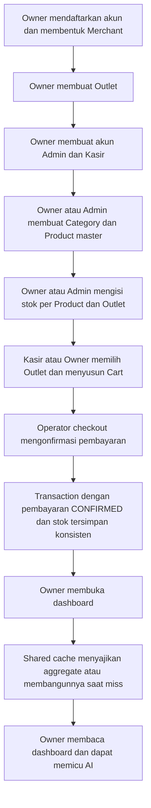
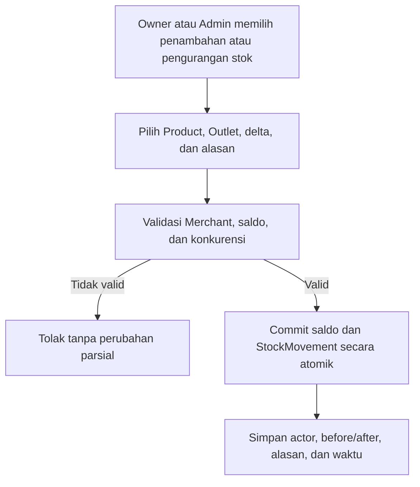
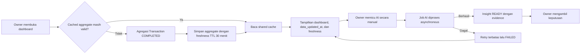

# Proposed Functional Requirements Document (FRD)

**Produk: Aplikasi K — POS dan Business Intelligence untuk UMKM**

| Atribut | Nilai |
|---|---|
| Dokumen | Functional Requirements Document, NFR Summary, dan Out-of-Scope |
| Versi | 0.8 — Iterasi 1 (structured) |
| Status | Proposed — untuk review dan validasi deliverable |
| Audiens | Stakeholder, Product, UX, engineer, QA, mentor, dan presenter |
| Panduan paket | [`00-iterasi-1-document-guide.md`](./00-iterasi-1-document-guide.md) |
| Konteks bisnis | [`01-iterasi-1-business-flow.md`](./01-iterasi-1-business-flow.md) |
| Kebutuhan pengguna | [`02-iterasi-1-proposed-urs.md`](./02-iterasi-1-proposed-urs.md) |
| Spesifikasi sistem | [`03-iterasi-1-proposed-srs.md`](./03-iterasi-1-proposed-srs.md) |

> **Tujuan dokumen:** menyajikan seluruh fitur Iterasi 1 secara jelas, terstruktur, dan cukup kontekstual tanpa menduplikasi detail teknis SRS secara tidak terkendali.

## Cara membaca dokumen ini

| Tujuan pembaca | Bagian utama |
|---|---|
| Memahami seluruh fitur | Bagian 4–6 |
| Memahami satu flow secara detail | Bagian 7–8 |
| Menilai kualitas sistem | Bagian 9 |
| Memastikan scope tidak melebar | Bagian 10–11 |
| Menelusuri fitur ke requirement dan test | Bagian 12 |

Requirement pengguna dan sistem yang normatif tetap menggunakan ID pada URS/SRS. ID `FEAT-*`, `US-*`, dan `UC-FRD-*` dalam FRD adalah lapisan navigasi dan traceability; ID tersebut tidak boleh mengubah makna `UR-*`, `FR-*`, `BR-*`, `DR-*`, atau `NFR-*` yang dirujuk.

---

# Part A — Functional Requirements

## 1. Tujuan dan batas FRD

FRD menjawab empat pertanyaan:

1. fitur apa yang tersedia pada Iterasi 1;
2. siapa yang menggunakan fitur tersebut;
3. bagaimana flow normal dan kondisi gagalnya;
4. bagaimana fitur ditelusuri ke URS, SRS, dan acceptance test.

FRD tidak mengunci:

- framework atau library;
- bentuk tabel fisik final;
- REST versus GraphQL;
- vendor cloud atau AI;
- bentuk deployment final;
- keputusan yang masih berstatus `Open`.

Jika terjadi perbedaan:

- URS menjadi rujukan intent, scope pengguna, dan prioritas;
- SRS menjadi rujukan perilaku sistem, aturan data, NFR, dan verifikasi;
- FRD menjadi tampilan feature-oriented yang menghubungkan keduanya.

## 2. Ringkasan produk dan prinsip utama

Aplikasi K adalah POS SaaS multi-tenant untuk UMKM Indonesia. Platform melayani banyak Merchant, sedangkan setiap Owner memiliki tepat satu Merchant. Satu Merchant dapat memiliki banyak Outlet. Proposed baseline mendukung lebih dari satu akun Kasir pada suatu Outlet, sedangkan satu Kasir hanya berada pada satu Outlet aktif; kapasitas multi-kasir ini bukan aturan jumlah minimum akun per Outlet.

Siklus bisnisnya:

```text
Owner menyiapkan Merchant, Outlet, dan staf
      -> Owner atau Admin menyiapkan Category, Product, harga, dan stok per Outlet
      -> Kasir atau Owner melakukan penjualan pada Outlet yang sah
          -> Transaction menjadi sumber kebenaran
              -> Reporting membentuk dashboard
                  -> Owner memicu AI dan mengambil keputusan
```

Prinsip prioritas:

> Checkout adalah jalur uang dan mendapat prioritas pertama. Reporting dan AI boleh tertinggal atau gagal, tetapi tidak boleh membuat checkout ikut lambat, gagal, atau berubah hasil.

## 3. Aktor dan scope akses

| Aktor/fungsi | Scope | Tanggung jawab utama |
|---|---|---|
| Owner | Tepat satu Merchant, lintas seluruh Outlet | Role tertinggi: mengelola profil Merchant, Outlet, lifecycle staf, seluruh fungsi Admin, seluruh fungsi Kasir, seluruh transaksi, dashboard bisnis, analytics, dan BI insight. Untuk fungsi POS, Owner memilih Outlet aktif dalam Merchant sebagai konteks. |
| Admin | Satu Merchant, lintas seluruh Outlet | Mengelola Category, Product master, harga, inventory per Outlet, dan dashboard operasional |
| Kasir | Tepat satu Outlet aktif | Menemukan Product, menyusun Cart, checkout, melihat receipt, dan melihat transaction history sesuai batas akses |
| Reporting | Satu Merchant dan Outlet bila relevan | Menyajikan cached aggregate dashboard dari Transaction final melalui shared cache dengan freshness TTL 30 menit |
| BI insight | Satu Merchant | Menghasilkan beberapa tipe insight analitik (bukan satu tipe) untuk Owner setelah dipicu manual |
| Operator sistem | Platform | Memantau kesehatan aplikasi, database, shared cache, worker AI, checkout, dan backlog tanpa memperoleh akses bisnis berlebihan |

Admin dan Kasir adalah manusia, bukan perangkat POS. Perangkat/register belum dimodelkan sebagai entitas pada Iterasi 1.

## 4. Feature catalog

| Feature ID | Fitur | Aktor utama | Prioritas | Use case utama |
|---|---|---|---|---|
| `FEAT-ONB` | Registrasi Owner dan pembentukan Merchant | Owner | Must | `UC-FRD-01` |
| `FEAT-AUTH` | Login, JWT access token, logout client-side, dan status akun | Semua pengguna | Must | `UC-FRD-02` |
| `FEAT-OUT` | Pengelolaan Outlet | Owner | Must | `UC-FRD-03` |
| `FEAT-STF` | Pengelolaan lifecycle staf | Owner | Must | `UC-FRD-04` |
| `FEAT-CAT` | Pengelolaan Category | Owner, Admin | Must | `UC-FRD-05` |
| `FEAT-PROD` | Product master, harga, low-stock threshold dasar, status, pencarian, dan filter Category | Owner, Admin, Kasir | Must | `UC-FRD-06`, `UC-FRD-08` |
| `FEAT-INV-READ` | Melihat stok dan stok rendah seluruh Outlet | Owner, Admin | Must | `UC-FRD-07` |
| `FEAT-INV-ADJ` | Menyesuaikan stok serta threshold override per Outlet | Owner, Admin | Must | `UC-FRD-07` |
| `FEAT-CART` | Membuat dan mengubah Cart | Owner, Kasir | Must | `UC-FRD-08` |
| `FEAT-CHK` | Checkout, atribut pembayaran pada Transaction, dan perlindungan duplikasi | Owner, Kasir | Must | `UC-FRD-09`, `UC-FRD-10` |
| `FEAT-REC` | Receipt dan pencarian status transaksi | Kasir, Owner | Must | `UC-FRD-09`, `UC-FRD-10` |
| `FEAT-TRX` | Transaction history dan detail | Kasir, Owner | Must | `UC-FRD-11` |
| `FEAT-DASH-OWN` | Dashboard bisnis Owner | Owner | Must | `UC-FRD-12` |
| `FEAT-DASH-ADM` | Dashboard operasional Merchant | Owner, Admin | Must | `UC-FRD-13` |
| `FEAT-AI` | Satu trigger analisis harian, status, hasil, dan pembaruan insight BI (tren, perbandingan Outlet, produk terlaris/tidak laku, pola waktu, tren AOV; satu analisis dapat memperbarui beberapa hasil sekaligus, tanpa histori per tipe) | Owner | Must | `UC-FRD-14` |
| `FEAT-OPS` | Operability: observability, health, recovery, dan isolasi workload checkout dari reporting/AI | Operator sistem, Merchant | Must | Cross-cutting; `US-OPS-001–002` |

> **Notifikasi:** Fitur "AI Insight" (`FEAT-AI`) diimplementasikan sebagai **Business Intelligence (BI)** — kumpulan insight analitik beberapa tipe (tren penjualan, perbandingan Outlet, produk terlaris/tidak laku, pola waktu, tren AOV), bukan satu tipe insight tunggal. AI berperan sebagai mesin pengerja/penjelas.

## 5. Role-based access definitions

Legenda: `✓` diizinkan, `—` tidak diizinkan. Owner mewarisi seluruh permission Admin dan Kasir; untuk fungsi POS Owner wajib memilih Outlet aktif dalam Merchant-nya.

| Kapabilitas |       Owner        | Admin |                              Kasir                               |
|---|:------------------:|:---:|:----------------------------------------------------------------:|
| Mengelola profil Merchant |         ✓          | — |                                —                                 |
| Membuat/mengubah/menonaktifkan Outlet |         ✓          | — |                                —                                 |
| Membuat dan mengelola akun Admin/Kasir |         ✓          | — |                                —                                 |
| Menetapkan `User.role` dan `User.outlet_id` |         ✓          | — |                                —                                 |
| Melihat Category dan Product master | ✓ | ✓ | Product aktif yang tersedia pada Outlet tugasnya |
| Membuat/mengubah/menonaktifkan Category | ✓ | ✓ | — |
| Membuat/mengubah/menonaktifkan Product dan harga | ✓ | ✓ | — |
| Mengatur harga override per Outlet | ✓ | ✓ | — |
| Mengatur low-stock threshold Product dan override per Outlet | ✓ | ✓ | — |
| Melihat stok seluruh Outlet | ✓ | ✓ | — |
| Penambahan atau pengurangan stok | ✓ | ✓ | — |
| Membuat dan mengubah Cart | ✓ pada Outlet aktif yang dipilih | — | ✓ pada Outlet tugasnya |
| Checkout | ✓ pada Outlet aktif yang dipilih | — | ✓ pada Outlet tugasnya |
| Melihat seluruh transaksi Merchant |         ✓          | — |                                —                                 |
| Melihat transaction history Kasir |         ✓          | — | Hanya transaksi yang dilakukan dirinya sendiri (`OD-003` locked) |
| Melihat dashboard bisnis Owner |         ✓          | — |                                —                                 |
| Melihat analytics bisnis |         ✓          | — |                                —                                 |
| Melihat dashboard operasional Merchant | ✓ | ✓ | — |
| Memicu dan melihat BI insight |         ✓          | — |                                —                                 |

Aturan akses wajib:

1. akses diperiksa oleh server, bukan hanya dengan menyembunyikan menu;
2. semua akses dibatasi oleh `User.merchant_id`;
3. akses Kasir juga dibatasi oleh `User.outlet_id`;
4. Owner dan Admin memiliki `User.outlet_id = null` dan bekerja lintas Outlet dalam Merchant; Owner memilih Outlet aktif secara eksplisit saat memakai fungsi POS;
5. Kasir memiliki tepat satu `User.outlet_id` aktif;
6. data Merchant lain tidak boleh dikembalikan walaupun ID-nya diketahui;
7. checkout dapat dilakukan oleh Kasir pada Outlet tugasnya atau Owner pada Outlet aktif yang dipilih; Admin tidak memiliki permission checkout;
8. Admin tidak memiliki akses melihat transaksi; lihat transaksi hanya untuk Owner (seluruh Merchant) dan Kasir (riwayat dirinya di Outlet tugasnya);
9. Owner mewarisi seluruh permission Admin dan Kasir; Admin tidak mewarisi permission Kasir atau Owner, dan Kasir tidak mewarisi permission Admin/Owner.

## 6. User stories dan acceptance summary

Setiap baris tetap memakai ID agar ringkas. Untuk membaca sumber lengkapnya, gunakan [User requirements di URS](./02-iterasi-1-proposed-urs.md#7-user-requirements), [role dan permission di URS](./02-iterasi-1-proposed-urs.md#8-proposed-role-and-permission-matrix), atau [functional requirements di SRS](./03-iterasi-1-proposed-srs.md#8-functional-requirements).

### 6.1 Onboarding, authentication, Outlet, dan staf

| User Story ID | User story | Prioritas | Acceptance summary | Referensi |
|---|---|---|---|---|
| `US-ONB-001` | Sebagai calon Owner, saya ingin mendaftarkan akun dan membentuk Merchant agar dapat mulai menggunakan platform. | Must | Email unik; Owner dan Merchant terbentuk konsisten; satu Owner tidak dapat membuat Merchant kedua. | `UR-OWN-001`, `FR-AUTH-001–004`, `FR-TEN-001–003` |
| `US-AUTH-001` | Sebagai pengguna, saya ingin login menggunakan email dan password agar dapat mengakses fungsi sesuai role. | Must | Credential valid menghasilkan satu JWT access token yang berlaku 900 detik; credential salah atau akun nonaktif ditolak tanpa membocorkan detail. | `UR-OWN-002`, `UR-CAS-001`, `FR-AUTH-005–010` |
| `US-AUTH-002` | Sebagai pengguna, saya ingin logout agar token di perangkat yang sedang saya gunakan dihapus. | Must | Client menghapus JWT saat logout; tidak ada refresh token/revocation server-side dan token yang telah disalin tetap berlaku sampai expiry selama akun aktif. | `UR-SEC-003`, `FR-AUTH-008–009` |
| `US-OUT-001` | Sebagai Owner, saya ingin membuat dan mengubah Outlet agar struktur operasional Merchant tercatat. | Must | Outlet hanya dibuat pada Merchant Owner dan memiliki nama/status yang valid. | `UR-OWN-003A`, `FR-TEN-004` |
| `US-OUT-002` | Sebagai Owner, saya ingin menonaktifkan Outlet tanpa menghapus histori agar Outlet berhenti menerima checkout baru tetapi transaksi lama tetap ada. | Must | Outlet nonaktif ditolak untuk checkout baru; histori tetap dapat ditelusuri. | `UR-OWN-003A`, `FR-TEN-004,008–010` |
| `US-STF-001` | Sebagai Owner, saya ingin membuat akun Admin atau Kasir menggunakan email dan password awal agar staf dapat langsung bekerja. | Must | Role hanya `ADMIN`/`CASHIER`; email unik; password disimpan sebagai hash. | `UR-OWN-003–003B`, `FR-AUTH-011–013` |
| `US-STF-002` | Sebagai Owner, saya ingin menetapkan role dan Outlet staf agar batas aksesnya benar. | Must | Admin tidak memiliki Outlet; Kasir wajib memiliki tepat satu Outlet aktif dalam Merchant yang sama. | `UR-OWN-003`, `FR-AUTH-014`, `FR-TEN-005–006` |
| `US-STF-003` | Sebagai Owner, saya ingin menonaktifkan, mengaktifkan kembali, atau mereset password staf tanpa menghapus keterkaitannya pada Transaction atau StockMovement historis. | Must | Hanya Owner dapat melakukan aksi; JWT lama akun nonaktif ditolak pada request berikutnya. | `UR-OWN-003–003B`, `FR-TEN-007–008`, `BR-015` |

### 6.2 Category, Product, dan inventory

| User Story ID | User story | Prioritas | Acceptance summary | Referensi |
|---|---|---|---|---|
| `US-CAT-001` | Sebagai Owner atau Admin, saya ingin membuat dan mengubah Category agar Product dapat dikelompokkan secara konsisten. | Must | Nama Category unik dalam Merchant dan tidak kosong. | `UR-OWN-005B`, `UR-ADM-001–002`, `FR-CAT-001,003,009` |
| `US-CAT-002` | Sebagai Owner atau Admin, saya ingin menonaktifkan Category tanpa menghapusnya agar relasi Product dan histori tetap utuh. | Must | Category nonaktif tidak dapat dipilih untuk Product baru/perubahan; relasi lama tidak dihapus. | `UBR-016`, `FR-CAT-003,009`, `BR-019` |
| `US-PROD-001` | Sebagai Owner atau Admin, saya ingin membuat Product master dengan nama, harga, Category, low-stock threshold dasar, dan status agar Product siap dikelola Merchant. | Must | Category wajib aktif dan milik Merchant; nama tidak kosong; harga serta threshold tidak negatif; threshold wajib diisi. | `UR-OWN-005B`, `UR-ADM-001–002`, `FR-CAT-002–005` |
| `US-PROD-002` | Sebagai Owner atau Admin, saya ingin mengubah harga/status Product tanpa mengubah transaksi lama agar histori tetap benar. | Must | Perubahan berlaku untuk checkout berikutnya; snapshot transaksi lama tidak berubah. | `UR-OWN-005B`, `UR-ADM-005–006`, `FR-CAT-005,007` |
| `US-PROD-003` | Sebagai Kasir atau Owner pada Outlet aktif yang dipilih, saya ingin mencari dan memilih Product aktif agar dapat melayani pelanggan dengan cepat. | Must | Hanya Product aktif dengan Category aktif yang mempunyai inventory pada Outlet POS yang sah ditampilkan; pencarian memenuhi target performa. | `UR-OWN-005B`, `UR-CAS-002–003`, `FR-CAT-006`, `NFR-PERF-003` |
| `US-PROD-004` | Sebagai Kasir atau Owner pada Outlet aktif yang dipilih, saya ingin memfilter Product berdasarkan Category agar daftar Product lebih mudah dipindai. | Must | Filter hanya memakai Category aktif pada Merchant dan Outlet POS yang sah; hasil tetap dibatasi pada Product yang dapat dijual. | `UR-OWN-005B`, `UR-CAS-002–003`, termasuk `UR-CAS-002A`, `FR-CAT-006,012` |
| `US-PROD-005` | Sebagai Owner atau Admin, saya ingin menetapkan harga yang berbeda per Outlet agar tiap cabang bisa menyesuaikan harga. | Must | Harga override per Outlet; tanpa override, fallback ke harga master. | `UR-OWN-005B`, `UR-ADM-005,005A`, `FR-CAT-010–011` |
| `US-INV-001` | Sebagai Owner atau Admin, saya ingin melihat stok satu Product pada setiap Outlet agar dapat mengetahui ketersediaannya. | Must | Saldo ditampilkan per kombinasi Product + Outlet dan tidak bercampur antar-Merchant. | `UR-OWN-005B`, `UR-ADM-001`, `FR-INV-001–002` |
| `US-INV-002` | Sebagai Owner atau Admin, saya ingin menambah, mengurangi, atau mengoreksi stok pada Outlet aktif dengan alasan agar perubahan dapat dipertanggungjawabkan. | Must | Tidak menghasilkan stok negatif; StockMovement menyimpan delta, alasan, Product, Outlet, dan waktu. Outlet nonaktif hanya dapat dilihat sebagai histori. | `UR-OWN-005B`, `UR-ADM-003,007`, `FR-TEN-004`, `FR-INV-003–004` |
| `US-INV-003` | Sebagai Owner atau Admin, saya ingin melihat Product dengan stok rendah agar dapat mengambil tindakan sebelum habis. | Must | Threshold efektif memakai override Product–Outlet bila ada, jika tidak memakai threshold dasar Product; daftar dibatasi oleh scope Merchant/Outlet. | `UR-OWN-005B`, `UR-ADM-001,005B`, `FR-INV-007–007A`, `FR-REP-003` |
| `US-INV-004` | Sebagai Owner atau Admin, saya ingin mengatur threshold stok rendah yang berbeda pada Outlet tertentu agar peringatan sesuai kebutuhan tiap cabang. | Must | Override wajib nonnegatif dan hanya untuk Product serta Outlet dalam Merchant yang sama; menghapus override mengembalikan threshold dasar Product. | `UR-OWN-005B`, `UR-ADM-005B`, `FR-INV-007A`, `DR-011A` |
| `US-INV-005` | Sebagai Owner, saya ingin melihat dan menyesuaikan stok serta daftar stok rendah seluruh Outlet agar dapat mengambil tindakan operasional bila diperlukan. | Must | Owner dapat adjustment dan mengubah threshold dalam Merchant, serta dapat mengakses dashboard operasional; setiap perubahan tetap memerlukan Outlet aktif dan alasan. | `UR-OWN-005B`, `FR-INV-002–003,007,007A`, `AT-019,030` |

### 6.3 Product discovery, Cart, checkout, payment, dan receipt

| User Story ID | User story | Prioritas | Acceptance summary | Referensi |
|---|---|---|---|---|
| `US-CART-001` | Sebagai Kasir atau Owner pada Outlet aktif yang dipilih, saya ingin membuat Cart dan menambahkan Product agar dapat menyusun pembelian pelanggan. | Must | Hanya Product aktif; kuantitas positif; Cart terkait dengan konteks Outlet yang sah. | `UR-OWN-005B`, `UR-CAS-002–004`, `FR-CART-001–002` |
| `US-CART-002` | Sebagai Kasir atau Owner pada Outlet aktif yang dipilih, saya ingin mengubah kuantitas, menghapus item, atau membatalkan Cart agar kesalahan dapat diperbaiki sebelum pembayaran. | Must | Tidak ada Transaction final ketika Cart diubah/dibatalkan. | `UR-OWN-005B`, `UR-CAS-004`, `FR-CART-003,010` |
| `US-CART-003` | Sebagai Kasir atau Owner pada Outlet aktif yang dipilih, saya ingin melihat item, subtotal, dan total agar dapat mengonfirmasi jumlah pembayaran kepada pelanggan. | Must | UI menampilkan perhitungan; server tetap menghitung ulang total final. | `UR-OWN-005B`, `UR-CAS-005`, `FR-CART-004–006` |
| `US-CHK-001` | Sebagai Kasir atau Owner pada Outlet aktif yang dipilih, saya ingin memilih metode pembayaran dan checkout agar penjualan tercatat tepat satu kali. | Must | Transaction beserta atribut pembayaran `CONFIRMED`, line snapshot, stock movement, dan pengurangan stok commit atomik; tidak ada tabel Payment terpisah. | `UR-OWN-005B`, `UR-CAS-006–008`, `FR-CHK-001–011`, `FR-PAY-001–005` |
| `US-CHK-002` | Sebagai Kasir atau Owner pada Outlet aktif yang dipilih, saya ingin menerima alasan yang jelas ketika harga, status Product, stok, atau akses berubah agar Cart dapat diperbaiki dengan aman. | Must | Checkout ditolak tanpa hasil parsial dan mengembalikan kode error yang dapat ditindaklanjuti. | `UR-OWN-005B`, `UR-CAS-010`, `FR-CART-007–010`, `FR-CHK-005–007` |
| `US-CHK-003` | Sebagai Kasir atau Owner pada Outlet aktif yang dipilih, saya ingin memeriksa status checkout yang responsnya terputus agar tidak membuat transaksi ganda. | Must | `checkout_request_id` dan request hash yang sama mengembalikan Transaction yang sama; ID sama dengan payload/scope berbeda ditolak; ID baru tetap membolehkan pembelian identik pelanggan berikutnya. | `UR-OWN-005B`, `UR-CAS-007–009`, `FR-CHK-001–004,012–016` |
| `US-REC-001` | Sebagai Kasir atau Owner pada Outlet aktif yang dipilih, saya ingin menerima nomor dan receipt setelah checkout berhasil agar pelanggan memperoleh bukti transaksi. | Must | Receipt memakai snapshot dan dapat dilihat ulang tanpa membaca harga katalog terbaru. | `UR-OWN-005B`, `UR-CAS-011`, `FR-PAY-006–008` |
### 6.4 Transaction history, dashboard, reporting, dan AI

| User Story ID | User story | Prioritas | Acceptance summary | Referensi |
|---|---|---|---|---|
| `US-TRX-001` | Sebagai Owner atau Kasir sesuai hak, saya ingin melihat daftar dan detail Transaction agar dapat menelusuri penjualan yang telah terjadi. | Must | Pagination; filter tanggal dan Outlet untuk Owner; pencarian receipt; scope Merchant (Owner) atau riwayat Kasir diterapkan; Admin tidak dapat mengakses. | `UR-CAS-014`, `UR-OWN-007`, `FR-TRX-001–007` |
| `US-TRX-002` | Sebagai Kasir, saya ingin melihat riwayat transaksi yang saya lakukan sendiri agar dapat membantu pemeriksaan. | Must | Hanya transaksi dengan `operator_user_id = saya` (`OD-003` locked). | `UR-CAS-014`, `FR-TRX-004,006` |
| `US-DASH-001` | Sebagai Owner, saya ingin memilih periode dan melihat omzet, jumlah transaksi, serta AOV agar memahami kondisi bisnis. | Must | Hanya Transaction `COMPLETED`; definisi metrik konsisten; scope Merchant/Outlet benar. | `UR-OWN-004`, `UR-REP-001–003`, `FR-REP-001–003` |
| `US-DASH-002` | Sebagai Owner, saya ingin melihat tren penjualan/AOV, pola waktu, Product terlaris/tidak laku, dan perbandingan Outlet agar mengetahui perubahan yang perlu ditindaklanjuti. | Must | Hasil sesuai periode, bucket waktu, timezone Merchant, dan transaksi sumber. | `UR-OWN-005–005A`, `UR-REP-003A`, `FR-REP-003A–003C` |
| `US-DASH-003` | Sebagai Owner, saya ingin melihat waktu pembaruan dan status stale agar memahami seberapa baru data dashboard. | Must | Cached aggregate normal berumur maksimal 30 menit; `data_updated_at`, timezone, empty state, dan degraded state terlihat. | `UR-OWN-006,009`, `FR-REP-004–007` |
| `US-DASH-004` | Sebagai Admin atau Owner, saya ingin melihat dashboard operasional agar dapat menjaga seluruh Outlet siap berjualan. | Must | Hanya ringkasan inventory, stok rendah, dan kondisi katalog dalam Merchant; Admin tidak memperoleh omzet, AOV, transaksi, analytics bisnis, atau insight BI. | `UR-OWN-005B`, `UR-ADM-001,007`, `FR-REP-003,009` |
| `US-AI-001` | Sebagai Owner, saya ingin memicu analisis BI/AI secara manual agar memperoleh insight ketika dibutuhkan. | Must | Hanya Owner; maksimal satu analisis per Merchant per hari; job diproses di luar checkout dan dapat menghasilkan beberapa tipe insight sekaligus. | `UR-AI-002,010`, `FR-AI-001,012`, `BR-020` |
| `US-AI-002` | Sebagai Owner, saya ingin melihat status, periode, evidence, dan hasil insight agar dapat menilai dasar rekomendasinya. | Must | Status terlihat; output menyimpan periode, evidence summary, tipe, versi data, dan waktu. | `UR-OWN-008–009`, `UR-AI-003–006`, `FR-AI-002–008` |
| `US-AI-003` | Sebagai Owner, saya ingin dashboard tetap tersedia ketika AI gagal agar keputusan dasar tidak bergantung pada provider AI. | Must | AI timeout/retry terbatas; status `FAILED` dapat dipahami; checkout dan dashboard dasar tetap hidup. | `UR-AI-005,007`, `FR-AI-006,008,011` |

### 6.5 Keamanan dan operasi

| User Story ID | User story | Prioritas | Acceptance summary | Referensi |
|---|---|---|---|---|
| `US-OPS-001` | Sebagai operator, saya ingin menelusuri checkout menggunakan correlation ID atau Transaction ID agar insiden dapat diselidiki. | Must | Log tidak membocorkan secret; alur dapat dicari lintas modul. | `UR-OPS-001–002`, `FR-OPS-001–004` |
| `US-OPS-002` | Sebagai Merchant, saya ingin checkout tetap responsif ketika reporting/AI aktif agar penjualan tidak terganggu. | Must | Mixed workload memenuhi target; cache miss/agregasi dibatasi dan worker AI mempunyai concurrency limit/backpressure. | `UR-BIZ-003,005,008`, `NFR-SCALE-002–003` |

---

## 7. Detailed use cases

### UC-FRD-01 — Registrasi Owner dan Merchant

| Elemen | Detail |
|---|---|
| Aktor | Calon Owner |
| Prasyarat | Email belum terdaftar |
| Pemicu | Calon Owner memilih registrasi |
| Alur utama | Isi nama, email, dan password → sistem memvalidasi input → password di-hash → User `OWNER` dan tepat satu Merchant dibentuk konsisten → Owner masuk atau diarahkan login |
| Alternatif | Email sudah digunakan; password lemah; pembuatan Merchant gagal |
| Hasil sukses | Owner aktif terhubung dengan tepat satu Merchant aktif |
| Hasil gagal | Tidak ada Owner atau Merchant setengah terbentuk |
| Referensi | `US-ONB-001`, `FR-AUTH-001–004`, `FR-TEN-001–003`, `AT-001` |

### UC-FRD-02 — Login dan logout

| Elemen | Detail |
|---|---|
| Aktor | Owner, Admin, Kasir |
| Prasyarat | User dan Merchant aktif; Outlet Kasir juga aktif |
| Pemicu | Pengguna mengirim email dan password atau memilih logout |
| Alur utama | Normalisasi email → validasi credential/status → terbitkan satu JWT access token dengan expiry 900 detik → setiap request memvalidasi signature, expiry, role/scope, dan status akun → logout menghapus token dari client |
| Alternatif | Credential salah; akun/Merchant/Outlet nonaktif; rate limit tercapai; JWT tidak ada/tidak valid/kedaluwarsa |
| Hasil | Akses hanya diberikan kepada identitas dan scope yang sah |
| Referensi | `US-AUTH-001–002`, `FR-AUTH-005–010`, `AT-014` |

### UC-FRD-03 — Owner mengelola Outlet

| Elemen | Detail |
|---|---|
| Aktor | Owner |
| Prasyarat | Owner login pada Merchant aktif |
| Pemicu | Owner membuat, mengubah, atau menonaktifkan Outlet |
| Alur utama | Isi/pilih Outlet → validasi ownership Merchant → simpan perubahan → tampilkan konfirmasi |
| Alternatif | Input tidak valid; Outlet Merchant lain; Outlet sudah nonaktif; konflik dengan operasi aktif ditangani sesuai rule |
| Hasil | Outlet tersedia untuk setup operasional atau menjadi read-only ketika nonaktif; checkout dan stock adjustment baru ditolak, histori tetap ada |
| Referensi | `US-OUT-001–002`, `FR-TEN-004,008–010` |

### UC-FRD-04 — Owner mengelola staf

| Elemen | Detail |
|---|---|
| Aktor | Owner |
| Prasyarat | Owner login pada Merchant aktif |
| Pemicu | Owner membuat atau mengubah akun staf |
| Alur utama | Isi nama/email/password awal → pilih satu role → pilih tepat satu Outlet aktif hanya untuk Kasir → validasi → simpan password hash → User aktif dibuat/diubah |
| Alternatif | Email duplikat; role tidak sah; Admin memiliki Outlet; Kasir tidak memiliki Outlet; Outlet berbeda Merchant; reset/aktivasi gagal |
| Hasil | Admin aktif pada Merchant atau Kasir aktif pada tepat satu Outlet; histori User lama tidak dihapus |
| Referensi | `US-STF-001–003`, `FR-AUTH-011–014`, `FR-TEN-005–008`, `AT-016` |

### UC-FRD-05 — Owner atau Admin mengelola Category

| Elemen | Detail |
|---|---|
| Aktor | Owner atau Admin |
| Prasyarat | User aktif dengan akses katalog pada Merchant |
| Pemicu | Membuat, mengubah, atau menonaktifkan Category |
| Alur utama | Isi/pilih Category → validasi nama dan Merchant → simpan perubahan → Category aktif dapat dipilih Product |
| Alternatif | Nama kosong/duplikat; Merchant salah; Category nonaktif dipilih untuk Product baru/perubahan |
| Hasil | Category tersimpan atau dinonaktifkan tanpa dihapus fisik; relasi dan histori tetap utuh. Product dengan Category nonaktif tidak tampil di katalog POS dan tidak dapat di-checkout. |
| Referensi | `US-CAT-001–002`, `FR-CAT-001,003,009`, `BR-019` |

### UC-FRD-06 — Owner atau Admin mengelola Product master

| Elemen | Detail |
|---|---|
| Aktor | Owner atau Admin |
| Prasyarat | Category aktif tersedia pada Merchant |
| Pemicu | Membuat atau mengubah Product |
| Alur utama | Isi nama, harga, satu Category wajib, low-stock threshold dasar, dan status → validasi Merchant/Category/harga/threshold → simpan Product → stok awal dikelola melalui adjustment terpisah |
| Alternatif | Category kosong/nonaktif/beda Merchant; nama kosong; harga negatif; threshold kosong/negatif; akses ditolak |
| Hasil | Product master tersedia bagi Merchant; perubahan berikutnya tidak mengubah snapshot transaksi lama |
| Referensi | `US-PROD-001–002`, `FR-CAT-002–009`, `AT-013,018` |

### UC-FRD-07 — Stock adjustment

| Elemen | Detail |
|---|---|
| Aktor | Owner atau Admin |
| Prasyarat | Product dan Outlet aktif berada dalam Merchant aktif |
| Pemicu | Pengguna memilih penambahan, pengurangan, atau koreksi stok |
| Alur utama | Pilih Outlet dan Product → masukkan perubahan serta alasan → validasi scope dan saldo → commit saldo dan StockMovement → simpan before/after serta actor → bila diperlukan set/hapus threshold override Product–Outlet → tampilkan saldo dan threshold efektif |
| Alternatif | Alasan kosong; Outlet nonaktif; Outlet/Product beda Merchant; hasil negatif; threshold override negatif; konflik dengan checkout bersamaan |
| Hasil | Satu saldo Product + Outlet dan StockMovement terkait konsisten; threshold efektif memakai override Outlet bila ada atau threshold dasar Product bila tidak ada |
| Referensi | `US-INV-001–004`, `FR-INV-001–004,007–008`, termasuk `FR-INV-007A` |

### UC-FRD-08 — Kasir atau Owner menemukan Product dan menyusun Cart

| Elemen | Detail |
|---|---|
| Aktor | Kasir atau Owner |
| Prasyarat | Kasir aktif pada Outlet tugasnya, atau Owner aktif yang telah memilih Outlet aktif dalam Merchant |
| Pemicu | Pelanggan memilih barang yang akan dibeli |
| Alur utama | Cari atau filter Category → pilih Product aktif → tambah ke Cart → ubah kuantitas bila perlu → hapus item bila perlu → UI menampilkan subtotal dan total |
| Alternatif | Product tidak aktif; tidak mempunyai inventory pada Outlet; kuantitas tidak valid; Cart dikosongkan |
| Hasil | Cart siap direview; belum ada Transaction final atau pengurangan stok |
| Referensi | `US-PROD-003–004`, `US-CART-001–003`, `FR-CAT-006,012`, `FR-CART-001–010` |

### UC-FRD-09 — Checkout berhasil

| Elemen | Detail |
|---|---|
| Aktor | Kasir atau Owner |
| Prasyarat | Kasir dan Outlet tugasnya aktif, atau Owner dan Outlet aktif yang dipilih; Cart tidak kosong; metode pembayaran dipilih |
| Pemicu | Operator checkout mengonfirmasi bahwa pembayaran telah diterima |
| Alur utama | Client mengirim `checkout_request_id` → server menghitung `request_hash` dan memvalidasi User/Merchant/Outlet/Product/harga/stok/metode pembayaran serta scope Kasir/Owner → server menghitung total → Transaction beserta atribut pembayaran `CONFIRMED`, line snapshot, StockMovement, dan saldo stok commit atomik → receipt dikembalikan tanpa agregasi atau invalidasi cache dashboard |
| Alternatif | Ditangani oleh `UC-FRD-10` |
| Hasil | Tepat satu Transaction `COMPLETED` dengan `payment_status = CONFIRMED`, satu pengurangan stok, dan receipt yang konsisten |
| Referensi | `US-CHK-001`, `US-REC-001`, `FR-CHK-001–018`, `FR-PAY-001–008`, `AT-003–006,009–010,029` |

### UC-FRD-10 — Checkout ditolak atau hasil belum diketahui

| Elemen | Detail |
|---|---|
| Aktor | Kasir atau Owner |
| Prasyarat | Operator checkout telah menyusun Cart atau pernah mengirim checkout |
| Pemicu | Validasi bisnis gagal, dependency gagal, atau response terputus |
| Alur utama | Sistem mengembalikan kode yang dapat ditindaklanjuti → Cart tetap dapat diperbaiki → bila response tidak diketahui, UI mempertahankan `checkout_request_id` dan melakukan lookup → Transaction lama dikembalikan atau payload yang sama di-retry memakai ID yang sama |
| Alternatif | Harga berubah: tampilkan total baru; Product nonaktif: hapus/ganti; stok kurang: kurangi/hapus; request ID sama dengan hash/scope berbeda: conflict; Transaction belum ditemukan: retry aman dengan ID dan payload yang sama |
| Hasil | Tidak ada Transaction/atribut pembayaran/stok parsial dan tidak terjadi transaksi ganda |
| Referensi | `US-CHK-002–003`, `FR-CART-007–010`, `FR-CHK-003–016`, `AT-005–010,029` |

### UC-FRD-11 — Melihat transaction history

| Elemen | Detail |
|---|---|
| Aktor | Owner, Kasir sesuai scope (Admin tidak memiliki akses) |
| Prasyarat | User login dan mempunyai hak terhadap Transaction yang diminta |
| Pemicu | Pengguna membuka riwayat atau mencari receipt number |
| Alur utama | Tentukan scope dari credential → terapkan filter tanggal dan Outlet sesuai role → kembalikan daftar berpaginasi → pengguna membuka detail/receipt snapshot |
| Alternatif | Tidak ada hasil; Transaction beda Merchant/Outlet; receipt tidak ditemukan; Kasir hanya dapat mengakses transaksi miliknya (`OD-003` locked) |
| Hasil | Histori dapat dibaca tanpa mengubah Transaction dan tanpa membaca harga katalog terbaru |
| Referensi | `US-TRX-001–002`, `FR-TRX-001–007` |

### UC-FRD-12 — Owner melihat dashboard bisnis

| Elemen | Detail |
|---|---|
| Aktor | Owner |
| Prasyarat | Owner login; source of truth transaksi tersedia; shared cache boleh kosong |
| Pemicu | Owner membuka dashboard dan memilih periode/scope Outlet |
| Alur utama | Validasi Merchant dan normalisasi cache key → cache hit membaca cached aggregate `FRESH`; cache miss mengagregasi Transaction `COMPLETED` dan menyimpan hasil dengan freshness TTL 30 menit → tampilkan omzet, jumlah transaksi, AOV, tren penjualan/AOV, pola waktu, Product terlaris/tidak laku, perbandingan Outlet, timezone, dan waktu pembaruan |
| Alternatif | Periode kosong; cache gagal lalu query sumber berhasil; query sumber gagal dan cache lama ditampilkan `STALE`; cache dan query sumber tidak tersedia; Outlet tidak sah |
| Hasil | Owner memahami kondisi bisnis tanpa query berat di jalur checkout |
| Referensi | `US-DASH-001–003`, `FR-REP-001–010`, `AT-011,017,024–028` |

### UC-FRD-13 — Owner atau Admin melihat dashboard operasional

| Elemen | Detail |
|---|---|
| Aktor | Owner atau Admin |
| Prasyarat | Owner/Admin aktif pada Merchant |
| Pemicu | Admin membuka dashboard operasional atau memilih Outlet |
| Alur utama | Validasi Merchant → baca current state inventory dan katalog → tampilkan ringkasan inventory, stok rendah, kondisi katalog, scope Merchant/Outlet, serta waktu pembaruan |
| Alternatif | Data kosong; Outlet Merchant lain; read port katalog/inventory gagal |
| Hasil | Owner/Admin dapat mengambil tindakan katalog/inventory. Untuk Admin, dashboard ini tidak memberikan omzet, AOV, transaksi, analytics bisnis, AI, atau manajemen staf; Owner memiliki akses tersebut melalui permission Owner tersendiri. |
| Referensi | `US-DASH-004`, `FR-REP-003,009`, `FR-INV-002,007`, `AT-020` |

### UC-FRD-14 — Owner memicu dan melihat BI insight

| Elemen | Detail |
|---|---|
| Aktor | Owner |
| Prasyarat | Owner aktif pada Merchant; dashboard dasar tidak bergantung pada AI |
| Pemicu | Owner menekan tombol analisis BI/AI |
| Alur utama | Validasi Owner/Merchant → temukan atau buat `AiAnalysisJob` berdasarkan `merchant_id + tanggal lokal Merchant`; periode dan versi data menjadi input, bukan pembeda job → antrekan job → tampilkan `PENDING/PROCESSING` → worker menghasilkan evidence dan content → simpan `READY` → Owner melihat hasil |
| Alternatif | Request duplikat memakai `AiAnalysisJob` yang sama; kegagalan sementara dijadwalkan retry terbatas; kegagalan akhir menjadi `FAILED`; data lama menjadi `STALE` |
| Hasil | Satu analisis menghasilkan atau memperbarui insight per tipe yang datanya tersedia (tren, perbandingan Outlet, produk terlaris/tidak laku, pola waktu, tren AOV), dengan periode, evidence, versi, status, dan waktu; hasil terbaru per tipe tanpa histori dan tidak mengubah Product, stok, akses, atau Transaction |
| Referensi | `US-AI-001–003`, `FR-AI-001–012`, `AT-012` |

## 8. Workflow descriptions

### 8.1 Workflow setup sampai penjualan



### 8.2 Apa yang terjadi ketika penjualan diproses

```mermaid
sequenceDiagram
    actor K as Operator Checkout
    participant UI as POS Web
    participant API as Core Application
    participant DB as Operational Database
    participant C as Shared Reporting Cache

    K->>UI: Review Cart dan konfirmasi pembayaran
    UI->>API: Submit checkout_request_id dan payload
    API->>API: Hitung request_hash; validasi User, scope, Product, harga, stok, metode
    API->>DB: Atomic commit Transaction + payment fields, lines, StockMovement, dan saldo
    alt Commit berhasil
        DB-->>API: Transaction COMPLETED
        API-->>UI: Receipt dan nomor transaksi
        UI-->>K: Tampilkan berhasil
    else Validasi atau commit gagal
        DB-->>API: Reject atau rollback
        API-->>UI: Error yang dapat ditindaklanjuti
        UI-->>K: Perbaiki Cart atau cek status
    end

    Note over API,C: Checkout tidak mengagregasi atau menginvalidasi cache dashboard
```

### 8.3 Workflow perubahan inventory



### 8.4 Workflow dashboard dan AI



---

# Part B — Non-Functional Requirements

## 9. Non-functional requirements

### 9.1 Cara membaca target

| Label | Arti |
|---|---|
| Acceptance MVP | Harus dibuktikan pada environment demo/test Iterasi 1 |
| Proposed Baseline | Target awal yang masih perlu disetujui stakeholder |
| Target Production | Arah kualitas produksi, bukan klaim kemampuan deployment demo gratis |

Semua pengujian harus mencatat environment, ukuran data, concurrency, durasi, dan hasil aktual. Detail normatif berada pada SRS bagian NFR.

### 9.2 Performance targets

| ID | Area | Target | Status |
|---|---|---|---|
| `NFR-PERF-001` | Checkout valid | p95 ≤ 500 ms dan p99 ≤ 1.000 ms di server | Proposed Baseline |
| `NFR-PERF-002` | Penolakan validasi checkout | p95 ≤ 400 ms | Proposed Baseline |
| `NFR-PERF-003` | Product search/list POS | p95 ≤ 300 ms pada dataset baseline | Proposed Baseline |
| `NFR-PERF-004` | Transaction status lookup | p95 ≤ 300 ms | Proposed Baseline |
| `NFR-PERF-005` | Dashboard Owner | cache hit p95 ≤300 ms; cache miss dengan agregasi p95 ≤2 detik pada dataset baseline | Proposed Baseline |
| `NFR-PERF-006` | CRUD Admin biasa | p95 ≤ 700 ms | Proposed Baseline |
| `NFR-PERF-007` | Feedback visual setelah checkout ditekan | ≤ 100 ms | Acceptance MVP |
| `NFR-PERF-008` | Query analitik berat dalam checkout | 0 query berat synchronous | Acceptance MVP |

### 9.3 Availability dan reliability

| Area | Target/aturan | Referensi |
|---|---|---|
| Availability POS | 99,9% per bulan untuk target produksi, di luar maintenance yang disetujui | `NFR-REL-001` |
| Isolasi kegagalan | Reporting/AI gagal tidak membuat checkout unavailable | `NFR-REL-002` |
| Atomicity | Tidak ada Transaction, atribut pembayaran, line, atau stok parsial | `NFR-REL-003` |
| AI jobs/cache concurrency | Job AI memakai retry terbatas dan deduplication; cache miss key yang sama dilindungi dari stampede | `NFR-REL-004` |
| Dashboard freshness | Cached aggregate normal berumur ≤30 menit; data lebih lama hanya sebagai fallback `STALE` | `NFR-REL-005`, Locked |
| AI job lifecycle | Setiap request yang diterima berakhir terpantau pada `READY` atau `FAILED` | `NFR-REL-006` |
| Durability | Transaction `COMPLETED` tetap tersimpan setelah process restart | `NFR-REL-007` |
| Dependency timeout | Call eksternal mempunyai timeout dan tidak menahan resource tanpa batas | `NFR-REL-008` |

Target recovery produksi:

- RPO database ≤15 menit, ideal mendekati nol sesuai biaya;
- RTO jalur POS ≤60 menit;
- backup diuji melalui restore minimal sekali sebelum final demo/release candidate;
- reporting cache dapat dihapus/expire dan dibangun ulang dari Transaction `COMPLETED`; Insight dapat dibangun ulang dari source of truth;
- prosedur recovery mencakup database unavailable, shared cache unavailable, migration gagal, backlog job AI, dan deployment gagal.

### 9.4 Scalability considerations

Dataset dan load Proposed Baseline:

| Dimensi | Baseline |
|---|---:|
| Merchant | 500 |
| User aktif terdaftar | Maksimum 2.500 |
| Product total | 100.000 |
| Transaction historis | 1.000.000 |
| Rata-rata line per Transaction | 3 |
| Submit checkout concurrent | 50 |
| Beban sustained | 20 checkout/detik selama 15 menit |
| Burst | 50 checkout/detik selama 60 detik |

Aturan scale:

1. checkout tetap memenuhi target pada dataset dan beban baseline;
2. ketika cache miss/agregasi reporting dan AI aktif, p95 checkout tidak memburuk lebih dari 20% dan tetap ≤500 ms;
3. concurrency agregasi/cache miss dan worker AI dibatasi agar tidak menghabiskan koneksi checkout; request miss pada key yang sama menggunakan single-flight atau proteksi setara;
4. application dan worker AI dapat dinaikkan kapasitasnya secara independen secara logis; seluruh instance application memakai shared cache yang sama;
5. list, report, dan batch selalu bounded/paginated;
6. **future consideration, bukan acceptance gate Iterasi 1:** pertumbuhan menuju 10× baseline dilakukan berdasarkan telemetry dan bottleneck nyata, bukan dengan over-provisioning sejak awal;
7. desain tidak mewajibkan microservices atau Kubernetes untuk mengklaim scalable.

### 9.5 Security measures

| Area | Requirement minimum |
|---|---|
| Password | Hash adaptif yang diakui seperti Argon2id atau bcrypt; password asli tidak disimpan atau ditampilkan kembali |
| Authentication | Email ternormalisasi, JWT access token tunggal berumur 900 detik, logout client-side, pemeriksaan status akun pada setiap request, dan login rate limit |
| Authorization/RBAC | Diperiksa di server untuk setiap operasi berdasarkan role, Merchant, Outlet, dan status User |
| Tenant isolation | ID valid milik Merchant lain tetap tidak boleh mengembalikan datanya |
| Transport | Seluruh traffic production menggunakan TLS |
| Token handling | JWT hanya dikirim melalui TLS, tidak ditempatkan pada URL/log, disimpan dengan strategi client yang meminimalkan pencurian, dan dihapus dari client saat logout |
| Input/data access | Validasi input, output encoding, serta parameterized query atau abstraction aman |
| Secret | Berasal dari environment/secret manager dan tidak di-commit |
| Payment privacy | Tidak menyimpan nomor kartu, PIN, OTP, credential e-wallet, atau QR payload sensitif |
| Logging | Password, token, credential, dan data sensitif direduksi; stack trace tidak dikirim ke pengguna |
| Dependency | Vulnerability scanning dijalankan pada CI atau sebelum release |
| Verification | Negative authorization dan cross-tenant security test wajib tersedia |

### 9.6 Maintainability principles

1. checkout, pricing, catalog availability, authorization, inventory, reporting, dan AI mempunyai batas modul yang jelas;
2. aturan bisnis kritis tidak diduplikasi secara independen di frontend dan backend;
3. backend menjadi validator final untuk harga, total, stok, role, Merchant, dan Outlet;
4. formatter, linter, naming convention, dan error format digunakan secara konsisten;
5. migration, seed, dan setup lokal terdokumentasi serta dapat direproduksi;
6. keputusan arsitektur besar mencatat rationale dan trade-off;
7. engineer baru dapat menjalankan aplikasi dari README tanpa pengetahuan tersembunyi;
8. reporting/AI dapat dimatikan tanpa mengubah kontrak checkout;
9. test kritis deterministic dan tidak bergantung pada provider AI nyata;
10. perubahan requirement memperbarui URS, FRD, SRS, API contract, dan test yang terdampak.

### 9.7 Observability dan operational quality

Sistem minimum harus menyediakan:

- structured log dengan timestamp, level, module, correlation ID, safe Merchant/actor reference, action, result, dan error category;
- metric checkout request rate, success/error rate, p95/p99 latency, database error/pool pressure, cache hit/miss/error/age, latency agregasi, dan AI job backlog age;
- alert untuk lonjakan checkout error, latency melewati target, database unavailable, cache failure/age melewati threshold, agregasi lambat, dan backlog AI berlebihan;
- health indicator aplikasi, database, shared cache, dan background worker AI;
- cara expire/rebuild reporting cache serta menjalankan ulang job AI secara aman tanpa menggandakan hasil;
- failed state untuk job AI yang kehabisan retry.

### 9.8 Usability, accessibility, dan compatibility

| Area | Target minimum |
|---|---|
| Kemudahan Kasir | ≥90% peserta usability test kecil dapat menyelesaikan happy path tanpa dokumentasi teknis |
| Langkah checkout | Pilih item → review → metode pembayaran → konfirmasi |
| Error | Semua error utama menjelaskan masalah dan tindakan berikutnya |
| Accessibility | Warna bukan satu-satunya penanda; flow utama mendekati WCAG 2.1 AA |
| Bahasa | Bahasa Indonesia konsisten dan tidak menampilkan jargon internal kepada pengguna |
| Browser | Dua versi terbaru Chromium dan Firefox; Safari terbaru sebaiknya diuji |
| Viewport | Tablet dan desktop sesuai desain |
| Currency/time | IDR dengan format Indonesia; waktu ditampilkan menurut zona Merchant; timestamp antarsistem tidak ambigu |

---

# Part C — Scope Boundary dan Traceability

## 10. Out-of-Scope Iterasi 1

Sistem Iterasi 1 secara eksplisit tidak diwajibkan untuk membangun:

1. integrasi payment gateway, settlement, atau rekonsiliasi pembayaran otomatis;
2. penyimpanan data kartu, PIN, OTP, credential e-wallet, atau data autentikasi pembayaran pelanggan;
3. split payment, cicilan, refund, partial refund, chargeback, koreksi, void, pembatalan, atau reversal transaksi final;
4. akuntansi lengkap dan rekonsiliasi bank;
5. customer profile, CRM, loyalty, gift card, atau promo kompleks;
6. diskon, pajak, service charge, tip, voucher, atau promo;
7. supplier, procurement, purchase order, atau inventory gudang terpisah;
8. transfer/pemindahan stok antar-Outlet melalui workflow khusus;
9. tracking bahan baku atau recipe/BOM makanan;
10. audit trail umum untuk perubahan katalog, staf, atau Outlet; StockMovement dan log operasional tetap digunakan sesuai fungsi MVP;
11. payroll dan shift management penuh;
12. Product variant, bundle, atau SKU/barcode kompleks;
13. marketplace atau e-commerce omnichannel;
14. offline-first dan conflict synchronization;
15. native Android/iOS application;
16. pengiriman receipt melalui SMS/email;
17. multi-currency dan perpajakan;
18. perangkat/register POS sebagai entitas terpisah;
19. BI ad-hoc query builder;
20. AI yang mengubah harga, stok, status Product, Outlet, atau akses User secara otomatis;
21. AI periodik otomatis sebagai trigger utama;
22. microservices, message broker, read replica, provider/produk cache tertentu, Kubernetes, atau teknologi tertentu sebagai tujuan tersendiri; shared cache tetap merupakan kebutuhan desain reporting MVP;
23. SLA produksi berbayar pada deployment demo gratis.
24. refresh token, endpoint refresh/logout, dan revocation list JWT server-side.

Out-of-Scope tidak boleh diimplementasikan diam-diam dengan mengorbankan requirement Must. Eksperimen teknis diperbolehkan hanya bila tidak mengubah scope, menghambat demo, atau menjadi dependency flow utama.

## 11. Open decisions

| ID | Keputusan yang belum final | Default proposed | Dampak utama |
|---|---|---|---|
| `OD-001` | Batas payment manual | **Locked**: atribut `payment_method` (`CASH`/`QRIS`/`TRANSFER`), `payment_status = CONFIRMED`, dan `paid_at` disimpan langsung pada Transaction; tidak ada tabel Payment | Transaction, checkout state, receipt, dan security |
| `OD-002` | Harga Product global atau override per Outlet | **Locked**: harga master global + override per Outlet | Data model dan Admin UX |
| `OD-003` | Riwayat Kasir: transaksi sendiri atau seluruh Outlet | **Locked**: hanya transaksi yang dilakukan dirinya sendiri | Authorization dan UX history |
| `OD-004` | Diskon, pajak, dan service charge | **Locked**: di luar MVP; `total = subtotal` | Model transaksi, snapshot, report |
| `OD-005` | Refund/void | **Locked**: tidak ada pada MVP | Reversal, permission, dan perhitungan omzet setelah reversal |
| `OD-006` | Freshness dashboard final | **Locked**: cached aggregate dashboard Owner berumur maksimal 30 menit pada kondisi normal | TTL, query agregasi, cache, dan biaya |
| `OD-007` | Insight minimum demo | **Locked**: beberapa tipe — tren penjualan, perbandingan Outlet, produk terlaris/tidak laku, pola waktu, dan tren AOV | Dataset dan acceptance test BI |
| `OD-008` | Provider/model AI eksternal wajib atau tidak | Tidak wajib | Biaya, privacy, reliability |
| `OD-009` | Target concurrency resmi | Proposed Baseline bagian 9.4 | Load test dan kapasitas deployment |
| `OD-010` | Hierarki role dan checkout | **Locked**: Owner mewarisi seluruh permission Admin dan Kasir; Owner checkout pada Outlet aktif yang dipilih dalam Merchant, Kasir hanya pada Outlet tugasnya, Admin tidak checkout | Permission model dan validasi checkout |
| `OD-011` | Model authentication dan logout | **Locked**: JWT access token tunggal berumur 900 detik; tanpa refresh token/revocation server-side; logout menghapus token dari client | UX sesi, exposure window token, security, dan testing |
| `OD-012` | Model idempotency checkout | **Locked**: `checkout_request_id` dan `request_hash` disimpan pada Transaction; kombinasi `merchant_id + checkout_request_id` unik, sedangkan `request_hash` tidak harus unik; tanpa tabel `IdempotencyRecord` | Checkout contract, duplicate handling, lookup timeout, dan data model |

Item `Open` tidak boleh dianggap final oleh engineer, QA, atau stakeholder. Default hanya digunakan agar proposal dapat dilanjutkan dan harus tetap mudah diubah.

## 12. Traceability matrix

| Feature | User stories | [URS §7](./02-iterasi-1-proposed-urs.md#7-user-requirements) | [SRS §8](./03-iterasi-1-proposed-srs.md#8-functional-requirements) | Bukti minimum |
|---|---|---|---|---|
| Onboarding dan authentication | `US-ONB-001`, `US-AUTH-001–002` | `UR-OWN-001–002`, `UR-SEC-001–003` | `FR-AUTH-001–010`, `FR-TEN-001–003` | `AT-001,014,022–023` |
| Outlet | `US-OUT-001–002` | `UR-OWN-003A` | `FR-TEN-004,008–010` | Outlet acceptance + tenant test |
| Staff lifecycle | `US-STF-001–003` | `UR-OWN-003–003B` | `FR-AUTH-011–014`, `FR-TEN-005–008` | `AT-016` + role/Outlet security test |
| Category | `US-CAT-001–002` | `UR-OWN-005B`, `UR-ADM-001–002` | `FR-CAT-001,003,009`, `BR-019` | `AT-018,030` + Category lifecycle integration test |
| Product | `US-PROD-001–005` | `UR-OWN-005B`, `UR-ADM-001–006`, termasuk `UR-ADM-005A–005B`, `UR-CAS-002–003` | `FR-CAT-002–012` | Product acceptance + `AT-013,018–019,021,030` |
| Inventory adjustment | `US-INV-001–002` | `UR-OWN-005B`, `UR-ADM-001,003,007` | `FR-INV-001–004,008` | Inventory integration/concurrency test + `AT-030` |
| Inventory threshold | `US-INV-003–005` | `UR-ADM-001,005B`, `UR-OWN-005B` | `FR-INV-002,007–007A`, `DR-011A` | `AT-019,030` |
| Cart | `US-CART-001–003` | `UR-OWN-005B`, `UR-CAS-002–005` | `FR-CART-001–010` | Cart acceptance + price manipulation test + `AT-030` |
| Checkout/payment | `US-CHK-001–003` | `UR-OWN-005B`, `UR-CAS-006–010,012–013` | `FR-CHK-001–018`, `FR-PAY-001–005`, `DR-014` | `AT-003–010,029–030` |
| Receipt | `US-REC-001` | `UR-OWN-005B`, `UR-CAS-011` | `FR-PAY-006–008` | `AT-010,013,030` |
| Transaction history | `US-TRX-001–002` | `UR-CAS-014`, `UR-OWN-007` | `FR-TRX-001–007` | History acceptance/security test |
| Owner dashboard | `US-DASH-001–003` | `UR-OWN-004–006`, `UR-REP-001–007` | `FR-REP-001–010` | `AT-011,017,024–028` |
| Dashboard operasional | `US-DASH-004` | `UR-OWN-005B`, `UR-ADM-001,007` | `FR-REP-003,009` | `AT-020,030` + Admin permission/dashboard test |
| BI insight | `US-AI-001–003` | `UR-OWN-008–010`, `UR-AI-001–010` | `FR-AI-001–012` | `AT-012` + AI authorization/idempotency test |
| Operasi | `US-OPS-001–002` | `UR-OPS-001–008` | `FR-OPS-001–006` | Fault, recovery, dan `AT-015` |

## 13. Deliverable coverage checklist

| Deliverable yang diminta | Lokasi dalam FRD | Status |
|---|---|---|
| User stories setiap feature group | Bagian 6 | Covered |
| Use cases setiap feature group | Bagian 7 | Covered |
| Role-based access definitions | Bagian 3 dan 5 | Covered |
| Workflow ketika sale diproses | Bagian 8.2 | Covered |
| Workflow onboarding, inventory, dashboard, dan AI | Bagian 8.1, 8.3, 8.4 | Covered |
| Performance targets | Bagian 9.2 | Covered |
| Availability goals | Bagian 9.3 | Covered |
| Scalability/10× considerations | Bagian 9.4 | Covered |
| Security measures | Bagian 9.5 | Covered |
| Maintainability principles | Bagian 9.6 | Covered |
| Logging/observability | Bagian 9.7 | Covered |
| Out-of-Scope eksplisit | Bagian 10 | Covered |
| Traceability ke URS/SRS/test | Bagian 12 | Covered |

## 14. Kriteria persetujuan FRD

FRD dapat dinaikkan menjadi baseline apabila:

1. feature catalog dan role matrix disetujui stakeholder;
2. setiap user story Must mempunyai use case atau flow yang cukup jelas;
3. setiap Must dapat ditelusuri ke URS, SRS, dan metode verifikasi;
4. `OD-001–010` yang memengaruhi implementasi aktif telah diputuskan atau diterima default-nya;
5. target NFR dipisahkan jelas antara Acceptance MVP, Proposed Baseline, dan Target Production;
6. Out-of-Scope dipahami dan tidak masuk sprint secara implisit;
7. Product, Engineering, dan QA menyatakan dokumen dapat dibangun serta diuji.

### Proposed sign-off

| Peran | Nama | Keputusan | Tanggal | Catatan |
|---|---|---|---|---|
| Product/Business Owner |  | Approve / Revise |  |  |
| Engineering Lead |  | Approve / Revise |  |  |
| QA Lead |  | Approve / Revise |  |  |
| UX Representative |  | Approve / Revise |  |  |
