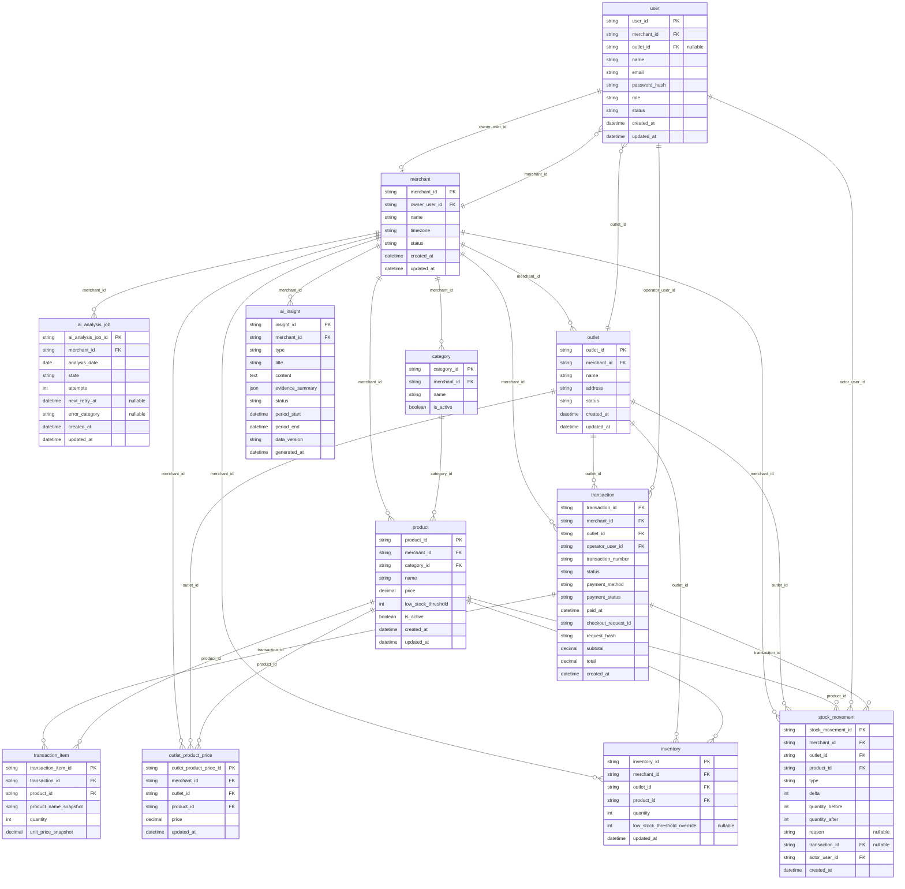

# Multi-Outlet POS System — ERD

## Catatan model

- diagram ini berfokus pada entitas dan relasi; unique key, check, index, dan detail constraint fisik ditetapkan saat rancangan Prisma/migration.
- `Cart`, `Payment`, `IdempotencyRecord`, audit trail umum, outbox reporting, dan reporting projection sengaja tidak menjadi tabel MVP.
- `Transaction` menyimpan atribut pembayaran manual dan idempotency checkout secara langsung.
- `TransactionItem.subtotal` tidak disimpan; nilainya selalu dihitung dari `unit_price_snapshot × quantity` ketika dibutuhkan.
- `StockMovement` adalah riwayat perubahan stok, bukan audit trail umum; `transaction_id` hanya diisi untuk pergerakan bertipe `SALE`.

## Siklus AI insight

Satu `AiAnalysisJob` dibuat untuk satu analisis harian Merchant. Job yang selesai dapat menghasilkan nol atau lebih tipe insight. Untuk setiap tipe yang memiliki data cukup, sistem memperbarui row `AiInsight` terbaru milik Merchant tersebut; sistem tidak membuat histori insight per tipe.

`AiInsight.type` adalah tipe yang ditentukan pengembang untuk MVP: tren penjualan, perbandingan Outlet, produk terlaris/tidak laku, pola waktu penjualan, dan tren AOV. Job memperbarui hasil insight terbaru tanpa menyimpan relasi permanen ke riwayat job.
