# SYSTEM FLOW — KESELURUHAN MODULE (Multi-Outlet POS + BI/AI)

Dokumen ini memetakan **alur sistem secara keseluruhan** — dari setup merchant sampai keputusan
bisnis Owner — berdasarkan `module-implementation-guide.md` dan deliverables (URS/SRS/FRD).

Berisi diagram berjenjang:
- **Bagian A** — Gambaran besar (context) & arsitektur.
- **Bagian B** — Alur utama (end-to-end): Register → Setup → Operasional → Reporting → AI.
- **Bagian C** — Alur detail per-module (13 module).
- **Bagian D** — Matriks alur & referensi silang.

> Teknis detail per endpoint: lihat `module-implementation-guide.md`. Detail AI analyze (DB baseline → BullMQ): lihat `ai-analyze-flow.md`.

---

## A. Gambaran Besar

### A.1 Konteks Sistem

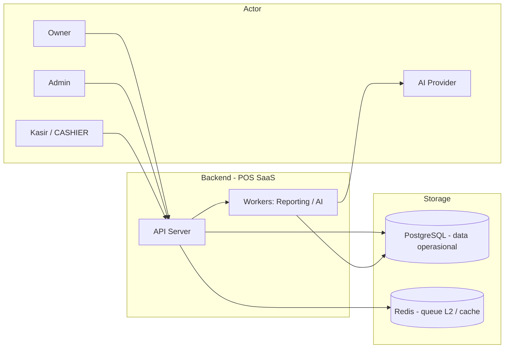

### A.2 Jalur Prioritas (dari Business Flow)

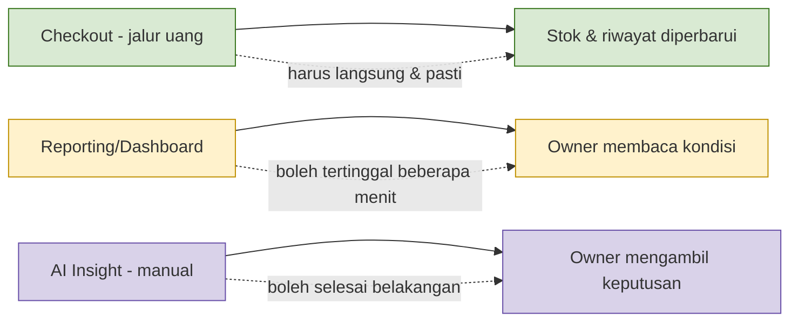

**Prioritas: Operasional (checkout) > Informasi (reporting) > Insight (AI).** Reporting & AI tidak boleh
memperlambat checkout (FR-AI-001, business flow §3).

### A.3 End-to-End (Ringkas)

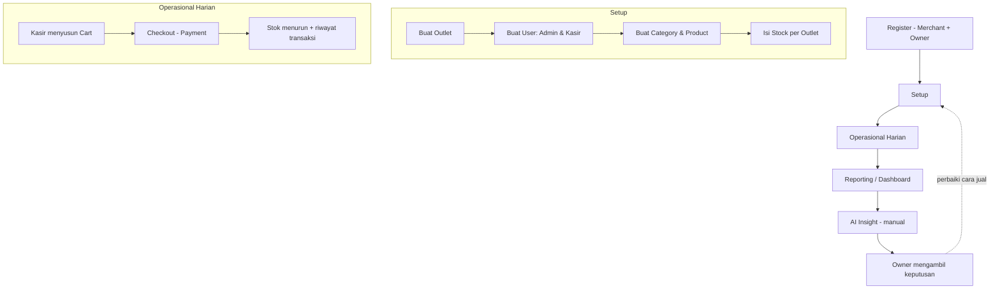

---

## B. Alur Utama (End-to-End)

### B.1 Onboarding & Setup (Register → Stock)

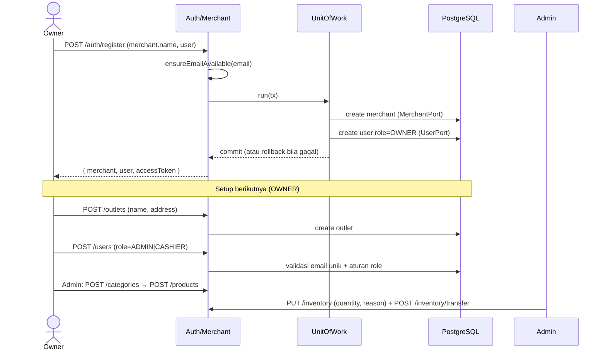

### B.2 Operasional: Cart → Checkout (Jalur Prioritas Tertinggi)

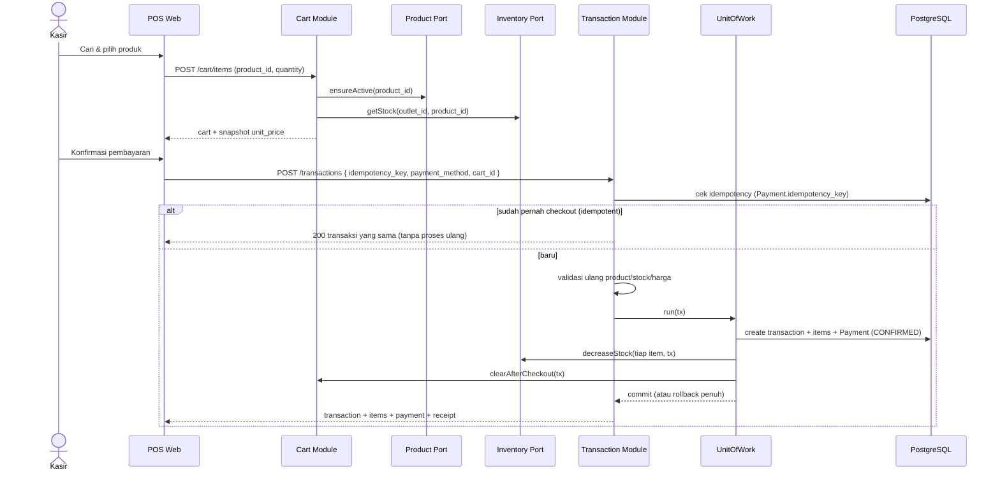

> Jika salah satu gagal (stok habis, harga berubah) → **rollback semua**, tidak ada transaksi parsial
> (FR-CHK-003, ASM-003).

### B.3 Reporting & Dashboard (Jalur Informasi)

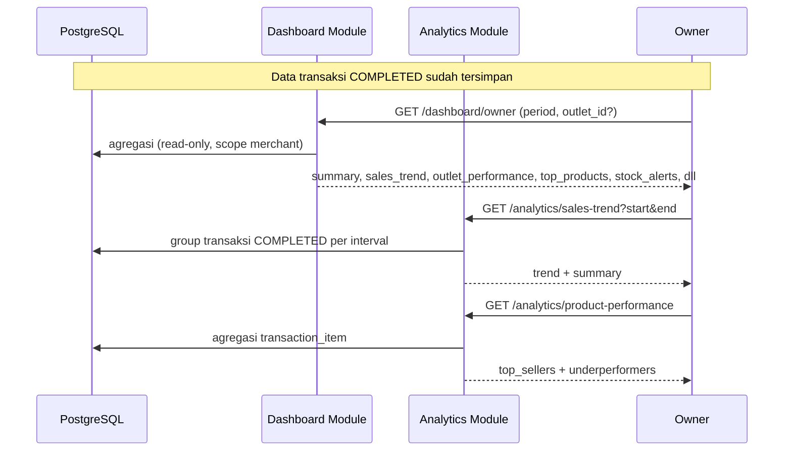

### B.4 AI Insight (Jalur Insight, Manual & Async)

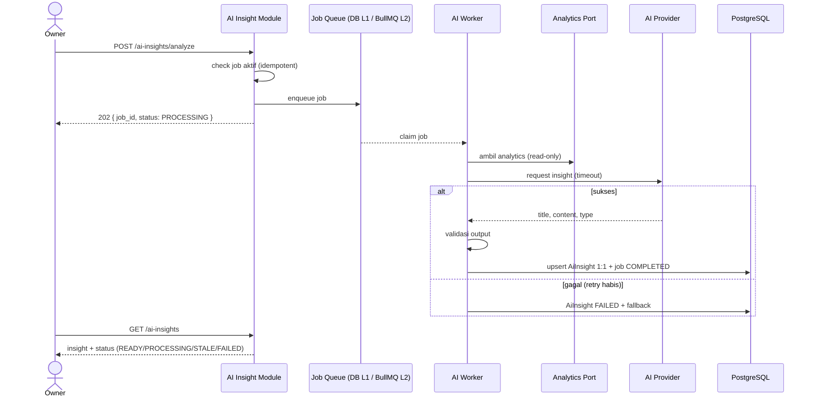

> Detail lengkap tier L1/L2: [`ai-analyze-flow.md`](./ai-analyze-flow.md).

---

## C. Alur Detail Per-Module

### C.1 AUTH MODULE

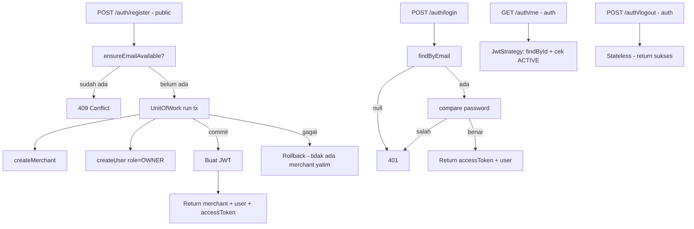

### C.2 MERCHANT MODULE

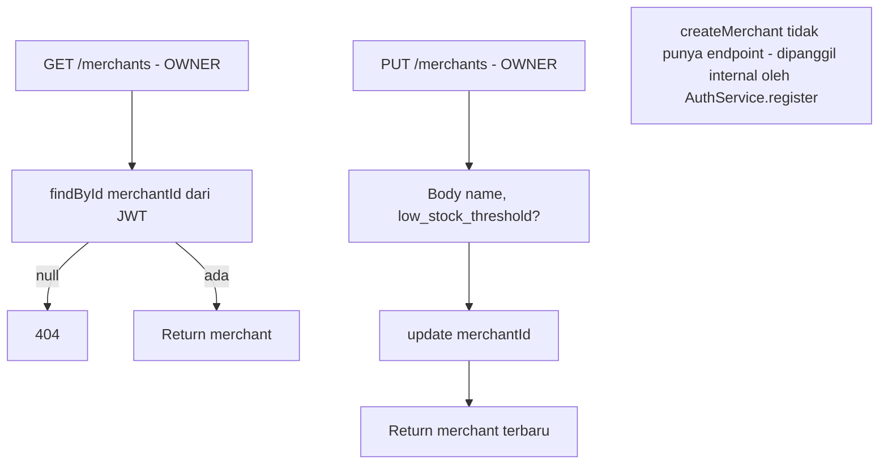

### C.3 OUTLET MODULE

```mermaid
flowchart TD
    LIST[GET /outlets - OWNER] --> FILTER[Filter status?] --> L[listByMerchant]
    CREATE[POST /outlets - OWNER] --> CO[createOutlet merchantId]
    ONE[GET /outlets/{id} - OWNER] --> OW[Pastikan milik merchant]
    UPD[PUT /outlets/{id} - OWNER] --> UO[updateOutlet]
    DEL[DELETE /outlets/{id} - OWNER] --> SOFT[Soft delete: status=INACTIVE]

    OW -->|bukan milik / tak ada| N404[404]
```

### C.4 USER MODULE

```mermaid
flowchart TD
    LIST[GET /users - OWNER] --> FILTER[Filter role/outlet/status, scope merchant]
    CREATE[POST /users - OWNER] --> VALID[Validasi role & email unik]
    VALID -->|CASHIER| W1[outlet_id wajib - outlet aktif merchant]
    VALID -->|ADMIN| W2[outlet_id harus null]
    VALID -->|OWNER| X[409 - owner hanya lewat register]
    VALID --> C[createUser + hash password]
    UPD[PUT /users/{id} - OWNER] --> U1[Update role/status/outlet]
    DEL[DELETE /users/{id} - OWNER] --> D1[Nonaktifkan - riwayat transaksi tetap]
```

### C.5 CATEGORY MODULE

```mermaid
flowchart TD
    GET[GET /categories - OWNER,ADMIN] --> L[listByMerchant]
    CREATE[POST /categories - OWNER,ADMIN] --> C1[cek unik nama dalam merchant]
    UPD[PUT /categories/{id} - OWNER,ADMIN] --> O[ensureMerchantOwnership]
    DEL[DELETE /categories/{id} - OWNER,ADMIN] --> SOFT[Soft delete: status=INACTIVE]

    C1 -->|duplikat| C409[409]
    O -->|bukan milik| N404[404]
    SOFT --> NOTE[Product & riwayat tetap utuh - URB-016/BR-019]
```

### C.6 PRODUCT MODULE

```mermaid
flowchart TD
    GET[GET /products - semua] --> Q[Filter category/status/search + pagination]
    CREATE[POST /products - OWNER,ADMIN] --> V[Validasi category aktif & milik merchant]
    V -->|tidak valid| B400[400]
    V --> CP[createProduct + audit harga/status]
    ONE[GET /products/{id} - semua] --> OW[Pastikan milik merchant]
    UPD[PUT /products/{id} - OWNER,ADMIN] --> U1[Update + audit before/after]
    DEL[DELETE /products/{id} - OWNER,ADMIN] --> SOFT[Soft delete: status=INACTIVE]

    NOTE[Product TIDAK punya stock - stock di Inventory]
```

### C.7 INVENTORY MODULE

```mermaid
flowchart TD
    GET[GET /inventory - semua] --> L[Stock per outlet + product]
    ONE[GET /inventory/outlet/o/product/p - semua] --> S[getStock]
    ADJ[PUT /inventory/{id} - OWNER,ADMIN] --> R[Body quantity + reason - wajib]
    ADJ --> UOW[UnitOfWork: update + StockMovement ADJUSTMENT]
    BULK[POST /inventory/bulk - OWNER,ADMIN] --> UOW2[UnitOfWork: semua item + StockMovement]
    TR[POST /inventory/transfer - OWNER,ADMIN] --> CK[cek stock from_outlet cukup]
    CK -->|kurang| B400[400]
    CK --> TR1[UnitOfWork: decrease from + increase to + StockMovement kedua sisi]
    LOW[GET /inventory/low-stock - OWNER,ADMIN] --> T[stock <= Merchant.low_stock_threshold]

    UOW --> AUDIT[before/after/delta/reason/actor/timestamp]
    NOTE2[Stock tidak boleh negatif - FR-INV-002/BR-011A]
```

### C.8 CART MODULE

```mermaid
flowchart TD
    GET[GET /cart - CASHIER] --> L[cari cart user+outlet]
    L -->|belum ada| 404[404]
    ADD[POST /cart/items - CASHIER] --> P[ensureActive product]
    P -->|tidak aktif| B400[400]
    P --> ST[getStock outlet]
    ST --> ADD1[upsert item - quantity baru <= stock?]
    ADD1 -->|melebihi| B400[400]
    ADD1 --> SNAP[simpan snapshot unit_price]
    UPD[PUT /cart/items/{id} - CASHIER] --> OW[ownership check] --> Q[quantity=0 hapus / cek stock]
    DEL[DELETE /cart/items/{id} - CASHIER] --> D[hapus item]
    CLR[DELETE /cart/clear - CASHIER] --> CL[hapus semua item]

    NOTE[Cart per kasir per outlet - lazily dibuat]
    NOTE2[Stock hanya dicek saat add/update - decrement saat checkout]
```

### C.9 TRANSACTION MODULE (Checkout)

```mermaid
flowchart TD
    GET[GET /transactions - semua] --> F[Filter outlet/date/cashier + pagination]
    F -->|CASHIER| P[outlet dipaksa milik kasir]

    POST[POST /transactions - semua] --> IDEM[cek idempotency_key]
    IDEM -->|sudah ada| SAME[200 transaksi sama - tanpa proses ulang]
    IDEM -->|baru| ITEM[cart_id ATAU items]
    ITEM --> VALID[validasi ulang product/stock/harga]
    VALID -->|gagal| B400[400 + info product/requested/available]
    VALID --> UOW[UnitOfWork run tx]
    UOW --> T1[create transaction + items + Payment CONFIRMED]
    UOW --> T2[decreaseStock tiap item]
    UOW --> T3[clearAfterCheckout]
    UOW -->|commit| REC[Return + receipt]
    UOW -->|gagal| RB[Rollback penuh - tanpa transaksi parsial]

    ONE[GET /transactions/{id} - semua] --> G[getById + scope outlet]
    CANC[POST /transactions/{id}/cancel] --> FUT[FUTURE - di luar scope MVP]
```

### C.10 DASHBOARD MODULE

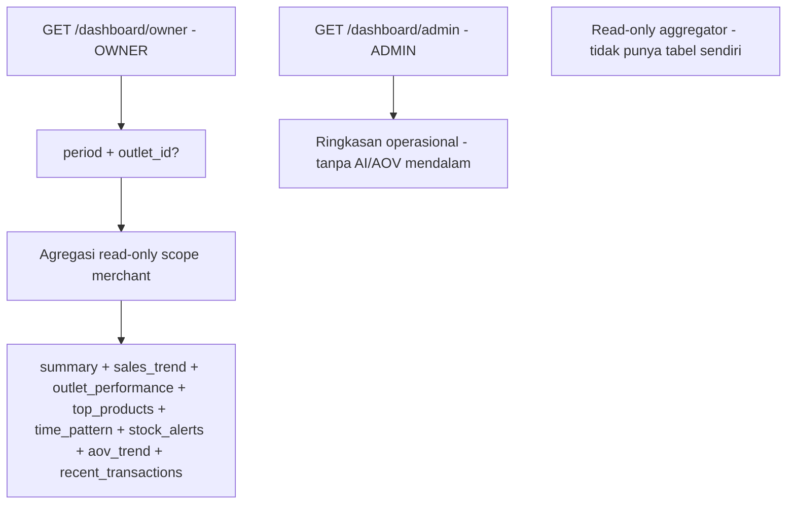

### C.11 ANALYTICS MODULE

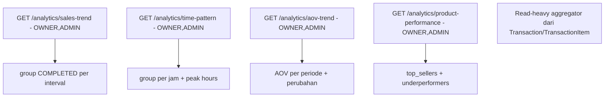

### C.12 AI INSIGHT MODULE

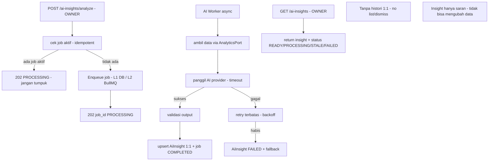

---

## D. Matriks Alur & Referensi Silang

### D.1 Role vs Endpoint (Ringkas)

| Module | OWNER | ADMIN | CASHIER | Public |
|---|---|---|---|---|
| Auth | register/login/logout/me | login/logout/me | login/logout/me | register, login |
| Merchant | GET,PUT | – | – | – |
| Outlet | GET,POST,GET/PUT/DELETE /{id} | – | – | – |
| User | GET,POST,GET/PUT/DELETE /{id} | – | – | – |
| Category | CRUD | CRUD | – | – |
| Product | CRUD | CRUD | GET | – |
| Inventory | PUT /{id}, bulk, transfer, low-stock | PUT /{id}, bulk, transfer, low-stock | GET | – |
| Cart | – | – | semua | – |
| Transaction | GET,POST,GET /{id} | GET,POST,GET /{id} | GET,POST (outlet sendiri),GET /{id} | – |
| Dashboard | /dashboard/owner | /dashboard/admin | – | – |
| Analytics | semua | semua | – | – |
| AI Insight | POST analyze, GET | – | – | – |

> CASHIER dibatasi outlet-nya sendiri pada semua operasi (scope dari JWT).

### D.2 Dependency Antar-Module (melalui Port)

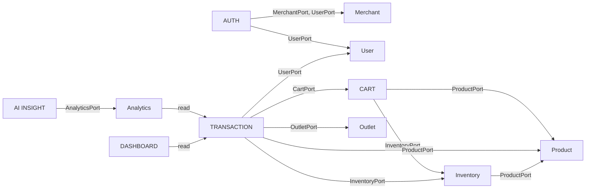

### D.3 Ringkasan Data yang Dimiliki Tiap Module

| Module | Owns |
|---|---|
| Auth | (tidak memiliki tabel) |
| Merchant | `merchant` |
| Outlet | `outlet` |
| User | `user` (termasuk password hash) |
| Category | `category` |
| Product | `product` (+ validasi category) |
| Inventory | `inventory`, `stock_movements` |
| Cart | `cart`, `cart_item` |
| Transaction | `transaction`, `transaction_item` |
| Dashboard | (tidak ada — read-only aggregator) |
| Analytics | (tidak ada — read-heavy aggregator) |
| AI Insight | `ai_insight` (1:1, tanpa histori) |

> **Aturan kunci**: module hanya boleh query tabel ownership-nya; antar-module wajib lewat port
> (lihat `module-implementation-guide.md`).

---

## Lampiran — Peta Dokumen

| Dokumen | Isi |
|---|---|
| [`module-implementation-guide.md`](./module-implementation-guide.md) | Detail per-module: files, owns, port, endpoints, logic |
| [`ai-analyze-flow.md`](./ai-analyze-flow.md) | Alur AI analyze berjenjang (DB → BullMQ+Redis) |
| [`api-contract.md`](./api-contract.md) | Kontrak request/response per endpoint |
| [`data-model.md`](./data-model.md) | Relasi data |
| [`architecture.md`](./architecture.md) | Logical architecture (Redis/BullMQ, scaling) |
| deliverables/ | URS, SRS, FRD, business flow (sumber kebenaran) |