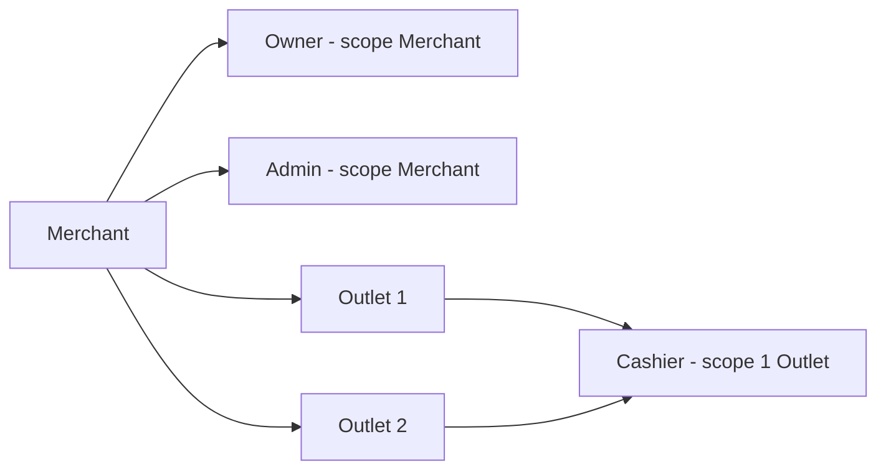
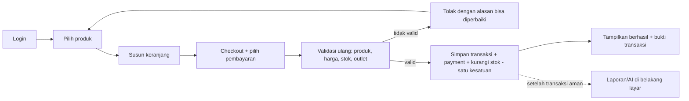
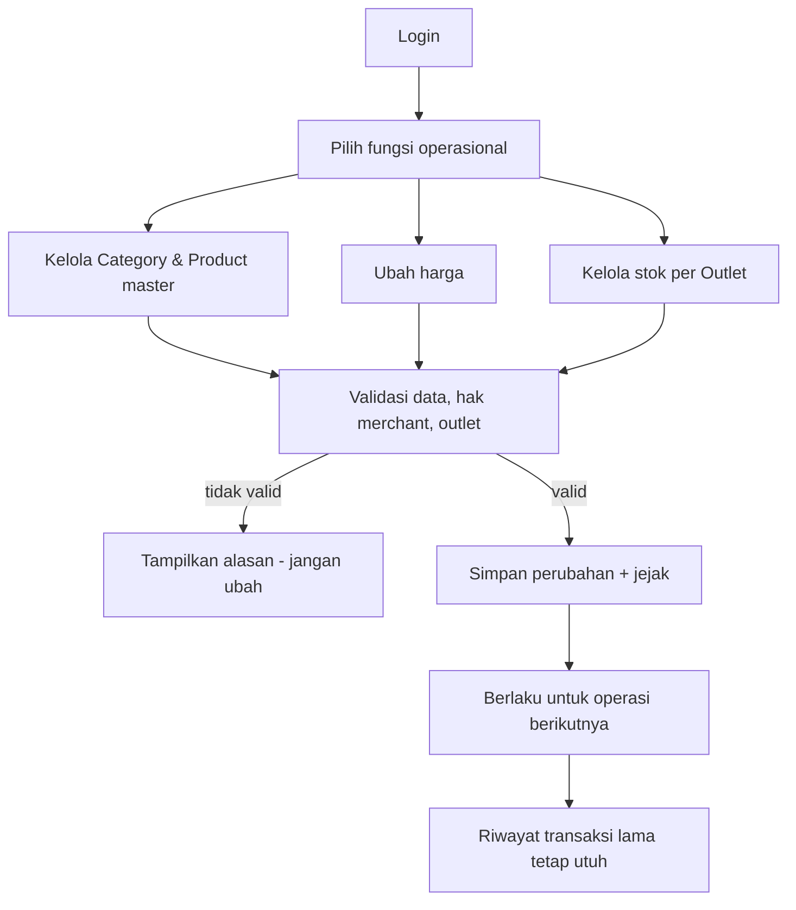
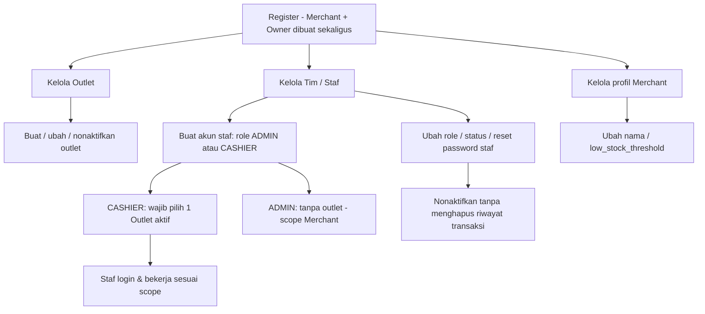
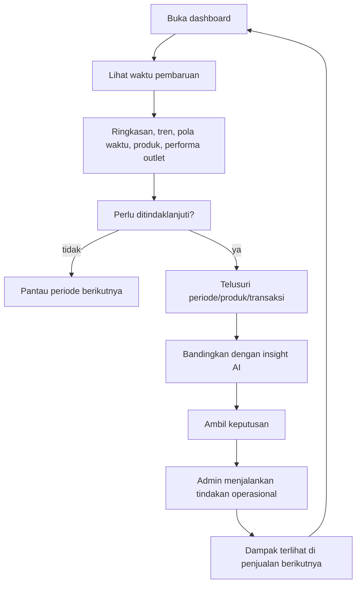
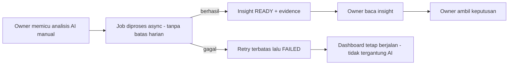

# USER FLOW — Per Role (Owner / Admin / Cashier)

Ringkasan alur pengguna per role: dari login sampai tugas selesai. Turunan dari
`deliverables/01-iterasi-1-business-flow.md` (bagian 5, 7, 8, 9) dan `system-flow.md`.
Gambar besar & detail teknis: lihat dokumen tersebut.

> **Scope role:** Owner = Merchant; Admin = Merchant (lintas outlet); Cashier = satu Outlet.
> Sumber kebenaran tetap deliverables — dokumen ini hanya untuk memudahkan membayangkan alur.

---

## 1. Overview Per Role

| Role | Scope | Fokus | Akses utama |
|---|---|---|---|
| **Owner** | Merchant | Keputusan bisnis (bukan transaksi harian) | Dashboard, Analytics, AI Insight, kelola merchant/outlet/staf |
| **Admin** | Merchant (lintas outlet) | Toko siap berjualan | Category, Product, Inventory, (bukan AI, bukan kelola staf) |
| **Cashier** | Satu Outlet | Melayani pelanggan | Cart, Checkout, Transaction (outlet sendiri) |

---

## 2. Cashier Flow — "Melayani pelanggan tanpa ragu"

### Happy path

1. Login ke POS.
2. Cari / pilih produk (harga + status aktif ditampilkan).
3. Susun keranjang, cek kuantitas.
4. Subtotal & total dihitung.
5. Checkout + pilih metode pembayaran (`CASH` / `CASHLESS_MANUAL`).
6. Sistem **validasi ulang** saat checkout: produk aktif, harga berlaku, stok outlet cukup, hak kasir pada outlet.
7. Satu kesatuan tersimpan: transaksi + detail/harga snapshot + payment + pengurangan stok.
8. Tampil nomor transaksi / bukti → layani pelanggan berikutnya.

### Status yang perlu dipahami kasir

| Status | Arti | Tindakan aman |
|---|---|---|
| Keranjang | Belum ada transaksi final | Item masih bisa diubah |
| Memproses | Sistem menentukan hasil | Jangan kirim ulang membabi buta |
| Berhasil | Transaksi final, ada identitas unik | Berikan bukti |
| Gagal sebelum tersimpan | Tidak ada transaksi final | Perbaiki lalu coba lagi |
| Belum diketahui | Respons putus, hasil belum terlihat | **Cari transaksi yang sama, jangan bikin baru** (hindari bayar ganda) |

---

## 3. Admin Flow — "Menjaga toko siap berjualan"

1. Login.
2. Pilih fungsi operasional: Category / Product / harga / stok per Outlet.
3. Validasi data, hak merchant, dan outlet yang dipilih.
4. Tidak valid → tampilkan alasan, jangan ubah data.
5. Valid → simpan perubahan + jejak (siapa/kapan/alasan).

> Prinsip: Admin mengubah **kondisi bisnis sekarang & ke depan**, bukan menulis ulang sejarah.
> Harga yang berubah hari ini tidak mengubah harga pada struk minggu lalu (snapshot).

---

## 4. Owner Flow — "Dari angka menjadi keputusan"

Owner punya dua sisi peran: **(A) mengelola bisnis** (merchant, outlet, tim) dan **(B) membaca & memutuskan** (dashboard, analytics, AI).

### 4A. Owner — Mengelola Merchant, Outlet, dan Tim

Pembentukan dilakukan saat register (merchant + owner sekaligus), lalu Owner mengelola struktur & akses:

**Aturan kunci (FR-AUTH-011, FR-TEN-005, URS §8):**
- Hanya **Owner** yang membuat/mengubah/menonaktifkan staf dan mengelola outlet & profil merchant (Admin tidak).
- Staf dibuat dengan role **ADMIN** atau **CASHIER** saja — **OWNER hanya lewat register**.
- **ADMIN** → `outlet_id` harus null (scope Merchant). **CASHIER** → `outlet_id` wajib menunjuk outlet aktif.
- Menonaktifkan staf tidak menghapus riwayat transaksi (FR-TEN-007).

### 4B. Owner — Membaca & Mengambil Keputusan

1. Buka dashboard.
2. Lihat waktu pembaruan data (bukan selalu real-time).
3. Lihat ringkasan, tren, pola waktu, produk, performa outlet.
4. Tentukan perlu tindak lanjut atau tidak.
5. Bila perlu: telusuri periode/produk/transaksi, bandingkan dengan insight AI.
6. Ambil keputusan → Admin menjalankan tindakan → dampak terlihat pada penjualan berikutnya.

### AI Insight (khusus Owner)

---

## 5. Prinsip Lintas Role (ringkas)

- **Satu sumber kebenaran transaksi** — dashboard & AI adalah turunan, tidak menentukan berhasil/tidaknya checkout.
- **Harga historis tidak mengikuti katalog terbaru** — simpan snapshot saat penjualan.
- **Satu checkout = paling banyak satu transaksi final** (idempotency, hindari bayar ganda).
- **Stok per Outlet = fakta operasional** — adjustment wajib pilih outlet; transaksi+payment+stok atomik.
- **Reporting & AI membaca hasil, bukan mengendalikan checkout.**
- **Setiap data punya pemilik merchant** — role saja tidak cukup untuk akses lintas merchant.
- **Aksi penting dapat ditelusuri** — siapa, kapan, konteks.

---

## Lampiran — Rujukan

| Topik | Dokumen |
|---|---|
| Flow kasir/admin/owner detail | `deliverables/01-iterasi-1-business-flow.md` §5, 7–9 |
| Gambaran besar & alur per-module | `system-flow.md` |
| Role & scope lengkap | `product-overview.md` |
| Endpoint per role | `api-contract.md` (RBAC) |