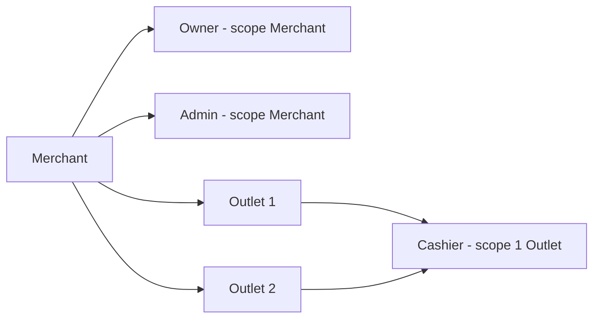
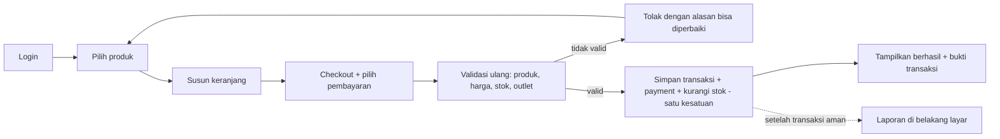
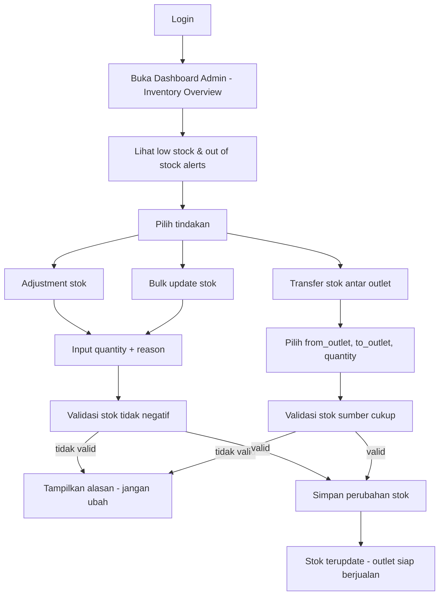
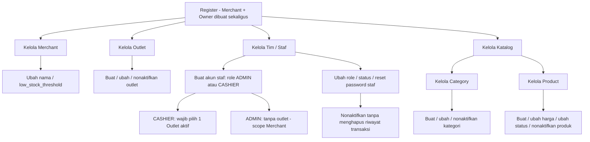
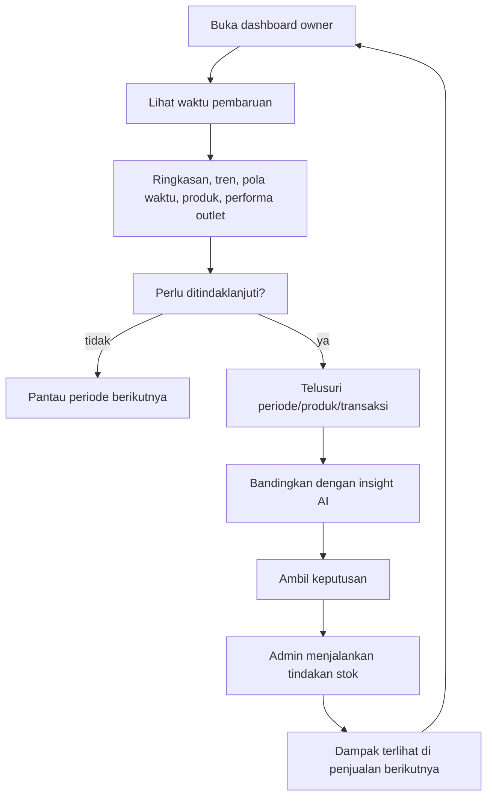
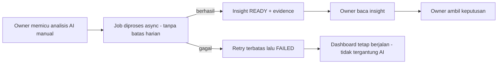

# USER FLOW — Per Role (UPDATED - Removed Stock Movement)

---

## Daftar Isi

1. [Overview Per Role](#1-overview-per-role)
2. [Cashier Flow — "Melayani pelanggan tanpa ragu"](#2-cashier-flow--melayani-pelanggan-tanpa-ragu)
3. [Admin Flow — "Menjaga stok siap berjualan"](#3-admin-flow--menjaga-stok-siap-berjualan)
4. [Owner Flow — "Dari angka menjadi keputusan"](#4-owner-flow--dari-angka-menjadi-keputusan)
5. [Prinsip Lintas Role](#5-prinsip-lintas-role)

---

## 1. Overview Per Role

| Role | Scope | Fokus Utama | Akses Utama | Tidak Bisa |
|---|---|---|---|---|
| **Owner** | Merchant | **Strategi bisnis + katalog + analytics + AI** | Dashboard Owner, Analytics, AI Insight, Merchant, Outlet, User, Category, Product | Mengubah stok (read-only), Checkout |
| **Admin** | Merchant (lintas outlet) | **Stok operasional + monitoring inventory** | Inventory (adjustment, transfer, bulk), Dashboard Admin (inventory overview), Low Stock Alerts | Mengubah product/category, Checkout, Analytics mendalam, AI |
| **Cashier** | Satu Outlet | **Melayani pelanggan** dari mulai memilih produk hingga checkout | Cart, Checkout, Transaction (outlet sendiri), Product (read-only), Inventory (read-only) | Dashboard, Analytics, AI, Mengubah product/category, Mengubah stok |

---

## 2. Cashier Flow — "Melayani pelanggan tanpa ragu"

### Happy Path

1. Login ke POS.
2. Cari / pilih produk (harga + status aktif ditampilkan).
3. Susun keranjang, cek kuantitas.
4. Subtotal & total dihitung.
5. Checkout + pilih metode pembayaran (`CASH` / `CASHLESS_MANUAL`).
6. Sistem **validasi ulang** saat checkout: produk aktif, harga berlaku, stok outlet cukup, hak kasir pada outlet.
7. Satu kesatuan tersimpan: transaksi + detail/harga snapshot + pengurangan stok.
8. Tampil nomor transaksi / bukti → layani pelanggan berikutnya.

### Status yang Perlu Dipahami Kasir

| Status | Arti | Tindakan Aman |
|---|---|---|
| Keranjang | Belum ada transaksi final | Item masih bisa diubah |
| Memproses | Sistem menentukan hasil | Jangan kirim ulang membabi buta |
| Berhasil | Transaksi final, ada identitas unik | Berikan bukti |
| Gagal sebelum tersimpan | Tidak ada transaksi final | Perbaiki lalu coba lagi |
| Belum diketahui | Respons putus, hasil belum terlihat | **Cari transaksi yang sama, jangan bikin baru** (hindari bayar ganda) |

### Endpoint yang Diakses Cashier

| Endpoint | Method | Fungsi |
|---|---|---|
| `/auth/login` | POST | Login |
| `/auth/me` | GET | Lihat profil sendiri |
| `/products` | GET | Lihat daftar produk |
| `/products/{id}` | GET | Lihat detail produk |
| `/inventory` | GET | Lihat stok per outlet |
| `/inventory/outlet/{oid}/product/{pid}` | GET | Lihat stok produk tertentu |
| `/cart` | GET | Lihat keranjang |
| `/cart/items` | POST | Tambah item ke keranjang |
| `/cart/items/{id}` | PUT/DELETE | Ubah/hapus item keranjang |
| `/cart/clear` | DELETE | Kosongkan keranjang |
| `/transactions` | GET | Lihat transaksi outlet sendiri |
| `/transactions` | POST | Checkout |
| `/transactions/{id}` | GET | Lihat detail transaksi |

---

## 3. Admin Flow — "Menjaga stok siap berjualan"

### Happy Path

1. Login.
2. Buka **Dashboard Admin** → lihat overview inventory:
   - Total stok keseluruhan
   - Jumlah produk low stock
   - Jumlah produk out of stock
   - Daftar produk mendekati habis per outlet
3. Ambil tindakan berdasarkan data:
   - **Adjustment stok**: ubah quantity produk di outlet tertentu (wajib beri alasan)
   - **Bulk update**: ubah banyak stok sekaligus dalam satu outlet
   - **Transfer stok**: pindahkan stok antar outlet
4. Sistem catat perubahan stok di inventory.
5. Stok terupdate → outlet siap berjualan.

### Yang Boleh dan Tidak Boleh Dilakukan Admin

| Boleh | Tidak Boleh |
|---|---|
| ✅ Melihat daftar produk | ❌ Membuat produk baru |
| ✅ Melihat daftar kategori | ❌ Mengubah produk |
| ✅ Melihat stok per outlet | ❌ Menonaktifkan produk |
| ✅ Mengubah stok (adjustment) | ❌ Membuat kategori baru |
| ✅ Bulk update stok | ❌ Mengubah kategori |
| ✅ Transfer stok antar outlet | ❌ Menonaktifkan kategori |
| ✅ Melihat low stock alerts | ❌ Checkout |
| ✅ Melihat dashboard inventory | ❌ Mengakses AI Insight |
| ✅ Melihat transaksi | ❌ Mengakses Analytics mendalam |

### Endpoint yang Diakses Admin

| Endpoint | Method | Fungsi |
|---|---|---|
| `/auth/login` | POST | Login |
| `/auth/me` | GET | Lihat profil sendiri |
| `/categories` | GET | Lihat kategori (read-only) |
| `/products` | GET | Lihat produk (read-only) |
| `/products/{id}` | GET | Lihat detail produk (read-only) |
| `/inventory` | GET | Lihat stok per outlet |
| `/inventory/outlet/{oid}/product/{pid}` | GET | Lihat stok produk tertentu |
| `/inventory/{id}` | PUT | Adjustment stok |
| `/inventory/bulk` | PUT | Bulk update stok |
| `/inventory/transfer` | POST | Transfer stok antar outlet |
| `/inventory/low-stock` | GET | Lihat low stock alerts |
| `/transactions` | GET | Lihat transaksi merchant |
| `/transactions/{id}` | GET | Lihat detail transaksi |
| `/dashboard/admin` | GET | Dashboard inventory overview |

---

## 4. Owner Flow — "Dari angka menjadi keputusan"

Owner punya dua sisi peran: **(A) mengelola bisnis** (merchant, outlet, tim, katalog) dan **(B) membaca & memutuskan** (dashboard, analytics, AI).

### 4A. Owner — Mengelola Merchant, Outlet, Tim, dan Katalog

Pembentukan dilakukan saat register (merchant + owner sekaligus), lalu Owner mengelola struktur & akses:

**Aturan Kunci (FR-AUTH-011, FR-TEN-005, URS §8):**
- Hanya **Owner** yang membuat/mengubah/menonaktifkan staf dan mengelola outlet & profil merchant.
- Staf dibuat dengan role **ADMIN** atau **CASHIER** saja — **OWNER hanya lewat register**.
- **ADMIN** → `outlet_id` harus null (scope Merchant). **CASHIER** → `outlet_id` wajib menunjuk outlet aktif.
- Menonaktifkan staf tidak menghapus riwayat transaksi.
- **Hanya Owner** yang mengelola Category & Product (create, update, delete).

### 4B. Owner — Membaca & Mengambil Keputusan

1. Buka dashboard.
2. Lihat waktu pembaruan data (bukan selalu real-time).
3. Lihat ringkasan, tren, pola waktu, produk, performa outlet.
4. Tentukan perlu tindak lanjut atau tidak.
5. Bila perlu: telusuri periode/produk/transaksi, bandingkan dengan insight AI.
6. Ambil keputusan → Admin menjalankan tindakan stok → dampak terlihat pada penjualan berikutnya.

### AI Insight (khusus Owner)

### Endpoint yang Diakses Owner

| Endpoint | Method | Fungsi |
|---|---|---|
| `/auth/register` | POST | Register merchant + owner |
| `/auth/login` | POST | Login |
| `/auth/me` | GET | Lihat profil sendiri |
| `/merchants` | GET/PUT | Kelola merchant |
| `/outlets` | GET/POST/PUT/DELETE | Kelola outlet |
| `/users` | GET/POST/PUT/DELETE | Kelola user/staf |
| `/categories` | GET/POST/PUT/DELETE | Kelola kategori (full CRUD) |
| `/products` | GET/POST/PUT/DELETE | Kelola produk (full CRUD) |
| `/inventory` | GET | Lihat stok (read-only) |
| `/transactions` | GET | Lihat transaksi |
| `/transactions/{id}` | GET | Lihat detail transaksi |
| `/dashboard/owner` | GET | Dashboard bisnis komprehensif |
| `/analytics/sales-trend` | GET | Analisis tren penjualan |
| `/analytics/time-pattern` | GET | Analisis pola waktu |
| `/analytics/aov-trend` | GET | Analisis AOV trend |
| `/analytics/product-performance` | GET | Analisis performa produk |
| `/ai-insights/analyze` | POST | Trigger AI analysis |
| `/ai-insights` | GET | Lihat AI insight |

---

## 5. Prinsip Lintas Role

### 5.1 Ringkasan Akses Role

| Activity | OWNER | ADMIN | CASHIER |
|---|---|---|---|
| Kelola Merchant | ✅ | ❌ | ❌ |
| Kelola Outlet | ✅ | ❌ | ❌ |
| Kelola User/Staf | ✅ | ❌ | ❌ |
| Kelola Category | ✅ (full CRUD) | ❌ (read-only) | ❌ |
| Kelola Product | ✅ (full CRUD) | ❌ (read-only) | ❌ (read-only) |
| Kelola Inventory | ❌ (read-only) | ✅ (adjustment, transfer, bulk) | ❌ (read-only) |
| Cart | ❌ | ❌ | ✅ |
| Checkout | ❌ | ❌ | ✅ |
| Lihat Transaksi | ✅ | ✅ | ✅ (outlet sendiri) |
| Dashboard Owner | ✅ | ❌ | ❌ |
| Dashboard Admin | ❌ | ✅ | ❌ |
| Analytics | ✅ | ❌ | ❌ |
| AI Insight | ✅ | ❌ | ❌ |

### 5.2 Prinsip Utama

- **Satu sumber kebenaran transaksi** — dashboard & AI adalah turunan, tidak menentukan berhasil/tidaknya checkout.
- **Harga historis tidak mengikuti katalog terbaru** — simpan snapshot saat penjualan.
- **Satu checkout = paling banyak satu transaksi final** (hindari bayar ganda).
- **Stok per Outlet = fakta operasional** — adjustment wajib pilih outlet; transaksi+stok atomik.
- **Admin adalah pemilik stok** — Owner hanya melihat, Cashier hanya membaca untuk validasi.
- **Owner adalah pemilik katalog** — Admin hanya melihat, Cashier hanya membaca.
- **Reporting & AI membaca hasil, bukan mengendalikan checkout.**
- **Setiap data punya pemilik merchant** — role saja tidak cukup untuk akses lintas merchant.

---

## Lampiran — Rujukan

| Topik | Dokumen |
|---|---|
| Flow kasir/admin/owner detail | `deliverables/01-iterasi-1-business-flow.md` §5, 7–9 |
| Gambaran besar & alur per-module | `system-flow.md` |
| Role & scope lengkap | `product-overview.md` |
| Endpoint per role | `api-contract.md` (RBAC) |
| Blueprint implementasi | `module-implementation-guide.md` |

---

**End of Document**