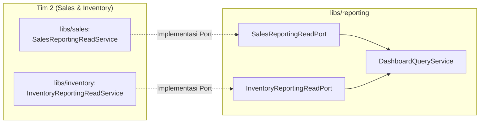

# Modul Reporting — Status Integrasi, Kesiapan AI, & Panduan Tim 2 (TODO)

> Dokumen ini adalah **sumber kebenaran integrasi** untuk modul `libs/reporting` di Aplikasi K (NestJS Modular Monolith).
> Disusun sesuai spesifikasi **URS, SRS (FR-REP-001–010), FRD, Build Plan 05 §5.6, Module Library 06 §3.6, dan API Contract 07 §6**.

---

## 1. Status Verifikasi Deliverables vs Kondisi Reporting Saat Ini

Seluruh 8 endpoint dashboard pada kontrak API (`07-API-Contract §6`) **sudah diimplementasikan secara lengkap dan terverifikasi** di `DashboardController`:

| Endpoint | Role | Status Implementasi | Sumber Data & Mekanisme |
|---|---|---|---|
| `GET /api/v1/dashboard/summary` | `OWNER` | **READY (100%)** | Cache-Aside (TTL 30m) $\to$ `SalesReportingReadPort` |
| `GET /api/v1/dashboard/sales-trend` | `OWNER` | **READY (100%)** | Cache-Aside (TTL 30m) $\to$ `SalesReportingReadPort` |
| `GET /api/v1/dashboard/aov-trend` | `OWNER` | **READY (100%)** | Cache-Aside (TTL 30m) $\to$ `SalesReportingReadPort` |
| `GET /api/v1/dashboard/time-pattern` | `OWNER` | **READY (100%)** | Cache-Aside (TTL 30m) $\to$ `SalesReportingReadPort` |
| `GET /api/v1/dashboard/top-products` | `OWNER` | **READY (100%)** | Cache-Aside (TTL 30m) $\to$ Sales + `CatalogReportingReadPort` |
| `GET /api/v1/dashboard/outlet-comparison` | `OWNER` | **READY (100%)** | Cache-Aside (TTL 30m) $\to$ Sales + `TenantReportingReadPort` |
| `GET /api/v1/dashboard/operations` | `ADMIN`, `OWNER` | **READY (100%)** | Real-time Read Replica $\to$ Tenant + Catalog + Inventory |
| `GET /api/v1/dashboard/low-stock` | `ADMIN`, `OWNER` | **READY (100%)** | Real-time Read Replica $\to$ Tenant + `InventoryReportingReadPort` |

### Kepatuhan NFR & Pola Akses:
1. **Workload Isolation (Access-Pattern-Aware)**: Seluruh query reporting membaca **PostgreSQL Read Replica (`PrismaReadService`)**, sehingga tidak pernah membebani *Primary Database* jalur kasir.
2. **Cache-Aside & Single-Flight Mutex**: Terhubung ke `ReportingCacheService` di `libs/platform` (Redis + In-Memory Fallback). Menggunakan *distributed lock* untuk mencegah *Cache Stampede / Thundering Herd*.
3. **Graceful Stale Fallback**: Jika Read Replica lag atau lambat, sistem mengembalikan cache berumur $\le 2$ jam dengan metadata `freshness_status: "STALE"` (HTTP 200) tanpa error.
4. **Worker Boundary**: Worker (`apps/worker`) **hanya memproses AI Insight job**. Reporting dieksekusi *on-demand* via API HTTP.

---

## 2. Komponen yang Sudah Terhubung Port Asli (*Real Ports*)

Modul `libs/reporting` telah terhubung langsung ke modul berikut **tanpa mock**:

1. **`TenantReportingReadPort` (`@app/tenant`)**:
   - Diimplementasikan oleh `TenantReportingReadService` (`libs/tenant`).
   - Menyediakan data context `timezone` Merchant (sesuai BR-018) dan daftar `outlets` aktif/nonaktif dari Read Replica.
2. **`CatalogReportingReadPort` (`@app/catalog`)**:
   - Diimplementasikan oleh `CatalogReportingReadService` (`libs/catalog`).
   - Menyediakan `getSellableProducts(merchantId)` untuk melengkapi daftar produk *least-selling*.
   - Menyediakan `getCatalogReportingSummary(merchantId)` (jumlah produk aktif/nonaktif & kategori nonaktif) untuk dasbor operasional Admin.
3. **`ReportingCachePort` (`@app/platform`)**:
   - Diimplementasikan oleh `ReportingCacheService` (`libs/platform`).

---

## 3. Kesiapan Konsumsi AI Provider (`libs/insight`)

Modul `libs/reporting` **SUDAH 100% SIAP DIKONSUMSI** oleh modul AI Insight (`libs/insight`):

### Interface Port: `ReportingReadPort`
Modul `libs/reporting` mengekspor `ReportingReadPort` di `index.ts`:
```typescript
import { ReportingReadPort } from '@app/reporting';

// Cara penggunaan di libs/insight:
const dataset = await this.reportingRead.getDataset({
  merchantId: 'uuid',
  dateFrom: new Date('2026-08-01T00:00:00Z'),
  dateTo: new Date('2026-08-31T23:59:59Z'),
  granularity: 'DAY', // 'HOUR' | 'DAY'
});
```

### Struktur `ReportingDataset` yang Dikembalikan:
- `summary`: Total omzet, jumlah transaksi, average transaction value.
- `series`: Tren penjualan dan tren AOV harian/per jam.
- `byOutlet`: Perbandingan omzet & transaksi per cabang outlet.
- `topProducts`: Daftar produk terlaris (`product_id`, `name`, `units_sold`, `omzet`).
- `leastSellingProducts`: Daftar produk paling sedikit terjual / belum terjual.
- `byHour`: Distribusi pola waktu penjualan jam 0–23 (`timePattern`).
- `dataVersion`: Fingerprint hash untuk deduplikasi AI insight (mencegah pemanggilan LLM jika data tidak berubah).
- `freshnessStatus`: `FRESH` atau `STALE`.
- `timezone`: Zona waktu Merchant.

---

## 4. Daftar Tugas untuk Tim 2 (TODO: Sales & Inventory Ports)

Saat ini, `libs/reporting` menggunakan **2 Mock Adapter sementara** agar aplikasi dapat di-build dan diuji secara independen. Tim 2 perlu mengimplementasikan 2 port berikut:



---

### TODO 1: Implementasikan `SalesReportingReadPort` (di `libs/sales`)

* **Lokasi Port**: `libs/reporting/src/application/ports/sales-reporting-read.port.ts`
* **Target Implementasi**: Buat `SalesReportingReadService` di `libs/sales` dan daftarkan sebagai provider eksternal.
* **Tanggung Jawab**:
  Membaca fakta transaksi yang berstatus `COMPLETED` dari **Read Replica** (`PrismaReadService`).

```typescript
export interface CompletedTransactionFactFilter {
  merchantId: string;
  outletId?: string;
  dateFrom: Date;
  dateTo: Date;
  timezone: string;
}

export interface CompletedTransactionFact {
  transactionId: string;
  outletId: string;
  /** Timestamp transaksi selesai (berasal dari transaction.paidAt ?? transaction.createdAt). */
  occurredAt: Date;
  total: string;
  items: Array<{
    productId: string;
    productNameSnapshot: string;
    quantity: number;
    subtotal: string;
  }>;
}


export abstract class SalesReportingReadPort {
  abstract listCompletedTransactionFacts(
    filter: CompletedTransactionFactFilter,
  ): Promise<CompletedTransactionFact[]>;
}
```

* **Query Prisma yang Disarankan (Read Replica)**:
  ```typescript
  return this.prismaRead.transaction.findMany({
    where: {
      merchantId: filter.merchantId,
      outletId: filter.outletId,
      status: 'COMPLETED',
      paidAt: { gte: filter.dateFrom, lte: filter.dateTo },
    },
    select: {
      id: true,
      outletId: true,
      paidAt: true,
      total: true,
      items: {
        select: {
          productId: true,
          productNameSnapshot: true,
          quantity: true,
          subtotal: true,
        },
      },
    },
    orderBy: { paidAt: 'asc' },
  });
  ```

---

### TODO 2: Implementasikan `InventoryReportingReadPort` (di `libs/inventory`)

* **Lokasi Port**: `libs/reporting/src/application/ports/inventory-reporting-read.port.ts`
* **Target Implementasi**: Buat `InventoryReportingReadService` di `libs/inventory`.
* **Tanggung Jawab**:
  Menghitung kondisi stok operasional dan daftar barang stok rendah (`low-stock`) dari **Read Replica**.

```typescript
export interface LowStockItem {
  productId: string;
  name: string;
  outletId: string;
  outletName: string;
  quantity: number;
  baseLowStockThreshold: number;
  lowStockThresholdOverride?: number;
  effectiveLowStockThreshold: number;
}

export interface InventoryOperationalData {
  inventoryItemCount: number;
  lowStockItemCount: number;
  outOfStockItemCount: number;
}

export abstract class InventoryReportingReadPort {
  abstract getOperationalData(request: {
    merchantId: string;
    outletId?: string;
  }): Promise<InventoryOperationalData>;

  abstract listLowStock(request: {
    merchantId: string;
    outletId?: string;
  }): Promise<LowStockItem[]>;
}
```

* **Aturan Bisnis (FR-INV-007)**:
  - `effectiveLowStockThreshold` = `low_stock_threshold_override ?? product.low_stock_threshold`.
  - `lowStockItemCount`: Jumlah baris inventory dengan `quantity <= effectiveLowStockThreshold && quantity > 0`.
  - `outOfStockItemCount`: Jumlah baris inventory dengan `quantity == 0`.

---

### TODO 3: Hubungkan Port Asli ke `ReportingModule`

Setelah Tim 2 menyelesaikan `SalesModule` dan `InventoryModule`:
1. Buka [`libs/reporting/src/reporting.module.ts`](file:///Users/rafianandra/StuPro/Project/Academy-Compfest-SEA/Seafinale/pos-project-be/libs/reporting/src/reporting.module.ts).
2. Tambahkan `SalesModule` dan `InventoryModule` ke array `imports`.
3. Hapus `MockSalesReportingReadAdapter` dan `MockInventoryReportingReadAdapter` dari providers.
4. Hapus file adapter mock di `libs/reporting/src/infrastructure/mock-*.ts`.

---

## 5. Checklist Verifikasi & Perintah Pengujian

Jalankan perintah berikut di terminal untuk memvalidasi bahwa modul reporting tetap bersih dan bebas error:

```bash
# 1. Validasi linting & formatting
npm run lint

# 2. Validasi isolasi boundary antar-modul (0 pelanggaran)
npm run depcruise

# 3. Jalankan seluruh unit test (23 suites, 102 tests)
npm test

# 4. Validasi build TypeScript apps/api & apps/worker
npm run build
```
